# 6.3 Similarity of Triangles

Two triangles are similar, if:
1. their corresponding angles are equal and
2. their corresponding sides are in the same ratio (or proportion).

If corresponding angles of two triangles are equal, then they are known as **equiangular triangles**. A famous Greek mathematician Thales gave an important truth relating to two equiangular triangles:
> The ratio of any two corresponding sides in two equiangular triangles is always the same.

It is believed that he had used a result called the **Basic Proportionality Theorem** (now known as the **Thales Theorem**) for the same.

To understand the Basic Proportionality Theorem, let us perform the following activity:

**Activity 2:** Draw any angle XAY and on its one arm AX, mark points (say five points) P, Q, D, R and B such that AP = PQ = QD = DR = RB. Now, through B, draw any line intersecting arm AY at C (see Fig. 6.9). Also, through the point D, draw a line parallel to BC to intersect AC at E. 

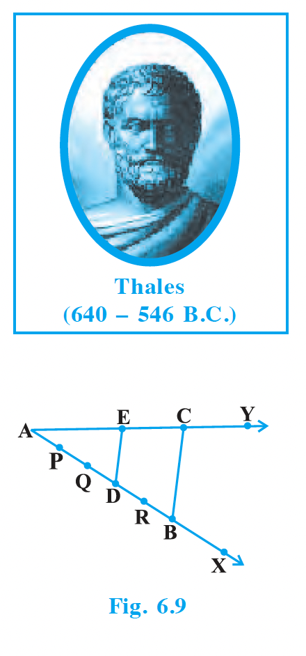

Do you observe from your constructions that $\frac{AD}{DB} = \frac{3}{2}$? Measure AE and EC. What about $\frac{AE}{EC}$? Observe that $\frac{AE}{EC}$ is also equal to $\frac{3}{2}$. Thus, you can see that in $\Delta ABC$, $DE \parallel BC$ and $\frac{AD}{DB} = \frac{AE}{EC}$. This is due to the following theorem (known as the Basic Proportionality Theorem):

---

## Theorem 6.1 (Basic Proportionality Theorem)

**Theorem:** If a line is drawn parallel to one side of a triangle to intersect the other two sides in distinct points, the other two sides are divided in the same ratio.

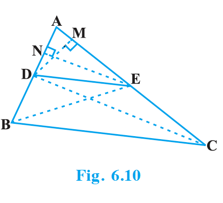

**Proof:**
We are given a triangle $ABC$ in which a line parallel to side $BC$ intersects other two sides $AB$ and $AC$ at $D$ and $E$ respectively (see Fig. 6.10). We need to prove that:
$$\frac{AD}{DB} = \frac{AE}{EC}$$

---

**Activity 3:** Draw an angle XAY on your notebook and on ray AX, mark points $B_1, B_2, B_3, B_4$ and $B$ such that $AB_1 = B_1B_2 = B_2B_3 = B_3B_4 = B_4B$. Similarly, on ray AY, mark points $C_1, C_2, C_3, C_4$ and $C$ such that $AC_1 = C_1C_2 = C_2C_3 = C_3C_4 = C_4C$. Then join $B_1C_1$ and $BC$ (see Fig. 6.11).

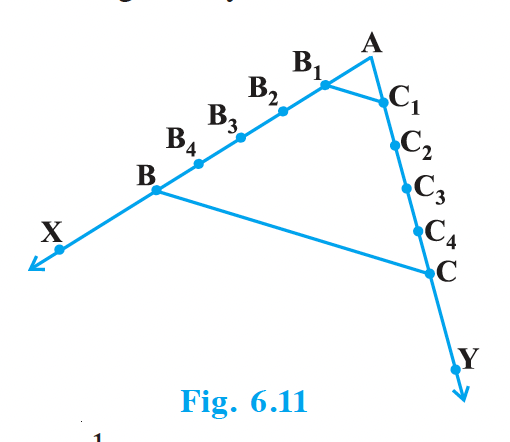

---

## Theorem 6.2 (Converse of BPT)

**Theorem:** If a line divides any two sides of a triangle in the same ratio, then the line is parallel to the third side.

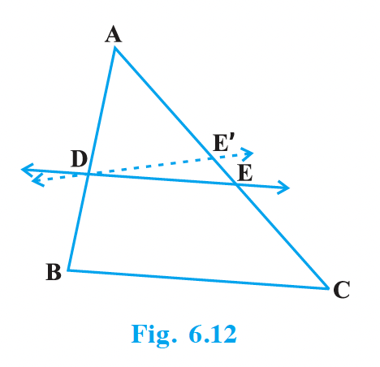

---

**Example 1:** If a line intersects sides AB and AC of a $\Delta ABC$ at D and E respectively and is parallel to BC, prove that $\frac{AD}{AB} = \frac{AE}{AC}$ (see Fig. 6.13).

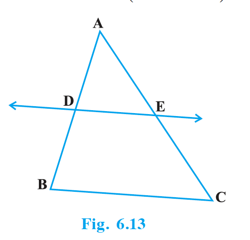

---

**Example 2:** ABCD is a trapezium with $AB \parallel DC$. E and F are points on non-parallel sides AD and BC respectively such that $EF \parallel AB$ (see Fig. 6.14). Show that:
$$\frac{AE}{ED} = \frac{BF}{FC}$$

**Solution:** Let us join AC to intersect EF at G (see Fig. 6.15). 
Since $AB \parallel DC$ and $EF \parallel AB$ (Given), we have $EF \parallel DC$ (Lines parallel to the same line are parallel to each other).

Now, in $\Delta ADC$, $EG \parallel DC$ (As $EF \parallel DC$).
By Theorem 6.1:
$$\frac{AE}{ED} = \frac{AG}{GC} \quad \dots (1)$$

Similarly, from $\Delta CAB$, we have $GF \parallel AB$.
So, $$\frac{CG}{AG} = \frac{CF}{BF}$$
which can be written as:
$$\frac{AG}{GC} = \frac{BF}{FC} \quad \dots (2)$$

Therefore, from (1) and (2):
$$\frac{AE}{ED} = \frac{BF}{FC}$$

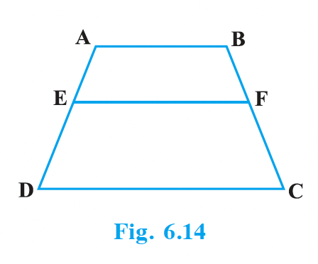
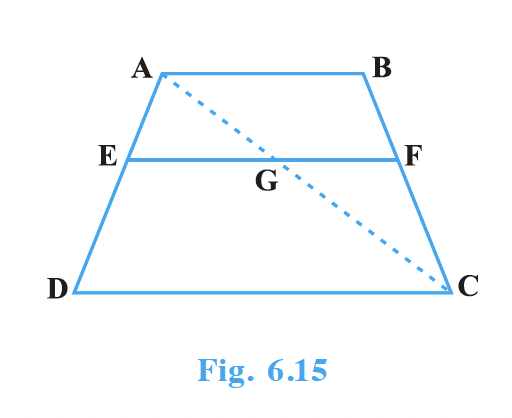

---

**Example 3:** In Fig. 6.16, $\frac{PS}{SQ} = \frac{PT}{TR}$ and $\angle PST = \angle PRQ$. Prove that PQR is an isosceles triangle.

**Solution:** It is given that:
$$\frac{PS}{SQ} = \frac{PT}{TR}$$
Therefore, by Theorem 6.2 (Converse of BPT):
$$ST \parallel QR$$
So, $$\angle PST = \angle PQR \quad (\text{Corresponding angles}) \quad \dots (1)$$
Also, it is given that:
$$\angle PST = \angle PRQ \quad \dots (2)$$
From (1) and (2), we get:
$$\angle PRQ = \angle PQR$$
Therefore, $PQ = PR$ (Sides opposite the equal angles are equal).
Hence, $\Delta PQR$ is an isosceles triangle.

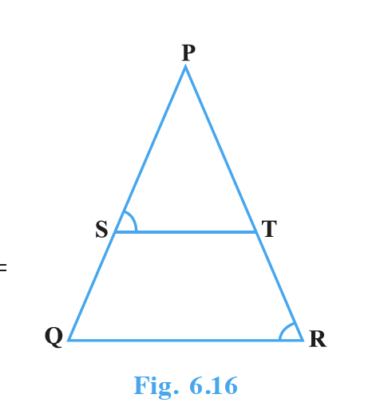

---

## EXERCISE 6.2

<ol>
  <li>In Fig. 6.17, (i) and (ii), \(DE \parallel BC\). Find EC in (i) and AD in (ii).
     
    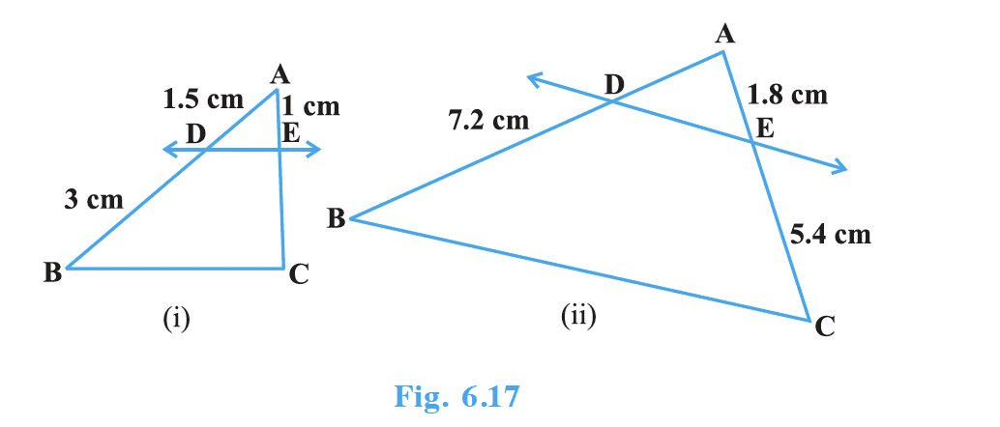
  </li>
  <li>E and F are points on the sides PQ and PR respectively of a \(\Delta PQR\). For each of the following cases, state whether \(EF \parallel QR\):
    <ul>
      <li>(i) \(PE = 3.9\) cm, \(EQ = 3\) cm, \(PF = 3.6\) cm and \(FR = 2.4\) cm</li>
      <li>(ii) \(PE = 4\) cm, \(QE = 4.5\) cm, \(PF = 8\) cm and \(RF = 9\) cm</li>
      <li>(iii) \(PQ = 1.28\) cm, \(PR = 2.56\) cm, \(PE = 0.18\) cm and \(PF = 0.36\) cm</li>
    </ul>
  </li>
  <li>In Fig. 6.18, if \(LM \parallel CB\) and \(LN \parallel CD\), prove that \(\frac{AM}{AB} = \frac{AN}{AD}\)
     
    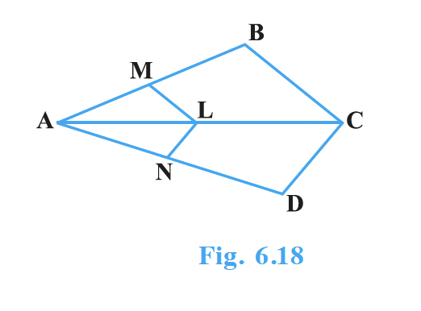
  </li>
  <li>In Fig. 6.19, \(DE \parallel AC\) and \(DF \parallel AE\). Prove that \(\frac{BF}{FE} = \frac{BE}{EC}\)
     
    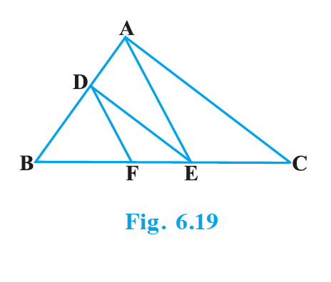
  </li>
  <li>In Fig. 6.20, \(DE \parallel OQ\) and \(DF \parallel OR\). Show that \(EF \parallel QR\).
     
    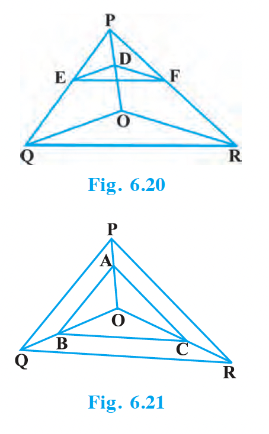
  </li>
  <li>In Fig. 6.21, A, B and C are points on OP, OQ and OR respectively such that \(AB \parallel PQ\) and \(AC \parallel PR\). Show that \(BC \parallel QR\).
     
    
  </li>
  <li>Using Theorem 6.1, prove that a line drawn through the mid-point of one side of a triangle parallel to another side bisects the third side. (Recall that you have proved it in Class IX).</li>
  <li>Using Theorem 6.2, prove that the line joining the mid-points of any two sides of a triangle is parallel to the third side. (Recall that you have done it in Class IX).</li>
  <li>ABCD is a trapezium in which \(AB \parallel DC\) and its diagonals intersect each other at the point O. Show that \(\frac{AO}{BO} = \frac{CO}{DO}\).</li>
  <li>The diagonals of a quadrilateral ABCD intersect each other at the point O such that \(\frac{AO}{BO} = \frac{CO}{DO}\). Show that ABCD is a trapezium.</li>
</ol>
