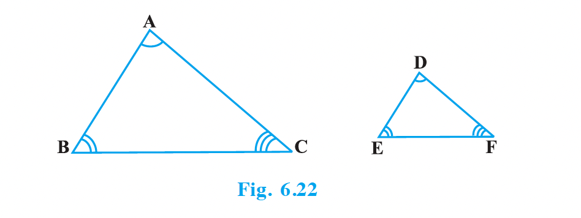
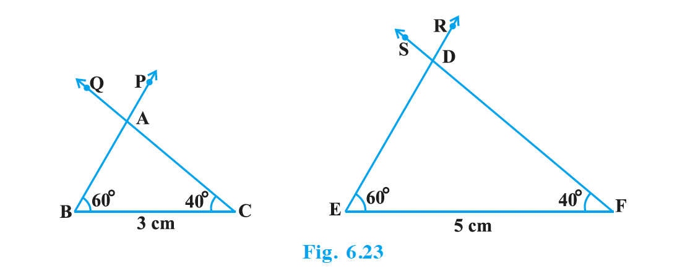
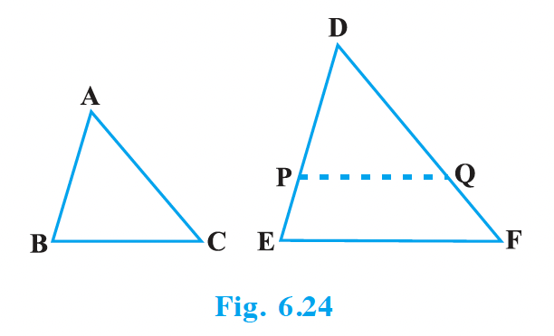
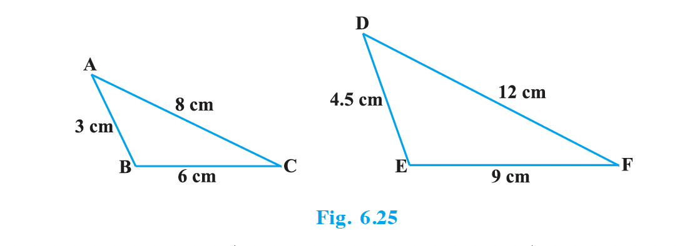
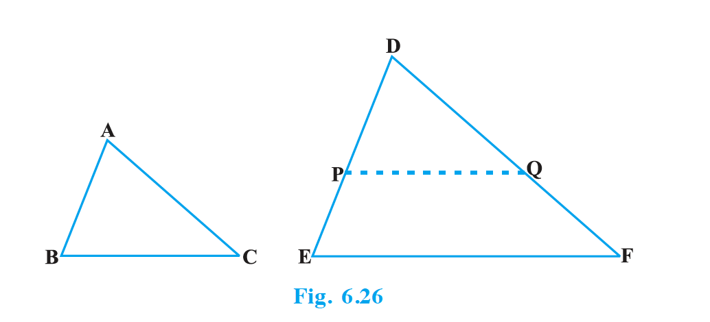
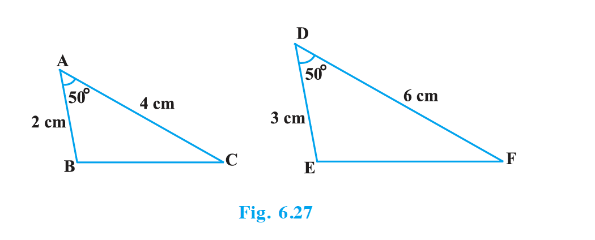

# 6.4 Criteria for Similarity of Triangles

Symbolically, we write the similarity of two triangles \(ABC\) and \(DEF\) as \(\Delta ABC \sim \Delta DEF\).

It must be noted that as done in the case of congruency of two triangles, the similarity of two triangles should also be expressed symbolically, using correct correspondence of their vertices.

**Activity 4:** Draw two line segments BC and EF of two different lengths, say 3 cm and 5 cm respectively. Then, at the points B and C respectively, construct angles PBC and QCB of some measures, say, 60° and 40°. Also, at the points E and F, construct angles REF and SFE of 60° and 40° respectively (see Fig. 6.23).

### AAA (Angle-Angle-Angle) Criterion
**Theorem 6.3:** If in two triangles, corresponding angles are equal, then their corresponding sides are in the same ratio (or proportion) and hence the two triangles are similar.

### AA (Angle-Angle) Criterion
If two angles of one triangle are respectively equal to two angles of another triangle, then the two triangles are similar.

**Activity 5:** Draw two triangles ABC and DEF such that AB = 3 cm, BC = 6 cm, CA = 8 cm, DE = 4.5 cm, EF = 9 cm and FD = 12 cm (see Fig. 6.25).

Observe that:
\[\frac{AB}{DE} = \frac{3}{4.5} = \frac{2}{3}, \quad \frac{BC}{EF} = \frac{6}{9} = \frac{2}{3}, \quad \frac{CA}{FD} = \frac{8}{12} = \frac{2}{3}\]
So, \(\frac{AB}{DE} = \frac{BC}{EF} = \frac{CA}{FD}\).

Now measure \(\angle A, \angle B, \angle C, \angle D, \angle E\) and \(\angle F\). You will observe that \(\angle A = \angle D, \angle B = \angle E\) and \(\angle C = \angle F\), i.e., the corresponding angles of the two triangles are equal.

### SSS (Side-Side-Side) Criterion
**Theorem 6.4:** If in two triangles, sides of one triangle are proportional to (i.e., in the same ratio of) the sides of the other triangle, then their corresponding angles are equal and hence the two triangles are similar.

**Activity 6:** Draw two triangles ABC and DEF such that AB = 2 cm, \(\angle A = 50^\circ\), AC = 4 cm, DE = 3 cm, \(\angle D = 50^\circ\) and DF = 6 cm (see Fig. 6.27).

Here, you may observe that \(\frac{AB}{DE} = \frac{AC}{DF} = \frac{2}{3}\) and \(\angle A = \angle D\). Now let us measure \(\angle B, \angle C, \angle E\) and \(\angle F\). You will find that \(\angle B = \angle E\) and \(\angle C = \angle F\). So, by AAA similarity criterion, \(\Delta ABC \sim \Delta DEF\).

### SAS (Side-Angle-Side) Criterion
**Theorem 6.5:** If one angle of a triangle is equal to one angle of the other triangle and the sides including these angles are proportional, then the two triangles are similar.

> **TODO: Insert Fig 6.28 here.**

---

## EXERCISE 6.3

1. State which pairs of triangles in Fig. 6.34 are similar. Write the similarity criterion used by you for answering the question and also write the pairs of similar triangles in the symbolic form.

> **TODO: Insert Fig 6.34 here.**

2. In Fig. 6.35, \(\Delta ODC \sim \Delta OBA\), \(\angle BOC = 125^\circ\) and \(\angle CDO = 70^\circ\). Find \(\angle DOC, \angle DCO\) and \(\angle OAB\).

> **TODO: Insert Fig 6.35 here.**
