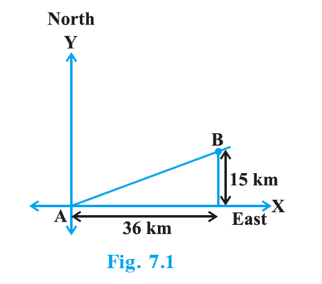
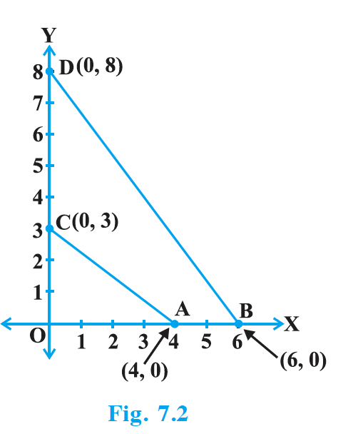
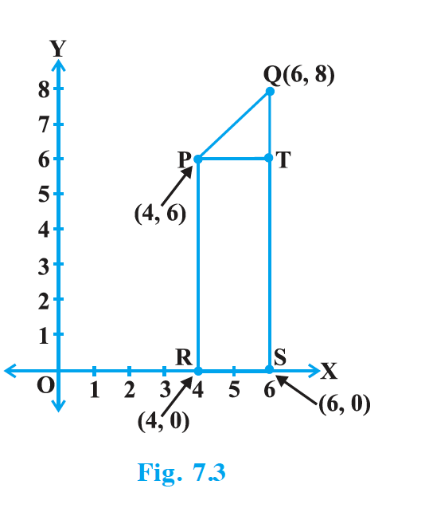
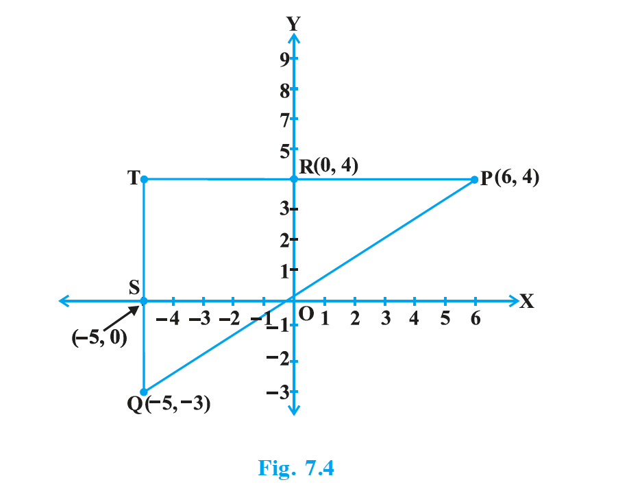
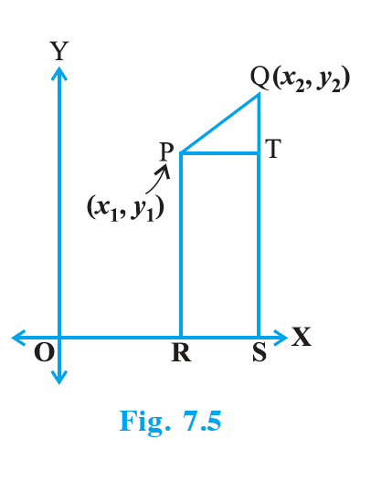
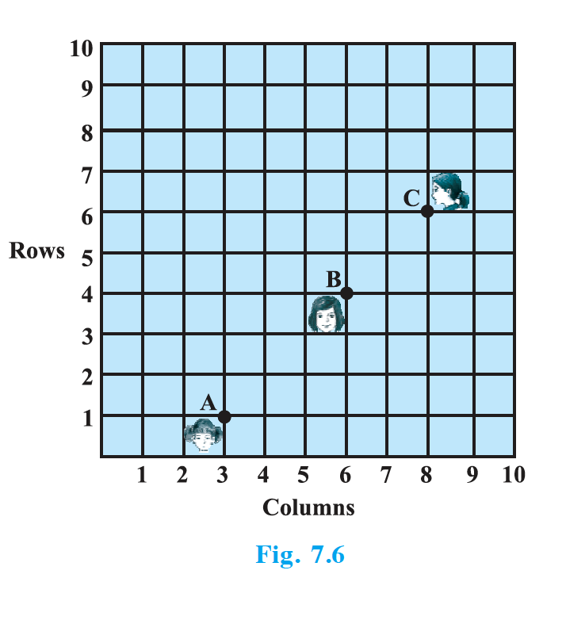
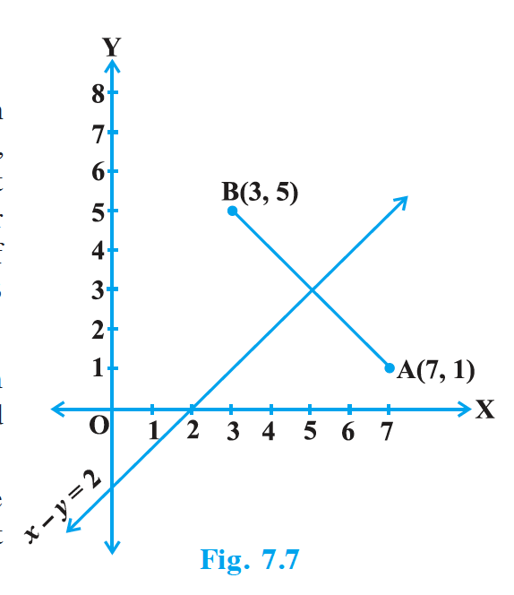

## 7.2 Distance Formula

Let us consider the following situation: A town B is located 36 km east and 15 km north of the town A. How would you find the distance from town A to town B without actually measuring it? Let us see. This situation can be represented graphically as shown in Fig. 7.1. You may use the Pythagoras Theorem to calculate this distance.

{: width="40%" }

Now, suppose two points lie on the $x$-axis. Can we find the distance between them? For instance, consider two points A(4, 0) and B(6, 0) in Fig. 7.2. The points A and B lie on the $x$-axis. From the figure you can see that OA = 4 units and OB = 6 units. Therefore, the distance of B from A, i.e., AB = OB – OA = 6 – 4 = 2 units. So, if two points lie on the $x$-axis, we can easily find the distance between them.

{: width="40%" }

Now, suppose we take two points lying on the $y$-axis. Can you find the distance between them? If the points C(0, 3) and D(0, 8) lie on the $y$-axis, similarly we find that CD = 8 – 3 = 5 units (see Fig. 7.2).

Next, can you find the distance of A from C (in Fig. 7.2)? Since OA = 4 units and OC = 3 units, the distance of A from C, i.e., $AC = \sqrt{3^2 + 4^2} = 5$ units. Similarly, you can find the distance of B from D = BD = 10 units.

Now, if we consider two points not lying on coordinate axis, can we find the distance between them? Yes! We shall use Pythagoras theorem to do so. Let us see an example.

In Fig. 7.3, the points P(4, 6) and Q(6, 8) lie in the first quadrant. How do we use Pythagoras theorem to find the distance between them? Let us draw PR and QS perpendicular to the $x$-axis from P and Q respectively. Also, draw a perpendicular from P on QS to meet QS at T. Then the coordinates of R and S are (4, 0) and (6, 0), respectively. So, RS = 2 units. Also, QS = 8 units and TS = PR = 6 units. Therefore, QT = 2 units and PT = RS = 2 units. Now, using the Pythagoras theorem, we have $PQ^2 = PT^2 + QT^2 = 2^2 + 2^2 = 8$, so $PQ = 2\sqrt{2}$ units.

{: width="40%" }

How will we find the distance between two points in two different quadrants? Consider the points P(6, 4) and Q(–5, –3) (see Fig. 7.4). Draw QS perpendicular to the $x$-axis. Also draw a perpendicular PT from the point P on QS (extended) to meet $y$-axis at the point R. Then PT = 11 units and QT = 7 units. (Why?) Using the Pythagoras Theorem to the right triangle PTQ, we get $PQ = \sqrt{11^2 + 7^2} = \sqrt{170}$ units.

{: width="60%" }

Let us now find the distance between any two points P($x_1$, $y_1$) and Q($x_2$, $y_2$). Draw PR and QS perpendicular to the $x$-axis. A perpendicular from the point P on QS is drawn to meet it at the point T (see Fig. 7.5). Then, OR = $x_1$, OS = $x_2$. So, RS = $x_2 – x_1$ = PT. Also, SQ = $y_2$, ST = PR = $y_1$. So, QT = $y_2 – y_1$. Now, applying the Pythagoras theorem in $\triangle$ PTQ, we get $PQ^2 = PT^2 + QT^2 = (x_2 – x_1)^2 + (y_2 – y_1)^2$. Therefore, $PQ = \sqrt{(x_2 - x_1)^2 + (y_2 - y_1)^2}$.

{: width="30%" }

Note that since distance is always non-negative, we take only the positive square root. So, the distance between the points P($x_1$, $y_1$) and Q($x_2$, $y_2$) is
$$PQ = \sqrt{(x_2 - x_1)^2 + (y_2 - y_1)^2},$$
which is called the **distance formula**.

**Remarks :**
1. In particular, the distance of a point P($x$, $y$) from the origin O(0, 0) is given by $OP = \sqrt{x^2 + y^2}$.
2. We can also write $PQ = \sqrt{(x_1 - x_2)^2 + (y_1 - y_2)^2}$. (Why?)

### Example 1

Do the points (3, 2), (–2, –3) and (2, 3) form a triangle? If so, name the type of triangle formed.

**Solution :** Let us apply the distance formula to find the distances PQ, QR and PR, where P(3, 2), Q(–2, –3) and R(2, 3) are the given points. We have
- $PQ = \sqrt{(3+2)^2 + (2+3)^2} = \sqrt{5^2 + 5^2} = \sqrt{50} = 7.07$ (approx.)
- $QR = \sqrt{(-2-2)^2 + (-3-3)^2} = \sqrt{(-4)^2 + (-6)^2} = \sqrt{52} = 7.21$ (approx.)
- $PR = \sqrt{(3-2)^2 + (2-3)^2} = \sqrt{1^2 + (-1)^2} = \sqrt{2} = 1.41$ (approx.)

Since the sum of any two of these distances is greater than the third distance, therefore, the points P, Q and R form a triangle. Also, $PQ^2 + PR^2 = QR^2$, by the converse of Pythagoras theorem, we have $\angle P = 90^\circ$. Therefore, PQR is a right triangle.

### Example 2

Show that the points (1, 7), (4, 2), (–1, –1) and (– 4, 4) are the vertices of a square.

**Solution :** Let A(1, 7), B(4, 2), C(–1, –1) and D(– 4, 4) be the given points. One way of showing that ABCD is a square is to use the property that all its sides should be equal and both its diagonals should also be equal. Now,
- $AB = \sqrt{(1-4)^2 + (7-2)^2} = \sqrt{9 + 25} = \sqrt{34}$
- $BC = \sqrt{(4+1)^2 + (2+1)^2} = \sqrt{25 + 9} = \sqrt{34}$
- $CD = \sqrt{(-1+4)^2 + (-1-4)^2} = \sqrt{9 + 25} = \sqrt{34}$
- $DA = \sqrt{(1+4)^2 + (7-4)^2} = \sqrt{25 + 9} = \sqrt{34}$
- $AC = \sqrt{(1+1)^2 + (7+1)^2} = \sqrt{4 + 64} = \sqrt{68}$
- $BD = \sqrt{(4+4)^2 + (2-4)^2} = \sqrt{64 + 4} = \sqrt{68}$

Since AB = BC = CD = DA and AC = BD, all the four sides of the quadrilateral ABCD are equal and its diagonals AC and BD are also equal. Therefore, ABCD is a square.

**Alternative Solution :** We find the four sides and one diagonal, say, AC as above. Here $AD^2 + DC^2 = 34 + 34 = 68 = AC^2$. Therefore, by the converse of Pythagoras theorem, $\angle D = 90^\circ$. A quadrilateral with all four sides equal and one angle $90^\circ$ is a square. So, ABCD is a square.

### Example 3

Fig. 7.6 shows the arrangement of desks in a classroom. Ashima, Bharti and Camella are seated at A(3, 1), B(6, 4) and C(8, 6) respectively. Do you think they are seated in a line? Give reasons for your answer.

{: width="40%" }

**Solution :** Using the distance formula, we have
- $AB = \sqrt{(6-3)^2 + (4-1)^2} = \sqrt{9 + 9} = \sqrt{18} = 3\sqrt{2}$
- $BC = \sqrt{(8-6)^2 + (6-4)^2} = \sqrt{4 + 4} = \sqrt{8} = 2\sqrt{2}$
- $AC = \sqrt{(8-3)^2 + (6-1)^2} = \sqrt{25 + 25} = \sqrt{50} = 5\sqrt{2}$

Since AB + BC = $3\sqrt{2} + 2\sqrt{2} = 5\sqrt{2} = AC$, we can say that the points A, B and C are collinear. Therefore, they are seated in a line.

### Example 4

Find a relation between $x$ and $y$ such that the point ($x$, $y$) is equidistant from the points (7, 1) and (3, 5).

**Solution :** Let P($x$, $y$) be equidistant from the points A(7, 1) and B(3, 5). We are given that AP = BP. So, $AP^2 = BP^2$
i.e., $(x – 7)^2 + (y – 1)^2 = (x – 3)^2 + (y – 5)^2$
i.e., $x^2 – 14x + 49 + y^2 – 2y + 1 = x^2 – 6x + 9 + y^2 – 10y + 25$
i.e., $x – y = 2$

which is the required relation.

**Remark :** Note that the graph of the equation $x – y = 2$ is a line. From your earlier studies, you know that a point which is equidistant from A and B lies on the perpendicular bisector of AB. Therefore, the graph of $x – y = 2$ is the perpendicular bisector of AB (see Fig. 7.7).

{: width="40%" }

### Example 5

Find a point on the $y$-axis which is equidistant from the points A(6, 5) and B(– 4, 3).

**Solution :** We know that a point on the $y$-axis is of the form (0, $y$). So, let the point P(0, $y$) be equidistant from A and B. Then $(6 – 0)^2 + (5 – y)^2 = (– 4 – 0)^2 + (3 – y)^2$
i.e., $36 + 25 + y^2 – 10y = 16 + 9 + y^2 – 6y$
i.e., $4y = 36$
i.e., $y = 9$

So, the required point is (0, 9). Let us check: $AP = \sqrt{(6-0)^2 + (5-9)^2} = \sqrt{36 + 16} = \sqrt{52}$, $BP = \sqrt{(-4-0)^2 + (3-9)^2} = \sqrt{16 + 36} = \sqrt{52}$.

**Note :** Using the remark above, we see that (0, 9) is the intersection of the $y$-axis and the perpendicular bisector of AB.

