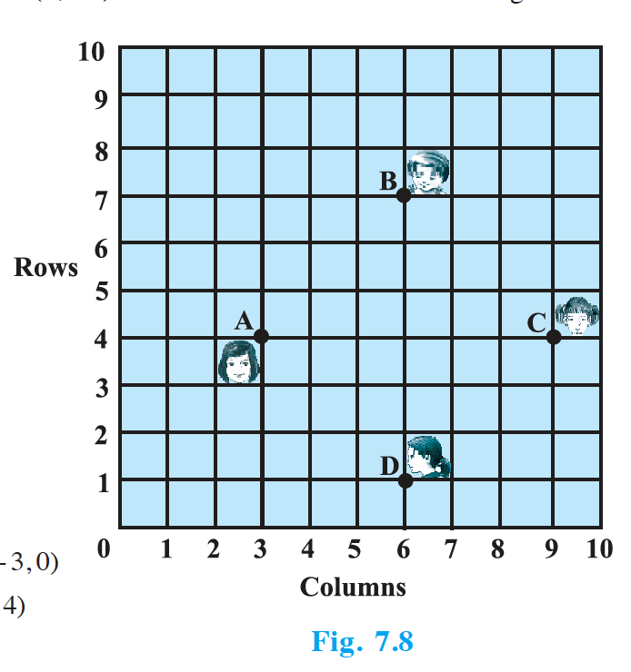

## EXERCISE 7.1

1. Find the distance between the following pairs of points :
   - (i) (2, 3), (4, 1)
   - (ii) (– 5, 7), (– 1, 3)
   - (iii) $(a, b)$, $(– a, – b)$

2. Find the distance between the points (0, 0) and (36, 15). Can you now find the distance between the two towns A and B discussed in Section 7.2.

3. Determine if the points (1, 5), (2, 3) and (– 2, – 11) are collinear.

4. Check whether (5, – 2), (6, 4) and (7, – 2) are the vertices of an isosceles triangle.

5. In a classroom, 4 friends are seated at the points A, B, C and D as shown in Fig. 7.8. Champa and Chameli walk into the class and after observing for a few minutes Champa asks Chameli, "Don't you think ABCD is a square?" Chameli disagrees. Using distance formula, find which of them is correct.

   {: width="40%" }

6. Name the type of quadrilateral formed, if any, by the following points, and give reasons for your answer:
   - (i) (– 1, – 2), (1, 0), (– 1, 2), (– 3, 0)
   - (ii) (–3, 5), (3, 1), (0, 3), (–1, – 4)
   - (iii) (4, 5), (7, 6), (4, 3), (1, 2)

7. Find the point on the $x$-axis which is equidistant from (2, –5) and (–2, 9).

8. Find the values of $y$ for which the distance between the points P(2, – 3) and Q(10, $y$) is 10 units.

9. If Q(0, 1) is equidistant from P(5, –3) and R($x$, 6), find the values of $x$. Also find the distances QR and PR.

10. Find a relation between $x$ and $y$ such that the point ($x$, $y$) is equidistant from the point (3, 6) and (– 3, 4).

---

## Solutions

**1.** Distance $= \sqrt{(x_2-x_1)^2 + (y_2-y_1)^2}$. (i) $\sqrt{(4-2)^2 + (1-3)^2} = \sqrt{8} = 2\sqrt{2}$. (ii) $\sqrt{(-1+5)^2 + (3-7)^2} = \sqrt{32} = 4\sqrt{2}$. (iii) $\sqrt{(-a-a)^2 + (-b-b)^2} = 2\sqrt{a^2+b^2}$.

**2.** $\sqrt{36^2 + 15^2} = \sqrt{1521} = 39$ units (distance between towns A and B).

**3.** AB = $\sqrt{5}$, BC = $\sqrt{212}$, AC = $\sqrt{265}$. No two sum to the third, so points are **not collinear**.

**4.** AB = $\sqrt{37}$, BC = $\sqrt{37}$, CA = 2. So **isosceles triangle** (AB = BC).

**5.** From the figure, find coordinates of A, B, C, D; show all four sides equal and diagonals equal. Then **Champa is correct** (ABCD is a square).

**6.** (i) All four sides = $\sqrt{8}$, diagonals equal $\Rightarrow$ **square**. (ii) Sides do not form equal opposite pairs $\Rightarrow$ **no standard quadrilateral**. (iii) Opposite sides equal $\Rightarrow$ **parallelogram**.

**7.** Let P($a$, 0). $(a-2)^2 + 25 = (a+2)^2 + 81$ $\Rightarrow$ $-8a = 56$ $\Rightarrow$ $a = -7$. Point is **(-7, 0)**.

**8.** $(10-2)^2 + (y+3)^2 = 100$ $\Rightarrow$ $(y+3)^2 = 36$ $\Rightarrow$ **$y = 3$ or $y = -9$**.

**9.** $QP^2 = QR^2$ $\Rightarrow$ $25+16 = x^2+25$ $\Rightarrow$ **$x = \pm 4$**. QR = $\sqrt{41}$; PR = $\sqrt{82}$ (for $x=4$) or $9\sqrt{2}$ (for $x=-4$).

**10.** $(x-3)^2+(y-6)^2 = (x+3)^2+(y-4)^2$ $\Rightarrow$ $-6x-12y+45 = 6x-8y+25$ $\Rightarrow$ **$3x+y-5=0$**.
