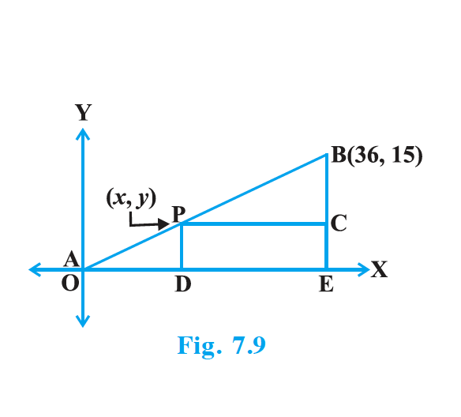
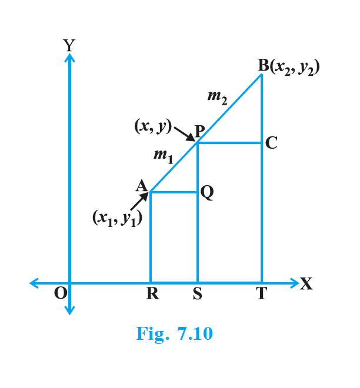
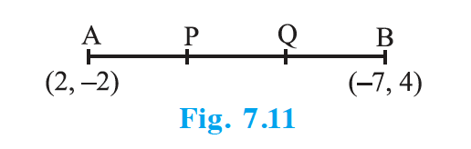

## 7.3 Section Formula

Let us recall the situation in Section 7.2. Suppose a telephone company wants to position a relay tower at P between A and B in such a way that the distance of the tower from B is twice its distance from A. If P lies on AB, it will divide AB in the ratio 1 : 2 (see Fig. 7.9). If we take A as the origin O, and 1 km as one unit on both the axis, the coordinates of B will be (36, 15). In order to know the position of the tower, we must know the coordinates of P. How do we find these coordinates?

{: width="40%" }

Let the coordinates of P be ($x$, $y$). Draw perpendiculars from P and B to the $x$-axis, meeting it in D and E, respectively. Draw PC perpendicular to BE. Then, by the AA similarity criterion, studied in Chapter 6, $\triangle$ POD and $\triangle$ BPC are similar. Therefore, $\dfrac{OD}{PC} = \dfrac{OP}{PB} = \dfrac{1}{2}$, and $\dfrac{PD}{BC} = \dfrac{OP}{PB} = \dfrac{1}{2}$. So, $\dfrac{x}{36 - x} = \dfrac{1}{2}$ and $\dfrac{y}{15 - y} = \dfrac{1}{2}$. These equations give $x = 12$ and $y = 5$. You can check that P(12, 5) meets the condition that OP : PB = 1 : 2.

Now let us use the understanding that you may have developed through this example to obtain the general formula. Consider any two points A($x_1$, $y_1$) and B($x_2$, $y_2$) and assume that P($x$, $y$) divides AB internally in the ratio $m_1 : m_2$, i.e., $\dfrac{PA}{PB} = \dfrac{m_1}{m_2}$ (see Fig. 7.10).

{: width="40%" }

Draw AR, PS and BT perpendicular to the $x$-axis. Draw AQ and PC parallel to the $x$-axis. Then, by the AA similarity criterion, $\triangle$ PAQ ~ $\triangle$ BPC. Therefore, $\dfrac{PA}{BP} = \dfrac{AQ}{PC} = \dfrac{PQ}{BC}$ … (1). Now, AQ = RS = OS – OR = $x – x_1$, PC = ST = OT – OS = $x_2 – x$, PQ = PS – QS = PS – AR = $y – y_1$, BC = BT – CT = BT – PS = $y_2 – y$. Substituting these values in (1), we get $\dfrac{m_1}{m_2} = \dfrac{x - x_1}{x_2 - x} = \dfrac{y - y_1}{y_2 - y}$. Taking $\dfrac{m_1}{m_2} = \dfrac{x - x_1}{x_2 - x}$, we get $x = \dfrac{m_1 x_2 + m_2 x_1}{m_1 + m_2}$. Similarly, taking $\dfrac{m_1}{m_2} = \dfrac{y - y_1}{y_2 - y}$, we get $y = \dfrac{m_1 y_2 + m_2 y_1}{m_1 + m_2}$.

So, the coordinates of the point P($x$, $y$) which divides the line segment joining the points A($x_1$, $y_1$) and B($x_2$, $y_2$), **internally**, in the ratio $m_1 : m_2$ are
$$\left( \dfrac{m_1 x_2 + m_2 x_1}{m_1 + m_2}, \dfrac{m_1 y_2 + m_2 y_1}{m_1 + m_2} \right)$$
This is known as the **section formula**.

If the ratio in which P divides AB is $k : 1$, then the coordinates of the point P will be $\left( \dfrac{k x_2 + x_1}{k + 1}, \dfrac{k y_2 + y_1}{k + 1} \right)$.

**Special Case :** The mid-point of a line segment divides the line segment in the ratio 1 : 1. Therefore, the coordinates of the mid-point P of the join of the points A($x_1$, $y_1$) and B($x_2$, $y_2$) is $\left( \dfrac{x_1 + x_2}{2}, \dfrac{y_1 + y_2}{2} \right)$.

Let us solve a few examples based on the section formula.

### Example 6

Find the coordinates of the point which divides the line segment joining the points (4, – 3) and (8, 5) in the ratio 3 : 1 internally.

**Solution :** Let P($x$, $y$) be the required point. Using the section formula, we get $x = \dfrac{3(8) + 1(4)}{3+1} = 7$, $y = \dfrac{3(5) + 1(-3)}{3+1} = 3$. Therefore, (7, 3) is the required point.

### Example 7

In what ratio does the point (– 4, 6) divide the line segment joining the points A(– 6, 10) and B(3, – 8)?

**Solution :** Let (– 4, 6) divide AB internally in the ratio $m_1 : m_2$. Using the section formula, we get $(-4, 6) = \left( \dfrac{3m_1 - 6m_2}{m_1 + m_2}, \dfrac{-8m_1 + 10m_2}{m_1 + m_2} \right)$. So $-4 = \dfrac{3m_1 - 6m_2}{m_1 + m_2}$ gives $-4m_1 - 4m_2 = 3m_1 - 6m_2$, i.e., $7m_1 = 2m_2$, i.e., $m_1 : m_2 = 2 : 7$. You should verify that the ratio satisfies the $y$-coordinate also. So, the point (– 4, 6) divides the line segment joining A(– 6, 10) and B(3, – 8) in the ratio **2 : 7**.

**Alternatively :** Let (– 4, 6) divide AB internally in the ratio $k : 1$. Then $(-4, 6) = \left( \dfrac{3k - 6}{k+1}, \dfrac{-8k + 10}{k+1} \right)$. So $-4 = \dfrac{3k - 6}{k+1}$ $\Rightarrow$ $-4k - 4 = 3k - 6$ $\Rightarrow$ $7k = 2$ $\Rightarrow$ $k : 1 = 2 : 7$.

### Example 8

Find the coordinates of the points of trisection (i.e., points dividing in three equal parts) of the line segment joining the points A(2, – 2) and B(– 7, 4).

**Solution :** Let P and Q be the points of trisection of AB i.e., AP = PQ = QB (see Fig. 7.11). Therefore, P divides AB internally in the ratio 1 : 2. Therefore, the coordinates of P, by applying the section formula, are $\left( \dfrac{1(-7) + 2(2)}{1+2}, \dfrac{1(4) + 2(-2)}{1+2} \right)$, i.e., **(–1, 0)**. Now, Q also divides AB internally in the ratio 2 : 1. So, the coordinates of Q are $\left( \dfrac{2(-7) + 1(2)}{2+1}, \dfrac{2(4) + 1(-2)}{2+1} \right)$, i.e., **(– 4, 2)**.

{: width="40%" }

Therefore, the coordinates of the points of trisection of the line segment joining A and B are (–1, 0) and (– 4, 2). **Note :** We could also have obtained Q by noting that it is the mid-point of PB.

### Example 9

Find the ratio in which the $y$-axis divides the line segment joining the points (5, – 6) and (–1, – 4). Also find the point of intersection.

**Solution :** Let the ratio be $k : 1$. Then by the section formula, the coordinates of the point which divides AB in the ratio $k : 1$ are $\left( \dfrac{-k + 5}{k+1}, \dfrac{-4k - 6}{k+1} \right)$. This point lies on the $y$-axis, and we know that on the $y$-axis the abscissa is 0. Therefore, $\dfrac{-k + 5}{k+1} = 0$ $\Rightarrow$ $k = 5$. That is, the ratio is **5 : 1**. Putting $k = 5$, we get the point of intersection as $\left( 0, \dfrac{-13}{3} \right)$.

### Example 10

If the points A(6, 1), B(8, 2), C(9, 4) and D($p$, 3) are the vertices of a parallelogram, taken in order, find the value of $p$.

**Solution :** We know that diagonals of a parallelogram bisect each other. So, the coordinates of the mid-point of AC = coordinates of the mid-point of BD. i.e., $\left( \dfrac{6+9}{2}, \dfrac{1+4}{2} \right) = \left( \dfrac{8+p}{2}, \dfrac{2+3}{2} \right)$ $\Rightarrow$ $\left( \dfrac{15}{2}, \dfrac{5}{2} \right) = \left( \dfrac{8+p}{2}, \dfrac{5}{2} \right)$. So $\dfrac{15}{2} = \dfrac{8+p}{2}$ $\Rightarrow$ $p = 7$.

