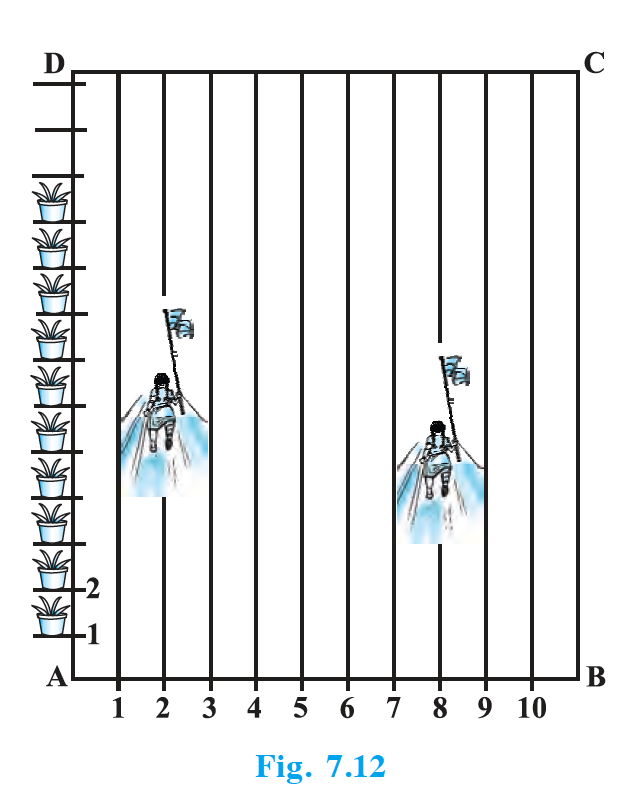

## EXERCISE 7.2

1. Find the coordinates of the point which divides the join of (–1, 7) and (4, –3) in the ratio 2 : 3.

2. Find the coordinates of the points of trisection of the line segment joining (4, –1) and (–2, –3).

3. To conduct Sports Day activities, in your rectangular shaped school ground ABCD, lines have been drawn with chalk powder at a distance of 1 m each. 100 flower pots have been placed at a distance of 1 m from each other along AD, as shown in Fig. 7.12. Niharika runs $\dfrac{1}{4}$th the distance AD on the 2nd line and posts a green flag. Preet runs $\dfrac{1}{5}$th the distance AD on the eighth line and posts a red flag. What is the distance between both the flags? If Rashmi has to post a blue flag exactly halfway between the line segment joining the two flags, where should she post her flag?

   {: width="40%" }

4. Find the ratio in which the line segment joining the points (– 3, 10) and (6, – 8) is divided by (– 1, 6).

5. Find the ratio in which the line segment joining A(1, – 5) and B(– 4, 5) is divided by the $x$-axis. Also find the coordinates of the point of division.

6. If (1, 2), (4, $y$), ($x$, 6) and (3, 5) are the vertices of a parallelogram taken in order, find $x$ and $y$.

7. Find the coordinates of a point A, where AB is the diameter of a circle whose centre is (2, – 3) and B is (1, 4).

8. If A and B are (– 2, – 2) and (2, – 4), respectively, find the coordinates of P such that $AP = \dfrac{3}{7} AB$ and P lies on the line segment AB.

9. Find the coordinates of the points which divide the line segment joining A(– 2, 2) and B(2, 8) into four equal parts.

10. Find the area of a rhombus if its vertices are (3, 0), (4, 5), (– 1, 4) and (– 2, – 1) taken in order. [Hint : Area of a rhombus = $\dfrac{1}{2}$ (product of its diagonals)]

---

## Solutions

**1.** Point dividing (–1, 7) and (4, –3) in ratio 2 : 3: $x = \dfrac{2(4) + 3(-1)}{2+3} = \dfrac{5}{5} = 1$, $y = \dfrac{2(-3) + 3(7)}{5} = \dfrac{15}{5} = 3$. So **(1, 3)**.

**2.** Trisection points of (4, –1) and (–2, –3): First point (ratio 1 : 2): $\left( \dfrac{-2+8}{3}, \dfrac{-3-2}{3} \right) = (2, -\dfrac{5}{3})$. Second point (ratio 2 : 1): $\left( \dfrac{-4+4}{3}, \dfrac{-6-1}{3} \right) = (0, -\dfrac{7}{3})$. So **(2, –5/3)** and **(0, –7/3)**.

**3.** Assuming AD = 100 m (100 pots at 1 m). Green flag: 2nd line, $\dfrac{1}{4}$ of AD $\Rightarrow$ (2, 25). Red flag: 8th line, $\dfrac{1}{5}$ of AD $\Rightarrow$ (8, 20). Distance between flags = $\sqrt{(8-2)^2 + (20-25)^2} = \sqrt{36+25} = \sqrt{61}$ m. Mid-point of (2, 25) and (8, 20) = **(5, 22.5)** — Rashmi posts blue flag at 5th line, halfway along the 22.5 m line from AD.

**4.** Let (–1, 6) divide (–3, 10) and (6, –8) in ratio $k : 1$. Then $-1 = \dfrac{6k - 3}{k+1}$ $\Rightarrow$ $-k - 1 = 6k - 3$ $\Rightarrow$ $7k = 2$ $\Rightarrow$ $k = 2/7$. So ratio **2 : 7**.

**5.** Let $x$-axis divide A(1, –5) and B(–4, 5) in ratio $k : 1$. For point on $x$-axis, $y = 0$: $\dfrac{5k - 5}{k+1} = 0$ $\Rightarrow$ $k = 1$. Ratio **1 : 1**. Point = mid-point = $\left( \dfrac{1-4}{2}, \dfrac{-5+5}{2} \right) = \mathbf{\left( -\dfrac{3}{2}, 0 \right)}$.

**6.** Diagonals of parallelogram bisect each other. Mid-point of (1, 2) and ($x$, 6) = mid-point of (4, $y$) and (3, 5). So $\dfrac{1+x}{2} = \dfrac{4+3}{2}$ $\Rightarrow$ $x = 6$; $\dfrac{2+6}{2} = \dfrac{y+5}{2}$ $\Rightarrow$ $y = 3$. So **$x = 6$, $y = 3$**.

**7.** Centre (2, –3) is mid-point of A and B(1, 4). So $A = (2 \times 2 - 1, 2 \times (-3) - 4) = \mathbf{(3, -10)}$.

**8.** P divides A(–2, –2) and B(2, –4) so that $AP : PB = 3 : 4$ (since $AP = \dfrac{3}{7}AB$). So $P = \left( \dfrac{3(2) + 4(-2)}{7}, \dfrac{3(-4) + 4(-2)}{7} \right) = \left( \dfrac{-2}{7}, \dfrac{-20}{7} \right)$.

**9.** Four equal parts: points divide AB in ratios 1:3, 1:1, 3:1. With A(–2, 2), B(2, 8): (i) 1:3: $\left( \dfrac{2-6}{4}, \dfrac{8+6}{4} \right) = (-1, 3.5)$; (ii) mid-point (1:1): $(0, 5)$; (iii) 3:1: $\left( \dfrac{6-2}{4}, \dfrac{24+2}{4} \right) = (1, 6.5)$. So **(–1, 7/2), (0, 5), (1, 13/2)**.

**10.** Vertices A(3, 0), B(4, 5), C(–1, 4), D(–2, –1). Diagonals AC and BD: $AC = \sqrt{(-4)^2 + 4^2} = \sqrt{32} = 4\sqrt{2}$, $BD = \sqrt{6^2 + (-6)^2} = \sqrt{72} = 6\sqrt{2}$. Area = $\dfrac{1}{2} \times 4\sqrt{2} \times 6\sqrt{2} = \dfrac{1}{2} \times 48 = \mathbf{24}$ sq units.
