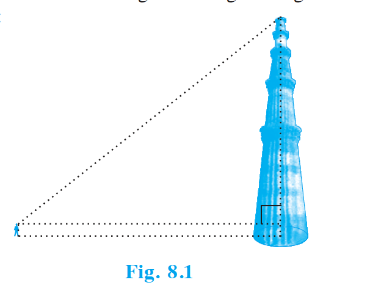
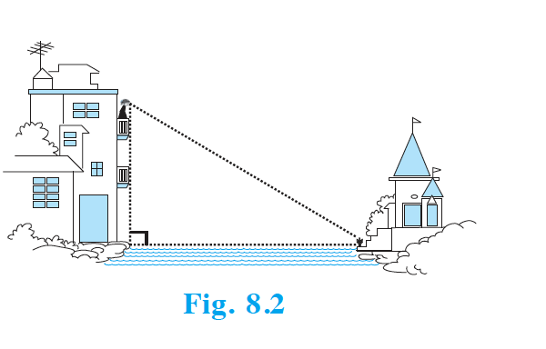
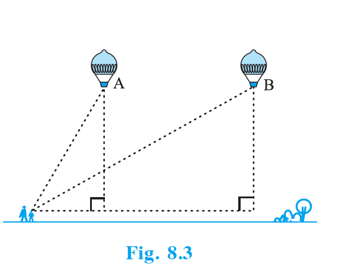

## 8.1 Introduction

You have already studied about triangles, and in particular, right triangles, in your earlier classes. Let us take some examples from our surroundings where right triangles can be imagined to be formed. For instance :

1. Suppose the students of a school are visiting Qutub Minar. Now, if a student is looking at the top of the Minar, a right triangle can be imagined to be made, as shown in Fig 8.1. Can the student find out the height of the Minar, without actually measuring it?

   {: width="80%" }

2. Suppose a girl is sitting on the balcony of her house located on the bank of a river. She is looking down at a flower pot placed on a stair of a temple situated nearby on the other bank of the river. A right triangle is imagined to be made in this situation as shown in Fig. 8.2. If you know the height at which the person is sitting, can you find the width of the river?

   {: width="80%" }

3. Suppose a hot air balloon is flying in the air. A girl happens to spot the balloon in the sky and runs to her mother to tell her about it. Her mother rushes out of the house to look at the balloon. Now when the girl had spotted the balloon initially it was at point A. When both the mother and daughter came out to see it, it had already travelled to another point B. Can you find the altitude of B from the ground?

   {: width="80%" }

In all the situations given above, the distances or heights can be found by using some mathematical techniques, which come under a branch of mathematics called 'trigonometry'. The word 'trigonometry' is derived from the Greek words 'tri' (meaning three), 'gon' (meaning sides) and 'metron' (meaning measure). In fact, trigonometry is the study of relationships between the sides and angles of a triangle. The earliest known work on trigonometry was recorded in Egypt and Babylon. Early astronomers used it to find out the distances of the stars and planets from the Earth. Even today, most of the technologically advanced methods used in Engineering and Physical Sciences are based on trigonometrical concepts.

In this chapter, we will study some ratios of the sides of a right triangle with respect to its acute angles, called trigonometric ratios of the angle. We will restrict our discussion to acute angles only. However, these ratios can be extended to other angles also. We will also define the trigonometric ratios for angles of measure $0^\circ$ and $90^\circ$. We will calculate trigonometric ratios for some specific angles and establish some identities involving these ratios, called trigonometric identities.
