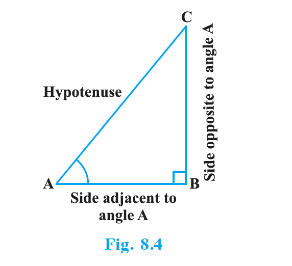
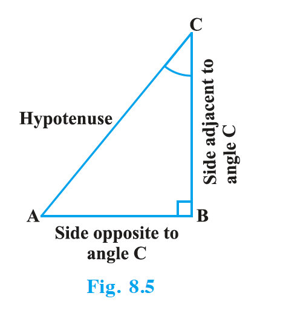
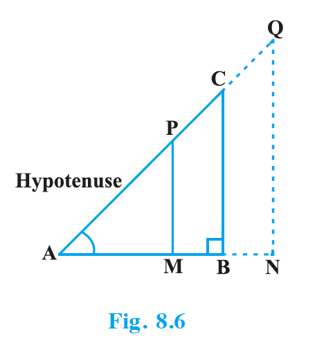
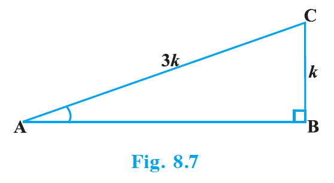
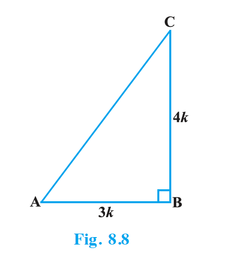
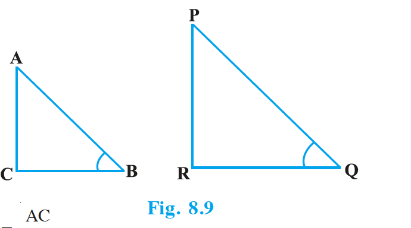
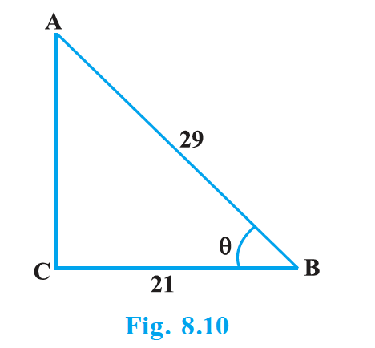
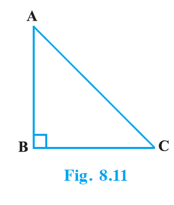
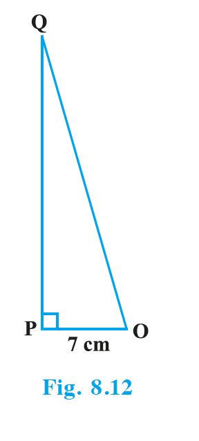

## 8.2 Trigonometric Ratios

In Section 8.1, you have seen some right triangles imagined to be formed in different situations. Let us take a right triangle ABC as shown in Fig. 8.4.

Here, $\angle$ CAB (or, in brief, angle A) is an acute angle. Note the position of the side BC with respect to angle A. It faces $\angle$ A. We call it the side opposite to angle A. AC is the hypotenuse of the right triangle and the side AB is a part of $\angle$ A. So, we call it the side adjacent to angle A.

{: width="50%" }

Note that the position of sides change when you consider angle C in place of A (see Fig. 8.5).

You have studied the concept of 'ratio' in your earlier classes. We now define certain ratios involving the sides of a right triangle, and call them trigonometric ratios.

The trigonometric ratios of the angle A in right triangle ABC (see Fig. 8.4) are defined as follows :

{: width="50%" }

sine of $\angle$ A = $\dfrac{\text{side opposite to angle A}}{\text{hypotenuse}} = \dfrac{BC}{AC}$

cosine of $\angle$ A = $\dfrac{\text{side adjacent to angle A}}{\text{hypotenuse}} = \dfrac{AB}{AC}$

tangent of $\angle$ A = $\dfrac{\text{side opposite to angle A}}{\text{side adjacent to angle A}} = \dfrac{BC}{AB}$

cosecant of $\angle$ A = $\dfrac{1}{\text{sine of } \angle A} = \dfrac{\text{hypotenuse}}{\text{side opposite to angle A}} = \dfrac{AC}{BC}$

secant of $\angle$ A = $\dfrac{1}{\text{cosine of } \angle A} = \dfrac{\text{hypotenuse}}{\text{side adjacent to angle A}} = \dfrac{AC}{AB}$

cotangent of $\angle$ A = $\dfrac{1}{\text{tangent of } \angle A} = \dfrac{\text{side adjacent to angle A}}{\text{side opposite to angle A}} = \dfrac{AB}{BC}$

The ratios defined above are abbreviated as sin A, cos A, tan A, cosec A, sec A and cot A respectively. Note that the ratios cosec A, sec A and cot A are respectively, the reciprocals of the ratios sin A, cos A and tan A.

Also, observe that $\tan A = \dfrac{BC}{AB} = \dfrac{BC/AC}{AB/AC} = \dfrac{\sin A}{\cos A}$ and $\cot A = \dfrac{\cos A}{\sin A}$.

So, the trigonometric ratios of an acute angle in a right triangle express the relationship between the angle and the length of its sides.

Why don't you try to define the trigonometric ratios for angle C in the right triangle? (See Fig. 8.5)

The first use of the idea of 'sine' in the way we use it today was in the work Aryabhatiyam by Aryabhata, in A.D. 500. Aryabhata used the word ardha-jya for the half-chord, which was shortened to jya or jiva in due course. When the Aryabhatiyam was translated into Arabic, the word jiva was retained as it is. The word jiva was translated into sinus, which means curve, when the Arabic version was translated into Latin. Soon the word sinus, also used as sine, became common in mathematical texts throughout Europe. An English Professor of astronomy Edmund Gunter (1581–1626), first used the abbreviated notation 'sin'. The origin of the terms 'cosine' and 'tangent' was much later. The cosine function arose from the need to compute the sine of the complementary angle. Aryabhatta called it kotijya. The name cosinus originated with Edmund Gunter. In 1674, the English Mathematician Sir Jonas Moore first used the abbreviated notation 'cos'.

**Remark :** Note that the symbol sin A is used as an abbreviation for 'the sine of the angle A'. sin A is not the product of 'sin' and A. 'sin' separated from A has no meaning. Similarly, cos A is not the product of 'cos' and A. Similar interpretations follow for other trigonometric ratios also.

Now, if we take a point P on the hypotenuse AC or a point Q on AC extended, of the right triangle ABC and draw PM perpendicular to AB and QN perpendicular to AB extended (see Fig. 8.6), how will the trigonometric ratios of $\angle$ A in $\triangle$ PAM differ from those of $\angle$ A in $\triangle$ CAB or from those of $\angle$ A in $\triangle$ QAN?

{: width="50%" }

To answer this, first look at these triangles. Is $\triangle$ PAM similar to $\triangle$ CAB? From Chapter 6, recall the AA similarity criterion. Using the criterion, you will see that the triangles PAM and CAB are similar. Therefore, by the property of similar triangles, the corresponding sides of the triangles are proportional.

So, we have $\dfrac{AM}{AB} = \dfrac{AP}{AC} = \dfrac{MP}{BC}$.

From this, we find $\dfrac{MP}{AP} = \dfrac{BC}{AC} = \sin A$.

Similarly, $\dfrac{AM}{AP} = \dfrac{AB}{AC} = \cos A$, $\dfrac{MP}{AM} = \dfrac{BC}{AB} = \tan A$ and so on.

This shows that the trigonometric ratios of angle A in $\triangle$ PAM do not differ from those of angle A in $\triangle$ CAB.

In the same way, you should check that the value of sin A (and also of other trigonometric ratios) remains the same in $\triangle$ QAN also.

From our observations, it is now clear that the values of the trigonometric ratios of an angle do not vary with the lengths of the sides of the triangle, if the angle remains the same.

**Note :** For the sake of convenience, we may write $\sin^2 A$, $\cos^2 A$, etc., in place of $(\sin A)^2$, $(\cos A)^2$, etc., respectively. But $\text{cosec } A = (\sin A)^{-1} \neq \sin^{-1} A$ (it is called sine inverse A). $\sin^{-1} A$ has a different meaning, which will be discussed in higher classes. Similar conventions hold for the other trigonometric ratios as well. Sometimes, the Greek letter $\theta$ (theta) is also used to denote an angle.

We have defined six trigonometric ratios of an acute angle. If we know any one of the ratios, can we obtain the other ratios? Let us see.

If in a right triangle ABC, $\sin A = \dfrac{1}{3}$, then this means that $\dfrac{BC}{AC} = \dfrac{1}{3}$, i.e., the lengths of the sides BC and AC of the triangle ABC are in the ratio 1 : 3 (see Fig. 8.7). So if BC is equal to $k$, then AC will be $3k$, where $k$ is any positive number. To determine other trigonometric ratios for the angle A, we need to find the length of the third side AB. Do you remember the Pythagoras theorem? Let us use it to determine the required length AB.

{: width="40%" }

$AB^2 = AC^2 - BC^2 = (3k)^2 - (k)^2 = 8k^2 = (2\sqrt{2} \, k)^2$

Therefore, $AB = \pm 2\sqrt{2} \, k$

So, we get $AB = 2\sqrt{2} \, k$ (Why is AB not $-2\sqrt{2} \, k$?)

Now, $\cos A = \dfrac{AB}{AC} = \dfrac{2\sqrt{2} \, k}{3k} = \dfrac{2\sqrt{2}}{3}$

Similarly, you can obtain the other trigonometric ratios of the angle A.

**Remark :** Since the hypotenuse is the longest side in a right triangle, the value of sin A or cos A is always less than 1 (or, in particular, equal to 1).

Let us consider some examples.

### Example 1

Given $\tan A = \dfrac{4}{3}$, find the other trigonometric ratios of the angle A.

**Solution :** Let us first draw a right $\triangle$ ABC (see Fig 8.8).

Now, we know that $\tan A = \dfrac{BC}{AB} = \dfrac{4}{3}$.

Therefore, if BC = 4k, then AB = 3k, where k is a positive number.

{: width="70%" }

Now, by using the Pythagoras Theorem, we have

$AC^2 = AB^2 + BC^2 = (4k)^2 + (3k)^2 = 25k^2$

So, $AC = 5k$

Now, we can write all the trigonometric ratios using their definitions.

$\sin A = \dfrac{BC}{AC} = \dfrac{4k}{5k} = \dfrac{4}{5}$

$\cos A = \dfrac{AB}{AC} = \dfrac{3k}{5k} = \dfrac{3}{5}$

Therefore, $\cot A = \dfrac{1}{\tan A} = \dfrac{3}{4}$, $\text{cosec } A = \dfrac{1}{\sin A} = \dfrac{5}{4}$ and $\sec A = \dfrac{1}{\cos A} = \dfrac{5}{3}$.

### Example 2

If $\angle$ B and $\angle$ Q are acute angles such that sin B = sin Q, then prove that $\angle$ B = $\angle$ Q.

**Solution :** Let us consider two right triangles ABC and PQR where sin B = sin Q (see Fig. 8.9).

We have $\sin B = \dfrac{AC}{AB}$ and $\sin Q = \dfrac{PR}{PQ}$.

{: width="45%" }

Then $\dfrac{AC}{AB} = \dfrac{PR}{PQ}$.

Therefore, $\dfrac{AC}{PR} = \dfrac{AB}{PQ} = k$, say … (1)

Now, using Pythagoras theorem,

$BC = \sqrt{AB^2 - AC^2}$ and $QR = \sqrt{PQ^2 - PR^2}$

So, $\dfrac{BC}{QR} = \dfrac{\sqrt{AB^2 - AC^2}}{\sqrt{PQ^2 - PR^2}} = \dfrac{\sqrt{k^2 PQ^2 - k^2 PR^2}}{\sqrt{PQ^2 - PR^2}} = \dfrac{k\sqrt{PQ^2 - PR^2}}{\sqrt{PQ^2 - PR^2}} = k$ … (2)

From (1) and (2), we have $\dfrac{AC}{PR} = \dfrac{AB}{PQ} = \dfrac{BC}{QR}$.

Then, by using Theorem 6.4, $\triangle$ ACB ~ $\triangle$ PRQ and therefore, $\angle$ B = $\angle$ Q.

### Example 3

Consider $\triangle$ ACB, right-angled at C, in which AB = 29 units, BC = 21 units and $\angle$ ABC = $\theta$ (see Fig. 8.10). Determine the values of (i) $\cos^2 \theta + \sin^2 \theta$, (ii) $\cos^2 \theta - \sin^2 \theta$.

**Solution :** In $\triangle$ ACB, we have

$AC = \sqrt{AB^2 - BC^2} = \sqrt{(29)^2 - (21)^2} = \sqrt{(29-21)(29+21)} = \sqrt{(8)(50)} = \sqrt{400} = 20$ units

{: width="50%" }

So, $\sin \theta = \dfrac{AC}{AB} = \dfrac{20}{29}$, $\cos \theta = \dfrac{BC}{AB} = \dfrac{21}{29}$.

Now, (i) $\cos^2 \theta + \sin^2 \theta = \left(\dfrac{21}{29}\right)^2 + \left(\dfrac{20}{29}\right)^2 = \dfrac{21^2 + 20^2}{29^2} = \dfrac{400 + 441}{841} = 1$,

and (ii) $\cos^2 \theta - \sin^2 \theta = \left(\dfrac{21}{29}\right)^2 - \left(\dfrac{20}{29}\right)^2 = \dfrac{(21+20)(21-20)}{29^2} = \dfrac{41}{841}$.

### Example 4

In a right triangle ABC, right-angled at B, if $\tan A = 1$, then verify that $2 \sin A \cos A = 1$.

**Solution :** In $\triangle$ ABC, $\tan A = \dfrac{BC}{AB} = 1$ (see Fig 8.11)

i.e., BC = AB

{: width="40%" }

Let AB = BC = k, where k is a positive number.

Now, $AC = \sqrt{AB^2 + BC^2} = \sqrt{k^2 + k^2} = k\sqrt{2}$

Therefore, $\sin A = \dfrac{BC}{AC} = \dfrac{1}{\sqrt{2}}$ and $\cos A = \dfrac{AB}{AC} = \dfrac{1}{\sqrt{2}}$

So, $2 \sin A \cos A = 2 \cdot \dfrac{1}{\sqrt{2}} \cdot \dfrac{1}{\sqrt{2}} = 1$, which is the required value.

### Example 5

In $\triangle$ OPQ, right-angled at P, OP = 7 cm and OQ – PQ = 1 cm (see Fig. 8.12). Determine the values of sin Q and cos Q.

**Solution :** In $\triangle$ OPQ, we have

$OQ^2 = OP^2 + PQ^2$

i.e., $(1 + PQ)^2 = OP^2 + PQ^2$ (Why?)

i.e., $1 + PQ^2 + 2PQ = OP^2 + PQ^2$

i.e., $1 + 2PQ = 7^2$ (Why?)

i.e., $PQ = 24$ cm and $OQ = 1 + PQ = 25$ cm

{: width="30%" }

So, $\sin Q = \dfrac{7}{25}$ and $\cos Q = \dfrac{24}{25}$.

