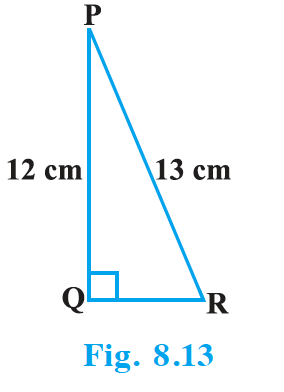

## EXERCISE 8.1

1. In $\triangle$ ABC, right-angled at B, AB = 24 cm, BC = 7 cm. Determine :
   - (i) sin A, cos A
   - (ii) sin C, cos C

2. In Fig. 8.13, find $\tan P - \cot R$.

   {: width="30%" }

3. If $\sin A = \dfrac{3}{4}$, calculate $\cos A$ and $\tan A$.

4. Given 15 cot A = 8, find sin A and sec A.

5. Given $\sec \theta = \dfrac{13}{12}$, calculate all other trigonometric ratios.

6. If $\angle$ A and $\angle$ B are acute angles such that $\cos A = \cos B$, then show that $\angle$ A = $\angle$ B.

7. If $\cot \theta = \dfrac{7}{8}$, evaluate :
   - (i) $\dfrac{(1 + \sin \theta)(1 - \sin \theta)}{(1 + \cos \theta)(1 - \cos \theta)}$
   - (ii) $\cot^2 \theta$

8. If 3 cot A = 4, check whether $\dfrac{1 - \tan^2 A}{1 + \tan^2 A} = \cos^2 A - \sin^2 A$ or not.

9. In triangle ABC, right-angled at B, if $\tan A = \dfrac{1}{\sqrt{3}}$, find the value of:
   - (i) $\sin A \cos C + \cos A \sin C$
   - (ii) $\cos A \cos C - \sin A \sin C$

10. In $\triangle$ PQR, right-angled at Q, PR + QR = 25 cm and PQ = 5 cm. Determine the values of sin P, cos P and tan P.

11. State whether the following are true or false. Justify your answer.
    - (i) The value of $\tan A$ is always less than 1.
    - (ii) $\sec A = \dfrac{12}{5}$ for some value of angle A.
    - (iii) cos A is the abbreviation used for the cosecant of angle A.
    - (iv) cot A is the product of cot and A.
    - (v) $\sin \theta = \dfrac{4}{3}$ for some angle $\theta$.

---

## Solutions

**1.** In $\triangle$ ABC, right-angled at B, AB = 24 cm, BC = 7 cm.

By Pythagoras theorem, $AC = \sqrt{AB^2 + BC^2} = \sqrt{24^2 + 7^2} = \sqrt{576 + 49} = \sqrt{625} = 25$ cm.

- (i) $\sin A = \dfrac{BC}{AC} = \dfrac{7}{25}$, $\cos A = \dfrac{AB}{AC} = \dfrac{24}{25}$.
- (ii) $\sin C = \dfrac{AB}{AC} = \dfrac{24}{25}$, $\cos C = \dfrac{BC}{AC} = \dfrac{7}{25}$.

**2.** In right $\triangle$ PQR (right-angled at Q), $\tan P = \dfrac{\text{opposite}}{\text{adjacent}} = \dfrac{QR}{PQ}$ and $\cot R = \dfrac{\text{adjacent}}{\text{opposite}} = \dfrac{QR}{PQ}$. So $\tan P = \cot R$, hence $\tan P - \cot R = 0$.

**3.** Given $\sin A = \dfrac{3}{4}$. Then $\cos A = \sqrt{1 - \sin^2 A} = \sqrt{1 - \dfrac{9}{16}} = \sqrt{\dfrac{7}{16}} = \dfrac{\sqrt{7}}{4}$, and $\tan A = \dfrac{\sin A}{\cos A} = \dfrac{3/4}{\sqrt{7}/4} = \dfrac{3}{\sqrt{7}}$.

**4.** Given $15 \cot A = 8$, so $\cot A = \dfrac{8}{15}$. Consider a right triangle where side adjacent to A = 8, side opposite to A = 15. Then hypotenuse $= \sqrt{8^2 + 15^2} = \sqrt{64 + 225} = 17$. So $\sin A = \dfrac{15}{17}$, $\sec A = \dfrac{17}{8}$.

**5.** Given $\sec \theta = \dfrac{13}{12}$, so $\cos \theta = \dfrac{12}{13}$. Then $\sin \theta = \sqrt{1 - \cos^2 \theta} = \sqrt{1 - \dfrac{144}{169}} = \dfrac{5}{13}$, $\tan \theta = \dfrac{\sin \theta}{\cos \theta} = \dfrac{5}{12}$, $\text{cosec } \theta = \dfrac{1}{\sin \theta} = \dfrac{13}{5}$, $\cot \theta = \dfrac{1}{\tan \theta} = \dfrac{12}{5}$.

**6.** In two right triangles, if $\cos A = \cos B$, then the ratio (adjacent/hypotenuse) is the same. So the triangles are similar and the angles are equal. Hence $\angle A = \angle B$.

**7.** Given $\cot \theta = \dfrac{7}{8}$.

- (i) $\dfrac{(1 + \sin \theta)(1 - \sin \theta)}{(1 + \cos \theta)(1 - \cos \theta)} = \dfrac{1 - \sin^2 \theta}{1 - \cos^2 \theta} = \dfrac{\cos^2 \theta}{\sin^2 \theta} = \cot^2 \theta = \left(\dfrac{7}{8}\right)^2 = \dfrac{49}{64}$.
- (ii) $\cot^2 \theta = \dfrac{49}{64}$.

**8.** Given $3 \cot A = 4$, so $\cot A = \dfrac{4}{3}$ and $\tan A = \dfrac{3}{4}$. In a right triangle with sides 3, 4, 5 (opposite, adjacent, hypotenuse), $\cos A = \dfrac{4}{5}$, $\sin A = \dfrac{3}{5}$.

LHS: $\dfrac{1 - \tan^2 A}{1 + \tan^2 A} = \dfrac{1 - 9/16}{1 + 9/16} = \dfrac{7/16}{25/16} = \dfrac{7}{25}$.

RHS: $\cos^2 A - \sin^2 A = \dfrac{16}{25} - \dfrac{9}{25} = \dfrac{7}{25}$.

So LHS = RHS; the equality holds.

**9.** In $\triangle$ ABC, right-angled at B, $\tan A = \dfrac{1}{\sqrt{3}}$ $\Rightarrow$ $\angle A = 30^\circ$, $\angle C = 60^\circ$.

- (i) $\sin A \cos C + \cos A \sin C = \sin(A + C) = \sin 90^\circ = 1$.
- (ii) $\cos A \cos C - \sin A \sin C = \cos(A + C) = \cos 90^\circ = 0$.

**10.** In $\triangle$ PQR, right-angled at Q, let QR = $x$ cm. Then PR = $(25 - x)$ cm. By Pythagoras, $PQ^2 + QR^2 = PR^2$ $\Rightarrow$ $5^2 + x^2 = (25 - x)^2$ $\Rightarrow$ $25 + x^2 = 625 - 50x + x^2$ $\Rightarrow$ $50x = 600$ $\Rightarrow$ $x = 12$. So QR = 12 cm, PR = 13 cm. Thus $\sin P = \dfrac{QR}{PR} = \dfrac{12}{13}$, $\cos P = \dfrac{PQ}{PR} = \dfrac{5}{13}$, $\tan P = \dfrac{QR}{PQ} = \dfrac{12}{5}$.

**11.**

- (i) **False.** For example, $\tan 60^\circ = \sqrt{3} > 1$.
- (ii) **True.** For an angle A in a right triangle with hypotenuse 12 and base 5, $\sec A = \dfrac{12}{5}$.
- (iii) **False.** cos A is the abbreviation for cosine of A; cosecant is abbreviated cosec A.
- (iv) **False.** cot A is the ratio (cos A)/(sin A), not the product of “cot” and A.
- (v) **False.** For any angle $\theta$, $\sin \theta \le 1$; $\dfrac{4}{3} > 1$ is not possible.
