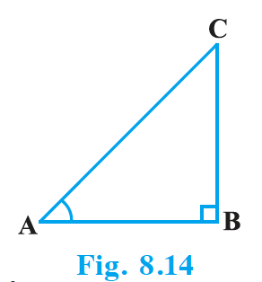
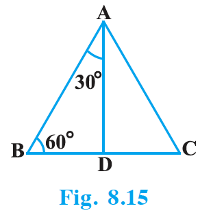
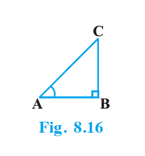
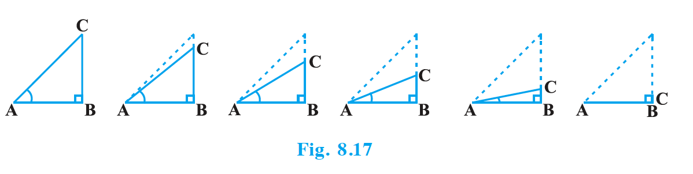
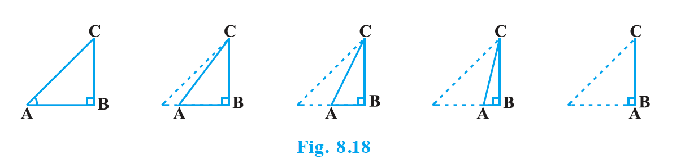
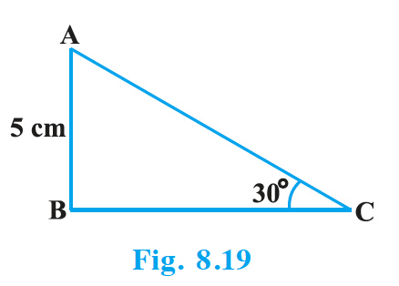
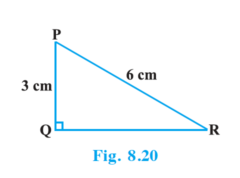

## 8.3 Trigonometric Ratios of Some Specific Angles

From geometry, you are already familiar with the construction of angles of $30^\circ$, $45^\circ$, $60^\circ$ and $90^\circ$. In this section, we will find the values of the trigonometric ratios for these angles and, of course, for $0^\circ$.

### Trigonometric Ratios of $45^\circ$

In $\triangle$ ABC, right-angled at B, if one angle is $45^\circ$, then the other angle is also $45^\circ$, i.e., $\angle$ A = $\angle$ C = $45^\circ$ (see Fig. 8.14).

So, BC = AB (Why?)

Now, suppose BC = AB = $a$.

{: width="30%" }

Then by Pythagoras Theorem, $AC^2 = AB^2 + BC^2 = a^2 + a^2 = 2a^2$, and therefore, $AC = a\sqrt{2}$.

Using the definitions of the trigonometric ratios, we have :

$\sin 45^\circ = \dfrac{\text{side opposite to angle } 45^\circ}{\text{hypotenuse}} = \dfrac{BC}{AC} = \dfrac{a}{a\sqrt{2}} = \dfrac{1}{\sqrt{2}}$

$\cos 45^\circ = \dfrac{\text{side adjacent to angle } 45^\circ}{\text{hypotenuse}} = \dfrac{AB}{AC} = \dfrac{a}{a\sqrt{2}} = \dfrac{1}{\sqrt{2}}$

$\tan 45^\circ = \dfrac{\text{side opposite to angle } 45^\circ}{\text{side adjacent to angle } 45^\circ} = \dfrac{BC}{AB} = \dfrac{a}{a} = 1$

Also, $\text{cosec } 45^\circ = \dfrac{1}{\sin 45^\circ} = \sqrt{2}$, $\sec 45^\circ = \dfrac{1}{\cos 45^\circ} = \sqrt{2}$, $\cot 45^\circ = \dfrac{1}{\tan 45^\circ} = 1$.

### Trigonometric Ratios of $30^\circ$ and $60^\circ$

Let us now calculate the trigonometric ratios of $30^\circ$ and $60^\circ$. Consider an equilateral triangle ABC. Since each angle in an equilateral triangle is $60^\circ$, therefore, $\angle$ A = $\angle$ B = $\angle$ C = $60^\circ$.

Draw the perpendicular AD from A to the side BC (see Fig. 8.15).

Now $\triangle$ ABD $\cong$ $\triangle$ ACD (Why?)

{: width="30%" }

Therefore, BD = DC and $\angle$ BAD = $\angle$ CAD (CPCT)

Now observe that: $\triangle$ ABD is a right triangle, right-angled at D with $\angle$ BAD = $30^\circ$ and $\angle$ ABD = $60^\circ$ (see Fig. 8.15).

As you know, for finding the trigonometric ratios, we need to know the lengths of the sides of the triangle. So, let us suppose that AB = 2a.

Then, $BD = \dfrac{1}{2} BC = a$

and $AD^2 = AB^2 - BD^2 = (2a)^2 - (a)^2 = 3a^2$, therefore, $AD = a\sqrt{3}$.

Now, we have :

$\sin 30^\circ = \dfrac{BD}{AB} = \dfrac{a}{2a} = \dfrac{1}{2}$, $\cos 30^\circ = \dfrac{AD}{AB} = \dfrac{a\sqrt{3}}{2a} = \dfrac{\sqrt{3}}{2}$

$\tan 30^\circ = \dfrac{BD}{AD} = \dfrac{a}{a\sqrt{3}} = \dfrac{1}{\sqrt{3}}$

Also, $\text{cosec } 30^\circ = \dfrac{1}{\sin 30^\circ} = 2$, $\sec 30^\circ = \dfrac{1}{\cos 30^\circ} = \dfrac{2}{\sqrt{3}}$, $\cot 30^\circ = \dfrac{1}{\tan 30^\circ} = \sqrt{3}$.

Similarly,

$\sin 60^\circ = \dfrac{AD}{AB} = \dfrac{a\sqrt{3}}{2a} = \dfrac{\sqrt{3}}{2}$, $\cos 60^\circ = \dfrac{1}{2}$, $\tan 60^\circ = \sqrt{3}$,

$\text{cosec } 60^\circ = \dfrac{2}{\sqrt{3}}$, $\sec 60^\circ = 2$ and $\cot 60^\circ = \dfrac{1}{\sqrt{3}}$.

### Trigonometric Ratios of $0^\circ$ and $90^\circ$

Let us see what happens to the trigonometric ratios of angle A, if it is made smaller and smaller in the right triangle ABC (see Fig. 8.16), till it becomes zero. As $\angle$ A gets smaller and smaller, the length of the side BC decreases. The point C gets closer to point B, and finally when $\angle$ A becomes very close to $0^\circ$, AC becomes almost the same as AB (see Fig. 8.17).

{: width="30%" }

{: width="80%" }

When $\angle$ A is very close to $0^\circ$, BC gets very close to 0 and so the value of $\sin A = \dfrac{BC}{AC}$ is very close to 0. Also, when $\angle$ A is very close to $0^\circ$, AC is nearly the same as AB and so the value of $\cos A = \dfrac{AB}{AC}$ is very close to 1.

This helps us to see how we can define the values of sin A and cos A when A = $0^\circ$. We define : $\sin 0^\circ = 0$ and $\cos 0^\circ = 1$.

Using these, we have :

$\tan 0^\circ = \dfrac{\sin 0^\circ}{\cos 0^\circ} = 0$, $\cot 0^\circ = \dfrac{1}{\tan 0^\circ}$, which is not defined. (Why?)

$\sec 0^\circ = \dfrac{1}{\cos 0^\circ} = 1$ and $\text{cosec } 0^\circ = \dfrac{1}{\sin 0^\circ}$, which is again not defined. (Why?)

Now, let us see what happens to the trigonometric ratios of $\angle$ A, when it is made larger and larger in $\triangle$ ABC till it becomes $90^\circ$. As $\angle$ A gets larger and larger, $\angle$ C gets smaller and smaller. Therefore, as in the case above, the length of the side AB goes on decreasing. The point A gets closer to point B. Finally when $\angle$ A is very close to $90^\circ$, $\angle$ C becomes very close to $0^\circ$ and the side AC almost coincides with side BC (see Fig. 8.18).

{: width="80%" }

When $\angle$ C is very close to $0^\circ$, $\angle$ A is very close to $90^\circ$, side AC is nearly the same as side BC, and so sin A is very close to 1. Also when $\angle$ A is very close to $90^\circ$, $\angle$ C is very close to $0^\circ$, and the side AB is nearly zero, so cos A is very close to 0.

So, we define : $\sin 90^\circ = 1$ and $\cos 90^\circ = 0$.

Now, why don't you find the other trigonometric ratios of $90^\circ$?

We shall now give the values of all the trigonometric ratios of $0^\circ$, $30^\circ$, $45^\circ$, $60^\circ$ and $90^\circ$ in Table 8.1, for ready reference.

**Table 8.1**

| $\angle A$ | $0^\circ$ | $30^\circ$ | $45^\circ$ | $60^\circ$ | $90^\circ$ |
| --- | --- | --- | --- | --- | --- |
| sin A | 0 | $\dfrac{1}{2}$ | $\dfrac{1}{\sqrt{2}}$ | $\dfrac{\sqrt{3}}{2}$ | 1 |
| cos A | 1 | $\dfrac{\sqrt{3}}{2}$ | $\dfrac{1}{\sqrt{2}}$ | $\dfrac{1}{2}$ | 0 |
| tan A | 0 | $\dfrac{1}{\sqrt{3}}$ | 1 | $\sqrt{3}$ | Not defined |
| cosec A | Not defined | 2 | $\sqrt{2}$ | $\dfrac{2}{\sqrt{3}}$ | 1 |
| sec A | 1 | $\dfrac{2}{\sqrt{3}}$ | $\sqrt{2}$ | 2 | Not defined |
| cot A | Not defined | $\sqrt{3}$ | 1 | $\dfrac{1}{\sqrt{3}}$ | 0 |

**Remark :** From the table above you can observe that as $\angle$ A increases from $0^\circ$ to $90^\circ$, sin A increases from 0 to 1 and cos A decreases from 1 to 0.

Let us illustrate the use of the values in the table above through some examples.

### Example 6

In $\triangle$ ABC, right-angled at B, AB = 5 cm and $\angle$ ACB = $30^\circ$ (see Fig. 8.19). Determine the lengths of the sides BC and AC.

**Solution :** To find the length of the side BC, we will choose the trigonometric ratio involving BC and the given side AB. Since BC is the side adjacent to angle C and AB is the side opposite to angle C, therefore $\dfrac{AB}{BC} = \tan C$.

{: width="30%" }

i.e., $\dfrac{5}{BC} = \tan 30^\circ = \dfrac{1}{\sqrt{3}}$

which gives $BC = 5\sqrt{3}$ cm.

To find the length of the side AC, we consider $\sin 30^\circ = \dfrac{AB}{AC}$ (Why?)

i.e., $\dfrac{1}{2} = \dfrac{5}{AC}$

i.e., AC = 10 cm.

Note that alternatively we could have used Pythagoras theorem to determine the third side in the example above, i.e., $AC = \sqrt{AB^2 + BC^2} = \sqrt{5^2 + (5\sqrt{3})^2}$ cm = 10 cm.

### Example 7

In $\triangle$ PQR, right-angled at Q (see Fig. 8.20), PQ = 3 cm and PR = 6 cm. Determine $\angle$ QPR and $\angle$ PRQ.

**Solution :** Given PQ = 3 cm and PR = 6 cm.

Therefore, $\dfrac{PQ}{PR} = \sin R$

{: width="30%" }

or $\sin R = \dfrac{3}{6} = \dfrac{1}{2}$

So, $\angle$ PRQ = $30^\circ$

and therefore, $\angle$ QPR = $60^\circ$. (Why?)

You may note that if one of the sides and any other part (either an acute angle or any side) of a right triangle is known, the remaining sides and angles of the triangle can be determined.

### Example 8

If $\sin (A - B) = \dfrac{1}{2}$, $\cos (A + B) = \dfrac{1}{2}$, $0^\circ < A + B \le 90^\circ$, A > B, find A and B.

**Solution :** Since $\sin (A - B) = \dfrac{1}{2}$, therefore, A – B = $30^\circ$ (Why?) … (1)

Also, since $\cos (A + B) = \dfrac{1}{2}$, therefore, A + B = $60^\circ$ (Why?) … (2)

Solving (1) and (2), we get : A = $45^\circ$ and B = $15^\circ$.

