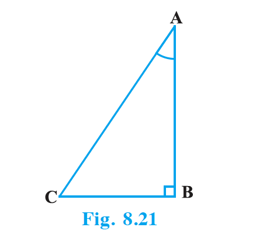

## 8.4 Trigonometric Identities

You may recall that an equation is called an identity when it is true for all values of the variables involved. Similarly, an equation involving trigonometric ratios of an angle is called a trigonometric identity, if it is true for all values of the angle(s) involved.

In this section, we will prove one trigonometric identity, and use it further to prove other useful trigonometric identities.

{: width="50%" }

In $\triangle$ ABC, right-angled at B (see Fig. 8.21), we have:

$AB^2 + BC^2 = AC^2$ … (1)

Dividing each term of (1) by $AC^2$, we get

$\dfrac{AB^2}{AC^2} + \dfrac{BC^2}{AC^2} = \dfrac{AC^2}{AC^2}$

i.e., $\left(\dfrac{AB}{AC}\right)^2 + \left(\dfrac{BC}{AC}\right)^2 = \left(\dfrac{AC}{AC}\right)^2$

i.e., $(\cos A)^2 + (\sin A)^2 = 1$

i.e., $\cos^2 A + \sin^2 A = 1$ … (2)

This is true for all A such that $0^\circ \le A \le 90^\circ$. So, this is a trigonometric identity.

Let us now divide (1) by $AB^2$. We get

$\dfrac{AB^2}{AB^2} + \dfrac{BC^2}{AB^2} = \dfrac{AC^2}{AB^2}$

i.e., $1 + \tan^2 A = \sec^2 A$ … (3)

Is this equation true for A = $0^\circ$? Yes, it is. What about A = $90^\circ$? Well, tan A and sec A are not defined for A = $90^\circ$. So, (3) is true for all A such that $0^\circ \le A < 90^\circ$.

Let us see what we get on dividing (1) by $BC^2$. We get

$\dfrac{AB^2}{BC^2} + \dfrac{BC^2}{BC^2} = \dfrac{AC^2}{BC^2}$

i.e., $\cot^2 A + 1 = \text{cosec}^2 A$ … (4)

Note that cosec A and cot A are not defined for A = $0^\circ$. Therefore (4) is true for all A such that $0^\circ < A \le 90^\circ$.

Using these identities, we can express each trigonometric ratio in terms of other trigonometric ratios. Suppose we know that $\tan A = \dfrac{1}{\sqrt{3}}$. Then $\cot A = \sqrt{3}$. Since $\sec^2 A = 1 + \tan^2 A = 1 + \dfrac{1}{3} = \dfrac{4}{3}$, $\sec A = \dfrac{2}{\sqrt{3}}$, and $\cos A = \dfrac{\sqrt{3}}{2}$. Again, $\sin A = \sqrt{1 - \cos^2 A} = \dfrac{1}{2}$. Therefore $\text{cosec } A = 2$.

### Example 9

Express the ratios cos A, tan A and sec A in terms of sin A.

**Solution :** Since $\cos^2 A + \sin^2 A = 1$, therefore $\cos^2 A = 1 - \sin^2 A$, i.e. $\cos A = \pm \sqrt{1 - \sin^2 A}$. This gives $\cos A = \sqrt{1 - \sin^2 A}$ (Why?). Hence $\tan A = \dfrac{\sin A}{\cos A} = \dfrac{\sin A}{\sqrt{1 - \sin^2 A}}$ and $\sec A = \dfrac{1}{\cos A} = \dfrac{1}{\sqrt{1 - \sin^2 A}}$.

### Example 10

Prove that $\sec A (1 - \sin A)(\sec A + \tan A) = 1$.

**Solution :** LHS = $\sec A (1 - \sin A)(\sec A + \tan A) = \dfrac{1}{\cos A}(1 - \sin A)\left(\dfrac{1}{\cos A} + \dfrac{\sin A}{\cos A}\right) = \dfrac{(1 - \sin A)(1 + \sin A)}{\cos^2 A} = \dfrac{1 - \sin^2 A}{\cos^2 A} = \dfrac{\cos^2 A}{\cos^2 A} = 1 = \text{RHS}$.

### Example 11

Prove that $\dfrac{\cot A - \cos A}{\cot A + \cos A} = \dfrac{\text{cosec } A - 1}{\text{cosec } A + 1}$.

**Solution :** LHS = $\dfrac{\cot A - \cos A}{\cot A + \cos A} = \dfrac{\dfrac{\cos A}{\sin A} - \cos A}{\dfrac{\cos A}{\sin A} + \cos A} = \dfrac{\cos A(\dfrac{1}{\sin A} - 1)}{\cos A(\dfrac{1}{\sin A} + 1)} = \dfrac{\text{cosec } A - 1}{\text{cosec } A + 1} = \text{RHS}$.

### Example 12

Prove that $\dfrac{\sin \theta - \cos \theta + 1}{\sin \theta + \cos \theta - 1} = \dfrac{1}{\sec \theta - \tan \theta}$, using the identity $\sec^2 \theta = 1 + \tan^2 \theta$.

**Solution :** Convert the LHS in terms of $\sec \theta$ and $\tan \theta$ by dividing numerator and denominator by $\cos \theta$. LHS = $\dfrac{\tan \theta - 1 + \sec \theta}{\tan \theta + 1 - \sec \theta}$. Multiply numerator and denominator by $(\tan \theta - \sec \theta)$ and use $\tan^2 \theta - \sec^2 \theta = -1$ to get $\dfrac{-1}{\tan \theta - \sec \theta} = \dfrac{1}{\sec \theta - \tan \theta}$ = RHS.

