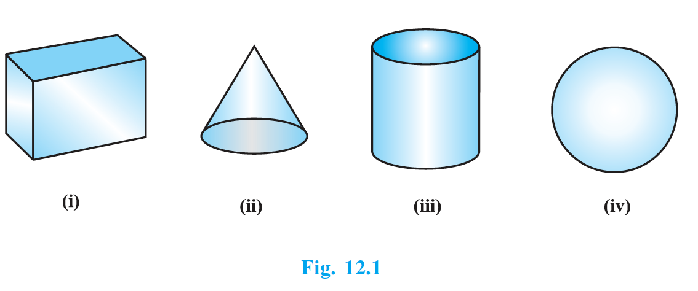
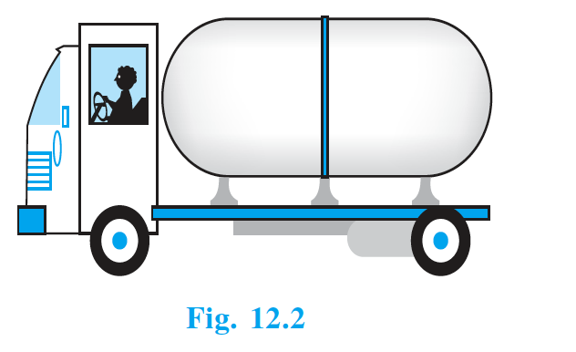
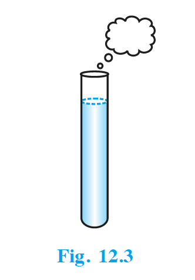

## 12.1 Introduction

From Class IX, you are familiar with some of the solids like cuboid, cone, cylinder, and sphere (see Fig. 12.1). You have also learnt how to find their surface areas and volumes.

{: width="50%" }

In our day-to-day life, we come across a number of solids made up of combinations of two or more of the basic solids as shown above.

You must have seen a truck with a container fitted on its back (see Fig. 12.2), carrying oil or water from one place to another. Is it in the shape of any of the four basic solids mentioned above? You may guess that it is made of a cylinder with two hemispheres as its ends.

{: width="50%" }

Again, you may have seen an object like the one in Fig. 12.3. Can you name it? A test tube, right! You would have used one in your science laboratory. This tube is also a combination of a cylinder and a hemisphere. Similarly, while travelling, you may have seen some big and beautiful buildings or monuments made up of a combination of solids mentioned above.

{: width="50%" }

If for some reason you wanted to find the surface areas, or volumes, or capacities of such objects, how would you do it? We cannot classify these under any of the solids you have already studied.

In this chapter, you will see how to find surface areas and volumes of such objects.

## Source

- NCERT PDF (to be added) in `class10/maths/maths_ncert/content/12-surface-area-and-volumes/`
