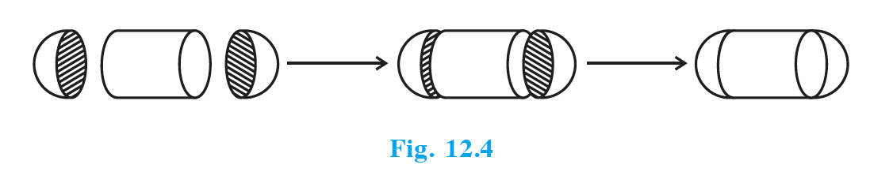
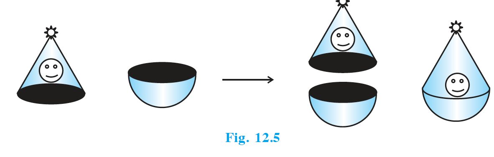
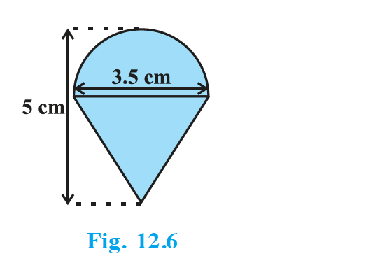
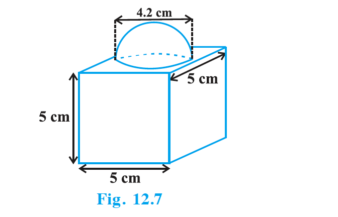
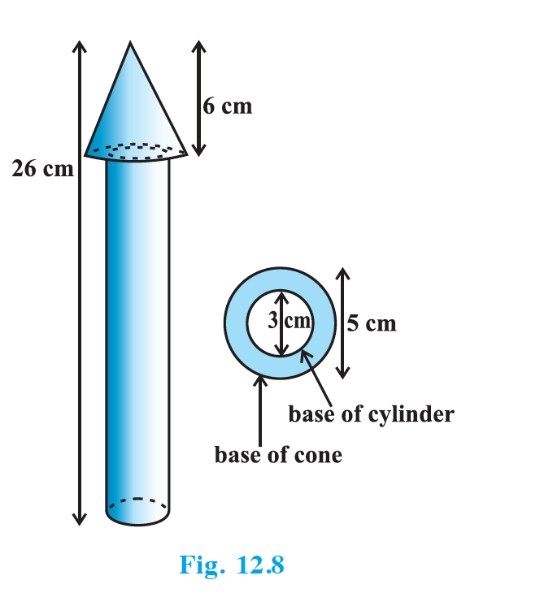
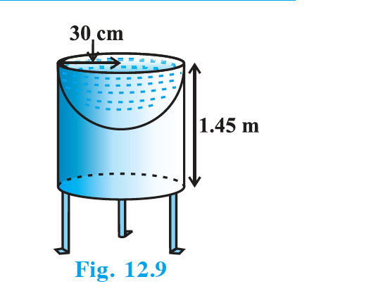

## 12.2 Surface Area of a Combination of Solids

Let us consider the container seen in Fig. 12.2. How do we find the surface area of such a solid? Whenever we come across a new problem, we first try to see if we can break it down into smaller problems we have solved earlier. We can see that this solid is made up of a cylinder with two hemispheres stuck at either end. It would look like what we have in Fig. 12.4, after we put the pieces all together.

{: width="50%" }

If we consider the surface of the newly formed object, we would be able to see only the curved surfaces of the two hemispheres and the curved surface of the cylinder. So, the total surface area of the new solid is the sum of the curved surface areas of each of the individual parts:

$$
\text{TSA of new solid} = \text{CSA of one hemisphere} + \text{CSA of cylinder} + \text{CSA of other hemisphere}
$$

where TSA and CSA stand for *Total Surface Area* and *Curved Surface Area*, respectively.

Let us now consider another situation. Suppose we are making a toy by putting together a hemisphere and a cone. Let us see the steps that we would be going through (Fig. 12.5).

{: width="50%" }

At the end of our trial, we have got ourselves a nice round-bottomed toy. If we want to find how much paint we would require to colour the surface of this toy, we need to know the surface area of the toy, which consists of the CSA of the hemisphere and the CSA of the cone:

$$
\text{TSA of toy} = \text{CSA of hemisphere} + \text{CSA of cone}
$$

Now, let us consider some examples.

## Example 1

Rasheed got a playing top (lattu) as his birthday present, which surprisingly had no colour on it. He wanted to colour it with his crayons. The top is shaped like a cone surmounted by a hemisphere (see Fig. 12.6). The entire top is 5 cm in height and the diameter of the top is 3.5 cm. Find the area he has to colour. (Take $\pi = \dfrac{22}{7}$.)

{: width="50%" }

### Solution (Example 1)

The top is exactly like Fig. 12.5, so:

$$
\text{TSA} = \text{CSA of hemisphere} + \text{CSA of cone}.
$$

Diameter $= 3.5$ cm $\Rightarrow r = 1.75$ cm.

Height of cone:

$$
h = 5 - r = 5 - 1.75 = 3.25\ \text{cm}.
$$

Slant height:

$$
l = \sqrt{r^2 + h^2} = \sqrt{(1.75)^2 + (3.25)^2} \approx 3.7\ \text{cm}.
$$

CSA of hemisphere:

$$
2\pi r^2 = 2 \times \frac{22}{7} \times (1.75)^2 = 19.25\ \text{cm}^2.
$$

CSA of cone:

$$
\pi r l = \frac{22}{7} \times 1.75 \times 3.7 \approx 20.35\ \text{cm}^2.
$$

Therefore:

$$
\text{TSA} \approx 19.25 + 20.35 = 39.6\ \text{cm}^2\ (\text{approx.})
$$

**Note:** “Total surface area of the top” is *not* the sum of the *total* surface areas of the cone and hemisphere.

## Example 2

The decorative block shown in Fig. 12.7 is made of two solids — a cube and a hemisphere. The base of the block is a cube with edge 5 cm, and the hemisphere fixed on the top has a diameter of 4.2 cm. Find the total surface area of the block. (Take $\pi = \dfrac{22}{7}$.)

{: width="50%" }

### Solution (Example 2)

TSA of cube:

$$
6a^2 = 6 \times 5^2 = 150\ \text{cm}^2.
$$

Diameter of hemisphere $= 4.2$ cm $\Rightarrow r = 2.1$ cm.

The circular area of the cube where the hemisphere is attached is not exposed, so:

$$
\text{Surface area of block} = 150 - \pi r^2 + 2\pi r^2 = 150 + \pi r^2.
$$

Now:

$$
\pi r^2 = \frac{22}{7} \times (2.1)^2 = \frac{22}{7} \times 4.41 = 13.86\ \text{cm}^2.
$$

Therefore:

$$
\text{Surface area of block} = 150 + 13.86 = 163.86\ \text{cm}^2.
$$

## Example 3

A wooden toy rocket is in the shape of a cone mounted on a cylinder, as shown in Fig. 12.8. The height of the entire rocket is 26 cm, while the height of the conical part is 6 cm. The base of the conical portion has a diameter of 5 cm, while the base diameter of the cylindrical portion is 3 cm. If the conical portion is to be painted orange and the cylindrical portion yellow, find the area of the rocket painted with each of these colours. (Take $\pi = 3.14$.)

{: width="50%" }

### Solution (Example 3)

Cone: $r = 2.5$ cm, $h = 6$ cm, so $l = \sqrt{r^2 + h^2} = \sqrt{2.5^2 + 6^2} = 6.5$ cm.

Cylinder: $r' = 1.5$ cm and $h' = 26 - 6 = 20$ cm.

Area painted orange:

$$
\pi r l + \pi r^2 - \pi (r')^2 = \pi[(2.5 \times 6.5) + (2.5)^2 - (1.5)^2]
= 3.14 \times 20.25 = 63.585\ \text{cm}^2.
$$

Area painted yellow:

$$
2\pi r' h' + \pi (r')^2 = 2 \times 3.14 \times 1.5 \times 20 + 3.14 \times (1.5)^2
= 188.4 + 7.065 = 195.465\ \text{cm}^2.
$$

## Example 4

Mayank made a bird-bath for his garden in the shape of a cylinder with a hemispherical depression at one end (see Fig. 12.9). The height of the cylinder is 1.45 m and its radius is 30 cm. Find the total surface area of the bird-bath. (Take $\pi = \dfrac{22}{7}$.)

{: width="50%" }

### Solution (Example 4)

Here $h = 145$ cm and $r = 30$ cm.

$$
\begin{aligned}
\text{TSA} &= \text{CSA of cylinder} + \text{CSA of hemisphere} \\
&= 2\pi r h + 2\pi r^2 = 2\pi r(h + r) \\
&= 2 \times \frac{22}{7} \times 30 \times (145 + 30) = 33000\ \text{cm}^2 = 3.3\ \text{m}^2.
\end{aligned}
$$

## Exercise 12.1

Unless stated otherwise, take $\pi = \dfrac{22}{7}$.

1. 2 cubes each of volume $64\ \mathrm{cm}^3$ are joined end to end. Find the surface area of the resulting cuboid.
2. A vessel is in the form of a hollow hemisphere mounted by a hollow cylinder. The diameter of the hemisphere is 14 cm and the total height of the vessel is 13 cm. Find the inner surface area of the vessel.
3. A toy is in the form of a cone of radius 3.5 cm mounted on a hemisphere of same radius. The total height of the toy is 15.5 cm. Find the total surface area of the toy.
4. A cubical block of side 7 cm is surmounted by a hemisphere. What is the greatest diameter the hemisphere can have? Find the surface area of the solid.
5. A hemispherical depression is cut out from one face of a cubical wooden block such that the diameter $l$ of the hemisphere is equal to the edge of the cube. Determine the surface area of the remaining solid.
6. A medicine capsule is in the shape of a cylinder with two hemispheres stuck to each of its ends (see Fig. 12.10). The length of the entire capsule is 14 mm and the diameter of the capsule is 5 mm. Find its surface area.

   {: width="50%" }

7. A tent is in the shape of a cylinder surmounted by a conical top. If the height and diameter of the cylindrical part are 2.1 m and 4 m respectively, and the slant height of the top is 2.8 m, find the area of the canvas used for making the tent. Also, find the cost of the canvas of the tent at the rate of ₹500 per $\mathrm{m}^2$. (Note that the base of the tent will not be covered with canvas.)
8. From a solid cylinder whose height is 2.4 cm and diameter 1.4 cm, a conical cavity of the same height and same diameter is hollowed out. Find the total surface area of the remaining solid to the nearest $\mathrm{cm}^2$.
9. A wooden article was made by scooping out a hemisphere from each end of a solid cylinder, as shown in Fig. 12.11. If the height of the cylinder is 10 cm, and its base is of radius 3.5 cm, find the total surface area of the article.

   {: width="50%" }
