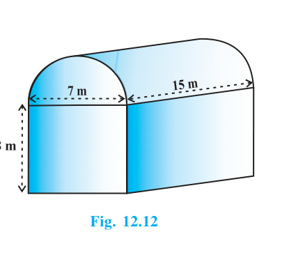
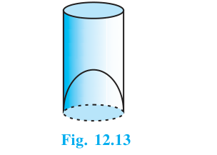
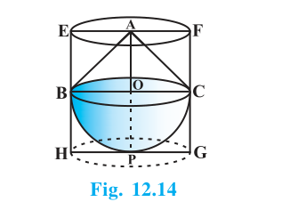

## 12.3 Volume of a Combination of Solids

In the previous section, we have discussed how to find the surface area of solids made up of a combination of two basic solids. Here, we shall see how to calculate their volumes. It may be noted that in calculating the surface area, we have not added the surface areas of the two constituents, because some part of the surface area disappeared in the process of joining them. However, this will not be the case when we calculate the volume. The volume of the solid formed by joining two basic solids will actually be the sum of the volumes of the constituents.

## Example 5

Shanta runs an industry in a shed which is in the shape of a cuboid surmounted by a half cylinder (see Fig. 12.12). If the base of the shed is of dimension 7 m × 15 m, and the height of the cuboidal portion is 8 m, find the volume of air that the shed can hold. Further, suppose the machinery in the shed occupies a total space of 300 m$^3$, and there are 20 workers, each of whom occupy about 0.08 m$^3$ space on an average. Then, how much air is in the shed? (Take $\pi = \dfrac{22}{7}$.)

{: width="50%" }

### Solution (Example 5)

The shed is a combination of:

- a cuboid of dimensions 15 m × 7 m × 8 m
- and a half-cylinder of radius $r = \dfrac{7}{2} = 3.5$ m and length 15 m

So,

$$
\begin{aligned}
V &= (15 \times 7 \times 8) + \frac{1}{2}\left(\pi r^2 \times 15\right) \\
&= 840 + \frac{1}{2}\left(\frac{22}{7} \times (3.5)^2 \times 15\right) \\
&= 840 + 288.75 = 1128.75\ \text{m}^3.
\end{aligned}
$$

Occupied volume:

- machinery $= 300\ \text{m}^3$
- workers $= 20 \times 0.08 = 1.6\ \text{m}^3$

Therefore, volume of air in the shed:

$$
1128.75 - (300 + 1.6) = 827.15\ \text{m}^3.
$$

## Example 6

A juice seller was serving his customers using glasses as shown in Fig. 12.13. The inner diameter of the cylindrical glass was 5 cm, but the bottom of the glass had a hemispherical raised portion which reduced the capacity of the glass. If the height of a glass was 10 cm, find the apparent capacity of the glass and its actual capacity. (Use $\pi = 3.14$.)

{: width="50%" }

### Solution (Example 6)

Inner diameter $= 5$ cm $\Rightarrow r = 2.5$ cm, height $h = 10$ cm.

Apparent capacity (as a cylinder):

$$
V_{\text{cyl}} = \pi r^2 h = 3.14 \times (2.5)^2 \times 10 = 196.25\ \text{cm}^3.
$$

The hemispherical raised portion reduces the capacity by the volume of a hemisphere:

$$
V_{\text{hemisphere}} = \frac{2}{3}\pi r^3 = \frac{2}{3}\times 3.14 \times (2.5)^3 \approx 32.71\ \text{cm}^3.
$$

So, actual capacity:

$$
V_{\text{actual}} = 196.25 - 32.71 = 163.54\ \text{cm}^3.
$$

## Example 7

A solid toy is in the form of a hemisphere surmounted by a right circular cone. The height of the cone is 2 cm and the diameter of the base is 4 cm. Determine the volume of the toy. If a right circular cylinder circumscribes the toy, find the difference of the volumes of the cylinder and the toy. (Take $\pi = 3.14$.)

{: width="50%" }

### Solution (Example 7)

Diameter of base $= 4$ cm $\Rightarrow r = 2$ cm, height of cone $h = 2$ cm.

Volume of toy:

$$
\begin{aligned}
V_{\text{toy}} &= V_{\text{hemisphere}} + V_{\text{cone}} \\
&= \frac{2}{3}\pi r^3 + \frac{1}{3}\pi r^2 h \\
&= \frac{2}{3}\times 3.14 \times 2^3 + \frac{1}{3}\times 3.14 \times 2^2 \times 2 \\
&= 25.12\ \text{cm}^3.
\end{aligned}
$$

A cylinder circumscribing the toy has radius $2$ cm and height $2 + 2 = 4$ cm.

$$
V_{\text{cyl}} = \pi r^2 H = 3.14 \times 2^2 \times 4 = 50.24\ \text{cm}^3.
$$

Therefore, required difference:

$$
V_{\text{cyl}} - V_{\text{toy}} = 50.24 - 25.12 = 25.12\ \text{cm}^3.
$$

## Exercises

Exercise 12.1 and Exercise 12.2 are on the Exercises page:

- [Go to Exercises](07-exercises.html)
- [Go to Exercise 12.2](07-exercises.html#exercise-12-2)
