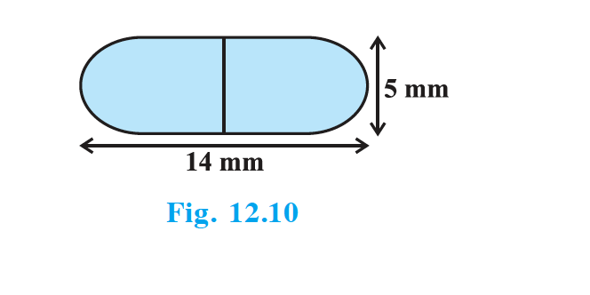
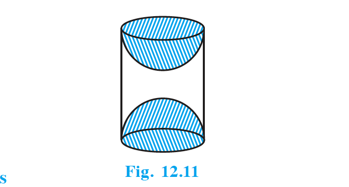

## Exercises

### Exercise 12.1

Unless stated otherwise, take $\pi = \dfrac{22}{7}$.

1. 2 cubes each of volume 64 cm$^3$ are joined end to end. Find the surface area of the resulting cuboid.
2. A vessel is in the form of a hollow hemisphere mounted by a hollow cylinder. The diameter of the hemisphere is 14 cm and the total height of the vessel is 13 cm. Find the inner surface area of the vessel.
3. A toy is in the form of a cone of radius 3.5 cm mounted on a hemisphere of same radius. The total height of the toy is 15.5 cm. Find the total surface area of the toy.
4. A cubical block of side 7 cm is surmounted by a hemisphere. What is the greatest diameter the hemisphere can have? Find the surface area of the solid.
5. A hemispherical depression is cut out from one face of a cubical wooden block such that the diameter $l$ of the hemisphere is equal to the edge of the cube. Determine the surface area of the remaining solid.
6. A medicine capsule is in the shape of a cylinder with two hemispheres stuck to each of its ends (see Fig. 12.10). The length of the entire capsule is 14 mm and the diameter of the capsule is 5 mm. Find its surface area.

   {: width="50%" }

7. A tent is in the shape of a cylinder surmounted by a conical top. If the height and diameter of the cylindrical part are 2.1 m and 4 m respectively, and the slant height of the top is 2.8 m, find the area of the canvas used for making the tent. Also, find the cost of the canvas of the tent at the rate of ` 500 per m$^2$. (Note that the base of the tent will not be covered with canvas.)
8. From a solid cylinder whose height is 2.4 cm and diameter 1.4 cm, a conical cavity of the same height and same diameter is hollowed out. Find the total surface area of the remaining solid to the nearest cm$^2$.
9. A wooden article was made by scooping out a hemisphere from each end of a solid cylinder, as shown in Fig. 12.11. If the height of the cylinder is 10 cm, and its base is of radius 3.5 cm, find the total surface area of the article.

   {: width="50%" }

### Exercise 12.2

Unless stated otherwise, take $\pi = \dfrac{22}{7}$.

1. A solid is in the shape of a cone standing on a hemisphere with both their radii being equal to 1 cm and the height of the cone is equal to its radius. Find the volume of the solid in terms of $\pi$.
2. Rachel, an engineering student, was asked to make a model shaped like a cylinder with two cones attached at its two ends by using a thin aluminium sheet. The diameter of the model is 3 cm and its length is 12 cm. If each cone has a height of 2 cm, find the volume of air contained in the model that Rachel made. (Assume the outer and inner dimensions of the model to be nearly the same.)
3. A gulab jamun contains sugar syrup up to about 30% of its volume. Find approximately how much syrup would be found in 45 gulab jamuns, each shaped like a cylinder with two hemispherical ends with length 5 cm and diameter 2.8 cm (see Fig. 12.15).

   **TODO:** Insert Fig. 12.15

4. A pen stand made of wood is in the shape of a cuboid with four conical depressions to hold pens. The dimensions of the cuboid are 15 cm by 10 cm by 3.5 cm. The radius of each of the depressions is 0.5 cm and the depth is 1.4 cm. Find the volume of wood in the entire stand (see Fig. 12.16).

   **TODO:** Insert Fig. 12.16

5. A vessel is in the form of an inverted cone. Its height is 8 cm and the radius of its top, which is open, is 5 cm. It is filled with water up to the brim. When lead shots, each of which is a sphere of radius 0.5 cm are dropped into the vessel, one-fourth of the water flows out. Find the number of lead shots dropped in the vessel.
6. A solid iron pole consists of a cylinder of height 220 cm and base diameter 24 cm, which is surmounted by another cylinder of height 60 cm and radius 8 cm. Find the mass of the pole, given that 1 cm$^3$ of iron has approximately 8g mass. (Use $\pi = 3.14$)
7. A solid consisting of a right circular cone of height 120 cm and radius 60 cm standing on a hemisphere of radius 60 cm is placed upright in a right circular cylinder full of water such that it touches the bottom. Find the volume of water left in the cylinder, if the radius of the cylinder is 60 cm and its height is 180 cm.
8. A spherical glass vessel has a cylindrical neck 8 cm long, 2 cm in diameter; the diameter of the spherical part is 8.5 cm. By measuring the amount of water it holds, a child finds its volume to be 345 cm$^3$. Check whether she is correct, taking the above as the inside measurements, and $\pi = 3.14$.
