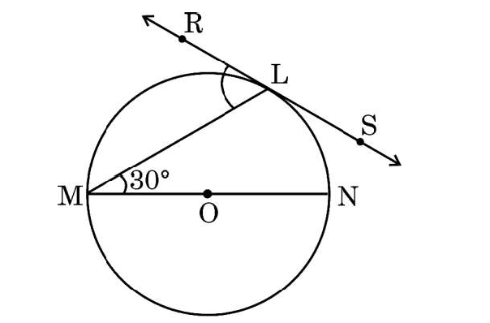
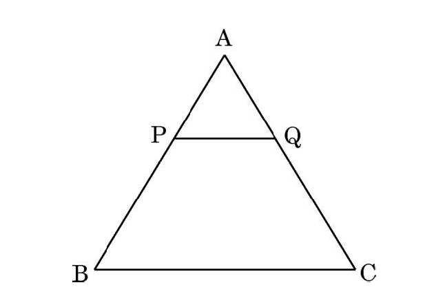
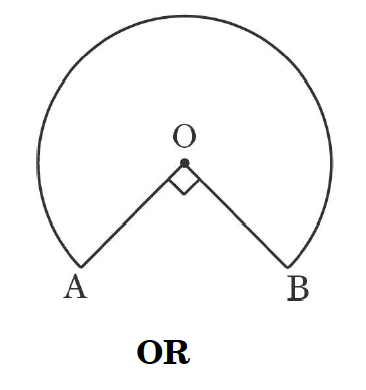
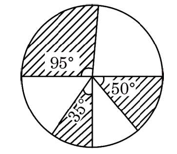
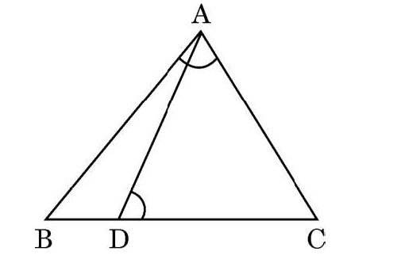
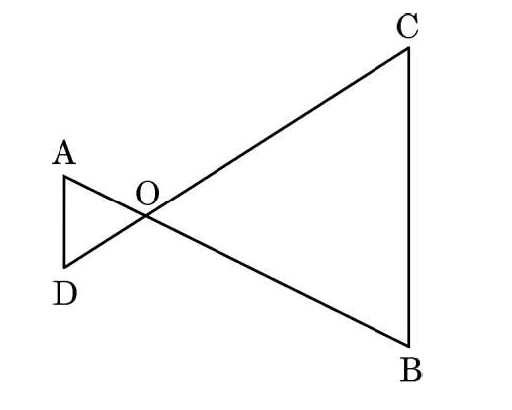
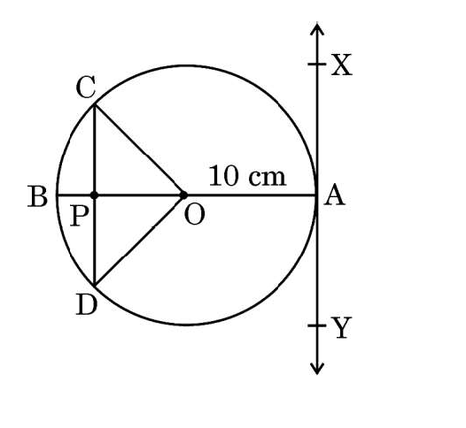
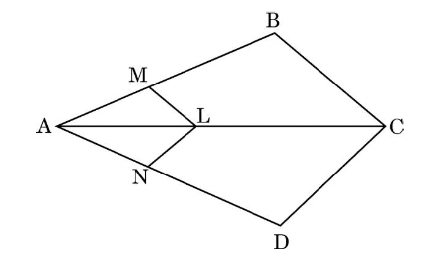
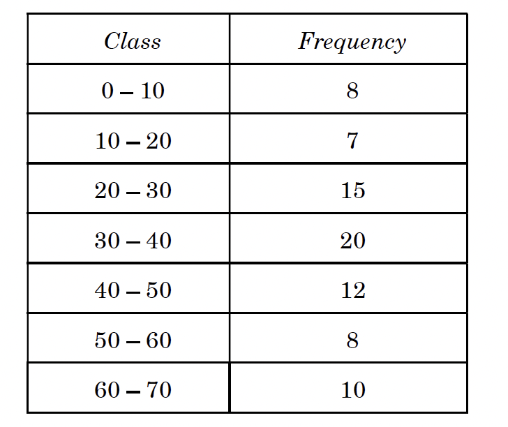

# 30-2-1 Mathematics Standard

## General Instructions

*Read the following instructions very carefully and strictly follow them:*

1. This question paper contains **38** questions. All questions are compulsory.
2. This question paper is divided into five Sections - A, B, C, D and E.
3. In **Section A**, Questions no. 1 to 18 are multiple choice questions (MCQs) and questions number 19 and 20 are Assertion-Reason based questions of 1 mark each.
4. In **Section B**, Questions no. 21 to 25 are very short answer (VSA) type questions, carrying 2 marks each.
5. In **Section C**, Questions no. 26 to 31 are short answer (SA) type questions, carrying 3 marks each.
6. In **Section D**, Questions no. 32 to 35 are long answer (LA) type questions carrying 5 marks each.
7. In **Section E**, Questions no. 36 to 38 are case study based questions carrying 4 marks each. Internal choice is provided in 2 marks questions in each case study.
8. There is no overall choice. However, an internal choice has been provided in 2 questions in Section B, 2 questions in Section C, 2 questions in Section D and 3 questions in Section E.
9. Draw neat diagrams wherever required. Take $\pi = \frac{22}{7}$ wherever required, if not stated.
10. Use of calculator is not allowed.

---

## SECTION A

*This section has 20 Multiple Choice Questions (MCQs) carrying 1 mark each.*

$20 \times 1 = 20$

**1.** If $7 \cos^2 \theta + 3 \sin^2 \theta = 4$, then the value of $\theta$ is:

- (A) $30°$
- (B) $45°$
- (C) $60°$
- (D) $90°$

**2.** The probability of drawing an even prime number out of numbers from 1 to 30 is:

- (A) $\frac{1}{30}$
- (B) $\frac{4}{15}$
- (C) $\frac{7}{30}$
- (D) $0$

**3.** The quadratic equation whose roots are $7$ and $\frac{1}{7}$ is:

- (A) $7x^2 - 50x + 7 = 0$
- (B) $7x^2 - 50x + 1 = 0$
- (C) $7x^2 + 50x - 7 = 0$
- (D) $7x^2 + 50x - 1 = 0$

**4.** The least number which is a perfect square and is divisible by each of 16, 20 and 50, is:

- (A) 1200
- (B) 100
- (C) 3600
- (D) 2400

**5.** The coordinates of the end points of a diameter of a circle are $(5, -2)$ and $(5, 2)$. The length of the radius of the circle is:

- (A) $\pm 2$
- (B) $\pm 4$
- (C) $4$
- (D) $2$

**6.** The points $(-5, 0)$, $(5, 0)$ and $(0, 4)$ are the vertices of a triangle which is:

- (A) right-angled triangle
- (B) isosceles triangle
- (C) equilateral triangle
- (D) scalene triangle

**7.** In the given figure, RS is the tangent to the circle at the point L and MN is the diameter. If $\angle NML = 30°$, then $\angle RLM$ is:

- (A) $30°$
- (B) $60°$
- (C) $90°$
- (D) $120°$

**8.** In the given figure, $PQ \parallel BC$. If $\frac{AP}{PB} = \frac{4}{13}$ and $AC = 20.4$ cm, then the length of AQ is:

- (A) 2.8 cm
- (B) 5.8 cm
- (C) 3.8 cm
- (D) 4.8 cm

**9.** Which of the following statements is incorrect?

- (A) Two congruent figures are always similar.
- (B) A square and a rhombus of the same area are always similar.
- (C) Two equilateral triangles are always similar.
- (D) Two similar triangles need not be congruent.

**10.** The sum of the exponents of prime factors in the prime factorisation of 4004 is:

- (A) 5
- (B) 4
- (C) 3
- (D) 2

**11.** In a cricket match, a batsman hits the boundary 7 times out of the 42 balls he plays. The probability of his not hitting a boundary is:

- (A) $\frac{1}{7}$
- (B) $\frac{2}{7}$
- (C) $\frac{5}{6}$
- (D) $\frac{1}{6}$

**12.** If a large circular pizza is divided into 5 equal sectors, then the central angle of each sector will be:

- (A) $60°$
- (B) $90°$
- (C) $45°$
- (D) $72°$

**13.** If $\sin 30° \cdot \tan 45° = \frac{\sec 60°}{k}$, then the value of $k$ is:

- (A) 4
- (B) 3
- (C) 2
- (D) 1

**14.** The line represented by the equation $x - y = 0$ is:

- (A) parallel to x-axis
- (B) parallel to y-axis
- (C) passing through the origin
- (D) passing through the point $(3, 2)$

**15.** The $10^{th}$ term of the AP $5, \frac{19}{4}, \frac{9}{2}, \frac{17}{4}, \ldots$ is:

- (A) $\frac{11}{4}$
- (B) $\frac{4}{11}$
- (C) $\frac{13}{4}$
- (D) $\frac{4}{13}$

**16.** If $-4$ is a zero of the polynomial $p(x) = x^2 - x - (2 + 2k)$, then the value of $k$ is:

- (A) 3
- (B) 9
- (C) 6
- (D) $-9$

**17.** The equation of a line parallel to the x-axis and at a distance of 3 units below x-axis is:

- (A) $x = 3$
- (B) $x = -3$
- (C) $y = -3$
- (D) $y = 3$

**18.** The HCF of 40, 110 and 360 is:

- (A) 40
- (B) 110
- (C) 360
- (D) 10

### Assertion-Reason Questions

*Questions 19 and 20 are Assertion and Reason based questions. Select the correct answer from the codes (A), (B), (C) and (D) as given below:*

- **(A)** Both Assertion (A) and Reason (R) are true and Reason (R) is the correct explanation of Assertion (A).
- **(B)** Both Assertion (A) and Reason (R) are true, but Reason (R) is not the correct explanation of Assertion (A).
- **(C)** Assertion (A) is true, but Reason (R) is false.
- **(D)** Assertion (A) is false, but Reason (R) is true.

**19.** 

> **Assertion (A):** Common difference of the AP: $5, 1, -3, -7, \ldots$ is $4$.
>
> **Reason (R):** Common difference of the AP: $a_1, a_2, a_3, \ldots, a_n$ is obtained by $d = a_n - a_{n-1}$.

**20.** 

> **Assertion (A):** The pair of linear equations $px + 3y + 59 = 0$ and $2x + 6y + 118 = 0$ will have infinitely many solutions if $p = 1$.
>
> **Reason (R):** If the pair of linear equations $px + 3y + 19 = 0$ and $2x + 6y + 157 = 0$ has a unique solution, then $p \neq 1$.

---

## SECTION B

*This section has 5 Very Short Answer (VSA) type questions carrying 2 marks each.*

$5 \times 2 = 10$

**21.** If $p$ and $q$ are zeroes of the polynomial $p(y) = 21y^2 - y - 2$, then find the value of $(1 - p)(1 - q)$.

**22.** (a) In the given figure, the shape of the top of a table is that of a sector of a circle with centre O and $\angle AOB = 90°$. If $AO = OB = 42$ cm, then find the perimeter of the top of the table.

**OR**

(b) In the given figure, three sectors of a circle of radius 5 cm, making angles $35°$, $50°$ and $95°$ at the centre are shaded. Find the area of the shaded region. [Use $\pi = \frac{22}{7}$]

**23.** If $\tan A = \sqrt{3}$, where A is an acute angle, then find the value of $\frac{\sin^2 A}{1 + \cos^2 A}$.

**24.** (a) In the given figure, D is a point on the side BC of $\triangle ABC$ such that $\angle ADC = \angle BAC$. Show that $CA^2 = CD \cdot CB$.

**OR**

(b) In the given figure, $OA \cdot OB = OC \cdot OD$. Show that $\angle A = \angle C$ and $\angle B = \angle D$.

**25.** At point A on the diameter AB of a circle of radius 10 cm, tangent XAY is drawn to the circle. Find the length of the chord CD parallel to XY at a distance of 16 cm from A.

---

## SECTION C

*This section has 6 Short Answer (SA) type questions carrying 3 marks each.*

$6 \times 3 = 18$

**26.** (a) Prove that the parallelogram circumscribing a circle is a rhombus.

**OR**

(b) Prove that the angle between the two tangents drawn from an external point to a circle is supplementary to the angle subtended by the line-segment joining the points of contact at the centre.

**27.** (a) Prove that:

$$\left(1 + \frac{1}{\tan^2 \theta}\right)\left(1 + \frac{1}{\cot^2 \theta}\right) = \frac{1}{\sin^2 \theta - \sin^4 \theta}$$

**OR**

(b) Prove that:

$$\sqrt{\frac{\csc \theta - 1}{\csc \theta + 1}} + \sqrt{\frac{\csc \theta + 1}{\csc \theta - 1}} = 2 \sec \theta$$

**28.** If the mid-point of the line segment joining the points $A(3, 4)$ and $B(k, 6)$ is $P(x, y)$ and $x + y - 10 = 0$, then find the value of $k$.

**29.** The length of the hour hand of a clock is 10 cm. Find the area of the minor sector swept by the hour hand of the clock between 5 a.m. to 8 a.m. Also, find the area of the major sector.

**30.** Prove that $\sqrt{3}$ is an irrational number.

**31.** A sum of ₹2,000 is invested at 7% per annum simple interest. Calculate the interests at the end of 1st, 2nd and 3rd year. Do these interests form an AP? If so, find the interest at the end of the 27th year.

---

## SECTION D

*This section has 4 Long Answer (LA) type questions carrying 5 marks each.*

$4 \times 5 = 20$

**32.** (a) Two ships are sailing in the sea on either side of a lighthouse. The angles of depression to the two ships as observed from the top of the lighthouse are $60°$ and $45°$, respectively. If the distance between the ships is $100\left(\frac{1+\sqrt{3}}{\sqrt{3}}\right)$ m, then find the height of the lighthouse.

**OR**

(b) The angles of depression of the top and the bottom of an 8 m tall building from the top of another multistoried building are $30°$ and $45°$, respectively. Find the height of the multistoried building and the distance between the two buildings.

**33.** (a) The sum of the areas of two squares is $52$ cm² and difference of their perimeters is 8 cm. Find the lengths of the sides of the two squares.

**OR**

(b) The time taken by a person to travel an upward distance of 150 km was $2\frac{1}{2}$ hours more than the time taken in the downward return journey. If he returned at a speed of 10 km/h more than the speed while going up, find the speeds in each direction.

**34.** Prove that a line drawn parallel to one side of a triangle to intersect the other two sides in distinct points divides the other two sides in the same ratio. Hence, in the figure given below, prove that $\frac{AM}{MB} = \frac{AN}{ND}$ where $LM \parallel CB$ and $LN \parallel CD$.

**35.** Find the Mean and Mode of the following frequency distribution:

> **Formula for Mode (Grouped Data):**
>
> $$\text{Mode} = l + \left[\frac{f_1 - f_0}{2f_1 - f_0 - f_2}\right] \times h$$
>
> Where:
> - $l$ = Lower limit of the modal class
> - $h$ = Class size (width of interval)
> - $f_1$ = Frequency of modal class
> - $f_0$ = Frequency of class preceding modal class
> - $f_2$ = Frequency of class succeeding modal class

---

## SECTION E

*This section has 3 case study based questions carrying 4 marks each.*

$3 \times 4 = 12$

### Case Study - 1

**36.** A school is organizing a grand cultural event to show the talent of its students. To accommodate the guests, the school plans to rent chairs and tables from a local supplier. It finds that rent for each chair is ₹50 and for each table is ₹200. The school spends ₹30,000 for renting the chairs and tables. Also, the total number of items (chairs and tables) rented are 300.

If the school rents '$x$' chairs and '$y$' tables, answer the following questions:

**(i)** Write down the pair of linear equations representing the given information. [1 mark]

**(ii)** (a) Find the number of chairs and number of tables rented by the school. [2 marks]

**OR**

(b) If the school wants to spend a maximum of ₹27,000 on 300 items (tables and chairs), then find the number of chairs and tables it can rent. [2 marks]

**(iii)** What is maximum number of tables that can be rented in ₹30,000 if no chairs are rented? [1 mark]

### Case Study - 2

**37.** Rahul is a lucky charm for his cricket team. He has a jar of cards with numbers from 10 to 74. Before each match, he draws a card from the jar. If the card bears an even number, the team wins. If the number is even and divisible by 5, they win by a big margin. If the number is an odd number less than 30, they win by a small margin. And if the number is a prime number between 50 and 74, they lose.

Answer the following questions if Rahul draws a card today:

**(i)** What is the probability that Rahul draws a card with an even number? [1 mark]

**(ii)** What is the probability that Rahul draws a card with an odd number less than 30? [1 mark]

**(iii)** (a) What is the probability that Rahul draws a card with a prime number between 50 and 74? [2 marks]

**OR**

(b) What is the probability that Rahul draws a card with an even number divisible by 5? [2 marks]

### Case Study - 3

**38.** A skilled carpenter decided to craft a special rolling pin for the local baker. He carefully joined three cylindrical pieces of wood - two small ones on the ends and one larger in the centre to create a perfect tool. The baker loved the rolling pin, as it rolled out the smoothest dough for breads and pastries.

**Given:**
- Bigger cylinder: Length = 12 cm, Diameter = 7 cm (Radius = 3.5 cm)
- Each smaller cylinder: Length = 5 cm, Diameter = 2.1 cm (Radius = 1.05 cm)

Based on the above information, answer the following questions:

**(i)** Find the volume of the bigger cylindrical part. [1 mark]

**(ii)** Find the curved surface area of the bigger cylindrical part. [1 mark]

**(iii)** (a) Find the ratio of the volume of the bigger cylindrical part to the total volume of the two smaller (identical) cylindrical parts. [2 marks]

**OR**

(b) Find the sum of the curved surface areas of the two identical smaller cylindrical parts. [2 marks]

## Answers

| Q | Answer | Solution |
|---|--------|----------|
| 1 | **(C)** | $7\cos^2\theta + 3\sin^2\theta = 4$   $7\cos^2\theta + 3(1-\cos^2\theta) = 4$   $4\cos^2\theta = 1 \Rightarrow \cos\theta = \frac{1}{2} \Rightarrow \theta = 60°$ |
| 2 | **(A)** | Only even prime number is 2.   P = $\frac{1}{30}$ |
| 3 | **(A)** | Sum of roots = $7 + \frac{1}{7} = \frac{50}{7}$, Product = $1$   Equation: $7x^2 - 50x + 7 = 0$ |
| 4 | **(C)** | LCM(16, 20, 50) = 400. Least perfect square divisible by 400 is $400 \times 9 = 3600 = 60^2$ |
| 5 | **(D)** | Diameter = $\sqrt{(5-5)^2 + (2-(-2))^2} = 4$   Radius = $\frac{4}{2} = 2$ |
| 6 | **(B)** | AB = 10, BC = $\sqrt{41}$, AC = $\sqrt{41}$   Since BC = AC, triangle is isosceles |
| 7 | **(B)** | **Step 1:** $\angle MLN = 90°$ (angle in semicircle, since MN is diameter)   **Step 2:** In $\triangle MLN$: $\angle NML + \angle MLN + \angle MNL = 180°$   $30° + 90° + \angle MNL = 180°$ → $\angle MNL = 60°$   **Step 3:** By **Alternate Segment Theorem**: angle between tangent and chord = angle in alternate segment   $\angle RLM = \angle MNL = 60°$ https://brilliant.org/wiki/alternate-segment-theorem-2/ |
| 8 | **(D)** | By BPT: $\frac{AQ}{AC} = \frac{AP}{AB} = \frac{4}{17}$   $AQ = \frac{4}{17} \times 20.4 = 4.8$ cm |
| 9 | **(B)** | Square has all angles 90°, rhombus can have different angles.   Same area doesn't make them similar. |
| 10 | **(A)** | $4004 = 2^2 \times 7 \times 11 \times 13$   Sum = $2+1+1+1 = 5$ |
| 11 | **(C)** | Not hitting = $42 - 7 = 35$   P = $\frac{35}{42} = \frac{5}{6}$ |
| 12 | **(D)** | Central angle = $\frac{360°}{5} = 72°$ |
| 13 | **(A)** | $\frac{1}{2} \times 1 = \frac{2}{k}$ → $k = 4$ |
| 14 | **(C)** | $x - y = 0$ → $y = x$ passes through $(0, 0)$ |
| 15 | **(A)** | $a = 5$, $d = -\frac{1}{4}$   $a_{10} = 5 + 9(-\frac{1}{4}) = \frac{11}{4}$ |
| 16 | **(B)** | $p(-4) = 16 + 4 - 2 - 2k = 0$ → $k = 9$ |
| 17 | **(C)** | Line parallel to x-axis, 3 units below → $y = -3$ |
| 18 | **(D)** | $40 = 2^3 \times 5$, $110 = 2 \times 5 \times 11$, $360 = 2^3 \times 3^2 \times 5$   HCF = $2 \times 5 = 10$ |
| 19 | **(D)** | $d = 1 - 5 = -4$ (not 4). Assertion is FALSE, Reason is TRUE |
| 20 | **(A)** | For infinitely many: $\frac{p}{2} = \frac{3}{6} = \frac{59}{118}$ → $p = 1$ ✓   Both true, R explains A |
| 21 | $\frac{6}{7}$ | $p + q = \frac{1}{21}$, $pq = -\frac{2}{21}$   $(1-p)(1-q) = 1 - (p+q) + pq = 1 - \frac{1}{21} - \frac{2}{21} = \frac{18}{21} = \frac{6}{7}$ |
| 22a | 150 cm | Perimeter $= 2r + \frac{90}{360} \times 2\pi r = 84 + 66 = 150$ cm |
| 22b | $\frac{275}{7}$ cm² | Total angle $= 180°$. Area $= \frac{1}{2} \times \frac{22}{7} \times 25 = \frac{275}{7}$ cm² |
| 23 | $\frac{3}{5}$ | $A = 60°$, $\sin^2 60° = \frac{3}{4}$, $\cos^2 60° = \frac{1}{4}$   $\frac{3/4}{1 + 1/4} = \frac{3}{5}$ |
| 24 | Proof | Similar triangles: $\triangle ADC \sim \triangle BAC$ (AA) |
| 25 | 16 cm | Distance from center to CD $= 16 - 10 = 6$ cm   Half-chord $= \sqrt{10^2 - 6^2} = 8$ cm → CD $= 16$ cm |
| 26a | Proof | Tangents from external point are equal.   $AP = AS$, $BP = BQ$, $CR = CQ$, $DR = DS$   $AB + CD = AD + BC$ → all sides equal → rhombus |
| 26b | Proof | $\angle OPA = \angle OQA = 90°$ (radius ⊥ tangent)   In quad OPAQ: $\angle PAQ + \angle POQ = 180°$ (supplementary) |
| 27a | Proof | LHS $= (1 + \cot^2\theta)(1 + \tan^2\theta) = \csc^2\theta \cdot \sec^2\theta$   $= \frac{1}{\sin^2\theta \cos^2\theta} = \frac{1}{\sin^2\theta(1-\sin^2\theta)}$ = RHS |
| 27b | Proof | LHS $= \frac{2\csc\theta}{\sqrt{\csc^2\theta - 1}} = \frac{2\csc\theta}{\cot\theta} = 2\sec\theta$ = RHS |
| 28 | $k = 7$ | $x = \frac{3+k}{2}$, $y = \frac{4+6}{2} = 5$   $x + y = 10$ → $\frac{3+k}{2} + 5 = 10$ → $k = 7$ |
| 29 | Minor: $\frac{550}{7}$ cm², Major: $\frac{1650}{7}$ cm² | 3 hours = 90°. Minor $= \frac{90}{360} \times \frac{22}{7} \times 100 = \frac{550}{7}$   Major $= \frac{270}{360} \times \frac{22}{7} \times 100 = \frac{1650}{7}$ |
| 30 | Proof | **Step 1:** Assume $\sqrt{3}$ is rational, so $\sqrt{3} = \frac{p}{q}$ where p, q are coprime integers (HCF = 1)   **Step 2:** Squaring: $3 = \frac{p^2}{q^2}$ → $3q^2 = p^2$   **Step 3:** Since $p^2$ is divisible by 3, p must be divisible by 3. Let $p = 3m$   **Step 4:** Then $3q^2 = 9m^2$ → $q^2 = 3m^2$ → q is also divisible by 3   **Step 5:** Both p and q divisible by 3 contradicts HCF(p,q) = 1   ∴ $\sqrt{3}$ is irrational |
| 31 | ₹3,780 | Interest each year = $\frac{2000 \times 7}{100} = ₹140$   AP: 140, 280, 420... with $d = 140$   $a_{27} = 140 + 26(140) = ₹3780$ |
| 32a | h = 100 m | Let h = height. $d_1 = \frac{h}{\tan 60°} = \frac{h}{\sqrt{3}}$, $d_2 = \frac{h}{\tan 45°} = h$   $d_1 + d_2 = \frac{h(1+\sqrt{3})}{\sqrt{3}} = 100\frac{(1+\sqrt{3})}{\sqrt{3}}$ → $h = 100$ m |
| 32b | H = $4(3+\sqrt{3})$ m, d = $4(3+\sqrt{3})$ m | Let H = height, d = distance. $\tan 45° = \frac{H}{d}$ → $d = H$   $\tan 30° = \frac{H-8}{d}$ → $d = (H-8)\sqrt{3}$   $H = (H-8)\sqrt{3}$ → $H = 4(3+\sqrt{3}) ≈ 18.93$ m |
| 33a | 6 cm, 4 cm | Let sides = a, b. $a^2 + b^2 = 52$, $4a - 4b = 8$ → $a = b + 2$   $(b+2)^2 + b^2 = 52$ → $b^2 + 2b - 24 = 0$ → $b = 4$, $a = 6$ |
| 33b | Up: 20 km/h, Down: 30 km/h | Let speed up = x. $\frac{150}{x} - \frac{150}{x+10} = 2.5$   $150(x+10) - 150x = 2.5x(x+10)$ → $x^2 + 10x - 600 = 0$ → $x = 20$ |
| 34 | Proof | **BPT:** Draw DM⊥AC, EN⊥AB. Area ratios give $\frac{AD}{DB} = \frac{AE}{EC}$   **Application:** In △ACB: $\frac{AL}{LC} = \frac{AM}{MB}$ (LM∥CB)   In △ACD: $\frac{AL}{LC} = \frac{AN}{ND}$ (LN∥CD)   Both = $\frac{AL}{LC}$ ∴ $\frac{AM}{MB} = \frac{AN}{ND}$ |
| 35 | Mean = 35.625, Mode = 33.85 | **Mean:** $\Sigma f = 80$, $\Sigma fd = 50$, Mean $= 35 + \frac{50}{80} = 35.625$   **Mode Formula:** $\text{Mode} = l + \frac{f_1 - f_0}{2f_1 - f_0 - f_2} \times h$   Where: $l$ = lower limit, $h$ = class width, $f_1$ = modal class freq, $f_0$ = preceding class freq, $f_2$ = succeeding class freq   Modal class = 30-40 (highest freq = 20), $l=30$, $h=10$, $f_1=20$, $f_0=15$ (20-30), $f_2=12$ (40-50)   Mode $= 30 + \frac{20-15}{40-15-12} \times 10 = 30 + \frac{5}{13} \times 10 = 33.85$ |
| 36(i) | $x + y = 300$, $50x + 200y = 30000$ | Equation 1: Total items   Equation 2: Total cost |
| 36(ii)a | Chairs = 200, Tables = 100 | From $x + y = 300$: $x = 300 - y$   $50(300-y) + 200y = 30000$ → $150y = 15000$ → $y = 100$, $x = 200$ |
| 36(ii)b | Chairs = 220, Tables = 80 | $x + y = 300$, $50x + 200y \leq 27000$   $150y \leq 12000$ → $y \leq 80$ (max tables) |
| 36(iii) | 150 tables | $200y = 30000$ → $y = 150$ |
| 37(i) | $\frac{33}{65}$ | Total cards = 65 (10 to 74). Even: 10, 12, ..., 74 = 33 numbers |
| 37(ii) | $\frac{10}{65} = \frac{2}{13}$ | Odd numbers < 30: 11, 13, 15, 17, 19, 21, 23, 25, 27, 29 = 10 numbers |
| 37(iii)a | $\frac{6}{65}$ | Primes between 50-74: 53, 59, 61, 67, 71, 73 = 6 numbers |
| 37(iii)b | $\frac{7}{65}$ | Even & divisible by 5 (i.e., divisible by 10): 10, 20, 30, 40, 50, 60, 70 = 7 numbers |
| 38(i) | 462 cm³ | $V = \pi r^2 h = \frac{22}{7} \times (3.5)^2 \times 12 = \frac{22}{7} \times 12.25 \times 12 = 462$ cm³ |
| 38(ii) | 264 cm² | CSA $= 2\pi rh = 2 \times \frac{22}{7} \times 3.5 \times 12 = 264$ cm² |
| 38(iii)a | 40 : 3 | Small cyl vol $= \frac{22}{7} \times (1.05)^2 \times 5 = 17.325$ cm³   Total (2 small) = 34.65 cm³   Ratio = $\frac{462}{34.65} = \frac{40}{3}$ = 40 : 3 |
| 38(iii)b | 66 cm² | CSA of one small $= 2 \times \frac{22}{7} \times 1.05 \times 5 = 33$ cm²   Sum of 2 = $2 \times 33 = 66$ cm² |