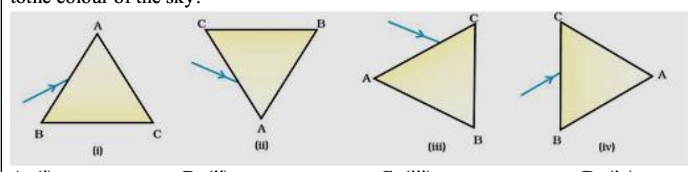
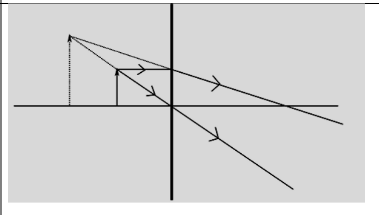
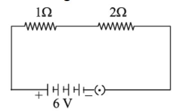
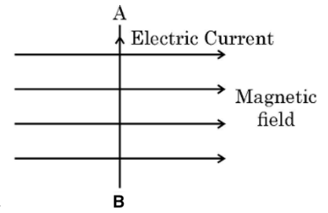

# KV Preboard Class 10

## Section - B

17_ $\mathrm{Zn}+2 \mathrm{CH}_3 \mathrm{COOH} \longrightarrow\left(\mathrm{CH}_3 \mathrm{COO}\right)_2 \mathrm{Zn}+\mathrm{H}_2$ The above reaction is a   (a) Decomposition reaction   (b) Displacement reaction   (c) Double displacement reaction   (d) Combination reaction 

18_ Four solutions, namely glucose, alcohol, hydrochloric acid and sulphuric acid filled in four separate beakers are connected one by one in an electric circuit with a bulb. The solutions in which the bulb will glow when current is passed are :   

(a) Glucose and alcohol    
(b) Alcohol and hydrochloric acid   
(c) Glucose and sulphuric acid (d) Hydrochloric acid and sulphuric acid 

19_ Match column I with column II and select the correct option using the given Codes:

| Column I | Column II |
| :--- | :--- |
| a. A metal that forms amphoteric oxides | (i) Ga |
| b. A metal which melts when kept on our palm | (ii) Au |
| c. A metal that reacts with nitric acid | (iii) Al |
| d. A metal which cannot displace hydrogen from   acids | (iv) Mn |

(a) $\mathrm{a}-$ (ii), $\mathrm{b}-$ (i), $\mathrm{c}-$ (iii), $\mathrm{d}-$ (iv)
(b) $\mathrm{a}-$ (iii), $\mathrm{b}-$ (i), $\mathrm{c}-$ (iv), $\mathrm{d}-$ (ii)
(c) $\mathrm{a}-$ (iv), $\mathrm{b}-$ (ii), $\mathrm{c}-$ (iii), $\mathrm{d}-$ (i)
(d) $a-$ (iii), $b-$ (ii), $c-$ (i), $d-$ (iv)

20_ A metal and a non-metal that exists in liquid state at room temperature are respectively:
(a) Bromine and Mercury (b) Mercury and Iodine
(c) Mercury and Bromine (d) Iodine and Mercury

21_ Anita added a drop each of diluted acetic acid and diluted hydrochloric acid on pH paper
and compared the colours. Which of the following is the correct conclusion?  
(a) pH of acetic acid is more than that of hydrochloric acid.  
(b) pH of acetic acid is less than that of hydrochloric acid.  
(c) Acetic acid dissociates completely in aqueous solution.  
(d) Acetic acid is a strong acid. 

22_ When excess carbon dioxide is passed through lime water, the milkiness disappears due to the formation of:
(a) soluble calcium carbonate
(b) insoluble calcium carbonate converts to water soluble calcium bicarbonate.
(c) water soluble calcium carbonate converts to insoluble calcium bicarbonate.
(d) insoluble calcium carbonate converts to insoluble calcium bicarbonate.

23_ The number of single and double bonds present in a molecule of benzene (C6H6) respectively, are :
(a) 6 and 6 (b) 9 and 3
(c) 3 and 9 (d) 3 and 3

24_ The following question consists of two statements - Assertion (A) and Reason (R).  
Answer these questions by selecting the appropriate option given below:   
A. Both A and R are true, and R is the correct explanation of A .  
B. Both A and R are true, and R is not the correct explanation of A .   
C. A is true but R is false.   
D. A is false but R is true.  
   Assertion(A): If the first member of a homologous series is Methanal, its third member will be Propanal.
   Reason (R): All the members of a homologous series show similar chemical properties.

25_ Explain why we cannot have isomers of first three members of Alkane series?

26_ Attempt either option A or B.

**A.** Amrita electrolysed distilled water using the set-up shown in figure 1. She was expecting two gases to be evolved at the anode and cathode respectively.

Suddenly, she realised that the bulb in the circuit did not glow when she used distilled water (figure 2).

*Figure 2*

After this realization, she added a substance to the distilled water for electrolysis to take place.
Answer the following questions based on the information given above:
(i) Which gas was she expecting to be formed at the anode and which one at the cathode respectively?
(ii) Why did the bulb not glow when Amrita passed electricity through distilled water?
(iii) Which substance was added by Amrita to distilled water to get the expected result?

**OR**

**B.** The domes of many building in Europe are made of copper. These domes now appear greenish in colour.
(i) Why do the domes appear greenish though copper is orange-red in colour?
(ii) In your opinion, should the copper domes be replaced by iron domes to overcome the problem of change of colour of copper domes?
(iii) Domes used to be made from thin sheets of metals. Why did the ancient architects use copper to make domes?

27_ (i) Suggest a safe procedure of diluting a strong concentrated acid.  
(ii) Name the salt formed when sulphuric acid is added to sodium hydroxide and write its oH .   
(iii) Dry HCl gas does not change the colour of dry blue litmus paper.   Why?  

28_ The metals produced by various reduction processes are not very pure. They contain
impurities, which must be removed to obtain pure metals. The most widely used method for refining impure metal is electrolytic refining.   
(i) What is the cathode and anode made of in the refining of copper by this process?   
(ii) Name the solution used in the above process and write its formula.   
(iii) How copper gets refined when electric current is passed in the  electrolytic cell?   

OR
(iii) You have two beakers A and B containing copper sulphate solution. What would you observe after two hours if you dip a strip of zinc in beaker A and a strip of silver in beaker B? Give reasons for your observations in each case.

29_ An organic compound ' X ' with molecular formula $\mathrm{C}_2 \mathrm{H}_6 \mathrm{O}$ on reacting with acidified $\mathrm{K}_2 \mathrm{Cr}_2 \mathrm{O}_7$ gives an organic compound ' Y '. X reacts with Y on warming in the presence of conc. $\mathrm{H}_2 \mathrm{SO}_4$ to give a sweet smelling compound ' Z '.
(i) Identify $\mathrm{X}, \mathrm{Y}$ and Z .
(ii) Write the chemical equations for the reactions involved in both cases.
(iii) State the role of - (a) acidified $\mathrm{K}_2 \mathrm{Cr}_2 \mathrm{O}_7$ in the conversion of X to Y (b) Conc. $\mathrm{H}_2 \mathrm{SO}_4$ in the reaction of X and Y .
(iv) Name the reaction, which occurs when Z reacts with an alkali.

    OR      
    (i) Write the name and structure of an organic compound ' X ' having two carbon atoms in its molecule and its name is suffixed with '-ol'.
    (ii) What happens when ' X ' is heated with excess conc. Sulphuric acid at 443 K ? Write chemical equation for the reaction stating the conditions for the reaction. Also state the role played by conc. Sulphuric acid in the reaction.
    (iii) Name and draw the electron dot structure of hydrocarbon produced in the above reaction.

## Answers

17_ (b) Displacement reaction.  
18_ (d) Hydrochloric acid and sulphuric acid.  
19_ (b) $\mathrm{a}-$ (iii), $\mathrm{b}-$ (i), $\mathrm{c}-$ (iv), $\mathrm{d}-$ (ii).  
20_ (c) Mercury and Bromine.  
21_ (a) pH of acetic acid is more than that of hydrochloric acid.   
22_ $Ca(OH)_2 + CO_2 \rightarrow CaCO_3 + H_2O$.   
   To understand why the milkiness disappears when excess carbon dioxide is passed into lime water, we can break down the process into a few clear steps:   
  
   $\mathrm{CaCO}_3+\mathrm{CO}_2+\mathrm{H}_2 \mathrm{O} \rightarrow \mathrm{Ca}\left(\mathrm{HCO}_3\right)_2$

  Calcium hydrogen carbonate is soluble in water.
  Disappearance of Milkiness: As calcium hydrogen carbonate is formed, it dissolves in the water, leading to the disappearance of the white precipitate of calcium carbonate. This results in the milkiness of the lime water vanishing.   
  The milkiness in lime water disappears upon the addition of excess carbon dioxide because the insoluble calcium carbonate is converted into soluble calcium hydrogen carbonate.  
23_ 3 and 3 between carbon atoms.  
24_ (c) A is true but R is false.   
25_ Not enough number of carbon atoms   
26_ **Attempt either option A or B.**
 **A.**. 
    (i) **Anode:** Oxygen ($O_2$); **Cathode:** Hydrogen ($H_2$).
    (ii) Distilled water is a covalent compound and does not contain free ions to conduct electricity.
    (iii) A few drops of acid (like $H_2SO_4$) or a salt.

 **OR**

**B.**. 
    (i) Copper reacts with moist carbon dioxide in the air to form a green coating of basic copper carbonate ($CuCO_3 \cdot Cu(OH)_2$), known as verdigris.     
    (ii) No, iron is more reactive and rusts (corrodes) easily, leading to structural damage. Copper's corrosion forms a protective layer.      
    (iii) Copper is malleable, ductile, and resistant to corrosion (forms a protective layer), making it durable for domes.      

27_ (i) Suggest a safe procedure of diluting a strong concentrated acid.  
(ii) Name the salt formed when sulphuric acid is added to sodium hydroxide and write its oH .   
(iii) Dry HCl gas does not change the colour of dry blue litmus paper.   Why?  

  Slowly add water to the acid while stirring continuously.  
  $H_2SO_4 + 2NaOH \rightarrow Na_2SO_4 + 2H_2O$.   
  $Na_2SO_4 \rightarrow Na^+ + SO_4^{2-}$

  Dry HCl gas does not change the colour of dry blue litmus paper.   Why?  
  Dry HCl gas does not change the color of dry blue litmus paper because it requires the presence of water to dissociate and produce hydrogen ions ($H^{+}$). Acids show acidic properties and affect litmus paper only in an aqueous solution, not as a dry gas. 

28_ (i) Copper (ii) $CuSO_4$ (iii) Copper gets refined when electric current is passed in the electrolytic cell.
  Step 1
    a) In the refining of copper by electrolytic refining, the anode is made of impure copper, and the cathode is made of pure copper.

   Step 2
    b) The solution used in the process is called copper(II) sulfate solution, and its formula is CuSO4.

 Step 3
    c) When electric current is passed through the electrolytic cell, copper ions (Cu²⁺) from the copper(II) sulfate solution are reduced at the cathode, depositing pure copper. At the anode, the impure copper oxidizes, releasing Cu²⁺ ions into the solution, thus maintaining the concentration of copper ions in the solution.

29_ X -> C_2H_6OH, Y => CH_3COOH, Z => CH_3CH_2COOH

(i) Identify X, Y and Z .
(ii) Write the chemical equations for the reactions involved in both cases.
(iii) State the role of - (a) acidified K_2Cr_2O_7 in the conversion of X to Y (b) Conc. H_2SO_4 in the reaction of X and Y .
(iv) Name the reaction, which occurs when Z reacts with an alkali.

X - $CH_3CH_2OH$    
$CH_3CH_2OH + O \rightarrow CH3COOH$ (this is y).  
$CH_3COOH + CH_3CH_2OH \rightarrow CH_3CH_2COOH + H_2O$ (this is z).  

(iii) State the role of - (a) acidified K_2Cr_2O_7 in the conversion of X to Y (b) Conc. H_2SO_4 in the reaction of X and Y .
    (a) acidified K_2Cr_2O_7 in the conversion of X to Y (b) Conc. H_2SO_4 in the reaction of X and Y .

(B) C_2H_5OH
C_2H_5OH + H_2SO_4 =>.  
 Name of compound. Ethanol, Molecular formula $-\mathrm{C}_2 \mathrm{H}_5 \mathrm{OH}$
Heating ethanol at 443 K with excess conc. sulphuric acid ( $\mathrm{H}_2 \mathrm{SO}_4$ ) results in the dehydration of ethanol to give ethene.

$
\mathrm{CH}_3-\mathrm{CH}_2-\mathrm{OH} \xrightarrow{\text { Conc. } \mathrm{H}_2 \mathrm{SO}_4} \mathrm{CH}_2=\mathrm{CH}_2+\mathrm{H}_2 \mathrm{O}
$

The saturated carbon is converted into an unsaturated one.

## Section - C

30_ Consider these indices of refraction: glass: 1.52; air: 1.0003; water: 1.333. Based on the
refractive indices of three materials, arrange the speed of light through them in
decreasing order.
(a) The speed of light in water > the speed of light in air > the speed of light in glass.
(b) The speed of light in glass > the speed of light in water > the speed of light in air.
(c) The speed of light in air > the speed of light in water > the speed of light in glass.
(d) The speed of light in glass > the speed of light in air > the speed of light in water

31_ A prism ABC (with BC as base) is placed in different orientations. A narrow beam of
white light is incident on the prism as shown in below Figure. In which of the following
diagrams, after dispersion, the third colour from the top of the spectrum corresponds to the colour of the sky?

 

 The following question consists of two statements - Assertion (A) and Reason (R).
Answer these questions by selecting the appropriate option given below:
A. Both A and R are true, and R is the correct explanation of A .
B. Both A and R are true, and R is not the correct explanation of A .
C. A is true but R is false.
D. A is false but R is true.

32_ Assertion (A): The rainbow is a natural spectrum of sunlight in the sky.
Reason (R):Rainbow is formed in the sky when the sun is overhead and water droplets are also present in air.

33_ The above figure shows the formation of an image by a lens shown by a thick line.
Analyse the figure and answer the following questions.  
(i) What is the type of lens used?   
(ii) What is the nature of the image?   
(iii) If the image is formed at a distance of 30 cm from the lens and the
image is twice the size of the object, then where is the object placed?

  

34_ Attempt either option A or B.  
   A_ Show how you would connect three resistors each of resistance $6 \Omega$, so that the combination has a resistance of $9 \Omega$. Also justify your answer.
   OR.  
    B_ In the given circuit calculate the power consumed in watts in the resistor of $2 \Omega$ :

 

35_ A person is suffering from an eye defect in which the far point of the eye is nearer than infinity. Identify the defect. List two main causes of this defect. Draw a ray diagram to show how this defect is corrected by using a suitable lens.

36_ a) State Fleming’s left hand rule. Apply this rule to determine the direction of force experienced by a straight current carrying conductor AB placed in a uniform magnetic field as shown.

 

37_ What is a solenoid? When does a solenoid behave as a magnet? Draw the pattern of the
magnetic field produced inside it showing the directions of the magnetic field lines.

38_ A highly polished surface such as a mirror reflects most of the light falling on it. In our daily life, we use two types of mirrors: plane and spherical. The reflecting surface of spherical mirrors may be curved inwards or outwards. In concave mirrors, reflection takes place from the inner surface, while in convex mirrors reflection takes place from the outer surface.   
**(a)** Define the principal focus of a concave mirror.   
**(b)** A ray of light is incident on a concave mirror, parallel to its principal axis. If this ray after reflection from the mirror passes through the principal axis from a point at a distance of 10 cm from the pole of the mirror, find the radius of curvature of the mirror.   
**(c)** An object is placed at a distance of 10 cm from the pole of a convex mirror of focal length 15 cm. Find the position of the image.

OR

(c) A mirror forms a virtual, erect and diminished image of an object. Identify the type of this mirror. Draw a ray diagram to show the image formation in this case. 

39_ a) Define electric power and state its SI unit. The commercial unit of electrical energy is known as 'unit'. Write the relation between this 'unit' and joule.    
(b) In a house, 2 bulbs of 50 W each are used for 6 hours daily and an electric geyser of 1 kW is used for 1 hour daily. Calculate the total energy consumed in a month of 30 days and its cost at the rate of ₹ 8.00 per kWh.   
    OR.   
    a) Draw a schematic diagram of a circuit consisting of a battery of four dry cells of 1.5
V each, a 2 Ω resistor, a 6 Ω resistor, a 16 Ω resistor and a plug key all connected in
series. Put an ammeter to measure the current in the circuit and a voltmeter across the
16 Ω resistor to measure the potential difference across its two ends. Use Ohm’s law to determine:   
(i) ammeter reading, and.  
(ii) voltmeter reading when the key is closed.   
(b) A 4 Ω resistance wire is doubled on it. Calculate the new resistance of the wire.

### Answers Section C

30_ C.  
31_ (ii) Red diverges the least, voilent diverges the most.   
32_ (c) A is true but R is false.   
33_ Concave lens, virtual and enlarged, between focus and pole.   
34_ (a)6 ohm in parallel and 6 ohm in series, (b) I = 2A, Power = I^2R = 8W    
35_ Myopia, causes: near work, reading in dim light, hereditary, age,  > Myopia, or nearsightedness, is a common vision condition where distant objects appear blurry because light focuses in front of the retina, not on it, often due to an elongated eyeball or overly curved cornea. Symptoms include blurry distance vision, squinting, eye strain, and headaches, typically starting in childhood and progressing through adolescence, though increased screen time and less outdoor activity are driving a global rise, especially in children. It's managed with glasses, contacts, or sometimes treatments like atropine, with the goal of slowing progression   
36_ Flemings left hand rule: If middle find represents magentic field, forefinger represents current, thumb represents force.   

    Force will be out of the page.

37_ Solenoid is coil of wire. When current flows through it, it behaves as a magnet.  
    

38_ (a) **Principal Focus of Concave Mirror:** A point on the principal axis where rays of light incident parallel to the principal axis converge after reflection.
    (b) **Radius of Curvature:**
    The ray passes through the focus, so focal length $f = 10$ cm.
    Radius of curvature $R = 2f = 2 \times 10 = 20$ cm.
    (c) **Image Position:**
    Convex mirror: $u = -10$ cm, $f = +15$ cm.   
    $\frac{1}{v} + \frac{1}{u} = \frac{1}{f}$.   
    $\frac{1}{v} - \frac{1}{10} = \frac{1}{15}$.   
    $\frac{1}{v} = \frac{1}{15} + \frac{1}{10} = \frac{5}{30} = \frac{1}{6}$.  
    $v = +6$ cm.   
    The image is formed 6 cm behind the mirror (Virtual and Erect).

38_ The mirror is a convex mirror. A convex mirror always forms a virtual, erect, and diminished image of an object, regardless of the object's position.

39_   In a house, 2 bulbs of 50 W each are used for 6 hours daily and an electric geyser of 1 kW is used for 1 hour daily. Calculate the total energy consumed in a month of 30 days
and its cost at the rate of ₹ 8.00 per kWh.   
    100w x 6 = 600wh.   
    1000wh,   
    1600x30 wh = 1.6 kwh.  
    Cost = 1.6 x 8 = ₹ 12.80.  

