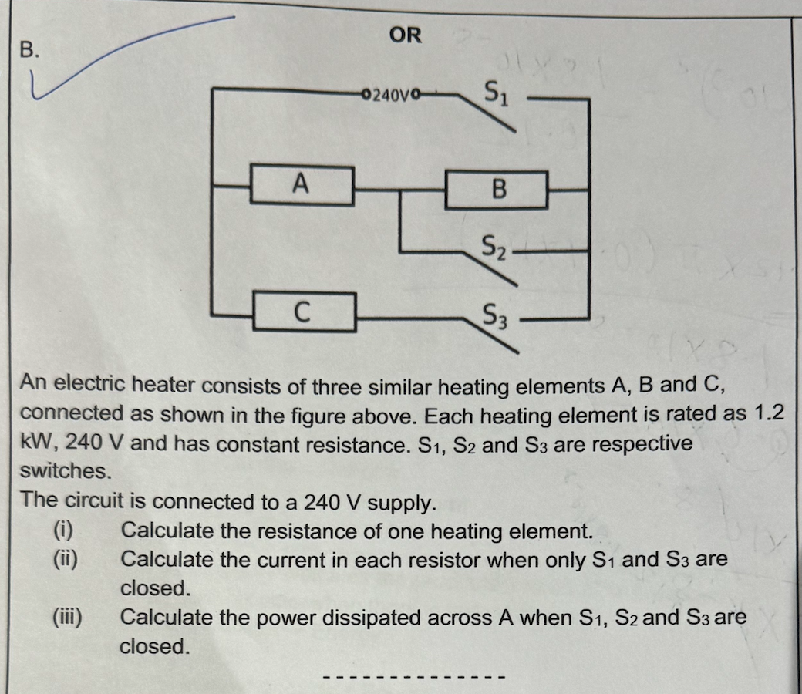

# Electric Heater Circuit Problem

  

## Problem Statement

**An electric heater consists of three similar heating elements A, B, and C, connected as shown in the figure above. Each heating element is rated at 1.2 kW, 240 V and has constant resistance. S1, S2 and S3 are respective switches.**

**The circuit is connected to a 240 V supply.**

**(i)** Calculate the resistance of one heating element.  
**(ii)** Calculate the current in each resistor when only S1 and S3 are closed.  
**(iii)** Calculate the power dissipated across A when S1, S2 and S3 are closed.

---

## Solution

### (i) Resistance of one heating element

Given $P = 1.2 \text{ kW} = 1200 \text{ W}$ and $V = 240 \text{ V}$:

$$
R = \frac{V^2}{P} = \frac{240^2}{1200} = 48\ \Omega
$$

Each element also has rated current $I = P/V = 1200/240 = 5\text{ A}$.

### (ii) Current in each resistor (Switches S1 and S3 Closed)

**Circuit analysis:**  
S1 feeds the top rail; S3 feeds the bottom rail. With S2 open, A and B are in series across 240 V; C is directly across 240 V.

* Series branch (A+B): $R_{AB} = 48 + 48 = 96\ \Omega$  
  $$I_{A} = I_{B} = \frac{240}{96} = 2.5\ \text{A}$$

* Branch C (across supply):  
  $$I_{C} = \frac{240}{48} = 5\ \text{A}$$

**Answer:** $I_A = I_B = 2.5\text{ A}$; $I_C = 5\text{ A}$.

### (iii) Power dissipated across A (All Switches Closed)

With S1, S2, S3 closed: the right rail and the midpoint between A and B are both at 240 V, so B is shorted (0 V across B). A is across the full 240 V.

* Voltage across A: 240 V  
* Current through A: $I_A = 240 / 48 = 5\ \text{A}$  
* Power in A:  
  $$P_A = \frac{V^2}{R} = \frac{240^2}{48} = 1200\ \text{W} = 1.2\ \text{kW}$$

**Answer:** $P_A = 1.2\ \text{kW}$ (B is shorted, so $P_B = 0$).
