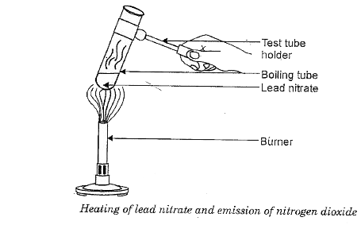
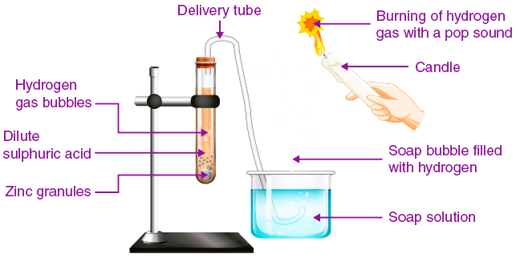

### CHEMICAL REACTIONS AND EQUATIONS

#### LAWS OF CHEMICAL COMBINATION

To understand compound composition, a theory is needed to account for qualitative and quantitative observations during chemical change. These observations of chemical reactions were crucial in developing a satisfactory theory of matter. These observations are summarized in statements known as laws of chemical combination.

#### 1. Law of Conservation of Mass

This law states that matter can neither be created nor destroyed. The total mass of reactants and products remains constant. Antoine Lavoisier proposed this law in 1789 after studying combustion reactions.

Consider the reaction:
$$\mathrm{C}_3 \mathrm{H}_8+5 \mathrm{O}_2 \rightarrow 4 \mathrm{H}_2 \mathrm{O}+3 \mathrm{CO}_2$$
The mass of $\mathrm{C}_3 \mathrm{H}_8$ (propane) is 44, and that of $\mathrm{O}_2$ is 160. The total mass of reactants is 204.
The mass of $\mathrm{H}_2 \mathrm{O}$ is 72, and that of $\mathrm{CO}_2$ is 132. The total mass of products is 204. Since the masses of reactants and products are the same, mass is conserved in this reaction. Chemical equations must be balanced to prove mass conservation.

#### 2. Law of Definite Proportions

Joseph Proust, a French chemist, stated that the proportion of elements by weight in a given compound always remains constant. Regardless of its source or quantity, the percent composition of elements by weight in a compound is always the same. For example, 2 atoms of hydrogen combine with 1 atom of oxygen in water.

2 atoms of hydrogen = 2 grams
1 atom of oxygen = 16 grams
Total mass of water = 18 grams
Weight percentage of hydrogen = 11%
Weight percentage of oxygen = 89%

#### 3. Law of Multiple Proportions

This law states that if two elements combine to form more than one compound, the masses of one element that combine with a fixed mass of the other are in a ratio of small whole numbers. Dalton proposed this law in 1803.

**Example: Carbon Monoxide (CO) and Carbon Dioxide (CO₂)**
* Carbon monoxide (CO): 12 parts by mass of carbon combines with 16 parts by mass of oxygen.
* Carbon dioxide (CO₂): 12 parts by mass of carbon combines with 32 parts by mass of oxygen.
* Ratio of oxygen masses that combine with a fixed mass of carbon (12 parts): 16:32 or 1:2.

**Problem: Hydrogen and Oxygen Compounds**
Hydrogen and oxygen form two compounds. The hydrogen content in one is 5.93%, and in the other is 11.2%. Show that this data illustrates the law of multiple proportions.

**SOLUTION**
In the first compound:
Hydrogen = 5.93%
Oxygen = (100 - 5.93) = 94.07%
For one part by mass of hydrogen, the parts of oxygen combined are $\frac{94.07}{5.93} = 15.86$ parts.

In the second compound:
Hydrogen = 11.2%
Oxygen = (100 - 11.2) = 88.8%

In the second compound, the number of parts of oxygen that combine with one part by mass of hydrogen is $\frac{88.8}{11.2}=7.9$ parts.

The ratio of the masses of oxygen that combine with a fixed mass of hydrogen is $15.86:7.9$ or $2:1$. This result is consistent with the law of multiple proportions.

#### 4. Gay Lussac's Law of Gaseous Volumes

In 1808, Gay-Lussac proposed this law based on his observations. This law states that when gases combine or are produced in a chemical reaction, their volumes bear a simple ratio to one another, provided all gases are at the same temperature and pressure. This law can be seen as another form of the law of definite proportions. The key difference is that Gay-Lussac's Law pertains to volume, while the law of definite proportions relates to mass.

$$
\begin{aligned}
& \mathrm{N}_{2(g)}+3 \mathrm{H}_{2(g)} \rightarrow 2 \mathrm{NH}_{3(g)} \\
& 1 \text { vol. } 3 \text { vols. } \quad 2 \text { vols. }
\end{aligned}
$$

1 volume of nitrogen combines with 3 volumes of hydrogen to form 2 volumes of ammonia.

### TYPES OF CHEMICAL CHANGES

Chemical reactions and chemical changes are categorized into four types based on the nature of the substance involved.

1.  Chemical combination (or) synthesis reaction
2.  Chemical decomposition
3.  Chemical displacement
4.  Chemical double decomposition (or) precipitation reaction

#### 1. Chemical Combination (or) Synthesis Reaction

A chemical change where two or more elements or compounds combine to form a new, single substance is called a "chemical combination."

**Example:**

(i) Magnesium burns in air with a bright light, producing a white ash known as Magnesium oxide.

$$\underset{\text { Magnesium }}{2 \mathrm{Mg}}+\underset{\text { Oxygen }}{\mathrm{O}_2} \rightarrow \underset{\text { Magnesium oxide }}{2 \mathrm{MgO}}$$

(ii) When a glass rod dipped in concentrated hydrochloric acid is held at the mouth of an ammonia gas jar, white, dense fumes of ammonium chloride ($\mathrm{NH}_4 \mathrm{Cl}$) are formed.

$$\underset{\text { Ammonia }}{\mathrm{NH}_3}+\underset{\text { Hydrochloric acid }}{\mathrm{HCl}} \rightarrow \underset{\text { Ammonium Chloride }}{\mathrm{NH}_4 \mathrm{Cl}}$$

(iii) Calcium oxide combines with water to form calcium hydroxide.

$$\underset{\text { Calcium oxide }}{\mathrm{CaO}}+\underset{\text { Water }}{\mathrm{H}_2 \mathrm{O}} \longrightarrow \underset{\text { Calcium hydroxide }}{\mathrm{Ca}(\mathrm{OH})_2}$$

**Note:** $\mathrm{CaO}$ is known as quicklime. $\mathrm{Ca}(\mathrm{OH})_2$ is known as slaked lime.

Other examples of chemical combination are:
(1) $2 \mathrm{Na}+\mathrm{Cl}_2 \rightarrow 2 \mathrm{NaCl}$
(2) $\mathrm{N}_2+3 \mathrm{H}_2 \rightarrow 2 \mathrm{NH}_3 \uparrow$
(3) $\mathrm{S}+\mathrm{O}_2 \rightarrow \mathrm{SO}_2 \uparrow$

#### 2. Chemical Decomposition

A chemical change in which a compound splits into two or more simpler substances, which can be either elements or other compounds, is called "chemical decomposition."

**Examples:**
(i) When lead nitrate is heated in a dry test tube, a reddish-brown gas of nitrogen dioxide is evolved along with oxygen gas. A pale yellow substance, which is lead oxide, remains in the test tube.

$$\underset{\text { Lead Nitrate }}{2 \mathrm{~Pb}\left(\mathrm{NO}_3\right)_2} \longrightarrow \underset{\substack{\text { Nitrogen dioxide } \\ \text { Lead }}}{4 \mathrm{NO}_2} \uparrow+\underset{\text { Oxygen }}{\mathrm{O}_2 \uparrow}+\underset{\text { Lead Oxide }}{2 \mathrm{PbO}}$$

$$\underset{\text { Calcium carbonate }}{\mathrm{CaCO}_3} \longrightarrow \underset{\text { Calcium oxide }}{\mathrm{CaO}}+\underset{\text { Carbon dioxide }}{\mathrm{CO}_2} \uparrow$$

Other examples of chemical decomposition are:

$$
\begin{aligned}
2 \mathrm{NaNO}_3 & \rightarrow 2 \mathrm{NaNO}_2+\mathrm{O}_2 \uparrow \\
2 \mathrm{HgO} & \rightarrow 2 \mathrm{Hg}+\mathrm{O}_2 \uparrow \\
\mathrm{CuCO}_3 & \rightarrow \mathrm{CuO}+\mathrm{CO}_2 \uparrow \\
2 \mathrm{KNO}_3 & \rightarrow 2 \mathrm{KNO}_2+\mathrm{O}_2 \uparrow \\
2 \mathrm{H}_2 \mathrm{O}_2 & \rightarrow 2 \mathrm{H}_2 \mathrm{O}+\mathrm{O}_2 \uparrow
\end{aligned}
$$

### 3. Chemical Displacement

A chemical reaction in which one element displaces another element from its compound and takes its place, forming a new compound, is called chemical displacement.

**Examples:**
(i) Zinc displaces hydrogen gas when treated with dilute acids.

$$\underset{\text { Zinc }}{\mathrm{Zn}}+\underset{\text { Hydrogen chloride }}{2 \mathrm{HCl}} \longrightarrow \underset{\text { Zinc chloride }}{\mathrm{ZnCl}_2}+\underset{\text { Hydrogen }}{\mathrm{H}_2 \uparrow}$$

(ii) When zinc metal is added to copper sulfate solution, zinc displaces copper from the copper sulfate solution. The blue colored solution turns colorless, and red copper is deposited.

$$\underset{\substack{\text { Copper sulphate } \\ \text { (Blue) }}}{\mathrm{CuSO}_4}+\underset{\substack{\text { Zinc } \\ \text { (Colourless) }}}{\mathrm{Zn}} \longrightarrow \underset{\substack{\text { Zinc sulphate } \\ \text { (Colourless) }}}{\mathrm{ZnSO}_4}+\underset{\substack{\text { Copper } \\ \text { (Red) }}}{\mathrm{Cu}}$$

Other examples of chemical displacement are:

$$
\begin{aligned}
\mathrm{Zn}+\mathrm{H}_2 \mathrm{SO}_4 & \rightarrow \mathrm{ZnSO}_4+\mathrm{H}_2 \uparrow \\
\mathrm{Cu}+2 \mathrm{AgNO}_3 & \rightarrow \mathrm{Cu}\left(\mathrm{NO}_3\right)_2+2 \mathrm{Ag} \\
\mathrm{Br}_2+2 \mathrm{KI} & \rightarrow 2 \mathrm{KBr}+\mathrm{I}_2 \\
\mathrm{Mg}+2 \mathrm{AgNO}_3 & \rightarrow \mathrm{Mg}\left(\mathrm{NO}_3\right)_2+2 \mathrm{Ag}
\end{aligned}
$$

### 4. Chemical Double Decomposition

When solutions of two salts are mixed, there is a mutual exchange of radicals, resulting in the formation of two new compounds. Such chemical reactions are called "chemical double decomposition."

**Examples:**
(i) When silver nitrate ($\mathrm{AgNO}_3$) solution is mixed with sodium chloride solution, the constituents of the two compounds are mutually exchanged. This forms silver chloride and sodium nitrate solution.

$$\underset{\text { Silver Nitrate }}{\mathrm{AgNO}_3}+\underset{\text { Sodium chloride }}{\mathrm{NaCl}} \rightarrow \underset{\text { Silver chloride }}{\mathrm{AgCl}} \downarrow+\underset{\text { Sodium Nitrate }}{\mathrm{NaNO}_3}$$

 (ii) When barium chloride solution is added to a solution of sodium sulphate in a test tube, white precipitate of Barium sulphate will be formed. Here barium and sodium exchange their ions to give two new compounds hence it is example of double decomposition.

$$
\underset{\text { Barium chloride }}{\mathrm{BaCl}_2}+\underset{\text { Sodium sulphate }}{\mathrm{Na}_2 \mathrm{SO}_4} \longrightarrow \underset{\text { Bartum Sulphate }}{\mathrm{BaSO}_4 \downarrow}+\underset{\text { Sodium Chlorice }}{2 \mathrm{NaCl}}
$$

Other examples of double decomposition are:

$$
\begin{aligned}
& 2 \mathrm{KI}+\mathrm{Pb}\left(\mathrm{NO}_3\right)_2 \rightarrow \mathrm{PbI}_2+2 \mathrm{KNO}_3 \\
& \mathrm{Na}_2 \mathrm{CO}_3+\mathrm{Ca}(\mathrm{OH})_2 \rightarrow \mathrm{CaCO}_3+2 \mathrm{NaOH}
\end{aligned}
$$

Oxidation: The term "oxidation" means addition of oxygen (or) removal of hydrogen.
We can define oxidation in terms of electrons as loss of electrons, loss of electrons is called oxidation.
In terms of oxidation state: Increase in positive charge is called oxidation.
Reduction: The term "reduction" means addition of hydrogen (or) removal of oxygen.
We can define oxidation in terms electrons i.e., gain of electrons also.

**OIL**
Oxidation Is Loss of electrons

**RIG**
Reduction Is Gain of electrons

### Redox Reactions

In a chemical reaction, if oxidation and reduction occur simultaneously, such reactions are called redox reactions. The substance that gains electrons is termed the oxidizing agent, and the substance that loses electrons is called the reducing agent.

**Example:**

$$\mathrm{Fe}+\mathrm{Cu}^{2+} \rightarrow \mathrm{Fe}^{2+}+\mathrm{Cu}$$

In the above reaction, two electrons (negative charges) are transferred from the iron atom to the copper atom. Thus, the iron becomes positively charged (is oxidized) by the loss of two electrons, while the copper receives the two electrons and becomes neutral (is reduced).

### Oxidation Number

The oxidation number (or oxidation state) of an element can be defined as the charge an atom of an element has in its ion, or appears to have when present in a combined state with other atoms. The oxidation number defines the state of oxidation of an element in that compound.

To determine the oxidation number of an atom in an ion or a molecule, the following set of rules has been formulated.

### Rules for Determining Oxidation Number

1.  The oxidation number of all atoms of different elements in their respective elementary states and allotropic forms is taken as zero. For example, hydrogen exists as $\mathrm{H}_2$, oxygen as $\mathrm{O}_2$ or $\mathrm{O}_3$, phosphorus as $\mathrm{P}_4$, sulfur as $\mathrm{S}_8$ molecule, and carbon as graphite or diamond. They all have an oxidation state equal to zero.

2.  The oxidation number of hydrogen is +1 when it forms compounds with non-metals (e.g., in $\mathrm{HCl}$, $\mathrm{HNO}_3$, $\mathrm{H}_2 \mathrm{~S}$). It is -1 when it forms compounds with metals, known as metal hydrides (e.g., in $\mathrm{NaH}$, $\mathrm{MgH}_2$, $\mathrm{AlH}_3$).

3.  The oxidation number of alkali metals (Group 1) is +1, and that of alkaline earth metals (Group 2) is +2.

4.  The oxidation number of oxygen is -2 in most compounds. In peroxides such as $\mathrm{H}_2 \mathrm{O}_2$, $\mathrm{BaO}_2$, and $\mathrm{Na}_2 \mathrm{O}_2$, it is -1. In superoxides like $\mathrm{KO}_2$, the oxidation state of oxygen is -1/2. Oxygen exhibits a positive charge only when it combines with fluorine, as seen in $\mathrm{OF}_2$.

5.  The most electronegative atom, Fluorine, exhibits an oxidation state of -1 in all its compounds. Other halogens ($\mathrm{Cl}$, $\mathrm{Br}$, $\mathrm{I}$) exhibit -1 only in halides but show variable positive oxidation states in other compounds like $\mathrm{ClO}_2$ or $\mathrm{HClO}_3$.

6.  The sum of the oxidation states in a neutral molecule is equal to zero. For an ion, the sum of the oxidation states is equal to its charge. For instance, in $\mathrm{H}_2 \mathrm{SO}_4$, the sum of oxidation states of all elements is zero. In $\mathrm{SO}_4^{-2}$, the sum of oxidation states is equal to its charge, which is -2.

7.  In general, metals have positive oxidation states, and non-metals have negative oxidation states. The oxidation state of an unknown atom can be calculated using the known oxidation states of other atoms in the compound.

8.  The oxidation state of representative elements should not exceed their group number. For example, since sulfur belongs to Group VI, its maximum oxidation state should not exceed +6.