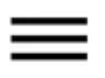

# 50 MCQs on Chemical Bonding

---

## Bond Energy and Bond Length (Q1–Q5)

**Q1.** Bond energy of a molecule is defined as:  
- A. Energy required to form a bond  
- B. Energy required to break a bond into isolated atoms  
- C. Energy released when bond forms  
- D. Energy difference between reactants and products  

**Q2.** Bond length is inversely proportional to:  
- A. Bond energy  
- B. Electronegativity  
- C. Formal charge  
- D. Bond order  

**Q3.** Among C-C, C=C, and CC bonds, the shortest is:  
- A. C-C  
- B. C=C  
- C. CC 

- D. All equal  

$\ce{CO2 + C -> 2 CO}$

**Q4.** Average bond length of NN is approximately:  
- A. 1.10 Å  
- B. 1.47 Å  
- C. 1.24 Å  
- D. 1.36 Å  

**Q5.** As bond order increases, bond length:  
- A. Increases  
- B. Decreases  
- C. Remains same  
- D. Becomes unpredictable  

---

## Octet Rule (Q6–Q10)

**Q6.** The octet rule states that atoms tend to attain:  
- A. 2 electrons in outer shell  
- B. 8 electrons in outer shell  
- C. 12 electrons in outer shell  
- D. A full d-subshell  

**Q7.** Hydrogen is stable with how many valence electrons?  
- A. 8  
- B. 6  
- C. 2  
- D. 4  

**Q8.** Which of the following violates the octet rule?  
- A. CH₄  
- B. CO₂  
- C. BF₃  
- D. H₂O  

**Q9.** Beryllium chloride is an example of:  
- A. Octet rule follower  
- B. Octet rule violator  
- C. Super-octet compound  
- D. Odd electron molecule  

**Q10.** Which atom follows the duet rule instead of octet?  
- A. Helium  
- B. Hydrogen  
- C. Lithium  
- D. Neon  

---

## Lewis Structures and Formal Charge (Q11–Q15)

**Q11.** In Lewis structures, dots represent:  
- A. Nucleus  
- B. Valence electrons  
- C. Protons  
- D. Bond length  

**Q12.** Formal charge is calculated as:  
- A. Valence e⁻ – (lone e⁻ + ½ bonding e⁻)  
- B. Total e⁻ – bonding e⁻  
- C. Bond order – nonbonding e⁻  
- D. Atomic number – valence e⁻  

**Q13.** Correct Lewis structure of O₂ contains:  
- A. Single bond  
- B. Double bond  
- C. Triple bond  
- D. No bond  

**Q14.** Resonance in molecules implies:  
- A. Atoms oscillate between positions  
- B. Delocalization of electrons  
- C. Molecule vibrates constantly  
- D. Bond order is always integer  

**Q15.** Cyanide ion (CN–) has how many valence electrons in total?  
- A. 8  
- B. 9  
- C. 10  
- D. 11  

---

## Sigma and Pi Bonds (Q16–Q20)

**Q16.** The first bond formed between two atoms is always:  
- A. Sigma bond  
- B. Pi bond  
- C. Delta bond  
- D. Metallic bond  

**Q17.** A triple bond consists of:  
- A. Three sigma bonds  
- B. One sigma and two pi bonds  
- C. Two sigma and one pi bond  
- D. Three pi bonds  

**Q18.** Which of the following has only sigma bonds?  
- A. O₂  
- B. C₂H₂  
- C. CH₄  
- D. C₂H₄  

**Q19.** Pi bonds are formed due to:  
- A. End-on overlap  
- B. Sidewise overlap  
- C. Electrostatic attraction  
- D. Back bonding  

**Q20.** Bond order of N₂ is:  
- A. 2  
- B. 2.5  
- C. 3  
- D. 1  

---

## VSEPR Theory and Shapes (Q21–Q30)

**Q21.** Shape of CO₂ according to VSEPR theory is:  
- A. Bent  
- B. Trigonal planar  
- C. Linear  
- D. Tetrahedral  

**Q22.** Shape of BF₃ is:  
- A. Tetrahedral  
- B. Trigonal pyramidal  
- C. Trigonal planar  
- D. Linear  

**Q23.** Shape of CH₄ is:  
- A. Tetrahedral  
- B. Square planar  
- C. Trigonal planar  
- D. Octahedral  

**Q24.** Shape of NH₃ molecule is:  
- A. Bent  
- B. Trigonal pyramidal  
- C. Linear  
- D. T-shaped  

**Q25.** Water (H₂O) has which shape?  
- A. Bent  
- B. Trigonal planar  
- C. Tetrahedral  
- D. Trigonal bipyramidal  

**Q26.** SF₆ has which shape?  
- A. Octahedral  
- B. Square planar  
- C. See-saw  
- D. T-shaped  

**Q27.** XeF₂ has which shape?  
- A. Trigonal planar  
- B. Tetrahedral  
- C. Linear  
- D. Square pyramidal  

**Q28.** IF₃ has which shape?  
- A. T-shaped  
- B. See-saw  
- C. Square planar  
- D. Linear  

**Q29.** PF₅ has which geometry?  
- A. Square planar  
- B. Octahedral  
- C. Trigonal bipyramidal  
- D. Tetrahedral  

**Q30.** SF₄ has which shape?  
- A. Linear  
- B. See-saw  
- C. Bent  
- D. Square planar  

---

## Polarity and Dipole Moments (Q31–Q40)

**Q31.** A molecule is polar if:  
- A. All bonds are polar  
- B. It has uneven distribution of charge  
- C. All atoms are identical  
- D. No lone pairs exist  

**Q32.** CO₂ is non-polar because:  
- A. Bonds are non-polar  
- B. Shape cancels dipole moments  
- C. It has lone pairs on C  
- D. Bond order is 2  

**Q33.** Dipole moment of H₂O is approximately:  
- A. 0 D  
- B. 1.47 D  
- C. 1.85 D  
- D. 9.0 D  

**Q34.** Dipole moment (µ) is calculated as:  
- A. µ = Q/r  
- B. µ = Q × r  
- C. µ = r/Q  
- D. µ = Q²/r  

**Q35.** Which of the following is polar?  
- A. CH₄  
- B. CCl₄  
- C. H₂O  
- D. CO₂  

**Q36.** Higher the electronegativity difference, dipole moment:  
- A. Decreases  
- B. Increases  
- C. Remains constant  
- D. Becomes zero  

**Q37.** Dipole moment of NaCl in gas phase is:  
- A. 1.87 D  
- B. 1.85 D  
- C. 0 D  
- D. 9.0 D  

**Q38.** Which molecule has zero dipole moment?  
- A. NH₃  
- B. H₂O  
- C. CO₂  
- D. HF  

**Q39.** In CHCl₃, the polarity is due to:  
- A. Different halogen substituents  
- B. Lone pairs on hydrogen  
- C. Symmetry of structure  
- D. Metallic bonding  

**Q40.** The unit of dipole moment is:  
- A. Coulomb  
- B. Debye  
- C. Joule  
- D. Tesla  

---

## Fajans’ Rules and Ionic vs Covalent Character (Q41–Q50)

**Q41.** Fajans’ rules explain:  
- A. Lattice energy  
- B. Polarizing power and covalency in ionic compounds  
- C. Bond length  
- D. Octet rule  

**Q42.** Larger the anion, the ______ the covalent character.  
- A. Smaller  
- B. Greater  
- C. Equal  
- D. Unchanged  

**Q43.** Smaller the cation, the ______ the covalent character.  
- A. Smaller  
- B. Greater  
- C. No effect  
- D. Same  

**Q44.** Among KF, KCl, KBr, and KI, the highest covalent character is in:  
- A. KF  
- B. KCl  
- C. KBr  
- D. KI  

**Q45.** Among LiCl, NaCl, KCl, and RbCl, which has highest covalent character?  
- A. LiCl  
- B. NaCl  
- C. KCl  
- D. RbCl  

**Q46.** AgCl is more covalent than KCl because:  
- A. Ag⁺ has smaller size  
- B. Ag⁺ has pseudo-noble gas configuration  
- C. Ag⁺ has higher charge  
- D. Ag is a transition metal  

**Q47.** Polarising power of cations increases:  
- A. Down a group  
- B. Remains constant  
- C. Randomly  
- D. Across a period  

**Q48.** Polarisability of anions increases with:  
- A. Smaller size  
- B. Larger size  
- C. Less charge  
- D. Higher ionization energy  

**Q49.** An anion with high polarisability leads to:  
- A. More ionic bond  
- B. More covalent bond  
- C. Metallic bond  
- D. Hydrogen bond  

**Q50.** Covalent character is maximum in:  
- A. Small cation + large anion  
- B. Large cation + small anion  
- C. Small cation + small anion  
- D. Large cation + large anion  

---

