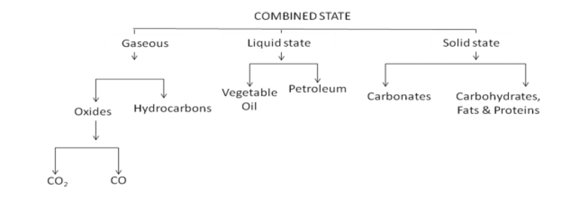
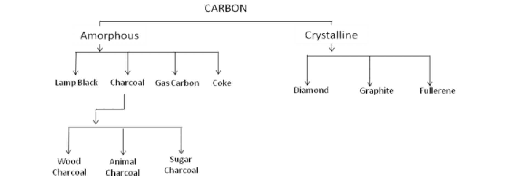
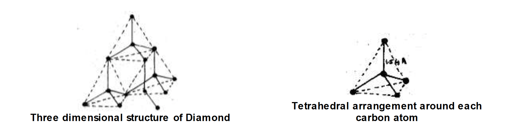

# CHEMISTRY OF CARBON COMPOUNDS 

---

## 🧭 Introduction

Carbon is the third most important element after oxygen and hydrogen, for the existence of life on the earth. It constitutes only **0.03%** of earth's crust. Over 400,000 compounds of carbon have been known, most of which are produced naturally and some artificially by scientists. The bodies of all living beings are made up of compounds of carbon. For fuel, food, clothing we have to depend entirely on carbon compounds. The vast amount of energy needed to run factories is produced from carbon compounds like water gas, producer gas, petroleum, etc.

It belongs to **IV A group** and **second period** in the periodic table.

In the 2nd period carbon occupies position after boron and before nitrogen. Carbon is a **non-metal** as it contains 4 electrons in the outermost shell. The other elements of IV A group are **silicon**, **germanium**, **tin** and **lead**. Metallic character increases down the group. This can be observed in IV A group as carbon is a non-metal; silicon and germanium are semi-conductors whereas tin and lead are metals. This change from non metallic character to metallic character brings diversity in the chemistry of these elements based on the group to which they belong.

### Key Point:
- Non-metal
- Forms both covalent and network structures
- Shows allotropy (various physical forms)

---

## 🧩 Occurrence of Carbon

**Free State:** Diamond, Graphite, Coal  
**Combined State:** Carbonates, Hydrocarbons, CO₂, etc.

## Allotropes of Carbon

### What is Allotropy?

Allotropy is the phenomenon due to which an element exhibits different physical forms, which have **same chemical properties**. The various physical forms of an element that exhibit allotropy are called **allotropes**.

The main reason behind allotropy is the **different arrangement of atoms** in the molecule of each allotrope.

Examples of some elements exhibiting allotropy are:
* **Sulphur:** Rhombic, monoclinic, and plastic
* **Phosphorus:** Red and yellow

---

## Carbon's Allotropes

Like sulphur and phosphorus, carbon also exhibits allotropy. Carbon has two important allotropic forms, **diamond** and **graphite**, which are crystalline solids.

In addition, carbon exists in non-crystalline (amorphous) forms:
* Coal
* Coke
* Charcoal
* Lamp black
* Carbon black

Recently another important allotropic form of carbon, **$\mathrm{C}_{60}$** (Buckminsterfullerene), has been discovered.

### 💎 Diamonds

Diamonds are found naturally in **South Africa, India, South America, and Russia**. In India, diamonds are found in the mines of **Panna in Madhya Pradesh** and **Golconda in Karnataka**.

The formation process begins when **dissolved carbon** present in **molten magma** inside the earth's surface solidifies as it is pushed up. On solidification, the **iron** present in the magma exerts great **pressure** on the carbon, causing it to crystallize in the form of a diamond.

Here is a formatted overview of the text you provided.

#### 💎 Structure and Properties

* i. In a given crystal unit, one carbon atom is covalently bonded to four other carbon atoms, such that they form a **regular tetrahedron**.
    

* ii. The bond angle is $109^0 28^{\prime}$ and bond length is $1.54 \mathrm{~A}^0$.
* iii. The whole crystal of diamond is a **giant molecule** (covalent network), in which carbon atoms lie in different planes.
* iv. Diamond is the **hardest naturally occurring substance**. Black diamond is the hardest.
* v. A pure diamond is colorless, brittle solid and **transparent** to X-rays, ultraviolet rays, and visible rays. The polished gem has smooth surfaces.
* vi. Its density is $3.51 \mathrm{~g} / \mathrm{cc}$ and **refractive index is 2.41**, which adds up to its gem value. Because of its high refractive index, it reflects light falling on it, making it shine.
* vii. It is a **bad conductor** of heat and electricity.
* viii. It is **insoluble** in almost all solvents. Acids and bases do not affect diamonds.
* ix. It is chemically **inert**. It burns in air at $900^{\circ} \mathrm{C}$ to form $\mathrm{CO}_2$.
* x. It is the purest form of carbon.
* xi. As the atoms are held firmly by strong covalent bonds, diamond possesses a very **high melting point** ($3600^{\circ} \mathrm{C}$).

---

#### Uses of Diamond

* i. In **jewellery** due to its high refractive index.
* ii. For **cutting glass** as well as other diamonds.
* iii. **Black diamond** is used as the tip of boring drills.
    
* iv. They are also used as needles for record players, bearings in watches, and in making dies for drawing wires.
* v. They are also used in making laser beams in electronics.

#### Summary Diamond
- 3D tetrahedral lattice, each carbon linked to 4 carbons.  
- Bond angle: 109°28′ ; Bond length: 1.54 Å  
- **Hardest natural substance**  
- Density: 3.51 g/cc  
- Refractive index: 2.41  
- Poor conductor, inert, burns at 900°C to CO₂  
- **Uses:** Jewellery, cutting tools, drilling, electronics, lasers

  

### Graphite

- Layers of hexagonal rings (sp² hybridisation)  
- Bond length: 1.42 Å ; Layer gap: 3.4 Å  
- Each carbon linked to 3 others; 1 free electron → **good conductor**  
- **Soft, slippery, dark gray** solid  
- **Uses:** Pencil leads, lubricants, electrodes, crucibles, reactor moderator  
  
  

**Manufacture (Acheson process):**

   $SiO_2 + 3C → SiC + 2CO$  
   $SiC → Si + C (graphite)$

Source: Wikimedia