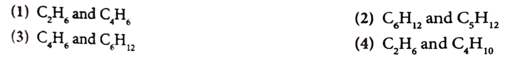
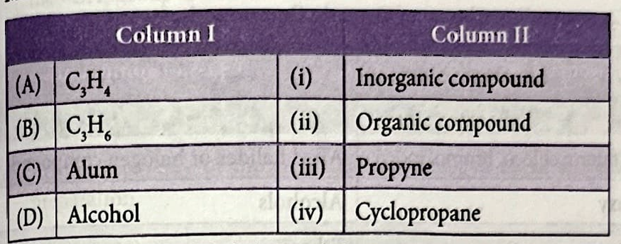

## CONCEPT APPLICATION EXERCISE 2

**1. Out of the following pairs of compounds, the unsaturated compounds are**

**2. A cyclic hydrocarbon having carbon-carbon single bonds as well as carbon-carbon double bonds in its molecule is**
(1) $C_6H_{12}$
(2) $\mathrm{C}_6 \mathrm{H}_{14}$
(3) $\mathrm{C}_6 \mathrm{H}_6$
(4) $\mathrm{C}_5 \mathrm{H}_{10}$

**3. The number of $\mathrm{C}-\mathrm{H}$ bonds in ethane ($\mathrm{C}_2 \mathrm{H}_6$) molecule is**
(1) Four
(2) Six
(3) Eight
(4) Ten

[Image of ethane molecule structure C2H6]

**4. Which of the following compounds of carbon does not consist of ions?**
(1) $\mathrm{CHCl}_3$
(2) $\mathrm{CaCO}_3$
(3) $\mathrm{NaHCO}_3$
(4) $\mathrm{Ca}_2 \mathrm{C}$

**5. Carbon forms four covalent bonds by sharing its four valence electrons with four univalent atoms, e.g., hydrogen. After the formation of four bonds, carbon attains the electronic configuration of**
(1) Helium
(2) Neon
(3) Argon
(4) Krypton

**6. The ratio of difference between number of hydrogens present in propane and propyne, propane and propene is**
(1) $1: 2$
(2) $2: 1$
(3) $3: 2$
(4) $2: 3$

**7. Solve the following riddle.**

> I'm a hydrocarbon with a double bond,
> In my family, this is our common bond.
> I'm less saturated, more reactive too,
> Plastic is one place where I'm found, it's true.
> Who am I with this bond so keen?
> What's my family name-can you glean?

(1) Alkanes
(2) Alkynes
(3) Alkenes
(4) None of these

Here is the formatted question and its correct answer.

---

**8. Match the columns.**

(1) A - (ii); B - (i); C - (iii); D - (iv).   
(2) A - (ii), (iii); B - (ii), (iv); C - (i); D - (ii).  
(3) A - (i); B - (iii); C - (ii); D - (iv).  
(4) A - (ii); B - (iii); C - (i); D - (iv).  

---

### **Answer**

The correct option is **(2)**.

**Explanation:**

* **(A) $\mathrm{C}_3 \mathrm{H}_4$:** This is a hydrocarbon, so it is an **(ii) Organic compound**. It fits the alkyne formula ($\mathrm{C}_n\mathrm{H}_{2n-2}$), and with 3 carbons, it is **(iii) Propyne**. So, **A $\rightarrow$ (ii), (iii)**.
* **(B) $\mathrm{C}_3 \mathrm{H}_6$:** This is a hydrocarbon, so it is an **(ii) Organic compound**. It fits the alkene/cycloalkane formula ($\mathrm{C}_n\mathrm{H}_{2n}$). **(iv) Cyclopropane** is a 3-carbon cycloalkane with this formula. So, **B $\rightarrow$ (ii), (iv)**.
* **(C) Alum:** Alum is an inorganic salt (e.g., potassium aluminum sulfate). It is an **(i) Inorganic compound**. So, **C $\rightarrow$ (i)**.
* **(D) Alcohol:** Alcohols (e.g., ethanol $\mathrm{C}_2\mathrm{H}_5\mathrm{OH}$) are a class of carbon-based compounds, making them **(ii) Organic compound**. So, **D $\rightarrow$ (ii)**.
---

### **Answer Key**

1.  **(3)**
    * **Explanation:** Unsaturated compounds have the general formula $\mathrm{C}_n\mathrm{H}_{2n}$ (alkenes) or $\mathrm{C}_n\mathrm{H}_{2n-2}$ (alkynes).
    * $\mathrm{C}_4\mathrm{H}_6$ fits $\mathrm{C}_n\mathrm{H}_{2n-2}$ (an alkyne, unsaturated).
    * $\mathrm{C}_6\mathrm{H}_{12}$ fits $\mathrm{C}_n\mathrm{H}_{2n}$ (an alkene, unsaturated).
    * All other pairs contain at least one saturated alkane ($\mathrm{C}_n\mathrm{H}_{2n+2}$), such as $\mathrm{C}_2\mathrm{H}_6$, $\mathrm{C}_5\mathrm{H}_{12}$, or $\mathrm{C}_4\mathrm{H}_{10}$.

2.  **(3)**
    * **Explanation:** $\mathrm{C}_6\mathrm{H}_6$ is benzene, a cyclic (ring) molecule famous for its alternating single and double bonds. $\mathrm{C}_6\mathrm{H}_{12}$ (cyclohexane) only has single bonds. $\mathrm{C}_5\mathrm{H}_{10}$ (cyclopentane) only has single bonds. $\mathrm{C}_6\mathrm{H}_{14}$ (hexane) is not cyclic.

3.  **(2)**
    * **Explanation:** Ethane ($\mathrm{C}_2\mathrm{H}_6$) has the structure $\mathrm{CH_3}-\mathrm{CH_3}$. Each of the two carbon atoms is bonded to three hydrogen atoms, for a total of $3 + 3 = 6$ $\mathrm{C}-\mathrm{H}$ bonds.

4.  **(1)**
    * **Explanation:** $\mathrm{CHCl}_3$ (chloroform) is a covalent molecule, as all its atoms (C, H, Cl) are non-metals and share electrons. The other compounds are ionic: $\mathrm{CaCO}_3$ contains $\mathrm{Ca}^{2+}$ and $\mathrm{CO}_3^{2-}$ ions; $\mathrm{NaHCO}_3$ contains $\mathrm{Na}^{+}$ and $\mathrm{HCO}_3^{-}$ ions; $\mathrm{Ca}_2\mathrm{C}$ is an ionic carbide.

5.  **(2)**
    * **Explanation:** Carbon (Period 2) has 4 valence electrons. By forming four covalent bonds, it shares 4 more electrons, completing its octet (8 valence electrons). This stable 8-electron configuration is the same as the noble gas at the end of its period, which is Neon (Ne).

6.  **(2)**
    * **Explanation:**
        * Propane ($\mathrm{C}_3\mathrm{H}_8$) has **8** hydrogens.
        * Propyne ($\mathrm{C}_3\mathrm{H}_4$) has **4** hydrogens.
        * Propene ($\mathrm{C}_3\mathrm{H}_6$) has **6** hydrogens.
        * Difference (Propane - Propyne) = $8 - 4 = 4$.
        * Difference (Propane - Propene) = $8 - 6 = 2$.
        * The ratio of these differences is $4:2$, which simplifies to $2:1$.

7.  **(3)**
    * **Explanation:** The riddle's clues "hydrocarbon with a double bond," "less saturated," "more reactive," and "plastic" all point to the **Alkenes** family. (e.g., ethene is used to make polyethylene).

Here is the formatted exercise, followed by the answer key.

---
