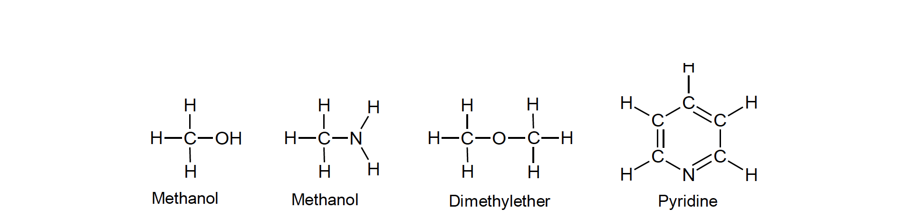

# 🌍 Uniqueness of Carbon

The number of carbon compounds is more than five million. This number is far more than the number of compounds of all other elements put together. The existence of such a large compounds of carbon is due to its uniqueness. The following points explained the reason for large number of carbon compounds.

1. **Tetravalency:**  
   Can form 4 covalent bonds (e.g., CH₄).

   Tetravalency of carbon: Carbon has tetravalency through which it can combine with four similar atoms or four different atoms. This results in the formation of large variety of compounds.

    

2. **Catenation:**  
Carbon possesses maximum tendency for catenation. Catenation is the tendency of atoms of an element to unite with each other forming a long open chain or closed chain of compounds of different sizes. 
 

  

   Another important factor in this connection is the ability of carbon to form double and triple bonds between its atoms, as in ethylene or acetylene.

  
  
3. **The ability of carbon to combine with other elements**  Carbon can combine with other elements like H, N, P, O, S, F, CI, Br, I, etc., giving rise to a large number of compounds

  

- **Properties:**
- Turns limewater milky:
  
  $Ca(OH)_2 + CO_2 → CaCO_3 + H_2O$
  
- Milkiness clears on excess CO₂:
  
  $CaCO_3 + CO_2 + H_2O → Ca(HCO_3)_2$
  
- Forms carbonic acid: $CO_2 + H_2O → H_2CO_3$
- **Photosynthesis:**  
$6CO_2 + 6H_2O → C_6H_12O_6 + 6O_2$
- **Uses:** Fire extinguishers, dry ice (−78°C), carbonated drinks, refrigeration.
