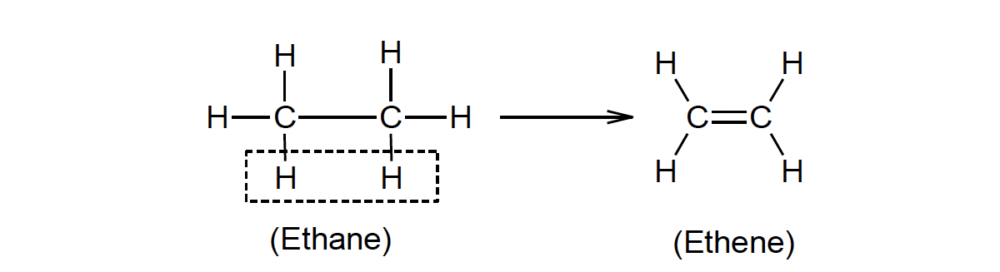

## Hydrocarbons

In hydrocarbons like methane, ethane, propane and butane, we have seen that the C and H atoms are all lined by single bonds, i.e., $\mathrm{C}-\mathrm{C}$ and $\mathrm{C}-\mathrm{H}$ bonds. Such compounds are called **saturated aliphatic hydrocarbons** or **alkanes**. An inspection of their formulae ($\mathrm{CH}_4$, $\mathrm{C}_2 \mathrm{H}_6$, $\mathrm{C}_3 \mathrm{H}_8$, $\mathrm{C}_4 \mathrm{H}_{10}$, etc.) reveals that they can be represented by a general formula $\mathrm{C}_n \mathrm{H}_{2n+2}$.

[Image of alkane structures methane ethane propane]

| Formula Derivation | $\rightarrow$ | Molecular Formula | Name |
| :--- | :--- | :--- | :--- |
| $\mathrm{C}_1 \mathrm{H}_{2 \times 1+2}$ | $\rightarrow$ | $\mathrm{CH}_4$ | (methane) |
| $\mathrm{C}_2 \mathrm{H}_{2 \times 2+2}$ | $\rightarrow$ | $\mathrm{C}_2 \mathrm{H}_6$ | (ethane) |
| $\mathrm{C}_3 \mathrm{H}_{2 \times 3+2}$ | $\rightarrow$ | $\mathrm{C}_3 \mathrm{H}_8$ | (propane) |
| $\mathrm{C}_4 \mathrm{H}_{2 \times 4+2}$ | $\rightarrow$ | $\mathrm{C}_4 \mathrm{H}_{10}$ | (butane) |

Names of higher alkanes are derived from the number of C atoms present in them, e.g., $\mathrm{C}_5 \mathrm{H}_{12}$ is **pentane**, and $\mathrm{C}_6 \mathrm{H}_{14}$ is **hexane** and so on. Saturated aliphatic hydrocarbons are called so because they cannot add on more atoms or molecules. This happens when all the bonds in a molecule are single.

---

If we remove two H atoms from the adjacent C atoms of ethane, a double bond will be formed between the two C atoms.

Such aliphatic hydrocarbons that contain a double bond between two adjacent C atoms are called **alkenes**. They are called **unsaturated hydrocarbons** as double bonds can open up to allow the addition of molecules like $\mathrm{H}_2$, $\mathrm{Cl}_2$ or HCl . Alkenes contain two H atoms less than parent alkanes and hence are represented by the general formula $\mathrm{C}_n\mathrm{H}_{2n}$.

| Molecular formula | Condensed formula | Name |
| :--- | :--- | :--- |
| $\mathrm{C}_2 \mathrm{H}_{2 \times 2} \rightarrow \mathrm{C}_2 \mathrm{H}_4$ | $\mathrm{H}_2 \mathrm{C}=\mathrm{CH}_2$ | Ethene (or ethylene) |
| $\mathrm{C}_3 \mathrm{H}_{2 \times 3} \rightarrow \mathrm{C}_3 \mathrm{H}_6$ | $\mathrm{H}_3 \mathrm{C}-\mathrm{CH}=\mathrm{CH}_2$ | Propene (propylene) |

If we again remove two H atoms from adjacent C atoms of ethene, a triple bond between the two C atoms will result.

