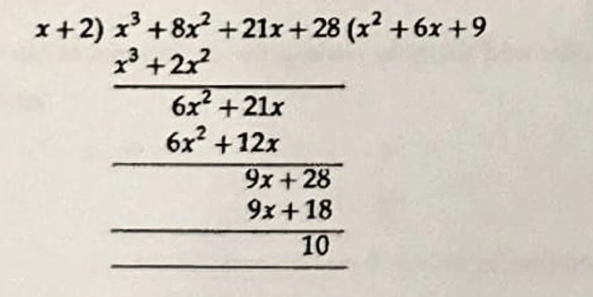

# C2:  Addition, Subtraction, Multiplication, and Division of Polynomials

## Addition and Subtraction of Polynomials

To add or subtract any two polynomials in $x$, we combine the coefficients of like powers of $x$.

**Example:**
Given the polynomials:
$P(x) = x^7 + 9x^3 + 3x + 1$
$Q(x) = x^5 + 6x^3 + 4x + 3$

Here's the formatted content, using single dollar signs and `\newline` as requested, but with a strong caveat that this might not render well in all Markdown parsers (especially for multi-line math).

---

**Solution (Addition and Subtraction):**

$\therefore P(x)+Q(x)=x^7+x^5+15 x^3+7 x+4$, similarly in subtraction we subtract the like powers
$P(x)-Q(x)=x^7-x^5+3 x^3-x-2$

---

**Multiplication of Polynomials**

We define the product of two polynomials by multiplying term by term and then adding the coefficient of like powers of $x$.

Using the law of indices $x^k x^l=x^{(k+l)}$

**Example:**

$a(x)=3 x^2+2 x+1$     
$b(x)=x+3$

**Solution:**

$a(x) \cdot b(x)=3 x^2 \cdot x+3 x^2 \cdot(3)+2 x \cdot(x)+2 x(3)+x+3 \\=3 x^3+11 x^2+7 x+3$

---

**Division of Polynomials**

Given two integers 'm' and 'n' with $n>0$, we know that we can divide $m$ by $n$ to get a quotient 'q' and a remainder 'r' and express it as
$m=n q+r \newline \longrightarrow(1)$
(Dividend = Divisor. (Quotient) + Remainder)
Where $0 \leq r<n$. Hence 'q' and 'r' are uniquely determined by 'm' and 'n'. A relation of the form (1) is also true for polynomials.

**Example-1:**
$37=7(5)+2$

**Solution:**
Dividend $=37$, Divisor $=7 \newline$Quotient $=5$, Remainder $=2$

Let us divide polynomial by another polynomial.

**Example-2:**
Divide $x^3+8 x^2+21 x+28$ by $x+2$

**Solution:**



Quotient $=x^2+6 x+9$.  
Remainder $=10$

We can divide the polynomial with a linear polynomial by Horner's method of synthetic division also.


---

**Horner's Method of Synthetic Division**

We will explain the method with the following example:
To divide $x^4 + 4x^3 + 3x^2 - 4x - 4$ by $(x-1)$.

The multiplier for synthetic division is obtained from the zero of the divisor $(x-1)$, which is $x=1$.

```
(multiplier) 1 | 1   4   3   -4   -4   (Coefficients of the dividend)
               |     1   5    8    4
               --------------------
                 1   5   8    4    0   (Coefficients of quotient and remainder)
```

The quotient is $x^3 + 5x^2 + 8x + 4$.
The remainder is $0$.

---

**Explanation of the Process:**

1.  **First Row Setup:**
    * The first element in the first horizontal row is the **multiplier**, which is the zero of the linear divisor (e.g., for $x-1$, the zero is $1$).
    * The remaining elements in the first horizontal row are the **coefficients of the dividend polynomial** in descending powers of $x$. If any power of $x$ is missing, its coefficient should be taken as zero.

2.  **Second and Third Row Calculation:**
    * Bring down the first coefficient of the dividend (in this case, '1') directly to the third row. This is the first coefficient of the quotient.
    * Multiply this coefficient by the multiplier (1 * 1 = 1) and place the result in the second row, under the next coefficient of the dividend (under '4').
    * Add the numbers in that column (4 + 1 = 5) and write the sum in the third row. This is the next coefficient of the quotient.
    * Repeat the process: Multiply the new number in the third row ('5') by the multiplier ('1') and place the result in the second row under the next dividend coefficient ('3').
    * Add the numbers in that column (3 + 5 = 8) and write the sum in the third row.
    * Continue this procedure for all remaining coefficients.

3.  **Interpreting the Results:**
    * The **last entry** in the third row is the **remainder**.
    * The **other entries** in the third row are the **coefficients of the quotient polynomial** in descending powers of $x$. The degree of the quotient polynomial will be one less than the degree of the original dividend.

Thus, for our example, the quotient is $x^3 + 5x^2 + 8x + 4$ and the remainder is $0$.

---

**Relationship between Dividend, Divisor, Quotient, and Remainder:**

We can express the original polynomial $f(x)$ in terms of the divisor, quotient, and remainder:
$$f(x) = (x-1)(x^3 + 5x^2 + 8x + 4) + 0$$
$$f(x) = x^4 + 4x^3 + 3x^2 - 4x - 4 = (x-1)(x^3 + 5x^2 + 8x + 4)$$

---

**Horner's Method of Synthetic Division (Step-by-Step Summary):**

* **Step-1:** The first element in the horizontal row is the **multiplier**, obtained from the zero of the linear divisor ($x-a \Rightarrow a$).
* **Step-2:** The remaining elements in the first horizontal row are the **coefficients of the dividend polynomial** in descending powers of $x$. (The coefficient of any missing power of $x$ should be taken as zero).
* **Step-3:** Bring down the first coefficient of the dividend directly to the third row. This becomes the first entry in the third row.
* **Step-4:** Multiply this entry (from Step 3) by the multiplier and place the result in the second row, under the second element of the first row. Add the two numbers in that column to get the second entry in the third row.
* **Step-5 (Implied continuation from original text):** Continue this process of multiplying the last entry in the third row by the multiplier and placing it in the second row under the next coefficient, then adding to get the next entry in the third row. Repeat until all coefficients have been processed.
* **Step-6 (Implied):** The final number in the third row is the remainder. The preceding numbers in the third row are the coefficients of the quotient.

Here's the reformatted content, maintaining clarity and using standard Markdown practices for mathematical expressions.

---

**Step-5 (Continuation of Horner's Method Explanation):**

Repeat the same procedure: multiply the latest entry in the third row by the multiplier, place the product in the second row under the next coefficient of the first row, and then add the numbers in that column to get the next entry in the third row. Continue until all coefficients of the first row have been processed.

The last entry in the third row represents the **remainder**. The preceding entries in the third row represent the **coefficients of the quotient polynomial** in descending powers of $x$.

---

**Example:**

Find the quotient and the remainder when $4x^3 - 3x + 9$ is divided by $2x - 3$.

**Solution:**

**Method-1: Polynomial Long Division**

```
        2x^2 + 3x + 3
      ________________
2x - 3 | 4x^3 + 0x^2 - 3x + 9
        -(4x^3 - 6x^2)
        ___________
              6x^2 - 3x
            -(6x^2 - 9x)
            ___________
                     6x + 9
                   -(6x - 9)
                   _________
                         18
```

From long division:
$\Rightarrow$ The quotient is $2x^2 + 3x + 3$.
$\Rightarrow$ The remainder is $18$.

---

**Method-2: Horner's Method (Synthetic Division)**

First, find the zero of the divisor $2x - 3$:
$2x - 3 = 0 \Rightarrow 2x = 3 \Rightarrow x = \frac{3}{2}$

Now, perform synthetic division with the coefficients of $4x^3 + 0x^2 - 3x + 9$ and the multiplier $x = \frac{3}{2}$:

```
x-3/2 | 4   0   -3   9   (Coefficients of the dividend)
      |     6    9   9
      ------------------
        4   6    6  18   (Coefficients of quotient and remainder)
```

From this synthetic division:
$\Rightarrow$ The remainder is $18$.
$\Rightarrow$ The coefficients of the quotient (if divided by $x - \frac{3}{2}$) are $4, 6, 6$. So, the quotient would be $4x^2 + 6x + 6$.

Explaination is given below

You're asking for a detailed explanation of the synthetic division step shown:

```
3/2 | 4   0   -3   9   (Coefficients of the dividend)
    |     6    9   9
    ------------------
      4   6    6  18   (Coefficients of quotient and remainder)
```

Let's break down each step of this synthetic division process:

**Purpose:** We are dividing the polynomial $P(x) = 4x^3 + 0x^2 - 3x + 9$ by the linear factor $(x - \frac{3}{2})$. Synthetic division is a shortcut method for polynomial long division, specifically when the divisor is a linear factor of the form $(x - a)$. Here, $a = \frac{3}{2}$.

**Setup:**

1.  **Write the multiplier:** The number outside the box, `3/2`, is the value of 'a' from the divisor $(x-a)$.
2.  **Write the coefficients:** The numbers in the top row (`4   0   -3   9`) are the coefficients of the dividend polynomial $4x^3 + 0x^2 - 3x + 9$. It's crucial to include a '0' for any missing terms (in this case, the $x^2$ term).

**Steps:**

1.  **Bring down the first coefficient:**
    * Take the first coefficient of the dividend (`4`) and bring it straight down to the bottom row. This `4` is the first coefficient of our quotient.

    ```
    3/2 | 4   0   -3   9
        |
        ------------------
          4
    ```

2.  **Multiply and place:**
    * Multiply the number you just brought down (`4`) by the multiplier (`3/2`).
    * $4 \times \frac{3}{2} = \frac{12}{2} = 6$.
    * Place this result (`6`) in the second row, directly under the next coefficient of the dividend (`0`).

    ```
    3/2 | 4   0   -3   9
        |     6
        ------------------
          4
    ```

3.  **Add the column:**
    * Add the numbers in the second column (`0 + 6 = 6`).
    * Write the sum (`6`) in the bottom row. This `6` is the second coefficient of our quotient.

    ```
    3/2 | 4   0   -3   9
        |     6
        ------------------
          4   6
    ```

4.  **Repeat Multiply and Place:**
    * Multiply the new number in the bottom row (`6`) by the multiplier (`3/2`).
    * $6 \times \frac{3}{2} = \frac{18}{2} = 9$.
    * Place this result (`9`) in the second row, directly under the next coefficient of the dividend (`-3`).

    ```
    3/2 | 4   0   -3   9
        |     6    9
        ------------------
          4   6
    ```

5.  **Repeat Add the column:**
    * Add the numbers in the third column (`-3 + 9 = 6`).
    * Write the sum (`6`) in the bottom row. This `6` is the third coefficient of our quotient.

    ```
    3/2 | 4   0   -3   9
        |     6    9
        ------------------
          4   6    6
    ```

6.  **Repeat Multiply and Place (final time):**
    * Multiply the new number in the bottom row (`6`) by the multiplier (`3/2`).
    * $6 \times \frac{3}{2} = \frac{18}{2} = 9$.
    * Place this result (`9`) in the second row, directly under the last coefficient of the dividend (`9`).

    ```
    3/2 | 4   0   -3   9
        |     6    9    9
        ------------------
          4   6    6
    ```

7.  **Repeat Add the column (final time):**
    * Add the numbers in the last column (`9 + 9 = 18`).
    * Write the sum (`18`) in the bottom row. This `18` is our remainder.

    ```
    3/2 | 4   0   -3   9
        |     6    9    9
        ------------------
          4   6    6   18
    ```

**Interpretation of Results:**

* **Remainder:** The very last number in the bottom row (`18`) is the remainder of the division.
* **Quotient Coefficients:** The other numbers in the bottom row (`4   6   6`) are the coefficients of the quotient, in descending order of powers of $x$. Since the original dividend was $x^3$, and we divided by an $x^1$ term, the quotient will start with $x^2$.

    So, the quotient is $4x^2 + 6x + 6$.

**Important Note (as explained previously):**
This quotient ($4x^2 + 6x + 6$) is the result of dividing by $(x - \frac{3}{2})$. Since the original problem asked for division by $(2x - 3)$, and $2x - 3 = 2(x - \frac{3}{2})$, we need to divide this temporary quotient by the leading coefficient of the original divisor (which is 2).

Therefore, the final quotient is $\frac{4x^2 + 6x + 6}{2} = 2x^2 + 3x + 3$.
The remainder remains the same, $18$.

**Important Adjustment for a Divisor with a Leading Coefficient:**

Since we divided by $x - \frac{3}{2}$ (which is $\frac{1}{2}(2x - 3)$), the quotient obtained ($4x^2 + 6x + 6$) needs to be divided by the leading coefficient of the original divisor ($2x - 3$), which is $2$.

Therefore, the actual quotient when divided by $2x - 3$ is:
$\text{Quotient} = \frac{4x^2 + 6x + 6}{2} = 2x^2 + 3x + 3$.

---

**Verification:**

We can express the original polynomial in the form: Dividend = Divisor $\cdot$ Quotient + Remainder.


$4x^3 - 3x + 9 = \left(4x^2 + 6x + 6\right)\left(x - \frac{3}{2}\right) + 18 = \left(2(2x^2 + 3x + 3)\right)\left(\frac{1}{2}(2x - 3)\right) + 18 = (2x^2 + 3x + 3)(2x - 3) + 18$
This confirms our results.


---

**Practice Problems**

1.  Find the quotient and remainder when $x^3 - 6x^2 + 11x - 6$ is divided by $x-1$.

2.  Find the remainder when $x^4 - 6x^2 + 5$ is divided by $x^2 - 6x + 1$.

3.  Find the quotient when $x^3 - 2x^2 + x - 6$ is divided by $2x - 1$.

4.  Find the remainder and quotient when $4x^7 + 2x^6 - 3x - 2$ is divided by $x+1$.

---

**Solution Practice Problems**

1. Problem 1: Find the quotient and remainder when $x^3 - 6x^2 + 11x - 6$ is divided by $x-1$.

We can solve this using either Polynomial Long Division or Horner's Method (Synthetic Division). Synthetic division is generally quicker for linear divisors.

---

**Method 1: Horner's Method (Synthetic Division)**

The divisor is $x-1$. So, our multiplier (or root) is $a=1$.
The coefficients of the dividend $x^3 - 6x^2 + 11x - 6$ are `1  -6  11  -6`.

Let's set up and perform the synthetic division:

```
1 | 1   -6   11   -6   (Coefficients of the dividend)
  |     1   -5    6
  --------------------
    1   -5    6    0   (Coefficients of quotient and remainder)
```

**Explanation of steps:**

1.  Bring down the first coefficient (`1`) to the bottom row.
2.  Multiply the number in the bottom row (`1`) by the multiplier (`1`): $1 \times 1 = 1$. Place this `1` under the next coefficient (`-6`).
3.  Add the numbers in the second column: $-6 + 1 = -5$. Place this `-5` in the bottom row.
4.  Multiply the new number in the bottom row (`-5`) by the multiplier (`1`): $-5 \times 1 = -5$. Place this `-5` under the next coefficient (`11`).
5.  Add the numbers in the third column: $11 + (-5) = 6$. Place this `6` in the bottom row.
6.  Multiply the new number in the bottom row (`6`) by the multiplier (`1`): $6 \times 1 = 6$. Place this `6` under the last coefficient (`-6`).
7.  Add the numbers in the last column: $-6 + 6 = 0$. Place this `0` in the bottom row.

**Interpretation of the results:**

* The last number in the bottom row is the **remainder**. In this case, the remainder is `0`.
* The other numbers in the bottom row (`1  -5  6`) are the coefficients of the **quotient**. Since the original polynomial was degree 3 ($x^3$) and we divided by an $x^1$ term, the quotient will be degree 2 ($x^2$).

Therefore, the quotient is $1x^2 - 5x + 6$, or simply $x^2 - 5x + 6$.

---

**Method 2: Polynomial Long Division**

```
        x^2 - 5x + 6
      _________________
x - 1 | x^3 - 6x^2 + 11x - 6
        -(x^3 - x^2)      <-- x^2 * (x - 1)
        ___________
              -5x^2 + 11x
            -(-5x^2 + 5x)   <-- -5x * (x - 1)
            ___________
                     6x - 6
                   -(6x - 6)   <-- 6 * (x - 1)
                   _________
                           0
```

**Result:**

* **Quotient:** $x^2 - 5x + 6$
* **Remainder:** $0$

---

Both methods confirm the same result.

**Answer:**
The **quotient** is $x^2 - 5x + 6$.
The **remainder** is $0$.