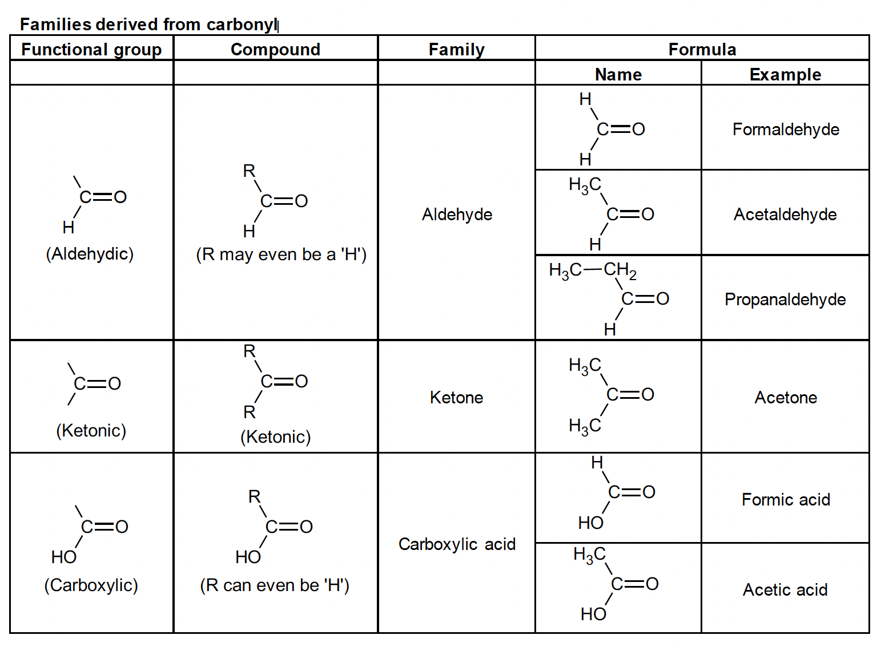
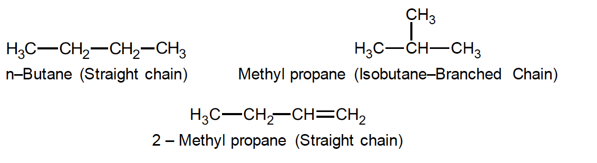

# 🧪 CHEMISTRY OF CARBON COMPOUNDS — FORMULA AT A GLANCE (CLASS 10)

---

## 🧭 Introduction
Carbon is the third most important element after oxygen and hydrogen for the existence of life on Earth.  
It forms **0.03%** of the Earth's crust and over **400,000 compounds**, both natural and synthetic.  
Carbon belongs to **Group 14 (IVA)** and **Period 2** of the periodic table. It has **4 valence electrons** → **tetravalent**.  

### Key Point:
- Non-metal
- Forms both covalent and network structures
- Shows allotropy (various physical forms)

---

## 🧩 Occurrence of Carbon
**Free State:** Diamond, Graphite, Coal  
**Combined State:** Carbonates, Hydrocarbons, CO₂, etc.

---

## ⚛️ Isotopes of Carbon

| Isotope | Type | Abundance | Use |
|----------|------|------------|-----|
| ¹²C | Stable | 98.89% | Mass standard |
| ¹³C | Stable | 1.11% | NMR tracing |
| ¹⁴C | Radioactive | 1.2×10⁻¹⁰ | Carbon dating (t₁/₂ = 5770 years) |

---

## 💎 Allotropes of Carbon

### **1. Diamond**
- 3D tetrahedral lattice, each carbon linked to 4 carbons.  
- Bond angle: 109°28′ ; Bond length: 1.54 Å  
- **Hardest natural substance**  
- Density: 3.51 g/cc  
- Refractive index: 2.41  
- Poor conductor, inert, burns at 900°C to CO₂  
- **Uses:** Jewellery, cutting tools, drilling, electronics, lasers

  

### **2. Graphite**
- Layers of hexagonal rings (sp² hybridisation)  
- Bond length: 1.42 Å ; Layer gap: 3.4 Å  
- Each carbon linked to 3 others; 1 free electron → **good conductor**  
- **Soft, slippery, dark gray** solid  
- **Uses:** Pencil leads, lubricants, electrodes, crucibles, reactor moderator  
  
  

**Manufacture (Acheson process):**

   $SiO_2 + 3C → SiC + 2CO$  
   $SiC → Si + C (graphite)$

---

### **3. Fullerenes (C₆₀)**

- Discovered in 1985 by Kroto, Smalley & Curl.  
- “Buckminsterfullerene” – 60 carbon atoms in hexagons + pentagons (soccer ball shape). 

  

- **Used in:** nanomaterials, superconductors, lasers.

---

## 🌫️ Oxides of Carbon

### **A. Carbon Monoxide (CO)**
- Colourless, odourless, **toxic** gas.
- Forms when carbon burns in limited O₂.
- Combines with haemoglobin (200× stronger than O₂).
  
  

- **Burns with blue flame:**

   $2CO + O_2 → 2CO_2 + heat$

- **Reducing agent:**

    $Fe_2O_3 + 3CO → 2Fe + 3CO_2$ 
    $ZnO + CO → Zn + CO_2$

- **Uses:** Fuel gas (water gas, producer gas), methanol synthesis, phosgene preparation.

---

### **B. Carbon Dioxide (CO₂)**

  

- Colourless, odourless, acidic oxide.
  
- **Preparation:**

   $C + O_2 → CO_2 $. 
   $CaCO_3 + 2HCl → CaCl_2 + H_2O + CO_2 $. 
   $2NaHCO_3 → Na_2CO_3 + CO_2 + H_2O $

  **Properties:**
- Turns limewater milky:
  
- Milkiness clears on excess CO₂:
  
  $CaCO_3 + CO_2 + H_2O → Ca(HCO_3)_2 $
  
- Forms carbonic acid: $CO_2 + H_2O → H_2CO_3$
  
- **Photosynthesis:**  
  
  $6CO_2 + 6H_2O → C_6H_12O_6 + 6O_2$

  

- **Uses:** Fire extinguishers, dry ice (−78°C), carbonated drinks, refrigeration.

---

## 🌍 Uniqueness of Carbon

1. **Tetravalency:**  
 Can form 4 covalent bonds (e.g., CH₄).

   

2. **Catenation:**  
 Carbon atoms link to form long chains or rings.  
 Example:  

  

- **Properties:**
- Turns limewater milky:
  
  $Ca(OH)_2 + CO_2 → CaCO_3 + H_2O$
  
- Milkiness clears on excess CO₂:
  
  $CaCO_3 + CO_2 + H_2O → Ca(HCO_3)_2$
  
- Forms carbonic acid: $CO_2 + H_2O → H_2CO_3$
- **Photosynthesis:**  
$6CO_2 + 6H_2O → C_6H_12O_6 + 6O_2$
- **Uses:** Fire extinguishers, dry ice (−78°C), carbonated drinks, refrigeration.

---

## 🌍 Uniqueness of Carbon

1. **Tetravalency:**  
 Can form 4 covalent bonds (e.g., CH₄).

2. **Catenation:**  
 Carbon atoms link to form long chains or rings.  
 Example:  
 $H–C–C–C–H$

3. **Multiple Bonds:**  
Forms double & triple bonds (C=C, C≡C).

   

4. **Combination with other elements:**  
Combines with H, O, N, S, F, Cl, Br, I forming vast compound varieties.

---

## 🧭 Classification of Organic Compounds

| Type | Description | Example |
|------|--------------|----------|
| **Aliphatic** | Open-chain (straight or branched) | Ethane, Isobutane |
| **Alicyclic** | Closed non-aromatic ring | Cyclohexane |
| **Aromatic** | Contains benzene ring | Benzene, Phenol |
| **Heterocyclic** | Contains non-carbon atom in ring | Pyridine, Furan |

Aromatic Ring Example - Benzene

  
---

## 🔹 Hydrocarbons

| Family | Type | General Formula | Examples |
|---------|------|------------------|-----------|
| Alkanes | Saturated | CₙH₂ₙ₊₂ | CH₄, C₂H₆ |
| Alkenes | 1 Double bond | CₙH₂ₙ | C₂H₄, C₃H₆ |
| Alkynes | 1 Triple bond | CₙH₂ₙ₋₂ | C₂H₂, C₃H₄ |

### Important Reactions

**Alkanes**

3. **Multiple Bonds:**  
Forms double & triple bonds (C=C, C≡C).

4. **Combination with other elements:**  
Combines with H, O, N, S, F, Cl, Br, I forming vast compound varieties.

---

## 🧭 Classification of Organic Compounds

| Type | Description | Example |
|------|--------------|----------|
| **Aliphatic** | Open-chain (straight or branched) | Ethane, Isobutane |
| **Alicyclic** | Closed non-aromatic ring | Cyclohexane |
| **Aromatic** | Contains benzene ring | Benzene, Phenol |
| **Heterocyclic** | Contains non-carbon atom in ring | Pyridine, Furan |

---

## 🔹 Hydrocarbons

| Family | Type | General Formula | Examples |
|---------|------|------------------|-----------|
| Alkanes | Saturated | CₙH₂ₙ₊₂ | CH₄, C₂H₆ |
| Alkenes | 1 Double bond | CₙH₂ₙ | C₂H₄, C₃H₆ |
| Alkynes | 1 Triple bond | CₙH₂ₙ₋₂ | C₂H₂, C₃H₄ |

### Important Reactions

**Alkanes**

$CH_4 + 2O2 → CO_2 + 2H_2O + heat $  
$CH_4 + Cl2 → CH3Cl + HCl (sunlight) $

**Alkenes**

$C_2H_4 + H_2 → C_2H_6 (Hydrogenation) $  
$C_2H_4 + Br_2 → C_2H_4Br_2 (Addition) $  
$nC_2H_4 → (C_2H_4)_n (Polymerization → Polyethylene) $

**Alkynes**

$C_2H_2 + 2H_2 → C_2H_6$  
$C_2H_2 + 2Br_2 → C_2H_2Br_4$

---

## 🧠 Functional Groups Summary

| Group | Symbol | Compound Type | Example |
|--------|---------|----------------|-----------|
| Halide | –X | Haloalkane | CH₃Cl |
| Hydroxyl | –OH | Alcohol | C₂H₅OH |
| Amino | –NH₂ | Amine | CH₃NH₂ |
| Ether | –O– | Ether | CH₃–O–CH₃ |
| Carbonyl | >C=O | Ketone | CH₃COCH₃ |
| Aldehyde | –CHO | Aldehyde | CH₃CHO |
| Carboxyl | –COOH | Acid | CH₃COOH |
| Ester | –COOR | Ester | CH₃COOC₂H₅ |

---
The carbonyl group and the compounds derived from it The group with the structure >C = O is called the carbonyl group. Several families of compounds like aldehydes, ketones, carboxylic acids, esters etc., arise from the carbonyl group on the placement of different groups or atoms on it. These are shown in Table. While naming compounds containing the carbonyl group, we should remember that (i) when R is H, the name starts with ‘form’ (e.g., formaldehyde, formic acid, etc.) and (ii) when R is CH3, the name starts with ‘acet’ (e.g., acetone, acetic acid, etc.)

## 🔸 Homologous Series

**Definition:** Compounds with the same functional group & similar chemical properties differing by –CH₂–.

| Family | Formula | Examples |
|---------|----------|-----------|
| Alkanes | CₙH₂ₙ₊₂ | CH₄, C₂H₆, C₃H₈ |
| Alkenes | CₙH₂ₙ | C₂H₄, C₃H₆ |
| Alkynes | CₙH₂ₙ₋₂ | C₂H₂, C₃H₄ |
| Alcohols | CₙH₂ₙ₊₁OH | CH₃OH, C₂H₅OH |

---

### 🔹 Characteristics of a Homologous Series — Summary

1. **General Formula:**  
   Each homologous series follows a general formula — for example:  
   - **Alkanes:** CₙH₂ₙ₊₂  
   - **Alkenes:** CₙH₂ₙ  
   - **Alkynes:** CₙH₂ₙ₋₂  
   - **Alcohols:** CₙH₂ₙ₊₁OH  

2. **Successive Difference:**  
   Consecutive members differ by a **–CH₂–** group (one carbon and two hydrogens).

3. **Molecular Mass:**  
   Each successive compound has a **molecular mass difference of 14 u**, corresponding to one CH₂ group.

4. **Preparation Methods:**  
   All members of a homologous series can generally be **prepared by similar methods** or reactions.

5. **Gradation in Physical Properties:**  
   Physical properties like **melting point, boiling point, and density** show a **gradual increase** with molecular mass.

6. **Similar Chemical Properties:**  
   Because all members have the **same functional group**, they exhibit **similar chemical behavior**.

## 🔹 Isomerism

**Definition:** Compounds with same molecular formula but different structures.

#### Structural Isomers
tructural isomers are molecules with the same molecular formula but different arrangements of atoms, also known as constitutional isomers. This means the atoms are connected in a different order, leading to different structures and properties. Common types include chain isomerism, position isomerism, and functional group isomerism. 

### Types:
1. **Chain Isomerism:**  
   n-Butane vs Isobutane  
2. **Position Isomerism:**  
   But-1-ene vs But-2-ene  
3. **Functional Isomerism:**  
   Ethanol vs Dimethyl Ether  
4. **Metamerism:**  
   2-Pentanone vs 3-Pentanone  
5. **Ring-Chain Isomerism:**  
   Propene vs Cyclopropane  
6. **Tautomerism:**  
   Keto–enol interconversion

   

---

## 🏭 Sources of Carbon Compounds

### 1. **Coal**

#### Summary: Coal and Its Importance

- **Coal** is a **primary fuel source** used to generate **electricity and heat** through combustion.  
- When heated at **500–1000°C without air**, it undergoes **destructive distillation** (also called **pyrolysis** or **carbonization**), producing:
  - **Coke** – solid fuel  
  - **Coal-tar** – source of phenols, naphthalene, road tar  
  - **Light oil** – used for benzene and methylated benzenes  
  - **Coal-gas** – gaseous fuel  

- These products are used in manufacturing **artificial petrol, dyes, medicines, explosives, and pesticides**.

#### 🔹 **Types of Coal (Based on Carbon Content)**

| Type | Carbon Content | Characteristics |
|------|----------------|-----------------|
| **Anthracite** | ~95% | Hardest, oldest, gives maximum heat |
| **Bituminous (Stone Coal)** | ~82% | Most common type |
| **Lignite** | ~70% | Soft, brown coal, lower heating value |

**Note:** Anthracite yields the **largest amount of heat** among all varieties.

- Pyrolysis → Coke, Coal-tar, Coal gas, Light oil
- **Coke:** fuel; **Coal-tar:** phenol, naphthalene; **Light oil:** benzene, toluene.

### 2. **Petroleum**
Petroleum is a mixture of several carbon compounds formed in nature by decomposition of animal and plant remains. It is a dark coloured oily liquid with a characteristic smell. It is lighter than water and insoluble in water. It occurs in large quantities in the depths of the earth between certain sedimentary layers. It is obtained by drilling holes in the earth and is refined to give important petrochemicals like LPG, jet fuels, naphtha,
kerosene, petrol, diesel oils, lubricants, waxes, asphalt, medicinal compounds etc.
- Refining yields LPG, petrol, diesel, lubricants, wax, asphalt.

**India:** Assam, Gujarat, Andhra Pradesh.  
**World:** Middle East, USA, Russia, Venezuela.

### Classification on the basis of carbon chain 

Based upon carbon chain organic compounds are of two types. 

(i) Open chain compounds   
(ii) Closed chain compounds In open chain compounds carbon atoms are linked to one another in chains which may be straight or branched but not closed (rings).

Open chain compounds are also called **aliphatic hydrocarbons**.

In closed chain compounds carbon atoms are linked to one another or atoms of some other elements to form a cycle or closed chain. If they have one ring they are monocyclic and if they have more than one ring they are polycyclic compounds. Cycloalkanes, cycloalkenes, cycloalkynes and their derivatives have closed chains.

| Compound     | Structure                                                                                                                                                               |
| ------------ | ----------------------------------------------------------------------------------------------------------------------------------------------------------------------- |
| Cyclopropane |                                          |
| Cyclobutane  |  |
| Cyclopentane |                     
---

## 🧼 Soap & Detergents

### **Soap**
- Sodium or potassium salts of long-chain fatty acids.
- Cleansing by **micelle formation** (hydrophilic head, hydrophobic tail).
- **Na-soaps:** hard ; **K-soaps:** soft/liquid.  
- **Used in:** cleaning, lubrication, greases.

### **Detergents**
- Surfactants + builders + enzymes + bleaches.
- Work in **hard water**.
- Contain sodium alkylbenzene sulfonates, phosphates (builders), TAED (bleach activator).

---

## 🔍 Tests for Hydrocarbons

| Test | Observation | Indicates |
|------|--------------|-----------|
| **Br₂ water** | Decolourises | Alkene/Alkyne |
| **Baeyer’s (KMnO₄)** | Decolourises | Alkene/Alkyne |
| **Ammoniacal AgNO₃** | White ppt | Terminal Alkyne |

---

## 🔬 Key Reaction Snippets

$C + O_2 → CO_2 $  
$Fe_2O_3 + 3CO → 2Fe + 3CO_2 $ 
$CO_2 + Ca(OH)2 → CaCO_3↓ + H_2O $ 
$CH_2=CH_2 + Br2 → BrCH_2–CH_2Br $ 
$HC≡CH + [Ag(NH_3)2]+ → AgC≡CH↓ $ 

---

## 💡 Exam Tip
Always:
1. Identify **functional group**
2. Apply **family formula**
3. Verify **reaction type** (addition/substitution)
4. Note **test** for confirmation (Br₂ / KMnO₄)

---
