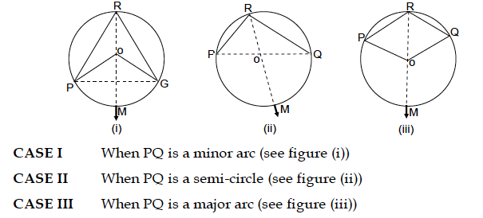
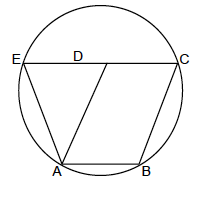

# ⚪ CIRCLES 

---

## 🧭 Geometric Definition
A **circle** is the *locus* of a point in a plane which moves such that its distance from a fixed point (centre) is constant.  
If the centre is **O** and radius **r**, then every point **P** on the circle satisfies:  
**OP = r**

---

## 📘 Properties of Chords
1. Equal chords of a circle subtend equal arcs.  
2. Perpendicular from the centre to a chord bisects the chord.  
3. Line joining the centre to the midpoint of a chord is ⟂ to the chord.  
4. Perpendicular bisectors of two chords intersect at the centre.  
5. If two chords **AB** and **AC** are equal → the centre lies on the bisector of ∠BAC.  
6. If two circles intersect in two points → line joining centres is the ⟂ bisector of the common chord.  
7. Equal chords of congruent circles are equidistant from their centres.  
8. Chords equidistant from the centres are equal.  
9. Equal chords subtend equal angles at the centre.  
10. If two chords subtend equal angles at the centre → they are equal.

---

## 📍 Illustration
**Statement:** Of all chords through a point within a circle, the shortest passes through the point and is bisected there.

**Proof:**  
Let circle C(O, r) have point M inside.  
Let **AB** pass through M and be bisected at M.  
Let **CD** pass through M but not bisected.  
Join **OM**, draw **ON ⟂ CD**.  
In ΔONM, OM > ON ⇒ CD nearer centre ⇒ CD > AB ⇒ **AB < CD**.  
→ *Chords nearer the centre are longer.*

---

## 📐 Theorem 1 — Angle at Centre
> The angle subtended by an arc at the centre is **double** the angle subtended by it at any point on the remaining circle.  

\[
∠AOB = 2∠ACB
\]

---

## 🔹 Angles in the Same Segment

1. Angles in the same segment are equal.  
2. Arc subtending a right angle ⇒ semicircle.  
3. Angle in a minor arc = acute; in a major arc = obtuse.  
4. If a line segment subtends equal angles at two points on the same side, the points are **concyclic**.

### Cases of Arc PQ  

**Case I:** PQ minor arc → smaller segment angle  
**Case II:** PQ semicircle → right angle  
**Case III:** PQ major arc → obtuse angle

---

## 🧮 Cyclic Quadrilateral

**Definition:**  
A **cyclic quadrilateral** has all its vertices on a circle.

**Theorem:**  
Sum of opposite angles = 180° (supplementary).  
If any pair of opposite angles of a quadrilateral = 180°, it is cyclic.

---

### 📏 Properties of Cyclic Quadrilateral
1. Exterior angle = interior opposite angle.  
2. Quadrilateral formed by angle bisectors of a cyclic quadrilateral is also cyclic.  
3. If two sides are parallel → other two sides and diagonals are equal.  
   - Hence, a cyclic trapezium is isosceles with equal diagonals.  
4. If non-parallel sides of a trapezium are equal → it is cyclic.  
   - *An isosceles trapezium is always cyclic.*

1. The bisectors of the angles formed by producing the opposite sides of a cyclic quadrilateral (provided that they are not parallel), intersect at right angle.

## Theorem 3

Let P be any point on the circumcircle of $\triangle \mathrm{ABC}$ and perpendiculars $\mathrm{PL}, \mathrm{PM}$ and $P N$ are drawn on the lines through line segments $B C, C A$ and $A B$ respectively. Show that the points $\mathrm{L}, \mathrm{M}, \mathrm{N}$ are collinear.

## Theorem 4

If the bisectors of the opposite angles $\angle \mathrm{P}$ and $\angle \mathrm{R}$ of a cyclic quadrilateral $P Q R S$ intersect the corresponding circle at $A$ and $B$ respectively, then $A B$ is a diameter of the circle.

## Illustration 2: 
### $A B C D$ is a parallelogram. The circle through $A, B$ and $C$ intersects $C D$ produced at $E$, prove that $A E=A D$.

**Solution:** In order to prove that $\mathrm{AE}=\mathrm{AD}$ i.e. $\triangle \mathrm{AED}$ is an isosceles strangle it is sufficient to prove that $\angle \mathrm{AED}=\angle \mathrm{ADE}$. Since ABCE is a cyclic quadrilateral.

$
\therefore \angle \mathrm{AED}+\angle \mathrm{ABC}=180^{\circ}
$

Now, CDE is a straight line

$
\begin{aligned}
& \therefore \mathrm{ADE}+\angle \mathrm{ADC}=180^{\circ} \\
& \Rightarrow \angle \mathrm{ADE}+\angle \mathrm{ABC}=180^{\circ}
\end{aligned}
$

$\therefore \angle \mathrm{ADC}$ and $\angle \mathrm{ABC}$ are opposite angles of all gm.

$
\therefore \angle \mathrm{ADC}=\angle \mathrm{ABC}
$

From (i) and (ii), we get

$
\begin{aligned}
& \angle \mathrm{AED}+\angle \mathrm{ABC}=\angle \mathrm{ADE}+\angle \mathrm{ABC} \\
& \Rightarrow \angle \mathrm{AED}=\angle \mathrm{ADE}
\end{aligned}
$

Thus, in $\triangle \mathrm{AED}$, we have

$
\angle \mathrm{AED}=\angle \mathrm{ADE} \Rightarrow \mathrm{AD}=\mathrm{AE} .
$
