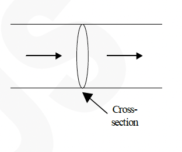
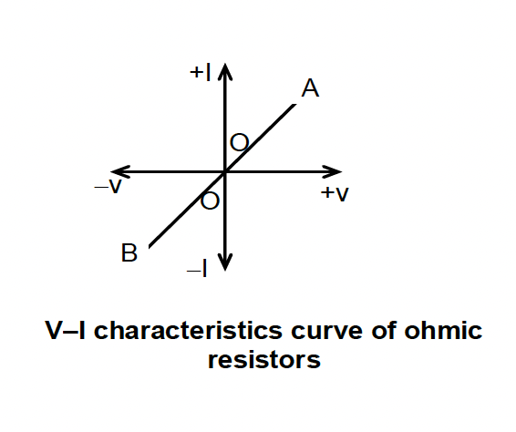
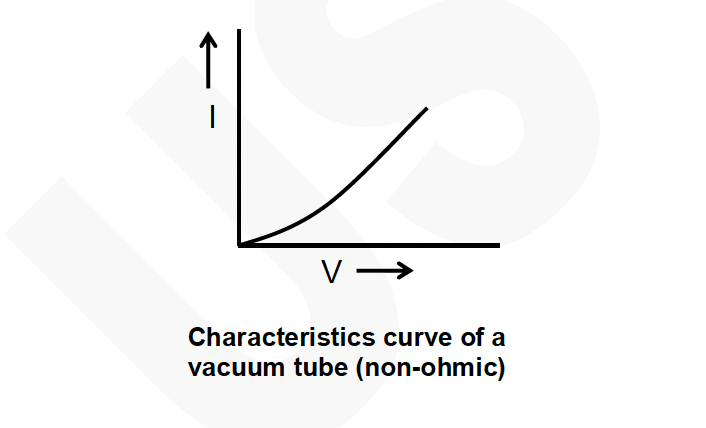
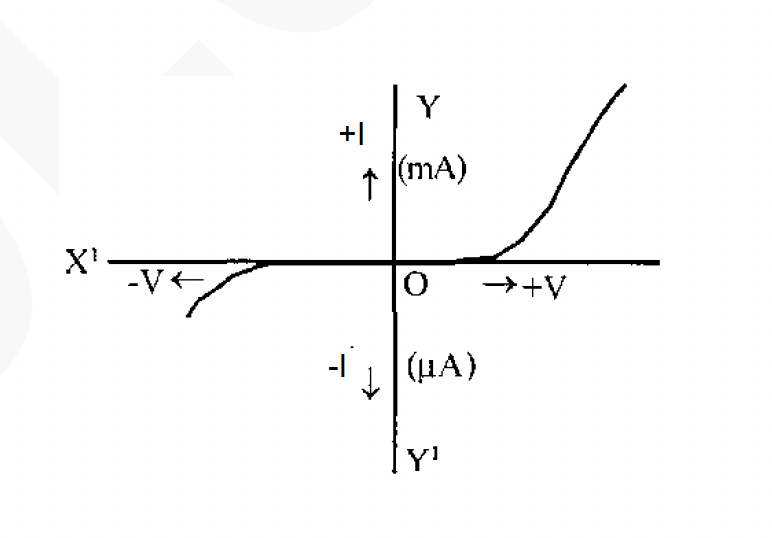
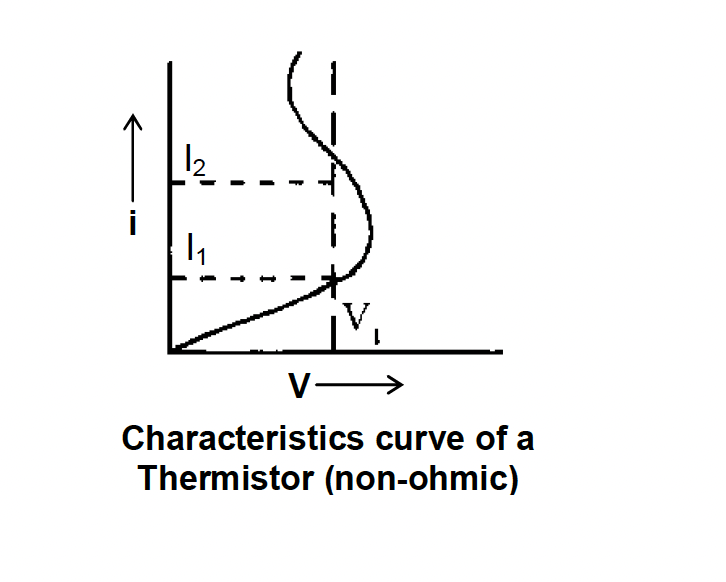

# ⚡ CURRENT ELECTRICITY

## 🧭 Introduction
Once upon a time food clothing and shelter, these were the essentials of a common man, but for a $21^{\text {st }}$ century common man it is food, clothing, shelter and electricity. To know the importance of it just imagine the world without electricity for a day. It has become an innate part of our lives . From father's shaver, mother's mixer grinder, sisters idiot box, brother's video game to grandma's hearing aid. electricity has become a part of human existence. it is even the reason behind the pumping of heart and the infinite intelligence of human brain. hence in this chapter we will discuss the properties of electric current.

---

## 🔋 Electric current
Flow of electric charge constitutes electric current. For a given conductor, if ' $Q$ ' charge flows through a cross-section of area A in time ' $t$ ', then the average electric current through the conductor is given as  
$\mathrm{I}=\frac{\Delta Q}{\Delta t}$

Current is assumed to be a fundamental quantity. The conventional direction of current is taken to be the direction of flow of positive charge or is in the direction opposite to the direction of flow of free electrons. It is not a vector quantity because it does not obey the law of vector addition.

- The SI unit of current is **ampere (A)**
- A conductor remains uncharged when current flows through it.
- For a given conductor current does not vary as its cross - sectional area varies.
- When 1 A current flows through a conductor then $6.24 \times 10^{18}$ electrons flow per second.
- For a given conductor current does not change with change in cross-sectional area. In the following figure $i_1=i_2=i_3$

---

## ⚙️ Journey of a Typical Electron
Current due to translatory motion of charge: If $n$ particles each having a charge $q$, pass through a given area in time t then $i=\frac{n q}{t}$  

If $n$ particles each having a charge $q$ pass per second per unit area, the current associated with cross-sectional area A is $i=n q A$

If there are n particles per unit volume each having a charge q and moving with velocity v , the current through cross section A is $i=n q v A$

| Statement | True or False? |
| :--- | :--- |
| a. When an electrochemical cell no longer works, it is out of charge and must be recharged before it can be used again. | T or F |
| b. An electrochemical cell can be a source of charge in a circuit. The charge that flows through the circuit originates in the cell. | T or F |
| c. Charge becomes used up as it flows through a circuit. The amount of charge that exits a light bulb is less than the amount that enters the light bulb. | T or F |
| d. Charge flows through circuits at very high speeds. This explains why the light bulb turns on immediately after the wall switch is flipped. | T or F |
| e. The local electrical utility company supplies millions and millions of electrons to our homes everyday. | T or F |

To maintain a steady current through $\mathrm{AB}, \mathrm{A}$ should be kept at a constant high potential and B at a constant lower potential. For this purpose, we connect A to the positive terminal P of the cell and B to the negative terminal $Q$ of the cell as shown in the figure.

Through chemical action, the cell always maintains $P$ at a constant positive potential and $Q$ at a constant negative potential.

In the external circuit, current (+ve charge) flows from $P$ to $Q$ via the conductor $A B$. But, inside the cell, the same positive charge has to move from a lower potential to a higher potential. To do this, the cell must be able to do work on the charge. The energy to do this work is derived from the chemical process inside the cell.

The influence that makes the charge move from a lower potential to a higher potential is called the electromotive force and is denoted by $\varepsilon$.

The emf of a cell is defined as the work done in carrying a unit positive charge through the complete circuit including the charge flow inside the cell. The emf is measured in the units of Joule/Coulomb
(JC⁻¹). The unit has a special name ‘Volt’. Thus emf has the same units as that of potential difference.

---

## ⚖️ Ohm’s Law
It states that “the potential difference across a conductor is directly proportional to the current flowing through it at a given temperature.”  

At constant temperature $\frac{V}{I}=\text{constant}(R)$ the constant ‘R’ is called resistance of the conductor.

---

### Limitations of Ohm’s Law
Ohm’s Law is just an empirical relationship. It is not a fundamental physical principle and does not specify any general property of matter. In case of electrolytes, another essential condition required for application of Ohm’s Law is that the physical state (electrolyte concentration) must remain the same. But, Ohm’s Laws is obeyed fairly well by most of the metallic conductors. Ohm’s law is valid for metallic conductors in which $\frac{V}{I}$ have a constant value irrespective of the magnitudes of V and I. But, even when $\frac{V}{I}$ is not a constant, we can still define the resistance R as $R=\frac{V}{I}$ at every potential difference V applied.

---

## 🧮 Ohmic and Non-ohmic resistances (devices)
Ohm’s Law is not universal (i.e. all conductors do not obey Ohm’s law). Conductors obeying Ohm’s law are called Ohmic conductors. However, resistance is always defined as the ratio V/I.  

A metallic conductor at a constant temperature is an Ohmic resistance. For such Ohmic resistances, the V–I characteristic curve will be a straight line passing through the origin as shown in the figure.

V–I characteristics curve of ohmic resistors.  
In Ohmic resistance, current is reversed in direction when the P.D. is reversed, but the magnitude of current remains the same.  

An electrolyte such as copper sulphate solution with copper electrodes, also obeys Ohm’s Law.

There are many resistances that do not obey Ohm’s law. These are called non-Ohmic resistances. For these resistances, the V–I characteristic curve will not be linear. The functioning of modern electronic devices is mainly based on these non-Ohmic resistances (devices).

A good number of commonly used non-ohmic resistances deviate from Ohm’s law in the following manners:

1. $V$ depends on $I$ in a **non-linear** fashion  
The V–I graph is not a straight line. Such type of behaviour is found in a **vacuum tube** as shown in the figure.

2. $I$ depends on the **sign of V**  
For the same magnitude of V, if it is applied in an opposite direction, the value of I will be quite different.  
This behaviour is found in **p-n junction diodes**.

3. The relation between $V$ and $I$ is not unique.  
For the same value of V there can be more than one value for I. Such behaviour is shown by a **thermistor** as shown in the figure.  

Other examples include **neon gas bulbs**, **electrolytes** with tungsten electrodes, etc.

---

## 🧲 Resistivity ($\rho$) and conductivity ($\sigma$)
The resistance $R$ of a given conductor depends upon its length $(\ell)$ and cross-sectional area (A) such that  
$R = \rho \frac{\ell}{A}$  
where $\rho =$ resistivity of the material of the given conductor.  

Its S.I. unit is $\Omega \, \mathrm{m}$.  
Reciprocal of resistivity is called the **electrical conductivity** $(\sigma)$ of the material, thus  
$\sigma=\frac{1}{\rho}=\frac{\ell}{R A}$  

whereas reciprocal of resistance is called **conductance**.  
S.I. unit of conductivity $\sigma$ is $(\Omega-\mathrm{m})^{-1}$ or $\mathrm{mho}/\mathrm{m}$.

---

### Example 5
How long a piece of aluminium wire 1 mm in diameter is needed to give a resistance of $4 \Omega$? (assume $t=20^{\circ}\mathrm{C}$)  

Solution:  
$R = \rho\left(\frac{L}{A}\right)$  \newline
We have $\rho$ for aluminium $=2.8\times10^{-8}\Omega\mathrm{m}$  
$A=\pi r^2 = 3.14(0.5\times10^{-3})^2=7.85\times10^{-7}\mathrm{m}^2$  
$\Rightarrow 4 = (2.8\times10^{-8}L)/(7.85\times10^{-7})$  
$\Rightarrow L = 112\ \mathrm{m}$

---

### Example 6
Compute the resistance of 180 m of silver wire having a cross section of $0.3\mathrm{mm}^2$. ($t=20^{\circ}\mathrm{C}$)  
$\rho_{\text{Ag}} = 1.6\times10^{-8}\Omega\mathrm{m}$  
$R = \rho L/A = (1.6\times10^{-8})(180)/(0.3\times10^{-6})=9.6\Omega$

---

### Example 7
A 20 cm long copper tube has an inner diameter of 0.85 cm and an outer diameter of 1.10 cm. Find its resistance when used lengthwise.  

$R = \rho (L/A)$  
$A=\pi(1.10^2-0.85^2)/(4\times10^4)=3.83\times10^{-5}\mathrm{m}^2$  
$L=0.20\mathrm{m}$, $\rho_{\text{Cu}}=1.7\times10^{-8}\Omega\mathrm{m}$  
$\Rightarrow R=89\ \mu\Omega$

## 🌡️ Temperature Dependence of Resistivity

The conductivity of a metal decreases as its temperature increases. Thus resistivity $\rho$ increases with temperature.  
If $\rho_T$ and $\rho_0$ represent the resistivities at temperatures $T$ and $T_0$ respectively, then for small temperature variations:  

$\rho_T = \rho_0[1 + \alpha (T - T_0)]$

Where $\alpha$ is called the **temperature coefficient of resistivity**.  

- For metals (good conductors) $\rho \approx 10^{-8}\Omega\text{-m}$  
- For insulators $\rho \approx 10^{17}\Omega\text{-m}$  
- For semiconductors (like Si, Ge), $\alpha$ is **negative**  
- For metals, $\alpha$ is **positive**  
- For superconductors, $\rho = 0$  

---

### Example 8
A coil of wire has a resistance of $25.00\ \Omega$ at $20^{\circ}\mathrm{C}$ and a resistance of $25.17\ \Omega$ at $35^{\circ}\mathrm{C}$. What is its temperature coefficient of resistance?  

Solution:  
$R = R_0 [1 + \alpha (T - T_0)]$  
$\Rightarrow \alpha = \frac{\Delta R}{R_0 \Delta T}$  

$\Delta R = 0.17\ \Omega$, $\Delta T = 15^{\circ}\mathrm{C}$  
$\Rightarrow \alpha = \frac{0.17}{25.00\times15} = 4.5\times10^{-4}/^{\circ}\mathrm{C}$

---

### Example 9
It is desired to make a $20.0\ \Omega$ coil of wire with zero thermal coefficient of resistance.  
A carbon resistor of resistance $R_1$ is placed in series with an iron resistor of resistance $R_2$.  
$R_1 + R_2 = 20\ \Omega$  

We need $R_1(1+\alpha_1\Delta t) + R_2(1+\alpha_2\Delta t) = 20$  
At $\Delta t = 0$, $R_1 + R_2 = 20$, so $R_1\alpha_1 = -R_2\alpha_2$  

Given $\alpha_1 = -0.5\times10^{-3}$ (carbon) and $\alpha_2 = 5\times10^{-3}$ (iron).  
$R_1 = 10R_2$  
Solving $R_1+R_2=20$ gives:  
$R_1=18.18\ \Omega$, $R_2=1.82\ \Omega$

## 🔌 Relation between E.M.F., Potential Difference, Internal and External Resistance

Consider a cell of emf $E$ and internal resistance $r$, connected in series to a resistor of resistance $R$.  
Let current $I$ flow through it, and $V$ be the potential difference at its ends.

Applying Ohm’s law to the external circuit (excluding the cell):  
$I = \frac{V}{R}$  

Applying Ohm’s law to the complete circuit (including the cell):  
$I = \frac{E}{R + r}$  

Comparing,  
$\frac{V}{R} = \frac{E}{R + r}$ \newline
$\Rightarrow VR + Vr = ER$ \newline
$\Rightarrow r = \frac{R(E - V)}{V}$  

Hence, $E - V = Ir$ and $E = V + Ir$.  
$V$ is the **terminal potential difference**, less than emf due to internal drop $Ir$.  

## 🧩 Grouping of Resistances

### Series
Let equivalent resistance between A and B be $R_{eq}$.  
$V = IR_1 + IR_2 + IR_3$  
$\Rightarrow R_{eq} = R_1 + R_2 + R_3$

### Parallel
$R_{eq} = \frac{V}{I}$ and $I = i_1 + i_2 + i_3 = \frac{V}{R_1} + \frac{V}{R_2} + \frac{V}{R_3}$  

Hence,  
$\frac{1}{R_{eq}} = \frac{1}{R_1} + \frac{1}{R_2} + \frac{1}{R_3}$

---

### Example 10
What is the resistance between A and B?

For two resistors in parallel,  
$\frac{1}{R} = \frac{1}{3} + \frac{1}{6} = \frac{3}{6}$  
$\Rightarrow R = 2\ \Omega$  

This is in series with $8\ \Omega$, so  
$R_{AB} = 2 + 8 = 10\ \Omega$

---

### Example 11
Three resistances of 12, 16, and $20\ \Omega$ are connected in parallel.  
What resistance must be connected in series with this combination to give a total resistance of $25\ \Omega$?  

$\frac{1}{R} = \frac{1}{12} + \frac{1}{16} + \frac{1}{20} = \frac{47}{240}$  
$\Rightarrow R = 5.11\ \Omega$  
Then $R_x + 5.11 = 25$  
$\Rightarrow R_x = 19.89\ \Omega$

---

### Example 12
In the figure, find the resistance from A to B.

There are two parallel branches, each of resistance $3(20)=60\ \Omega$.  
$\Rightarrow \frac{1}{R} = \frac{1}{60} + \frac{1}{60} = \frac{2}{60}$  
$\Rightarrow R = 30\ \Omega$

## 🔄 Kirchhoff’s Laws

1. **Junction Law:**  
   Based on conservation of charge.  
   The total current entering a junction equals the total current leaving it.  
   $\sum I = 0$

2. **Loop Law:**  
   Based on conservation of energy.  
   The algebraic sum of potential differences around any closed loop is zero.  
   $\sum V = 0$

For a resistor, potential drop in direction of current:  
$v_B - v_A = -IR$  

For an emf source (internal resistance $r$):  
$v_B - v_A = \varepsilon - Ir$ (rise)  
or  
$v_B - v_A = -\varepsilon - Ir$ (fall)

## 🔬 Wheatstone Bridge

For a certain adjustment of $Q$, $V_{BD} = 0$, meaning no current flows through the galvanometer.

$V_A - V_B = I_1P$, $V_A - V_D = I_2R$  
At balance, $V_B = V_D$  
$\Rightarrow I_1P = I_2R$

Also, $V_B - V_C = I_1Q$, $V_D - V_C = I_2S$  
At balance, $\Rightarrow I_1Q = I_2S$

Dividing, $\frac{P}{Q} = \frac{R}{S}$  

## 🔥 Energy, Power and Heating Effect

When current $I$ flows for time $t$ from a source of emf $E$,  
Charge $Q = It$, and energy $W = QV = VIt$  

Power $P = W/t = VI = I^2R = \frac{V^2}{R}$  

In the complete circuit:  
$E I = I^2R + I^2r$

- $EI$: Rate of conversion of chemical → electrical energy  
- $I^2R$: Power to external circuit  
- $I^2r$: Power lost internally

**Joule’s Law of Heating:**  
$H = I^2Rt$ joules  

where $I$ in A, $R$ in $\Omega$, $t$ in s.

## ⚡ Maximum Power Theorem

In a circuit, power developed in load resistance $R$ is  
$P = \frac{E^2 R}{(R + r)^2}$  
(where $E$ is emf, $r$ internal resistance)

Differentiate and set $\frac{dP}{dR}=0$ to find condition for maximum power:  
$\Rightarrow R = r$

Hence, maximum power is delivered when external resistance equals internal resistance.
