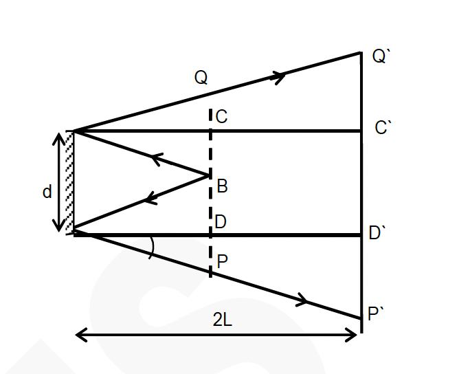
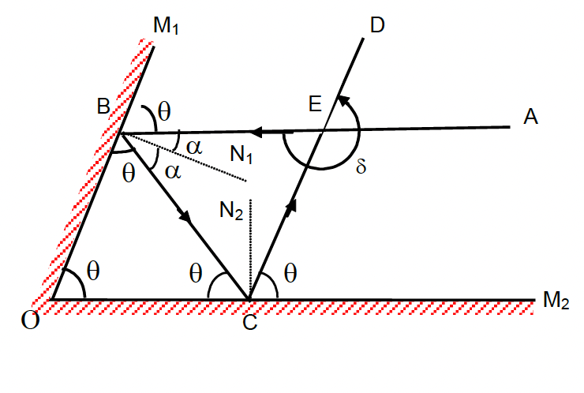
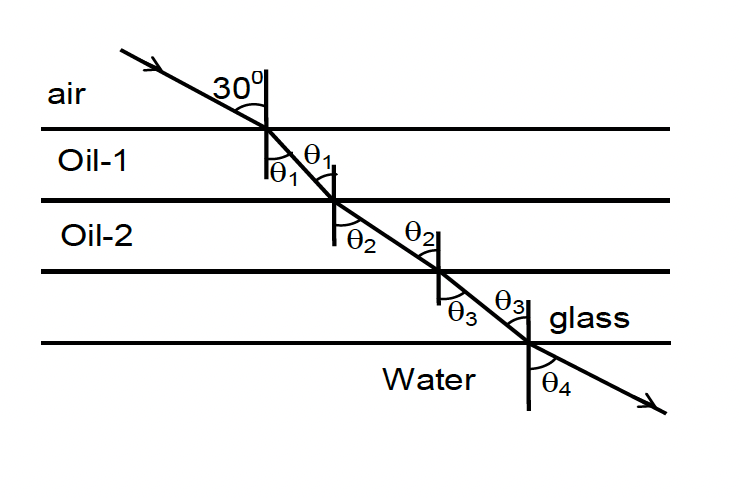
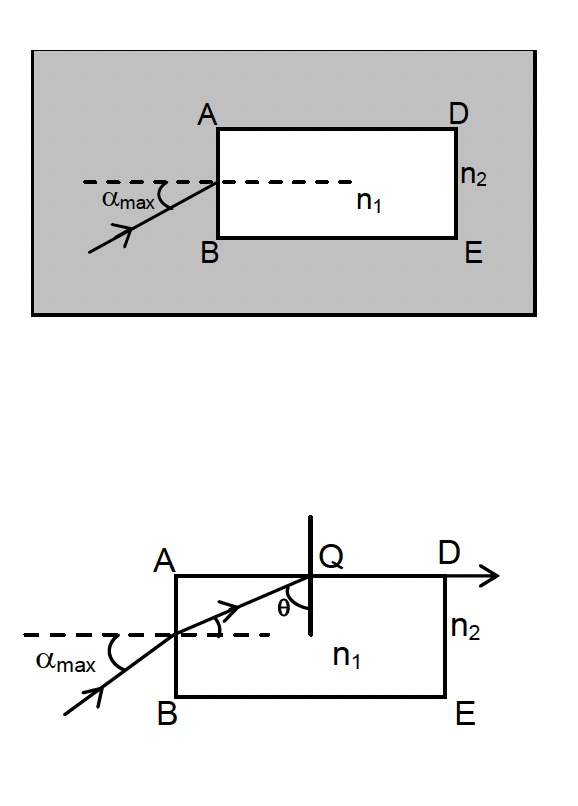
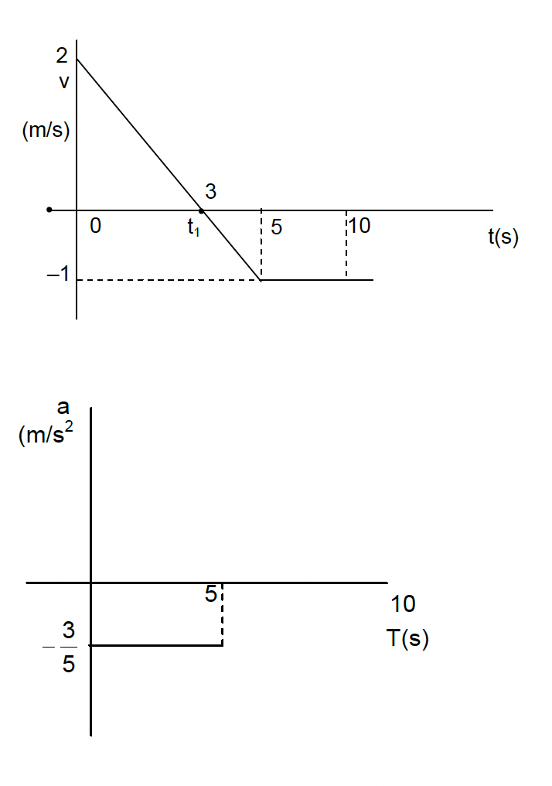

# ⚙️ KINEMATICS AND 🔭 OPTICS Theory

## Scalars and Vectors

**Scalar:**  
All those physical quantities which can be explained only by a number with suitable units are known as scalar quantities.  
Examples: length, mass, time etc. These obey the algebraic law of addition.

**Vector:**  
All those physical quantities which need direction too, besides the numerical value and units for their complete specification, are known as vector quantities.  
Examples: displacement, velocity, force — which obey the vector law of addition.

---

## Distance and Displacement

**Distance:**  
Distance moved by a particle is the total length along the path travelled by it. Distance is a scalar quantity.

**Displacement:**  
Displacement is the shortest distance between the initial and final point. It is a vector quantity and directed from the initial point to the final point.  

A particle moves from point O → A → B → C.  
- Distance = $OA + AB + BC$  
- Displacement = $OC$ (directed from O to C)

---

## Speed

Speed is defined as the distance covered by a body in unit time.

$
v = \frac{s}{t}
$

Units:  
- CGS: cm/s  
- MKS: m/s  

**Uniform Speed:** travels equal distance in equal intervals of time.

---

## Velocity

Velocity is defined as displacement per unit time.

$
v = \frac{\vec{s}}{t}
$

Vector quantity. Units same as speed.

**Uniform Velocity:** equal displacements in equal intervals of time.

---

## Acceleration

When velocity changes, the body is said to be accelerating.

$
a = \frac{\Delta v}{t}
$

Units:  
- CGS: cm/s²  
- MKS: m/s²  

If velocity increases → $a$ is positive.  
If velocity decreases → $a$ is negative (retardation).

---

## Kinematics

Kinematics studies motion **without considering its causes (forces)**.

Equations of motion apply to **constant acceleration** and relate $u$, $v$, $a$, $s$, and $t$.

---

## Equations of Motion

| Symbol | Meaning | Unit |
| :-- | :-- | :-- |
| $u$ | Initial velocity | m/s |
| $v$ | Final velocity | m/s |
| $a$ | Acceleration | m/s² |
| $t$ | Time | s |
| $s$ | Displacement | m |

### 1st Equation

$
v = u + at
$

### 2nd Equation

$
s = ut + \frac{1}{2}at^2
$

### 3rd Equation

$
v^2 = u^2 + 2as
$

**Distance in $t^{th}$ second:**

$
s_t = u + \frac{a}{2}(2t - 1)
$

---

## Motion under Gravity

For vertical motion: replace $a$ by $\pm g$.

$
v = u \pm gt, \quad h = ut \pm \frac{1}{2}gt^2, \quad v^2 = u^2 \pm 2gh
$

> $g = 9.8\,\text{m/s}^2$ (toward Earth’s center)

---

# 🔭 OPTICS

## Geometrical (Ray) Optics

Light travels in straight lines (rays). When encountering surfaces between media → reflection or refraction occurs.

**Beam of light:** group of rays  
- **Convergent:** rays meet at a point  
- **Divergent:** rays spread from a point  
- **Parallel:** rays remain parallel

---

## Reflection

**Laws of Reflection:**  
1. $ngle i = ngle r$  
2. The incident ray, reflected ray, and normal all lie in one plane.

### Reflection at Plane Mirror

- Image formed is **virtual**, **erect**, **laterally inverted**.  
- Object distance = Image distance.  
- When mirror rotates by $	heta$, reflected ray rotates by $2	heta$.  
- Two mirrors at angle $	heta$ → number of images $n = \frac{360}{\theta} - 1$ (if integer).

---

## Refraction

Occurs when light passes from one medium to another → changes speed and direction.

**Laws:**  
1. Incident ray, refracted ray, and normal lie in one plane.  
2. Snell’s Law:

$
\frac{\sin i}{\sin r} = {}_1\mu_2 = \frac{c_1}{c_2}
$

where ${}_1\mu_2$ = refractive index of medium 2 w.r.t. 1.

**Absolute Refractive Index:**  
$
\mu = \frac{c_{vacuum}}{c_{medium}}
$

Hence for multiple media:

$
\mu_1\sin i_1 = \mu_2\sin i_2 = constant
$

---

## Apparent Depth (Refraction Effect)

For near-normal incidence:

$
\frac{\text{Apparent depth}}{\text{Real depth}} = \frac{\mu_1}{\mu_2}
$

**Shift:**  
$
\text{Real} - \text{Apparent} = \text{Real} \left(1 - \frac{\mu_1}{\mu_2}\right)
$

If $\mu_2 > \mu_1$ → image appears **shallower**.

---

## Lenses and Power

**Power:**  
$
P = \frac{1}{f(\text{in metres})}
$

**Combination of Lenses:**  
$
P_{eq} = P_1 + P_2, \quad \frac{1}{F} = \frac{1}{f_1} + \frac{1}{f_2}
$

---

## Sample Examples

### Example 1
A car starts from rest and accelerates at $1\,\text{m/s}^2$ for 3 minutes.

$
v = u + at = 0 + 1 \times 180 = 180\,\text{m/s}
$

### Example 2
A bus accelerates from rest to $60\,\text{km/h}$ in 10 s.

$
a = \frac{v - u}{t} = \frac{50/3}{10} = 1.67\,\text{m/s}^2
$

### Example 3
A body with $u=10\,\text{m/s}$, $a=2\,\text{m/s}^2$, $t=20\,\text{s}$

$
s = ut + \frac{1}{2}at^2 = 10(20) + \frac{1}{2}(2)(400) = 600\,\text{m}
$

---

# 🧠 Summary

| Concept | Formula | Type |
| :-- | :-- | :-- |
| Speed | $v = s/t$ | Scalar |
| Velocity | $v = s/t$ | Vector |
| Acceleration | $a = (v-u)/t$ | Vector |
| Motion 1 | $v = u + at$ | Eq. of Motion |
| Motion 2 | $s = ut + \tfrac{1}{2}at^2$ | Eq. of Motion |
| Motion 3 | $v^2 = u^2 + 2as$ | Eq. of Motion |
| Refraction | $\mu_1 \sin i_1 = \mu_2 \sin i_2$ | Law |
| Power of Lens | $P = 1/f$ | Dioptre |

## EXAMPLES

### Example 1
A car starts from rest and moves with uniform acceleration of $1 \mathrm{~m} / \mathrm{s}^2$ for 3 minutes. Find the velocity acquired by the car.  
**Solution:**

$
\begin{aligned}
\mathrm{u} & =0, \mathrm{a}=1 \mathrm{~m} / \mathrm{s}^2, \mathrm{t}=3 \text { minutes }=3 \times 60=180 \mathrm{~s} \newline
\mathrm{v} & =\mathrm{u}+\mathrm{at} \newline
& =0+1 \times 180 \newline
& =180 \mathrm{~m} / \mathrm{s}
\end{aligned}
$

---

### Example 2
A bus starts moving from rest and moves with uniform acceleration. Its velocity after 10 sec is observed to be $60 \mathrm{~km} / \mathrm{hr}$. Calculate the magnitude of the acceleration.  
**Solution:**

$
\begin{aligned}
\mathrm{u} & =0 \newline
\mathrm{v} & =60 \mathrm{~km} / \mathrm{hr} \newline
& =60 \times \frac{5}{18}=\frac{50}{3} \mathrm{~m} / \mathrm{s} \newline
\mathrm{v} & =\mathrm{u}+\mathrm{at} \newline
\frac{50}{3} & =0+\mathrm{a} \times 10 \newline
\mathrm{a} & =\frac{50 / 3}{10}=\frac{5}{3}=1.67 \mathrm{~m} / \mathrm{s}^2
\end{aligned}
$

---

### Example 3
The velocity of a body is $30 \mathrm{~km} / \mathrm{hr}$ at a particular instant. After how much time will its velocity be equal to $90 \mathrm{~km} / \mathrm{hr}$ if it has a uniform acceleration of $2 \mathrm{~m} / \mathrm{s}^2$.  
**Solution:**

$
\begin{aligned}
& \mathrm{u}=30 \mathrm{~km} / \mathrm{hr}=\frac{25}{3} \mathrm{~m} / \mathrm{s} \newline
& \mathrm{v}=90 \mathrm{~km} / \mathrm{hr}=25 \mathrm{~m} / \mathrm{s} \newline
& \mathrm{v}=\mathrm{u}+\mathrm{at} \newline
& 25=\frac{25}{3}+2 \times \mathrm{t} \newline
& \Rightarrow \quad \mathrm{t}=\frac{25}{3} \text { seconds. }
\end{aligned}
$

---

### Example 4
A bus driver observes a obstacle at a distance and presses the brakes if the bus was initially moving along a straight line with a velocity of $90 \mathrm{~km} / \mathrm{hr}$ how much time will it take for the bus to stop if the retardation due to the brakes is $6 \mathrm{~m} / \mathrm{s}^2$.  
**Solution:**

$
\begin{aligned}
& \mathrm{u}=90 \mathrm{~km} / \mathrm{hr}=25 \mathrm{~m} / \mathrm{s} \newline
& \mathrm{v}=0, \mathrm{a}=-6 \mathrm{~m} / \mathrm{s}^2 \newline
& \mathrm{v}=\mathrm{u}+\mathrm{at} \newline
& 0=25-6 \times \mathrm{t} \newline
& \mathrm{t}=\frac{25}{6}=4.16 \mathrm{~s}
\end{aligned}
$

---

### Example 5
The driver of a car moving at a certain speed presses the brake. After 10 seconds of pressing the brake it is observed that the speed of the body is $72 \mathrm{~km} / \mathrm{hr}$ and after 20 seconds of pressing the brake it is observed that the speed of the body is $18 \mathrm{~km} / \mathrm{hr}$. Calculate the speed of the car (in $\mathrm{km} / \mathrm{hr}$ ) when the brakes were pressed. Also calculate the retardation due to the brakes.  
**Solution: Method I (For first 10 s).**

$
\begin{aligned}
& \mathrm{v}=72 \mathrm{~km} / \mathrm{hr}=20 \mathrm{~m} / \mathrm{s}, \mathrm{t}=10 \mathrm{~s} \newline
& 20=\mathrm{u}+10 \mathrm{a}
\end{aligned}
$

After 20 seconds.

$
\begin{aligned}
& \mathrm{v}=18 \mathrm{~km} / \mathrm{hr}=5 \mathrm{~m} / \mathrm{s}, \mathrm{t}=20 \mathrm{~s} . \newline
& 5=\mathrm{u}+20 \mathrm{a} \newline
& 20=\mathrm{u}+10 \mathrm{a} \newline
& 5=\mathrm{u}+20 \mathrm{a} \newline
& 15=-10 \mathrm{a}
\end{aligned}
$

therefore $a=-1.5 \mathrm{~m} / \mathrm{s}^2$.

$
\begin{aligned}
20 & =\mathrm{u}+10 \mathrm{a} \newline
25 & =\mathrm{u}+10(-1.5) \newline
\mathrm{u} & =20-10(-1.5) \newline
& =35 \mathrm{~m} / \mathrm{s} \newline
\mathrm{u} & =35 \times 18 / 5=126 \mathrm{~km} / \mathrm{hr}
\end{aligned}
$

**Method II (For the period from 10 s to 20 s).**

$
\begin{aligned}
& \mathrm{u}=72 \mathrm{~km} / \mathrm{hr}=20 \mathrm{~m} / \mathrm{s}, \mathrm{v}=18 \mathrm{~km} / \mathrm{hr}=5 \mathrm{~m} / \mathrm{s}, \mathrm{t}=10 \mathrm{~s} . \newline
& \mathrm{v}=\mathrm{u}+\mathrm{at} \newline
& 5=20+\mathrm{a} \times 10 \newline
& 10 \mathrm{a}=-15 \newline
& \mathrm{a}=-1.5 \mathrm{~m} / \mathrm{s}^2 .
\end{aligned}
$

For first 10 seconds:

$
\begin{aligned}
& \mathrm{v}=\mathrm{u}+\mathrm{at} \newline
& 20=\mathrm{u}-1.5 \times 10 \newline
& \mathrm{u}=20+15 \newline
& \mathrm{u}=35 \mathrm{~m} / \mathrm{s} \newline
& \mathrm{u}=35 \times 18 / 5=126 \mathrm{~km} / \mathrm{hr}
\end{aligned}
$

---

### Example 6
A body is moving with a speed of $10 \mathrm{~m} / \mathrm{s}$. It has got a uniform acceleration of $2 \mathrm{m} / \mathrm{s}^2$ because of which its speed goes on increasing. Find the distance covered by the body in 20s.  
**Solution:** $\mathrm{S}=\mathrm{ut}+\frac{1}{2} \mathrm{at}^2$

$
10 \times 20+\frac{1}{2} \times 2 \times 20^2=200+400=600 \mathrm{~m}
$

$
\begin{aligned}
& \mathrm{v}^2=\mathrm{u}^2+2 \mathrm{as} \newline
& 0=256-2 \times 5 \times \mathrm{s} \newline
& \mathrm{~S}=\frac{256}{10}=25.6 \mathrm{~m}
\end{aligned}
$

Total distance covered $=32+25.6=57.6 \mathrm{~m}$.

---

### Example 13
The driver presses the brakes of a car which was moving with a uniform speed of $20 \mathrm{~m} / \mathrm{s}$. As a result the vehicle slows down and finally stops. If the brakes can retard the vehicle at the rate of $10 \mathrm{~m} / \mathrm{s}^2$, then calculate the distance it will travel before coming to rest.  
**Solution:**

$
\begin{aligned}
& u=20 \mathrm{~m} / \mathrm{s}, v=0, a=-10 \newline
& v^2=u^2+2 a \mathrm{~s} \newline
& (0)^2=(20)^2+2(-10) \mathrm{s} \newline
& 400=20 \mathrm{~s} \newline
& s=20 \mathrm{~m}
\end{aligned}
$

---

### Example 14
The driver of a car watches a barrier at a distance of 100 m in front of him. As a reaction, he presses the brakes. If his reaction time is 2.5 s and he was moving with a uniform speed of $30 \mathrm{~m} / \mathrm{s}$ before the application of brakes, then, find out if the driver
hits the barrier or not. The retardation of the brakes is uniform and equal to $5 \mathrm{~m} / \mathrm{s}^2$  
**Solution:** Distance travelled during reaction time $2.5 \times 30=75 \mathrm{~m}$

$
\begin{aligned}
\mathrm{u} & =30 \mathrm{~m} / \mathrm{s}, \mathrm{v}=0, \mathrm{a}=-5 \mathrm{~m} / \mathrm{s}^2 \newline
\mathrm{v}^2 & =\mathrm{u}^2+2 \mathrm{as} \newline
0 & =900-2 \times 5 \times \mathrm{S} \newline
\mathrm{~S} & =90 \mathrm{~m}
\end{aligned}
$

Total distance $=75+90=165 \mathrm{~m}$  
Since the barrier is 100 m away, he will hit the barrier.

---

### Example 15
A body is moving in a circular path of radius 28 m . When it reaches the diametrically opposite point B, a linesman says that the body's speed has increased by $8 \mathrm{~m} / \mathrm{s}$. If the tangential acceleration is uniform at the rate of $1 \mathrm{~m} / \mathrm{s}^2$, calculate the velocity of the body at
point $A$ and at point $B$. What will be the speed of the body, when it again reaches point $A$.  
**Solution:** From A to B:  
Distance traveled $=\pi \mathrm{r}$. (along the circumference)

$
\begin{aligned}
& =\frac{22}{7} \times 28=88 \mathrm{~m} \newline
& a=1 \mathrm{~m} / \mathrm{s}^2, \mathrm{~s}=88 \mathrm{~m}
\end{aligned}
$

$
\begin{aligned}
& v^2=u^2+2 a s \newline
& (v+u)(v-u)=2 \times 1 \times 88 \newline
& (v+u) 8=176 \newline
& v+u=22 \newline
& v-u=8 \newline
& v=\frac{22+8}{2}=15 \mathrm{~m} / \mathrm{s} \newline
& u=7 \mathrm{~m} / \mathrm{s} \newline
& V_B=15 \mathrm{~m} / \mathrm{s}, V_A=7 \mathrm{~m} / \mathrm{s} \newline
& S=2 \times \frac{22}{7} \times 28=176 \newline
& v^2=u^2+2 a s \newline
& v^2=7^2+2 \times 1 \times 176 \newline
& v^2=49+352 \newline
& v=\sqrt{401}=20 \mathrm{~m} / \mathrm{s}
\end{aligned}
$

---

### Example 16
A body starts from rest and accelerates uniformly at the rate of $5 \mathrm{~m} / \mathrm{s}^2$. Calculate the distance covered by it in the $6^{\text {th }}$ second of its motion.  
**Solution:**

$
\begin{aligned}
\mathrm{u} & =0, \mathrm{a}=5 \mathrm{~m} / \mathrm{s}^2, \mathrm{t}=6 \mathrm{~s} \newline
\mathrm{~S}_{6 \mathrm{th}} & =\mathrm{u}+\frac{\mathrm{a}}{2}(2 \mathrm{t}-1) \newline
& =0+\frac{5}{2} \times(2 \times 6-1) \newline
& =\frac{5}{2} \times 11=27.5 \mathrm{~m}
\end{aligned}
$

since the body is moving along a straight line (without reversing its direction of motion) the above calculated displacement is also the distance traveled.

$
\text { Aliter: } \begin{aligned}
\mathrm{S}_6 & =\mathrm{ut}+\frac{1}{2} \mathrm{at}^2 \newline
& =\frac{1}{2} \times 5 \times 36=90 \mathrm{~m} \newline
\mathrm{~S}_5 & =\frac{1}{2} \text { at }=\frac{1}{2} \times 5 \times 25=62.5 \mathrm{~m} \newline
\mathrm{~S}_6 & =\mathrm{S}_6-\mathrm{S}_5=90-62.5=27.5 \mathrm{~m}
\end{aligned}
$

---

### Example 17
A body is thrown vertically upwards with a velocity of $39.2 \mathrm{~m} / \mathrm{s}$. Calculate the time taken to reach the maximum height as well as the maximum height reached by the body. (Given g $=9.8 \mathrm{~m} / \mathrm{s}^2$ )  
**Solution:** (take upward vectors as +ve)

$
\mathrm{u}=9.8 \mathrm{~m} / \mathrm{s}, \mathrm{v}=0 \text { (at highest point ) } \mathrm{g}=-9.8 \mathrm{~m} / \mathrm{s} \text { (retardation) }
$

$\mathrm{v}=\mathrm{u}-\mathrm{g} \mathrm{t}$

$
\begin{aligned}
& 0=39.2-9.8 t \newline
& t=4 \mathrm{~s} .
\end{aligned}
$

Height attained:

$
\begin{aligned}
& \mathrm{v}=0, \mathrm{u}=39.2 \mathrm{~m} / \mathrm{s}, \mathrm{~g}=-9.8 \mathrm{~m} / \mathrm{s}^2 \newline
& \mathrm{v}^2=\mathrm{u}^2-2 \mathrm{gS} \newline
& 0=(39.2)^2-2 \times 9.8 \times \mathrm{S} \newline
& \mathrm{~S}=\frac{39.2 \times 39.2}{2 \times 98}=78.4 \mathrm{~m}
\end{aligned}
$

So, after 4 second the body will be at a height of 78.4 m i.e. at maximum height.

---

### Example 18
A body falls freely from a height of 9.8 m . Calculate the time required by the body to reach the ground $\left(g=9.8 \mathrm{~m} / \mathrm{s}^2\right)$. Also find the velocity with which it strikes the ground.  
**Solution:** (take downward vectors as +ve)

$
\begin{aligned}
& \mathrm{u}=0, \mathrm{~h}=9.8 \mathrm{~m}, \mathrm{~g}=9.8 \mathrm{~m} / \mathrm{s}^2 \newline
& \mathrm{~h}=\frac{1}{2} \mathrm{gt}^2 \newline
& 9.8=\frac{1}{2} \times 9.8 \times \mathrm{t}^2 \newline
& \mathrm{t}=\sqrt{2}=1.414 \text { seconds. } \newline
& \mathrm{v}^2=\mathrm{u}^2+2 \mathrm{gh} \newline
& \mathrm{v}=\sqrt{2 \times 9.8 \times 9.8}= \pm 9.8 \sqrt{2}
\end{aligned}
$

here $\mathrm{v}=+9.8 \sqrt{2} \mathrm{~m} / \mathrm{s}$ as the direction of velocity is downwards

$
=13.86 \mathrm{~m} / \mathrm{s} .
$

---

### Example 19
A body is projected vertically upwards with a velocity of $19.6 \mathrm{~m} / \mathrm{s}$. Calculate  
(a) time of flight ( total time it was in air)  
(b) velocity with which it strikes the ground again.  
(c) Net displacement  
(d) Net distance covered, ( $\mathrm{g}=9.8 \mathrm{~m} / \mathrm{s}+2$ ).  
**Solution:**

$
\begin{aligned}
& \mathrm{u}=19.6 \mathrm{~m} / \mathrm{s}, \mathrm{~g}=-9.8 \mathrm{~m} / \mathrm{s}^2 \mathrm{v}=0 . \newline
& \mathrm{v}=\mathrm{u}-\mathrm{gt} \newline
& 0=19.6-9.8 \times \mathrm{t}_1 \newline
& \mathrm{t}_1=2 \mathrm{~s} \newline
& \mathrm{~h}=\mathrm{ut}_1-\frac{1}{2} \mathrm{gt}_1^2 \newline
& =19.6 \times 2-\frac{1}{2} \times 9.8 \times(2)^2 \newline
& =19.6 \mathrm{~m}
\end{aligned}
$

Time required to cover the distance while falling down.

$
\begin{aligned}
& 19.6=\frac{1}{2} \times 9.8 \times \mathrm{t}_2{ }^2 \Rightarrow \mathrm{t}_2=\sqrt{\frac{2 \times 19.6}{9.8}}=2 \mathrm{sec} \newline
& \text { total time required }=\mathrm{t}_1+\mathrm{t}_2 \newline
& =2+2=4 \mathrm{~s}
\end{aligned}
$

Note: Time of ascent = Time of descent  
At highest point, $\mathrm{u}=0 \mathrm{t}_2=2 \mathrm{~s}, \mathrm{~g}=9.8 \mathrm{~m} / \mathrm{s}^2$

$
\begin{aligned}
\mathrm{V} & =\mathrm{u}+\mathrm{gt} \newline
& =0+9.8 \times 2=19.6 \mathrm{~m} / \mathrm{s}
\end{aligned}
$

Note: It strikes the ground with the same velocity it was projected with. As it comes to the same point the net displacement is zero.

$
\text { Distance covered }=\mathrm{h}+\mathrm{h}=2 \mathrm{~h}=2 \times 19.6=39.2 \mathrm{~m} \text {. }
$

---

### Example 20
A body is projected so that it reaches the top of a tower of height 29.4 m . if the acceleration due to gravity is $9.8 \mathrm{~m} / \mathrm{s}^2$, calculate the maximum velocity of projection, so that it reaches to the top of the tower.  
**Solution:** At highest point velocity $=0, \mathrm{~h}=29.4 \mathrm{~m}, \mathrm{~g}=-9.8 \mathrm{~m} / \mathrm{s}^2$

$
\begin{aligned}
& v^2=u^2+2 g h \newline
& 0=u^2-2 \times 9.8 \times 29.4 \newline
& u=\sqrt{2 \times 9.8 \times 29.4}=24 \mathrm{~m} / \mathrm{s}
\end{aligned}
$

---

### Example 21
A body is projected vertically upward from the top of a tower of height 19.6 m with a velocity of $9.8 \mathrm{~m} / \mathrm{s}$. Calculate the time after which it strikes the ground. Also, calculate the velocity of body at the instant of striking the ground.  
**Solution:** $\quad u=9.8 \mathrm{~m} / \mathrm{s}, g=-9.8 \mathrm{~m} / \mathrm{s}^2$  
$\therefore$ time after which it comes to rest momentarily

$
\begin{aligned}
& v=u+g t \newline
& 0=9.8-9.8 t_1 \newline
& t_1=1 s . \newline
& \therefore \quad v^2=u^2+2 g h \newline
& 0=(9.8)^2-2 \times 9.8 \times h \newline
& h=\frac{9.8 \times 9.8}{2 \times 9.8}=4.9 m
\end{aligned}
$

$\therefore$ Total height above the ground $=19.6+4.9=24.5 \mathrm{~m}$.  
Time required to fall from a height of 24.5 m

$
\begin{aligned}
\mathrm{u} & =0, \mathrm{~g}=9.8 \mathrm{~m} / \mathrm{s}^2 \newline
\mathrm{~S} & =\mathrm{ut}+1 / 2 \mathrm{gt}^2 \newline
24.5 & =1 / 2 \times 9.8 \times \mathrm{t}_2^2 \newline
\mathrm{t}_2 & =\sqrt{\frac{24.5 \times 2}{9.8}}-\sqrt{5 \mathrm{~s}}
\end{aligned}
$

Total time required $=\mathrm{t}_1+\mathrm{t}_2$

$
=1 s+\sqrt{5} s
$

Again, $\mathrm{u}=0, \mathrm{~S}=24.5 \mathrm{~m}, \mathrm{~g}=9.8 \mathrm{~m} / \mathrm{s}^2$

$
\begin{aligned}
\mathrm{v}^2 & =\mathrm{u}^2+2 \mathrm{gs} \newline
\mathrm{v} & =\sqrt{2 \mathrm{gs}} \newline
& =\sqrt{2 \times 9.8 \times 24.5}=21.91 \mathrm{~m} / \mathrm{s}
\end{aligned}
$

---

### Example 22
A point source of light $B$ is placed at a distance $L$ in front of the centre of a mirror of width d hung vertically on a wall. A man walks in front of the mirror along a line parallel to the mirror at a distance 2 L from it as shown. Find the greatest distance over which he can see the image of the light source in the mirror.

**Solution:** The observer can see through the distance $\mathrm{P}^{\prime} \mathrm{Q}^{\prime}$, where reflected ray from B can meet the line.

From geometry $C D=d=C^{\prime} D^{\prime}$

$
\begin{aligned}
& P^{\prime} Q^{\prime}=C^{\prime} D^{\prime}+P^{\prime} D^{\prime}+Q^{\prime} C^{\prime} 
& =d+2 P D+2 C Q=d+2(P D+Q C)=d+2 d=3 d
\end{aligned}
$

## 🔹 Example 23  
**Problem:**  
Two plane mirrors are inclined to each other such that a ray of light incident on the first mirror and parallel to the second is reflected from the second mirror parallel to the first mirror.  
Determine the angle between the two mirrors.

**Solution:**  
Let $ \theta $ be the angle between the two mirrors $ OM_1 $ and $ OM_2 $.  
The incident ray $ AB $ is parallel to $ OM_2 $ and strikes mirror $ OM_1 $ at an angle of incidence $ \alpha $.  
It is reflected along $ BC $; the angle of reflection being $ \alpha $.

From geometry,  

$ \angle M_1BA = \angle OBC = \angle M_1OM_2 = \theta $

Similarly, for reflection at mirror $ OM_2 $:

$ \angle M_2CD = \angle BCO = \angle M_2OM_1 = \theta $

Now, in triangle $ OBC $:  
$ 3\theta = 180^\circ \Rightarrow \boxed{\theta = 60^\circ} $

---

## 🔹 Example 24  
**Problem:**  
Light is incident from air on oil at an angle of $ 30^\circ $. After moving through oil-1, oil-2, and glass it enters water.  
If the refractive indices of glass and water are $ 1.5 $ and $ 1.3 $ respectively, find the angle the ray makes with the normal in water.

**Solution:**  
By Snell’s Law,  
$ \mu \sin i = \text{constant} $

$ \Rightarrow \mu_{\text{air}} \sin 30^\circ = \mu_{\text{water}} \sin \theta_4 $

$\boxed{\theta_4 = \sin^{-1} \left( \frac{\mu_a \sin 30^\circ}{\mu_w} \right) = \sin^{-1} \left( \frac{1}{2.6} \right)}$

---

## 🔹 Example 25  
**Problem:**  
Refractive index of glass with respect to water is $ 1.125 $.  
If the absolute refractive index of glass is $ 1.5 $, find the absolute refractive index of water.

**Solution:**  
$ ^w\mu_g = \frac{\mu_g}{\mu_w} $

$ \Rightarrow \mu_w = \frac{\mu_g}{^w\mu_g} = \frac{1.5}{1.125} = \boxed{1.33} $

---

## 🔹 Example 26  
**Problem:**  
A layer of oil $ 3\,\text{cm} $ thick floats on coloured water $ 5\,\text{cm} $ thick.  
Refractive index of coloured water is $ \frac{5}{3} $ and the apparent depth of the two liquids appears as $ \frac{36}{7}\,\text{cm} $.  
Find the refractive index of oil.

**Solution:**  
$ \text{Apparent Depth} = \frac{t_1}{\mu_1} + \frac{t_2}{\mu_2} $

$ \frac{36}{7} = \frac{5}{5/3} + \frac{3}{\mu_2} \newline
\Rightarrow \frac{3}{\mu_2} = \frac{36}{7} - 3 = \frac{15}{7} \newline
\Rightarrow \boxed{\mu_2 = 1.4} $

---

## 🔹 Example 27  
**Problem:**  
A rectangular slab $ ABED $ (refractive index $ n_1 $) is immersed in water (refractive index $ n_2 $), where $ n_1 > n_2 $.  
Find the maximum incidence angle $ \alpha_{\max} $ at which the ray comes out only from the other surface $ ED $.

**Solution:**  
For limiting condition, angle $ \theta = $ critical angle.  

By Snell’s Law:  
$ n_1 \sin \theta = n_2 \sin 90^\circ $

and  
$ n_2 \sin \alpha_{\max} = n_1 \sin (90 - \theta) $

$\boxed{
\sin \alpha_{\max} = \frac{n_1}{n_2} \cos \theta \newline
\Rightarrow
\alpha_{\max} = \sin^{-1}\left[\frac{n_1}{n_2} \cos \sin^{-1}\frac{n_2}{n_1}\right]
}$

---

## 🔹 Example 28  
**Problem:**  
A converging lens of $ 6D $ is combined with a diverging lens of $ -2D $.  
Find the power and focal length of the combination.

**Solution:**  
$ P = P_1 + P_2 = 6 - 2 = 4D $

$ f = \frac{1}{P} = \frac{1}{4} = 0.25\,\text{m} = 25\,\text{cm} $

**Equivalent focal length of lenses in contact:**  
$ \frac{1}{F} = \frac{1}{f_1} + \frac{1}{f_2} + \cdots $

---

## 🔹 Example 29  
**Problem:**  
A convex lens of $ 10\,\text{cm} $ focal length is combined with a concave lens of $ 6\,\text{cm} $ focal length.  
Find the focal length of the combination.

**Solution:**  
$ \frac{1}{F} = \frac{1}{f_1} + \frac{1}{f_2} \newline
= \frac{1}{10} - \frac{1}{6} = -\frac{1}{15} $

$\boxed{F = -15\,\text{cm}}$

---

## 🔹 Example 30  
**Problem:**  
The velocity–time graph of a particle moving along X-axis is given.  
(a) Plot the acceleration–time graph.  
(b) Find the displacement and distance travelled in $ 10\,\text{s} $.

**Solution:**  
Using similar triangles,  
$ t_1 = \frac{10}{3}\,s $

**Displacement:**  
$ \text{Net area} = \frac{1}{2}\left(\frac{10}{3}\right)(2) - \left(\frac{1}{2} \times \frac{5}{3}\right) - (5 \times 1)
= -\frac{5}{2}\,\text{m} $

**Distance travelled:**  
$ = \frac{1}{2}\left(\frac{10}{3}\right)(2) + \left(\frac{1}{2} \times \frac{5}{3}\right) + (5 \times 1)
= \frac{55}{6}\,\text{m} $
