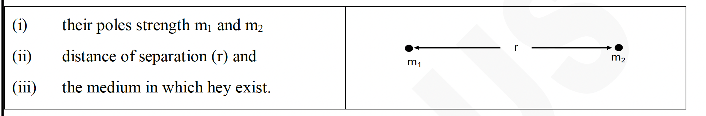
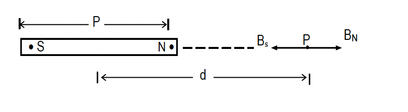
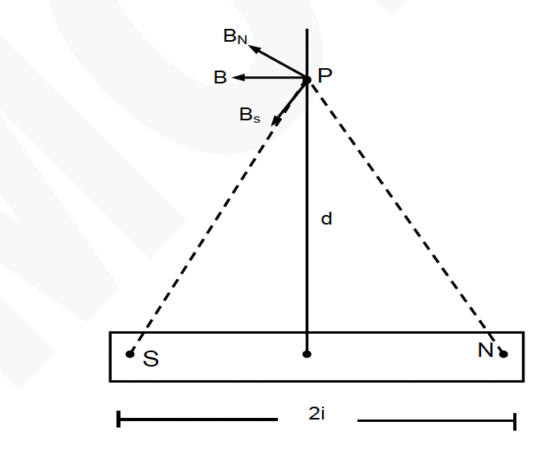
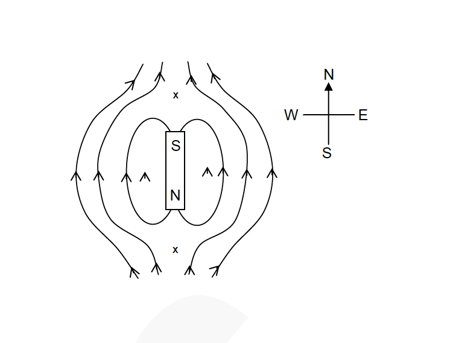
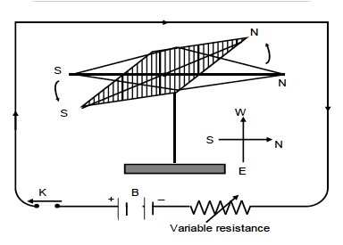
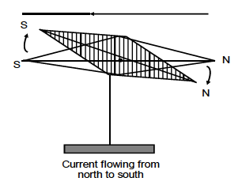
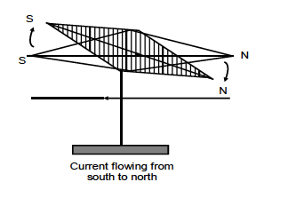
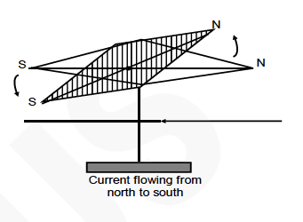
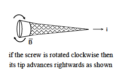

<h1 align="center">🧲 MAGNETISM — One Page Concept Summary</h1>

---

### 🧭 **Pole Strength**

The ability of a pole of a magnet to attract or repel another magnetic pole is called its **pole strength**.  
It is a **scalar** quantity.  
**SI unit:** A·m (ampere-metre)

A single magnetic pole never exists in nature — it is a *theoretical construct* used for conceptual clarity.

---

### ⚖️ **Inverse Square Law of Magnetism**

Consider two bar magnets with pole strengths $m_1$ and $m_2$ separated by a distance $r$.

Coulomb established the relation between force, pole strength, and distance as:

$
F \propto m_1 m_2 \quad \text{and} \quad F \propto \frac{1}{r^2}
$

Hence,

$
F = k \frac{m_1 m_2}{r^2}
$

where *k* depends on the magnetic properties of the medium.

In SI form:

$
F = \frac{\mu_0}{4\pi} \frac{m_1 m_2}{r^2}
$

---

### 🧮 **Magnetic Permeability (μ)**  
It defines the ability of a medium to allow magnetic lines of force to pass through it.

---

### 🧩 **Unit Pole Strength**

From  

$
F = 10^{-7} \frac{m_1 m_2}{r^2}
$

If $m_1 = m_2 = 1 \, A·m$ and $r = 1 \, m$,  
then $F = 10^{-7} \, N$.

✅ **Definition:**  
A *unit magnetic pole* is one that repels an identical pole at a 1 m distance with a force of $10^{-7} N$.

---

### 🌌 **Magnetic Induction or Magnetic Flux Density (B)**

A magnet creates a **magnetic field** represented by *lines of force*.  
The total number of lines passing normally through an area is **magnetic flux (ϕ)**.  
If flux $ϕ$ passes through area $A$:

$
B = \frac{ϕ}{A}
$

**Units:** Weber per m² (Wb/m²) or Tesla (T).  

$1\,T = 10^4 \, \text{gauss}$

For a unit north pole $(m_1 = 1)$:

$
F = \frac{\mu_0}{4\pi} \frac{m}{r^2}
$

and since $F = mB$,  

$
B = \frac{F}{m}
$

Thus, $B$ is the **force on a unit north pole at that point**.

---

### 🧲 **Magnetic Field Due to a Bar Magnet**

#### 1️⃣ At a Point on the Axial Line (End-On Position)

Let $SN$ be a bar magnet of magnetic length $2\ell$ and pole strength $m$.  
At point $P$ (distance $d$ from centre):

$
B_N = \frac{\mu_0}{4\pi} \frac{m}{(d-\ell)^2}, \quad 
B_S = \frac{\mu_0}{4\pi} \frac{m}{(d+\ell)^2}
$

Resultant field:

$
B = \frac{\mu_0}{4\pi} \frac{2M}{(d^2 - \ell^2)^2}, \quad M = 2\ell m
$

For $d \gg \ell$:

$
B = \frac{\mu_0}{4\pi} \frac{2M}{d^3}
$

---

#### 2️⃣ At a Point on the Equatorial Line (Broadside-On Position)

At point $P$ on the perpendicular bisector of the magnet:

$
\vec{B_N} = \frac{\mu_0}{4\pi} \frac{m \, \vec{NP}}{NP^3}, \quad 
\vec{B_S} = \frac{\mu_0}{4\pi} \frac{m \, \vec{PS}}{PS^3}
$

Resultant field:

$
\vec{B} = \frac{\mu_0}{4\pi} \frac{m(\vec{NS})}{(d^2+\ell^2)^{3/2}}
$

Hence,

$
B = \frac{\mu_0}{4\pi} \frac{M}{(d^2+\ell^2)^{3/2}}
$

For $d \gg \ell$:

$
B = \frac{\mu_0}{4\pi} \frac{M}{d^3}
$

---

### 🧭 **Mapping of Magnetic Lines — Neutral Points**

A **neutral point** is a point where the magnetic field due to a bar magnet equals and opposes Earth’s horizontal magnetic field $B_0$.

At a neutral point:  
$
B = B_0
$

#### (A) N-Pole Facing Earth’s N-Pole  
→ Neutral points lie **on the equatorial line**.  

 

$
d^3 = \frac{M}{390}
$

#### (B) S-Pole Facing Earth’s N-Pole  
→ Neutral points lie **on the axial line**. 
 
$
d^3 = \frac{M}{195}
$

---

### ⚡ **Units Recap**

| Quantity | Symbol | SI Unit | Alternative |
|-----------|---------|----------|--------------|
| Pole strength | m | A·m | — |
| Magnetic flux | ϕ | Weber (Wb) | — |
| Magnetic flux density | B | Tesla (T) | Wb/m² |
| Force | F | Newton (N) | — |
| Permeability | μ | H/m | — |

---

<h1 align="center">⚡ ELECTROMAGNETISM — Oersted’s Experiment</h1>

---

### 🧠 **Discovery**

In **1820**, *Hans Christian Oersted* discovered that **an electric current produces a magnetic field** around its conductor.  
Hence, a **current-carrying conductor behaves like a magnet** as long as current flows through it.  
This discovery established the fundamental link between **electricity and magnetism**, giving rise to *electromagnetism*.

---

### 🧪 **Experiment Setup**

**Apparatus Required:**  
- A magnetic needle pivoted freely (compass needle).  
- A long insulated copper wire.  
- A key (switch), variable resistor (rheostat), and a battery.

**Procedure:**
1. Place the magnetic needle horizontally so that it points naturally **north-south**.  
2. Connect the copper wire to the **battery**, **switch**, and **rheostat** in series.  
3. Hold the wire **parallel to the axis of the magnetic needle**, just **above it**, as shown in the figure.  
4. **Close the key (switch)** to allow current through the wire.

---

### 👀 **Observations**

1. The **north pole** of the magnetic needle deflects **towards west** when current flows through the wire.  
2. Increasing the **current strength** (by reducing resistance) causes **greater deflection** of the needle — up to a maximum, where the needle’s north pole points exactly **west**.  
   
3. When the **direction of current** is reversed (i.e., current flows **north to south** instead of south to north), the **needle deflects towards east**.
   
4. If the wire is held below the magnetic needle, such that current is flowing from south to north, then the north pole of the magnetic needle deflects towards west as is illustrated in figure.
   
5. If the wire is held below the magnetic needle, such that current is flowing from north to south, then the north pole of the magnetic needle deflects towards west s is illustrated in Figure.
   
---

### 📊 **Key Inference**

- The **deflection of the compass needle** shows that **a magnetic field is generated** around the current-carrying conductor.  
- The **direction of deflection** depends on the **direction of current** in the wire.  
- Therefore, **electric current produces magnetic effect** — the basis of *electromagnetism*.

---

### 🧭 **Right-Hand Thumb Rule**

> If the **right-hand thumb** points in the **direction of current**,  
> then the **curled fingers** indicate the **direction of the magnetic field lines** around the conductor.

---

### 📘 **Conclusion**

- Every **current-carrying conductor** is surrounded by **magnetic field lines** forming **concentric circles** around it.  
- The **field direction** reverses if the **current direction** reverses.  
- The **strength of the magnetic field** increases with the **magnitude of current**.

---

### ⚡ **Key Concept Summary**

| Concept | Observation / Law |
|----------|--------------------|
| Discovery | Electric current produces magnetic field |
| Direction of field | Given by Right-Hand Thumb Rule |
| Nature of field lines | Concentric circles around conductor |
| Magnetic field strength | ∝ Current strength |
| Deflection of compass | Indicates magnetic effect of current |

---

<h1 align="center">⚡ MAGNETIC EFFECTS OF ELECTRIC CURRENT — Summary Sheet</h1>

---

### 🌌 **Overview**

An **electric current** in a conductor produces a **magnetic field** around it.  
The **direction** of this magnetic field depends on the **direction of current** and can be found using several rules —  
**Oersted’s Experiment**, **Ampere’s Rules**, and **Maxwell’s Cork-Screw Rule**.

---

### 🌀 **1. Maxwell’s Cork-Screw Rule**

If the **rotation of the head** of a right-handed screw represents the **direction of magnetic field lines**,  
then the **direction in which its tip advances** gives the **direction of current**.

- Rotating the screw **clockwise** → tip moves **into the plane** (current direction).  
- Rotating **anticlockwise** → tip moves **out of the plane**.

---

### ✋ **2. Ampere’s Right-Hand Rule**

Hold the **conductor in the right hand** such that the **thumb** points along the **direction of current**.  
Then, the **curled fingers** indicate the **direction of magnetic field lines**.

Magnetic lines around the conductor form **concentric circles**.  
At any point, **B** is **tangential** to the circle.

---

### 📘 **3. Magnetic Induction near a Straight Current-Carrying Conductor**

For a conductor carrying current **i**, the magnetic field at a point **distance r** away is:

$
B = \frac{\mu_0}{2\pi} \frac{i}{r}
$

where  
**μ₀** → permeability of free space  
👉 **B ∝ i** and **B ∝ 1/r**

---

### 🧭 **4. Magnetic Field at the Centre of a Circular Coil**

For a coil of **radius r**, **n turns**, and **current i**:

$
B = \frac{\mu_0 n i}{2r}
$

- **B ∝ n**, **B ∝ i**, and **B ∝ 1/r**  
- The direction is given by **Right-Hand Rule** (curl fingers → direction of field).

---

### 🧲 **5. Force on a Current-Carrying Conductor in a Magnetic Field**

If a conductor of length **ℓ** carrying current **i** is placed in a uniform magnetic field **B**,  
then the **magnetic force (F)** acting on it is:

$
F = i \, \ell \, B \, \sin\theta
$

- $F_{min} = 0$ when $\theta = 0°$ (parallel)  
- $F_{max} = B i \ell$ when $\theta = 90°$ (perpendicular)

**Direction of F:** → given by **Fleming’s Left-Hand Rule**

---

### ✋ **6. Fleming’s Left-Hand Rule**

> Stretch the **forefinger**, **middle finger**, and **thumb** of your **left hand** so they are **mutually perpendicular**:
> - Forefinger → **Magnetic field (B)**  
> - Middle finger → **Current (I)**  
> - Thumb → **Force (F)** (direction of motion)

---

### ⚡ **7. Force on a Moving Charge in a Magnetic Field**

For a charge **q** moving with velocity **v** in a magnetic field **B**:

$
F = q \, v \, B \, \sin\theta
$

- $F_{min} = 0$ when $\theta = 0°$ (parallel)  
- $F_{max} = q v B$ when $\theta = 90°$ (perpendicular)

The **direction of F** → given by **Fleming’s Left-Hand Rule**.  
The force acts **perpendicular** to both **velocity** and **magnetic field**.

---

### ⚙️ **Key Relations Summary**

| Concept | Formula | Notes |
|----------|----------|-------|
| Straight wire | $B = \frac{\mu_0 i}{2\pi r}$ | B ∝ i, B ∝ 1/r |
| Circular coil | $B = \frac{\mu_0 n i}{2r}$ | B ∝ n, B ∝ i |
| Force on conductor | $F = i \ell B \sin\theta$ | Max when θ = 90° |
| Force on charge | $F = q v B \sin\theta$ | Direction → LHR |
| Relation | $B = \frac{F}{i\ell \sin\theta}$ | — |

---

<i>Compact A4 Study Sheet — Magnetic Effects of Electric Current (Rules, Formulas & Concepts)</i>

<h1 align="center">🧲 EXAMPLES — MAGNETISM & MAGNETIC EFFECTS OF ELECTRIC CURRENT</h1>

---

### **Example 1**
Two magnetic poles, one of which is three times as strong as the other exert on each other a force equal to 150 mg wt., when placed 5 cm apart in air.  
Find the strength of the stronger pole ($g=9.8 \mathrm{~ms}^{-2}$)

**Solution:** Let the pole strength of one pole be $m$. Then the pole strength of the other is $3m$.

$
\begin{array}{ll}
\therefore & F=\frac{\mu_0}{4 \pi} \times \frac{m_1 m_2}{d^2} \\
& 150 \times 10^{-6} \times 9.8=\frac{10^{-7} \times 3 \mathrm{~m}^2}{\left(5 \times 10^{-2}\right)^2} \\
\therefore & m=3.5 \mathrm{Am}
\end{array}
$

The strength of stronger pole $=3 \mathrm{~m}=10.5 \mathrm{~A} \mathrm{~m}$.

---

### **Example 2**
The magnetic moment of a short magnet is $8 \mathrm{~A}-\mathrm{m}^2$.  
What is the magnetic induction at a point 20 cm away on its equatorial line from its mid point?

**Solution:**  
$\quad B=\frac{\mu_0}{4 \pi} \times \frac{M}{d^3}$

$
\begin{aligned}
& \mathrm{B}=\frac{10^{-7} \times 8}{\left(20 \times 10^{-2}\right)^3} \\
& =10^{-4} \mathrm{~T}
\end{aligned}
$

---

### **Example 3**
Calculate the value of magnetic induction at a distance 0.5 m on the axial line of a short bar-magnet of length 5 cm and pole strength $2 \times 10^{-3} \mathrm{~A}-\mathrm{m}$.

**Solution:**  
Given that $2 \ell=5 \mathrm{~cm}=0.05 \mathrm{~m}$; $\mathrm{m}=2 \times 10^{-3}$ ampere-meter and $\mathrm{d}=0.5 \mathrm{~m}$.  
Magnetic moment $\mathrm{M}=\mathrm{m} 2 \ell=2 \times 10^{-3} \times 0.05=1 \times 10^{-4} \mathrm{~A}-\mathrm{m}^2$

$
\therefore \quad \mathrm{B}=\frac{\mu_0}{4 \pi} \frac{2 \mathrm{M}}{\mathrm{d}^3}=10^{-7} \times \frac{2 \times 10^{-4}}{(0.5)^3}=1.6 \times 10^{-10} \mathrm{~Wb} / \mathrm{m}^2
$

---

### **Example 4**
A magnet is 10 cm long and its pole strength is 120 CGS units (1 CGS unit of pole strength $=0.1 \mathrm{~A}-\mathrm{m}$).  
Find the magnitude of the magnetic field B at a point on its axis at a distance 20 cm from it.

**Solution:**  
The pole strength is $\mathrm{m}=120$ CGS units $=12 \mathrm{~A}-\mathrm{m}$.  
Magnetic length is $2l=10 \mathrm{~cm}$ or $l=0.05 \mathrm{~m}$.  
Distance from the magnet is $\mathrm{d}=20 \mathrm{~cm}=0.2 \mathrm{~m}$.  

$
\begin{aligned}
& \mathrm{B}=\frac{\mu_{\mathrm{o}}}{4_\pi} \frac{2 \mathrm{Md}}{\left(\mathrm{~d}^2-\ell^2\right)^2} \\
& =\frac{\mu_{\mathrm{o}}}{4_\pi} \frac{4 \mathrm{mld}}{\left(\mathrm{~d}^2-\ell^2\right)^2} \\
& =\left(10^{-7} \frac{\mathrm{~T}-\mathrm{m}}{\mathrm{~A}}\right) \frac{4 \times(12 \mathrm{~A}-\mathrm{m}) \times(0.05 \mathrm{~m}) \times(0.2 \mathrm{~m})}{\left[(0.2 \mathrm{~m})^2-(0.05 \mathrm{~m})^2\right]^2} \\
& =3.4 \times 10^{-5} \mathrm{~T}
\end{aligned}
$

---

### **Example 5**
Calculate the magnetic induction at a distance 0.5 m from the centre of a short bar-magnet on the equatorial line of a bar-magnet of length 5 cm and pole strength $2 \times 10^{-3}$ ampere-meter.

**Solution:**  
Given that $2 \ell=5 \mathrm{~cm}=0.05 \mathrm{~m}$;

$
\mathrm{m}=2 \times 10^{-3} \mathrm{~A}-\mathrm{m} ; \mathrm{d}=0.5 \mathrm{~m}
$

The magnetic moment $\mathrm{M}=\mathrm{m} \times 2 \ell=2 \times 10^{-3} \times 0.05=1 \times 10^{-4} \mathrm{~A}-\mathrm{m}^2$.

$
\therefore \quad \mathrm{B}=\frac{\mu_0}{4 \pi} \frac{\mathrm{M}}{\mathrm{d}^3}=10^{-7} \times \frac{10^{-4}}{(0.5)^3}=8.0 \times 10^{-11} \mathrm{~Wb} / \mathrm{m}^2
$

---

### **Example 6**
A straight current carrying conductor carries a current of 2 A .  
Find the intensity of magnetic field at a distance of 10 cm from it.

**Solution:**

$
\begin{aligned}
& \mathrm{B}=\frac{\mu_0}{2 \pi} \frac{\mathrm{i}}{\mathrm{r}} \\
& =\frac{4 \pi \times 10^{-7}}{2 \pi} \frac{2}{10 \times 10^{-2}}=4 \times 10^{-6} \mathrm{~T}
\end{aligned}
$

---

### **Example 7**
Two parallel conductors carrying currents of 4 A and 8 A in the same direction are 20 cm apart.  
Find the intensity of magnetic field at mid point of the line joining them.

**Solution:**

$
\begin{aligned}
& B_{\text {net }}=\vec{B}_1+\left(-\vec{B}_2\right)=\vec{B}_1 - \vec{B}_2 \\
& =\frac{\mu_0}{2 \pi}\left(\frac{i_1}{r_1}-\frac{i_2}{r_2}\right)=\frac{4 \pi \times 10^{-7}}{2 \pi}\left(\frac{8}{10 \times 10^{-2}}-\frac{4}{10 \times 10^{-2}}\right) \\
& =16 \times 10^{-6} \mathrm{~T}
\end{aligned}
$

---

### **Example 8**
What is the angular momentum of an electron revolving in the third orbit of hydrogen atom?

**Solution:**

$
\begin{aligned}
& L=m v I=\frac{n h}{2 \pi} \\
& L=\frac{3 h}{2 \pi} \quad(\because n=3)
\end{aligned}
$

---

### **Example 9**
An electron jumps from an orbit of energy -3.4 eV to the orbit of energy -13.6 eV .  
Find the wavelength of emitted radiation.

**Solution:**

$
\begin{gathered}
-3.4-(-13.6)=\frac{6.6 \times 10^{-34} \times 3 \times 10^{8}}{\lambda} \\
\lambda=\frac{12400}{10.2}=1216 \AA
\end{gathered}
$

---

### **Example 10**
An electron falls from a higher orbit to a lower orbit of energy -13.6 eV emitting the radiation of $1.83 \times 10^{34} \mathrm{~Hz}$.  
Find the energy of orbit which it is falling from. (take $\mathrm{h}=6.6 \times 10^{-34} \mathrm{~J} \mathrm{~s}$ )

**Solution:**

$
\begin{aligned}
& E_2-(-13.6)=6.6 \times 10^{-34} \times 1.83 \times 10^{34} \\
& E_2=1.51 \mathrm{eV}
\end{aligned}
$

---

### **Example 11**
If one micro gram of ${ }_{92} U^{235}$ is completely destroyed in an atom bomb, how much energy will be emitted?

**Solution:**  
Mass $\mathrm{m}=1$ micro gram $=10^{-9} \mathrm{~kg}$

$
E = m c^2 = 10^{-9}\left(3 \times 10^8\right)^2=9 \times 10^7 \mathrm{~J}
$

---

### **Example 12**
The energy released from an atom bomb is $9 \times 10^{13} \mathrm{~J}$.  
If the energy released in each fission is 200 M eV then find  
(a) the number of Uranium - $\mathbf{235}$ atoms present in fission  
(b) the mass of U235 used for atom bomb

**Solution:**  

$
200 \mathrm{MeV}=3.2 \times 10^{-11} \mathrm{~J}
$
(a)
$
\mathrm{n}=\frac{9 \times 10^{13}}{3.2 \times 10^{-11}}=2.8 \times 10^{24}
$
(b)
$
\mathrm{mass}=\frac{235 \times 2.8 \times 10^{24}}{6.023 \times 10^{23}}=1097.35 \mathrm{~g}
$

---

### **Example 13**
Find the force of attraction between a north and a south pole of strength 2 Am each separated by a distance of 10 cm in air.

**Solution:**

$
\begin{aligned}
\mathrm{F} & =\frac{\mu_0}{4 \pi} \frac{\mathrm{~m}_1 \mathrm{~m}_2}{\mathrm{~d}^2} \\
& =10^{-7} \times \frac{2 \times 2}{\left(10 \times 10^{-2}\right)^2} \\
& =4 \times 10^{-5} \mathrm{~N}
\end{aligned}
$

---

### **Example 14**
A pole of pole strength $10 \mathrm{Am}^2$ is held at a point in a uniform magnetic field of strength $5 \times 10^{-2} \mathrm{~T}$ (hypothetical case).  
Find the force acting on it. If it is released, find the acceleration produced.  
(Assume the mass of the pole to be 0.001 kg.)

**Solution:**

$
\begin{aligned}
& \mathrm{F} = \mathrm{mB} \\
& = 10 \times 5 \times 10^{-2} = 0.5 \mathrm{~N} \\
& \mathrm{a} = \frac{\mathrm{F}}{\text{mass}} = \frac{0.5}{0.001} = 0.5 \times 10^{-3} \mathrm{~ms}^{-2}
\end{aligned}
$

---

### **Example 15**
Find the ratio of magnetic field induction strengths at a distance $d$ on the axial line to the same at a distance $2d$ on the equatorial line of a magnet.

**Solution:**

$
\frac{\mathrm{B}_{\text{axial line}}}{\mathrm{B}_{\text{equatorial line}}}
= \frac{\frac{\mu_0}{4\pi} \frac{2M}{d^3}}{\frac{\mu_0}{4\pi} \frac{M}{(2d)^3}}
= 16 : 1
$

---

### **Example 16**
Two straight current-carrying conductors carrying 2 A current each in the same direction are at a distance of 10 cm between them.  
Find the magnetic induction field strength at the midpoint of the line joining them.

**Solution:**  
Zero — as the magnitudes of the fields are the same and directions are opposite.

---

### **Example 17**
Two straight current-carrying conductors carrying 4 A current each in opposite directions are at a distance of 8 cm between them.  
Find the magnetic induction field at the midpoint of the line joining them.

**Solution:**  
Field due to one of the conductors:

$
B = \frac{\mu_0}{2\pi} \frac{i}{r}
= \frac{4\pi \times 10^{-7}}{2\pi} \times \frac{4}{8 \times 10^{-2}}
= 10^{-5} \mathrm{~Wb/m^2}
$

Net field:

$
\vec{B} = \vec{B}_1 + \vec{B}_2 \ (\text{since they are in the same direction})
= 2 \times 10^{-5} \mathrm{~Wb/m^2}
$

---

### **Example 18**
A conductor of length 20 cm lies perpendicular to a magnetic field of intensity $2 \times 10^{-2} \mathrm{~T}$.  
If 2 A current is allowed to flow through it, find the magnitude of the force acting on it.

**Solution:**

$
\begin{aligned}
\mathrm{F} &= \mathrm{B i \ell \sin \theta} \\
&= 2 \times 10^{-2} \times 2 \times (20 \times 10^{-2}) \times 1 \quad (\because \sin \theta = 1) \\
&= 8 \mathrm{mN}
\end{aligned}
$

---

### **Example 19**
A conductor of length 2 m carrying a current of 10 A is fixed to a horizontal wooden table by a clamp.  
If there exists a magnetic field of 5 T at an angle of $45^\circ$ to the table, find the force exerted on the clamp.

**Solution:**  
Force exerted on the clamp is the same as the force experienced by the conductor.

$
\begin{aligned}
F &= B i \ell \sin \theta \\
&= 5 \times 10 \times 2 \times \frac{1}{\sqrt{2}} \quad (\because \sin 45^\circ = \frac{1}{\sqrt{2}}) \\
&= 50 \sqrt{2} \, \mathrm{N}
\end{aligned}
$

---

### **Example 20**
An electron enters a uniform magnetic field of intensity 2 T perpendicularly with a speed of $2 \times 10^6 \mathrm{~m/s}$.  
Find the force acting on it.

**Solution:**

$
F = q v B = 1.6 \times 10^{-19} \times 2 \times 10^6 \times 2 = 6.4 \times 10^{-13} \mathrm{~N}
$

---

### **Example 21**
The ends of a conducting spring having 50 turns very close to each other are connected to a battery.  
As a result, 2 A current flows through it.  
Find the magnetic field induction strength on its axis, if its radius is $4 \, \mathrm{cm}$.

**Solution:**

$
B = \frac{\mu_0 n i}{2r} = \frac{4\pi \times 10^{-7} \times 50 \times 2}{2 \times 4 \times 10^{-2}}
= 0.5\pi \times 10^{-4} \, \mathrm{T}
$

---

### **Example 22**
Calculate the value of magnetic induction at a distance 0.5 m on the axial line of a short bar magnet of length 5 cm and pole strength $2 \times 10^{-3} \mathrm{~A\!-\!m}$.

**Solution:**  
Given that $2\ell = 5 \mathrm{~cm} = 0.05 \mathrm{~m}$

$
\mathrm{m} = 2 \times 10^{-3} \mathrm{~A\!-\!m}, \quad \mathrm{d} = 0.5 \mathrm{~m}
$

Magnetic moment:

$
M = m (2\ell) = 2 \times 10^{-3} \times 0.05 = 1 \times 10^{-4} \mathrm{~A\!-\!m^2}
$

Therefore,

$
B = \frac{\mu_0}{4\pi} \frac{2M}{d^3} = 10^{-7} \times \frac{2 \times 10^{-4}}{(0.5)^3}
= 1.6 \times 10^{-10} \mathrm{~Wb/m^2}
$

