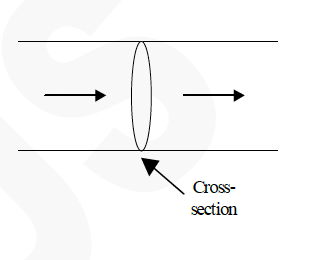
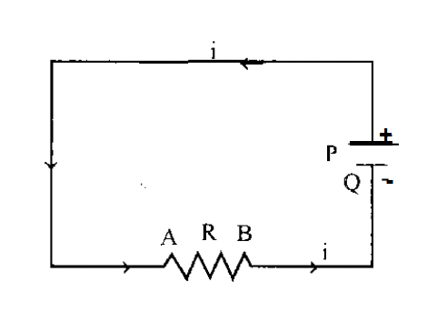
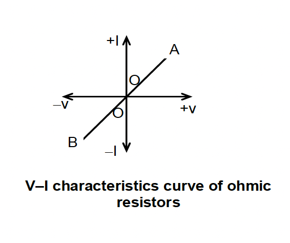

CURRENT ELECTRICITY

Introduction
Once upon a time food clothing and shelter, these were the essentials of a common man, but for a $21^{\text {st }}$ century common man it is food, clothing, shelter and electricity. To know the importance of it just imagine the world without electricity for a day. It has become an innate part of our lives . From father's shaver, mother's mixer grinder, sisters idiot box, brother's video game to grandma's hearing aid. electricity has become a part of human existence. it is even the reason behind the pumping of heart and the infinite intelligence of human brain. hence in this chapter we will discuss the properties of electric current.

Electric current
Flow of electric charge constitutes electric current. For a given conductor, if ' $Q$ ' charge flows through a cross-section of area A in time ' $t$ ', then the average electric current through the conductor is given as
$\mathrm{I}=\frac{\Delta Q}{\Delta t}$

Current is assumed to be a fundamental quantity. The conventional direction of current is taken to be the direction of flow of positive charge or is in the direction opposite to the direction of flow of free electrons. It is not a vector quantity because it does not obey the law of vector addition.

- The SI unit of current is ampere (A)
- A conductor remains uncharged when current flows through it.
- For a given conductor current does not vary as its cross - sectional area varies.
- When 1 A current flows through a conductor then $6.24 \times 10^{18}$ electrons flow per second.
- For a given conductor current does not change with change in cross-sectional area. In the following figure $i_1=i_2=i_3$

Journey of a Typical Electron
Current due to translatory motion of charge : If $n$ particle each having a charge $q$, pass through a given area in time t then $i=\frac{n q}{t}$

If n particles each having a charge q pass per second per unit area, the current associated with cross-sectional area A is $i=n q A$

If there are n particle per unit volume each having a charge q and moving with velocity v , the current thorough, cross section A is $i=n q v A$

| Statement | True or False? |
| :--- | :--- |
| a. When an electrochemical cell no longer works, it is out of charge and must be recharged before it can be used again. | T or F |
| b. An electrochemical cell can be a source of charge in a circuit. The charge that flows through the circuit originates in the cell. | T or F |
| c. Charge becomes used up as it flows through a circuit. The amount of charge that exits a light bulb is less than the amount that enters the light bulb. | T or F |
| d. Charge flows through circuits at very high speeds. This explains why the light bulb turns on immediately after the wall switch is flipped. | T or F |
| e. The local electrical utility company supplies millions and millions of electrons to our homes everyday. | T or F |

To maintain a steady current through $\mathrm{AB}, \mathrm{A}$ should be kept at a constant high potential and B at a constant lower potential. For this purpose, we connect A to the positive terminal P of the cell and B to the negative terminal $Q$ of the cell as shown in the figure.

Through chemical action, the cell always maintains $P$ at a constant positive potential and $Q$ at a constant negative potential.

In the external circuit, current (+ve charge) flows from $P$ to $Q$ via the conductor $A B$. But, inside the cell, the same positive charge has to move from a lower potential to a higher potential. To do this, the cell must be able to do work on the charge. The energy to do this work is derived from the chemical process inside the cell.

The influence that makes the charge move from a lower potential to a higher potential is called the electromotive force and is denoted by $\varepsilon$.

The emf of a cell is defined as the work done in carrying a unit positive charge through the complete circuit including the charge flow inside the cell. The emf is measured in the units of Joule/Coulomb
(JC-1). The unit has a special name 'Volt'. Thus emf has the same units as that of potential difference.

Ohm's Law
It states that "the potential difference across a conductor is directly proportional to the current flowing through it at a given temperature".

At constant temperature $\frac{V}{I}=\operatorname{constant}(\mathrm{R})$ the constant ' R ' is called resistance of the conductor.
Limitations of Ohm's Law
Ohm's Law is just an empirical relationship. It is not a fundamental physical principle and does not specify any general property of matter. In case of electrolytes, another essential condition required for application of Ohm's Law is that the physical state (electrolyte concentration) must remain the same. But, Ohm's Laws is obeyed fairly well by most of the metallic conductors. Ohm's law is valid for metallic conductors in which $\frac{V}{I}$ have a constant value irrespective of the magnitudes of V and I . But, even when $\frac{V}{I}$ is not a constant, we can still define the resistance ' R ' as $R=\frac{V}{I}$ at every potential difference ' V ' applied.

Ohmic and Non-ohmic resistances (devices)
Ohm's Law is not universal (i.e. all conductors do not obey Ohm's law). Conductor obeying Ohm's law are called Ohmic conductors. However, resistance is always defined as the ratio V/I. A metallic conductor at a constant temperature is an Ohmic resistance. For such Ohmic resistances, the V-I characteristic curve will be a straight line passing through the origin as shown in the figure.

V-I characteristics curve of ohmic resistors.

In Ohmic resistance, current is reversed in direction when the P.D. is reversed, but the magnitude of current remain the same.

An electrolyte such as copper sulphate solution with copper electrodes, also obeys Ohms Law.

There are many resistances that do not obey Ohm's law These are called non-Ohmic resistances. For these resistances, the V - I characteristic curve will not be linear. The functioning of modern electronic devices is mainly based on these non-Ohmic resistances (devices).

A good number of commonly used non-ohmic resistances deviate from Ohm's law in the following manners.

1. ' $V$ ' depends on I in a non-linear fashion*

The V-I graph is not a straight line. Such type of behaviour is found in a vacuum tube as shown in the figure.

Characteristics curve of a vacuum tube (non-ohmic)

2. ' I ' depends on the sign of V

For the same magnitude of V , if it is applied in an opposite direction, the value of V will be quite different.

The behaviour is found in p-n junction diode rectifier as shown in the figure. A sizeable current flows for a smaller positive ' $V$ ' but hardly any current flows
for the same value of negative ' $V$.

3. The relation between ' $V$ ' and ' $I$ ' is not a unique relation.

For the same value of ' V ' there can be more than one value for ' $I$ '. Such behaviour is shown by a thermistor as shown in the figure.

Neon gas bulb, electrolyte dilute sulphuric acid with tungsten electrodes are some other examples for non-

Characteristics curve of a Thermistor (non-ohmic)
Ohmic devices.

Resistivity ( $\rho$ ) and conductivity ( $\sigma$ ):
The resistance $R$ of a given conductor depends upon its length $(\ell)$ and cross-sectional area (A) such that $\mathrm{R}=\rho \frac{\ell}{A}$, where $\rho=$ resistivity of the material of the given conductor. Its S.I. unit is $\Omega \mathrm{m}$. Reciprocal of resistivity is called the electrical conductivity $(\sigma)$ of the material, thus $\sigma=\frac{1}{\rho}= \frac{\ell}{R A}$ whereas reciprocal of resistance is called conductance of the given conductor. S.I. unit of conductivity $\sigma$ is $(\Omega-\mathrm{m})^{-1}$ and is usually written as $\mathrm{mho} / \mathrm{m}$.

Example-5
How long a piece of aluminium wire 1 mm in diameter is needed to give a resistance of $4 \Omega$ ? (assume temperature $t=20^{\circ} \mathrm{C}$ ).

Solution

$
\mathrm{R}=\rho\left(\frac{L}{A}\right) .
$

We have $\rho$ for aluminium $=2.8 \times 10^{-8} \Omega \mathrm{~m}$.
The cross-sectional area A is $\pi \mathrm{r}^2=3.14\left(0.5 \times 10^{-3} \mathrm{~m}\right)^2=7.85 \times 10^{-7} \mathrm{~m}^2$.
Then $4 \Omega=\left[\left(2.8 \times 10^{-8} \Omega \mathrm{~m}\right) \mathrm{L}\right] /\left(7.85 \times 10^{-7} \mathrm{~m}^2\right)$ and solving we get $\mathrm{L}=112 \mathrm{~m}$.
Example-6
Compute the resistance of 180 m of silver wire having a cross section of $0.3 \mathrm{~mm}^2$. (Assume that temperature $\mathrm{t}=20^{\circ} \mathrm{C}$ ).

Solution
Resistance is given by $R=\rho(L / A)$.
we have $\rho$ for silver at $20^{\circ} \mathrm{C}=1.6 \times 10^{-8} \Omega \mathrm{~m}$.
Then $\mathrm{R}=\left(1.6 \times 10^{-8} \Omega \mathrm{~m}\right)(180 \mathrm{~m}) /\left(0.3 \times 10^{-6} \mathrm{~m}^2\right)=9.6 \Omega$.
Example-7
A 20 cm long copper tube has an inner diameter of 0.85 cm and an outer diameter of 1.10 cm . Find its electric resistance when used lengthwise.

Solution

$
\mathrm{R}=\rho\left(\frac{L}{A}\right) .
$

The cross-sectional area is $\left.\left.\pi\left[1.10^2-0.85^2\right)\right] /\left(4 \times 10^4\right)\right]=3.83 \times 10^{-5} \mathrm{~m}^2$;
Then with $\mathrm{L}=0.20 \mathrm{~m}$
and $\rho$ for copper $=1.7 \times 10^{-8}(\Omega-\mathrm{m})$

$
\mathrm{R}=89 \mu \Omega .
$

Temperature Dependence of Resistivity:
The conductivity of a metal decreases as its temperature is increased. Thus resistivity $\rho$ increases with the rise in temperature. If $\rho_{\mathrm{T}}$ and $\rho_0$ represent the resistivities at temperatures T and $\mathrm{T}_0$ respectively, then for small temperature variations, $\rho_{\mathrm{T}}=\rho_0\left[1+\alpha\left(T-T_0\right)\right]$

Where $\alpha$ is called the temperature coefficient of resistivity. The resistivity varies over a very wide range. For metals (good conductor) $\rho \approx 10^{-8} \Omega-\mathrm{m}$ and for insulators $\rho \approx 10^{17} \Omega-\mathrm{m}$.

Semiconductors (silicon, germanium ) have intermediate value much smaller than insulator but much larger than metals. Temperature coefficient of resistivity is negative for semiconductors and positive for the metals. For superconductors resistivity is zero.

Example-8
A coil of wire has a resistance of $25.00 \Omega$ at $20^{\circ} \mathrm{C}$ and a resistance of $25.17 \Omega$ at $35^{\circ} \mathrm{C}$. what is its temperature coefficient of resistance?

Solution
$\mathrm{R}=\mathrm{R}_0\left[1+\alpha\left(\mathrm{T}-\mathrm{T}_0\right)\right]$,
or $\quad \alpha=\frac{\Delta R}{R_0 \Delta T}$,
with $\quad \Delta \mathrm{R}=\mathrm{R}-\mathrm{R}_0=0.17 \Omega$
and $\quad \Delta \mathrm{T}=\mathrm{T}-\mathrm{T}_0=15^{\circ} \mathrm{C}$.
Then $\alpha=\frac{0.17}{25.00 \times 15}=4.5 \times 10^{-4}{ }^{\circ} \mathrm{C}^{-1}$.
Example-9
It is desired to make a $20.0 \Omega$ coil of wire which has a zero thermal coefficient of resistance. To do this, a carbon resistor of resistance $R_1$ is placed in series with an iron resistor of resistance $R_2$. The proportions of iron and carbon are so chosen that $R_1+R_2=20.00 \Omega$ for all temperatures near $20^{\circ} \mathrm{C}$. How large are $\mathrm{R}_1$ and $\mathrm{R}_2$ ?

Solution
We need $R_1\left(1+\alpha_1 \Delta t\right)+R_2\left(1+\alpha_2 \Delta t\right)=20$
Because $\mathrm{R}_1+\mathrm{R}_2=20$ when $\Delta \mathrm{t}=0$,
we must have $R_1 \alpha_1=-R_2 \alpha_2$
with $\alpha_1=-0.5 \times 10^{-3}$ and $\alpha_2=5 \times 10^{-3}$.
Solving the two equations $R_1+R_2=20$
and $R_1=10 R_2$ simultaneously leads to $R_1=18.18$ and $R_2=1.82 \Omega$

Open circuit records E.M.F

Closed circuit record P.D. at the ends of resistor

The figure shows a cell in open circuit, such that voltmeter is connected in parallel to the terminals of a cell. As the voltmeter is an extremely high resistance instrument, therefore the current flowing in external circuit is practically negligible. At this moment the difference of electrical potential recorded between the terminals of cell is called electromotive force.

The total electrical difference in potential between the terminals of a cell, when it is not doing any external work is called electromotive force (e.m.f). It is denoted by the letter E.

Relation between E.M.F. Potential Difference, Internal Resistance and External Resistance:
Consider a cell of e.m.f. E, and internal resistance r , connected in series to a resistor of resistance $R$, such that $I$ is the current flowing through it, when $V$ is the potential difference at its ends.

Applying, Ohm's law to the external circuit, including the cell

$
\mathrm{I}=\frac{V}{R}
$

Applying, Ohm's law to the complete circuit, including the cell

$
\mathrm{I}=\frac{E}{R+r}
$

Comparing (i) and (ii)

$
\begin{array}{ll} 
& \frac{V}{R}=\frac{E}{R+r} \newline
\therefore & \mathrm{VR}+\mathrm{Vr}=\mathrm{ER} \newline
\text { or } & \mathrm{Vr}=\mathrm{ER}-\mathrm{VR} \newline
\text { or } & \mathrm{r}=\frac{R(E-V)}{V}
\end{array}
$

From equations (i) and (ii)

$
\mathrm{R}=\frac{1}{I}(E-V)\left\{\because \frac{1}{I}=\frac{R}{V}\right\}
$

Grouping of Resistances
Resistance in series
Let the equivalent resistance between A \& B equals $\mathrm{R}_{\mathrm{eq}}$, by definition.

$
\begin{aligned}
& \mathrm{R}_{\mathrm{eq}}=\frac{V}{I} \newline
& \mathrm{~V}=\mathrm{IR}_1+\mathrm{IR}_2+\mathrm{IR}_3
\end{aligned}
$

From (1) and (2)

$
\mathrm{R}_{\mathrm{eq}}=\mathrm{R}_1+\mathrm{R}_2+\mathrm{R}_3
$

Resistance in parallel

Here again, $\mathrm{R}_{\mathrm{eq}}=\frac{V}{I}$

$
\mathrm{I}=\mathrm{i}_1+\mathrm{i}_2+\mathrm{i}_3=\frac{V}{R_1}+\frac{V}{R_2}+\frac{V}{R_3} \ldots
$

From (1) and (2)

$
\frac{1}{R_{e q}}=\frac{1}{R_1}+\frac{1}{R_2}+\frac{1}{R_3}
$

Example-10
What is the resistance between A and B in figure.
Solution
for the two resistors in parallel,

$
\frac{1}{R}=\frac{1}{3}+\frac{1}{6}=\frac{2}{6}+\frac{1}{6}=\frac{3}{6} \quad \text { or } R=2 \Omega
$

this is in series with $8 \Omega$, so

$
\mathrm{R}_{\mathrm{AB}}=2 \Omega+8 \Omega=10 \Omega
$

Example-11
Three resistances of 12, 16 and $20 \Omega$ are connected in parallel. What resistance must be connected in series with this combination to give a total resistance of $25 \Omega$ ?

Solution
The resistance $R$ of the parallel combination is given by

$
\begin{aligned}
& \frac{1}{R}=\frac{1}{R_1}+\frac{1}{R_2}+\frac{1}{R_3}=\frac{1}{12}+\frac{1}{16}+\frac{1}{20}=\frac{20}{240}+\frac{15}{240}+\frac{12}{240}=\frac{47}{240} \newline
& \text { or } \quad R=5.11 \Omega \newline
& \text { then } \quad R_x+R=25 \quad \text { or } \quad R_x=25-5.11=19.89 \Omega
\end{aligned}
$

Example-12
In figure, find the resistance from point $A$ to point $B$.
Solution
There are two parallel branches, each of resistance $3(20)=60 \Omega$.

$
\text { Thus, } \frac{1}{R}=\frac{1}{60}+\frac{1}{60}=\frac{2}{60} \text { and } \mathrm{R}=30 \Omega \text {. }
$

Kirchhoff's Laws
(i) Junction Law

It is based on the law of conservation of charge. At a junction in a circuit the total incoming current is equal to the total outgoing current. In other words the algebraic sum of the currents at a junction is zero. A junction in a circuit is neither sink nor source of charge.

(ii) Loop Law

It is based on the law of conservation of energy. The algebraic sum of the potential drop around any closed path is zero.

In case of a resistor of resistance ' R ' potential will decrease in the direction of current. Hence, for the shown conductor potential drop across a resistance is I.R. $\mathrm{v}_{\mathrm{B}}-\mathrm{v}_{\mathrm{A}}=-\mathrm{IR}$

For an emf source, the potential changes will be obtained as illustrated below,

Emf $=\varepsilon$, internal resistance $=\mathbf{r}$

$
\mathbf{v}_{\mathbf{B}}-\mathbf{v}_{\mathbf{A}}=-\varepsilon-\mathbf{i r}
$

Emf $=\square \varepsilon$, internal resistance $=\mathbf{r}$

$
\mathbf{v}_{\mathbf{B}}-\mathbf{v}_{\mathbf{A}}=\varepsilon-\mathbf{i r}
$

## TODO
Example 13,14,15,16,17

Wheatstone Bridge.  
For a certain adjustment of $\mathrm{Q}, \mathrm{V}_{\mathrm{BD}}=0$, then no current flows through the galvanometer.

$
\Rightarrow V_B=V_D \text { or } V_{A B}=V_{A D} \Rightarrow I_1 \cdot P=I_2 \cdot R
$

Likewise, $\mathrm{V}_{\mathrm{BC}}=\mathrm{V}_{\mathrm{DC}} \Rightarrow \mathrm{I}_1 \cdot \mathrm{Q}=\mathrm{I}_2 \cdot \mathrm{~S}$

Dividing, we get, $\frac{P}{Q}=\frac{R}{S}$

Energy, Power and Heating Effect
When a current I flows for time $t$ from a source of $\operatorname{emf} E$, then the amount of charge that flows in time t is $\mathrm{Q}=\mathrm{It}$.

Electrical energy delivered $\mathrm{W}=\mathrm{Q} . \mathrm{V}=$ VIt
Thus, Power given to the circuit, $=W / t=V I$ or $V^2 / R$ or $I^2 R$
In the circuit
E. $I=I^2 R+I^2 r$, where EI is the rate at which chemical energy is converted to electrical energy, I 2 R is power supplied to the external resistance $R$ and $\mathrm{I}_2 r$ is the power dissipated in the
internal resistance of the battery.

An electrical current flowing through conductor produces heat in it. This is known as Joule's effect. The heat developed is given by
$\mathrm{H}=\mathrm{I}^2$.R.t joule,
where $I=$ current in ampere,$R=$ resistance in $\Omega, t=$ time in second.
Maximum Power Theorem

In a circuit, for what value of the external resistance the maximum power be drawn from a battery? For the shown network power developed in resistance $R$ equals

$
P=\frac{E^2 \cdot R}{(R+r)^2}\left(\because \mathrm{I}=\frac{E}{R+r} \text { and } \mathrm{P}=\mathrm{I}^2 \mathrm{R}\right)
$

$\Rightarrow \quad$ The power output is maximum, when the external resistance equals the internal resistance.

$
\mathrm{R}=\mathrm{r}
$

## TODO
Example 8

## TODO Assignment
