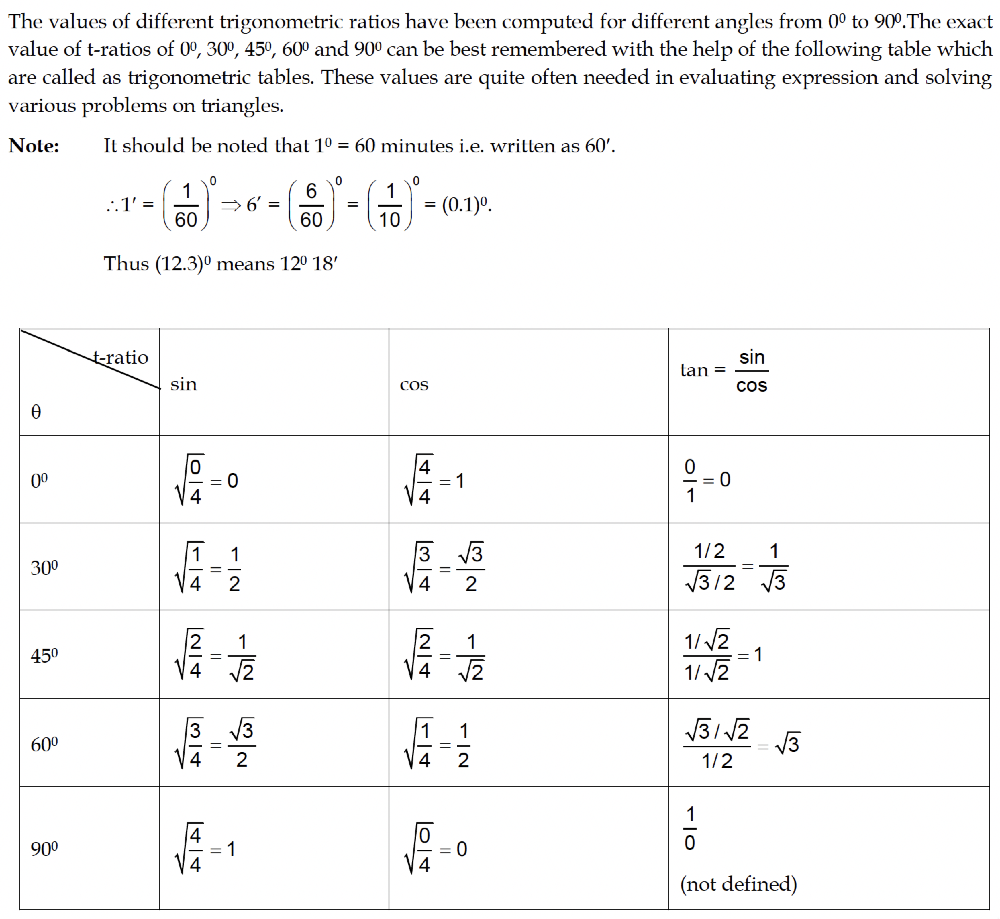

TRIGONOMETRY

C1 INTRODUCTION
Angle Measurement system
In the Sexagesimal system of measurement of a right angle is divided in to 90 equal parts called degrees.
Each degree is divided into 60 equal parts called minutes, and each minute into 60 equal parts called seconds.
Thus 60 seconds ( $60^{\prime \prime}$ ) make one minute ( $1^{\prime}$ )
60 minutes $\left(60^{\circ}\right)$ make one degree $\left(1^{\circ}\right)$
90 degrees $\left(90^{\circ}\right)$ make one right angle
On this account another system of measurement called the centesimal or French system has been proposed. In this system the right angle is divided into 100 equal parts called grades; each grade is subdivided into 100 minutes and each minute into 100 seconds.

Thus, 100 seconds ( $100^{\prime \prime}$ ) make 1 minute ( $1^{\prime}$ )
100 minutes (100') make one grade
100 grades make one right angle

To convert Sexagesimal to Centesimal measure and viceversa
Since, a right angle is equal to $90^{\circ}$ and also to 100 g , we have $90^{\circ}=100 \mathrm{~g}$

$$
\begin{aligned}
1^{\circ} & =\frac{10^g}{9} \\
1^g & =\frac{9}{10} \text { degrees. }
\end{aligned}
$$

Example: $54^{\circ}=54 \times \frac{10}{9}$ grade $=60^{\mathrm{g}}$ and $70^{\mathrm{g}}=70 \times \frac{9}{10}=63^{\circ}$

Circular measure:
Radian: An angle substended by an arc of length equal to the radius of the circle at the centre.
- To convert circular measure into sexagesimal measure or centesimal measure and viceversa

Two right angles $=180^{\circ}=200^{\mathrm{g}}=\pi$ radians

$$
1 \text { radian }=\frac{180}{\pi}=57^{\circ} 16^{\prime}
$$

Also 1 degree $=\frac{\pi}{180}$ radians $=0.001746$ radians (approximately)

Circular measure:

Radian: An angle substended by an arc of length equal to the radius of the circle at the centre.
- To convert circular measure into sexagesimal measure or centesimal measure and viceversa

Two right angles $=180^{\circ}=200^{\mathrm{g}}=\pi$ radians

$$
1 \text { radian }=\frac{180}{\pi}=57^{\circ} 16^{\prime}
$$

Also 1 degree $=\frac{\pi}{180}$ radians $=0.001746$ radians (approximately)

