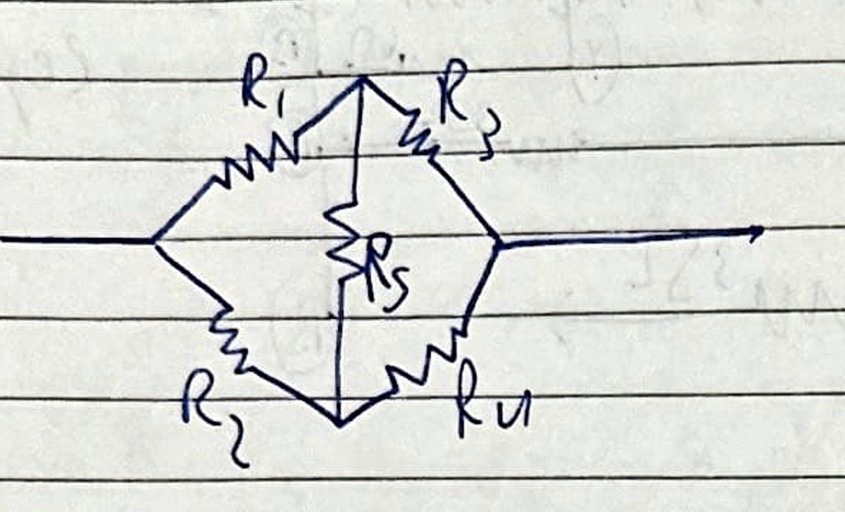
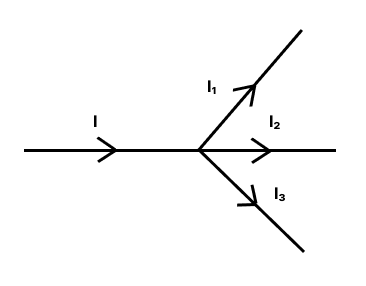
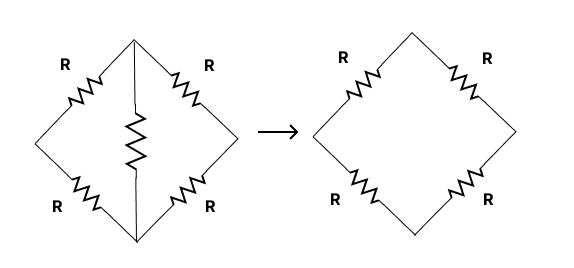
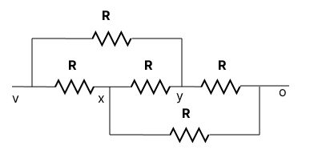
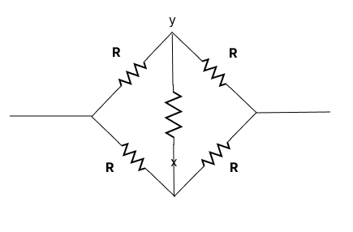
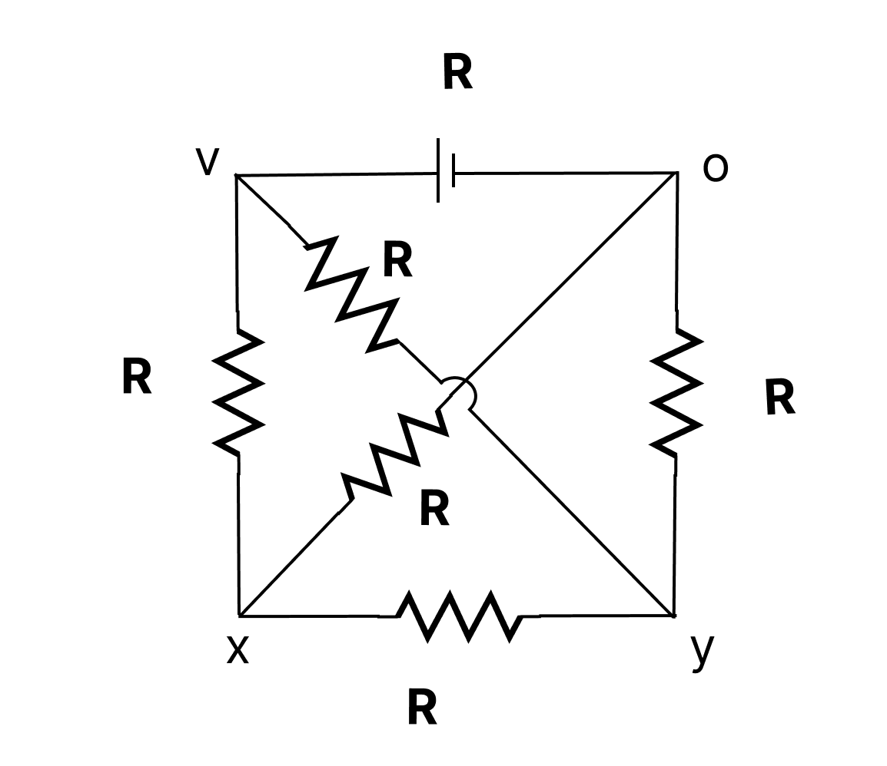

# Wheatstone Bridge

Condition for Balanced Wheatstore

$
\frac{R_1}{R_2}=\frac{R_1}{R_4}
$

## KCL : kirchoff's law

### Kirchhoff's Current Law (KCL)

**Statement:**
The sum of all currents entering a node is equal to the sum of all currents leaving the node. Alternatively, the algebraic sum of all currents entering and leaving a node is zero.

$\sum_{\mathrm{k}=1}^{\mathrm{n}} \mathrm{I}_{\mathrm{k}}=0$

$\sum_{\mathrm{loop}}\mathrm{V}=0$

**Analogy:**
Imagine water flowing into a pipe and then splitting to flow out through other pipes. The total amount of water flowing into the junction point must precisely equal the total amount of water flowing out. Similarly, the electric current flowing into an electrical junction (node) must equal the current flowing out.

**Application:**
KCL is a fundamental principle used extensively to analyze parallel circuits and more intricate electrical networks where currents divide and merge at various connection points (nodes).

**Example:**
Consider a simple electrical circuit where three branches converge at a single node. If the first two branches carry currents of 2 Amperes (A) and 3 Amperes (A) **entering** that node, then to satisfy Kirchhoff's Current Law, the third branch *must* have a current of 5 Amperes (A) **leaving** the node.

Examples

$\begin{aligned} A= & \Theta\left(I_1+I_3+I_3\right)+I \\ = & I-I_1-I_2-I_3=0 \newline \quad \sum_{Node}(I)=\end{aligned}$

## KVL (Voltage law)

$
\sum_{loop} V=0
$

**Question 1**

Ans = R

**Question 2**

This can be represented as -

$\begin{aligned} \frac{1}{R_{\text {eq }}} & =\frac{1}{2 R}+\frac{1}{2 R} \\ & =\frac{1}{R_{\text {eq }}}=\frac{1}{R} \\ \therefore R_{\text {eq }} & =R\end{aligned}$

**Question 3**

$\begin{aligned} \text { KCL: } i & =i_1+12 \\ \frac{x-30}{2} & =\frac{x-0}{5}+\frac{x-10}{10} \\ 15-\frac{x}{2} & =\frac{x}{5}+\frac{x}{10} \\ 15 & =\frac{51+2 x+1}{10} \\ 15 & =\frac{4 x}{5} \quad\end{aligned}$

$ x = \frac{75}{4}$

