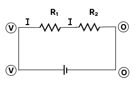

# Series

$
\begin{aligned} & v_1=I R_1 \textbf
{ .... }(1) \newline 
& v_2=1 R_2 \textbf{ .... }(2) \newline
& v_1+v_2=I\left(R_1+R_2\right) \newline & v=I\left(R_1+R_2\right) \newline & R=\frac{v}{I}=R_1+R_2\end{aligned}
$

