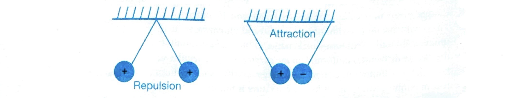
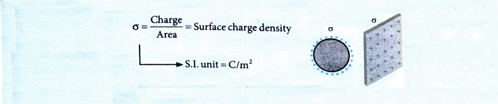

**OVERVIEW**

The text explains that **charge** is the foundation of all electrical phenomena, measured in **Coulombs (C)**. Matter consists of protons (positive charge: $+1.6 \times 10^{-19} \mathrm{C}$), electrons (equal negative charge: $-1.6 \times 10^{-19} \mathrm{C}$), and neutral neutrons.

Normally, bodies are neutral with equal protons and electrons. An imbalance, created by transferring electrons (like rubbing a glass rod with silk), results in a body becoming **positively charged** (losing electrons) or **negatively charged** (gaining electrons).

These charges exert forces: **like charges repel** and **unlike charges attract**.

An **electric current** is defined as the directional flow of charged particles, such as electrons. This flow requires a **potential difference**. Examples of electricity mentioned include natural phenomena like lightning, static shocks, and the electrical signals in the heart measured by an ECG machine.

## 1. ELECTRIC CHARGE**

* **Definition:** Charge is a fundamental property of matter that causes it to produce and experience electrical and magnetic effects.
* **Two Types:**
    * **Positive Charge:** Occurs when an object has **more protons than electrons** (e.g., by losing electrons).
    * **Negative Charge:** Occurs when an object has **more electrons than protons** (e.g., by gaining electrons).

### 1.1 Properties of Electric Charge

Charged particles can be created by disturbing the neutrality of an atom. Loss of electrons gives a positive darge (since $n_p > n_e$ ) to a particle. During charging, mass of the body changes as shown below:

Charges with the same electrical sign repel each other, and charges with opposite electrical signs attract each other.

A charged body may attract a neutral body or a positively charged body, but it always repels the body having similar charges. Hence, repulsion is the surest test of electrification.

* **Quantization of charge:** If the charge of an electron ($e=1.6 \times 10^{-19} \mathrm{C}$) is taken as elementary unit, i.e., quanta of charge, then charge on any body will be some integral multiple of $e$, i.e., $Q= \pm n e$, where $n=1,2$, $3, \ldots$ (natural numbers). This is because the body can acquire charge by gaining or losing electrons only.
* **Transferable:** It can be transferred from one body to another.
* **Associated with mass:** Charge cannot exist without mass; however, mass can exist without charge.
* **Conserved:** Charge can neither be created nor be destroyed (law of conservation of charge).
* **Invariant:** Charge is independent of velocity of charged particle.
* Electric charge produces electric field $(\vec{E})$, magnetic field $(\vec{B})$, and electromagnetic radiations.

**Unit and Dimensional Formula**
* The SI unit of charge $=$ ampere $\times s=$ coulomb $(\mathrm{C})$
* Smaller unit is $\mu \mathrm{C}$ (microcoulomb), $1 \mu \mathrm{C}=10^{-6} \mathrm{C}$
* The CGS unit of charge is statcoulomb or electrostatic unit (esu)
$
{ }^1 \mathrm{C}=3 \times 10^9 \text { stat coulomb }=\frac{1}{10} \mathrm{ab} \text { coulomb (absolute coulomb; } \mathrm{abC} \text { ) }
$
* Electromagnetic unit $(\mathrm{emu})$ of charge $=\mathrm{abC}$
$
{ }^1 \mathrm{abC}=10 \mathrm{C}
$

Here is the formatted overview of the text provided.

### 1.2 Point Charge

A **point charge** is an idealized model where a charged object is treated as if its entire charge is concentrated at a single point, with no physical dimensions.

This model can be used for real objects under specific conditions:

* **Large Separation:** When the distance *between* charged objects is significantly larger than their individual sizes, their dimensions become negligible, and they can be treated as point charges.
* **Symmetrical Objects:** A finite-sized body, like an **isolated charged sphere**, behaves like a point charge. Due to its uniform symmetry, it produces an electric field outside its surface that is identical to the field that would be created by a single point charge (with the same total charge) located at the sphere's center.
    * This is true both at a **very large distance** and at points **very close to its surface** (as long as they are outside the sphere).
    * This behavior is a key consequence of Gauss's Law and results in the electric field following an **inverse-square law** ($E \propto 1/r^2$), just like a point charge.

Understood. Here is the content formatted purely in Markdown.

### 1.3 Charge on a Conductor

Charge given to a conductor always resides on its **outer surface**. This is why the outer radius of both a solid and a hollow conducting sphere will hold maximum equal charge.

If the surface is uniform, the charge distributes uniformly on the surface; for an irregular surface, the distribution of charge, i.e., **charge density, is not uniform**.

It is maximum where the radius of curvature is minimum and vice versa, i.e., $\sigma \propto (1/R)$. This is why charge leaks from sharp points.

-----

### 1.4 Charge Distribution

Charge distribution can be classified as either continuous or discrete.

#### (i) Discrete distribution of charge:

A system consisting of ultimate individual charges.

#### (ii) Continuous distribution of charge:

An amount of charge distributed uniformly or non-uniformly over a body. It is of following three types.

**(a) Linear charge distribution:**
Charge distributed evenly/unevenly along a line. For example, charge on a straight wire, charged circular ring, etc. It is denoted by lambda ($\lambda$).

  * **Formula:** $\lambda = \frac{\text{Charge}}{\text{Length}} = \text{Linear charge density}$
  * **S.I. unit:** $\text{C/m}$

**(b) Surface charge distribution:**
Charge distributed over a surface. For example, plane sheet of charge, surface conducting sphere, outer and inner surface conducting cylinder, etc. It is denoted by sigma ($\sigma$).

  * **Formula:** $\sigma = \frac{\text{Charge}}{\text{Area}} = \text{Surface charge density}$
  * **S.I. unit:** $\text{C/m}^2$

**(c) Volume charge density:**
Charge distributed throughout the volume of the body. For example, charge on a dielectric sphere, etc. It is denoted by rho ($\rho$).

  * **Formula:** $\rho = \frac{\text{Charge}}{\text{Volume}} = \text{Volume charge density}$
  * **S.I. unit:** $\text{C/m}^3$

Here is the formatted text.

### 2. COULOMB'S LAW

**Coulomb's Law:** The force between two point charges is directly proportional to the product of two charges and inversely proportional to the square of the distance between them.

[Image of Coulomb's Law diagram showing two charges and the force vector]

If two point charges $q_1$ and $q_2$ are separated by a distance $r$ in medium, the magnitude of the force between them is given by:

$
F \propto q_1 q_2
$
$
F \propto \frac{1}{r^2}
$
$
F=\frac{k\left|q_1 q_2\right|}{\varepsilon_r r^2}
$
$
F=\frac{1}{4 \pi \varepsilon_0 \varepsilon_r} \frac{\left|q_1 q_2\right|}{r^2}
$

Where $\varepsilon_0$ is called the permittivity of free space.
$
\varepsilon_0= 8.854 \times 10^{-12} \mathrm{C}^2 \mathrm{~N}^{-1} \mathrm{~m}^{-2}
$
$
k=\frac{1}{4 \pi \varepsilon_0}=9 \times 10^9 \mathrm{Nm}^2 / \mathrm{C}^2
$

and Where $k$ is the constant of proportionality and has a value of $9 \times 10^9 \mathrm{Nm}^2 / \mathrm{C}^2$ (in vacuum).

$\varepsilon_r = \text{Dielectric constant of medium}$

(i) This force is directed along the line joining the two charges.

(ii) For like charges, it is repulsive (positive in sign); for unlike charges, it is attractive (negative in sign).

[Image of electrostatic attraction and repulsion]

(iii) Coulomb's force is analogous to the gravitational force. Both forces vary inversely as the square of the distance between two particles.

---

### Example 1

From the given set of charges, which charge(s) is/are not possible?
(a) $0.8 \times 10^{-16} \mathrm{C}$
(b) $3.2 \times 10^{-20} \mathrm{C}$

### Solution

(a) $0.8 \times 10^{-16} \mathrm{C}$

By $Q = ne$

$n$ must be integer, $n = 500$

$
\begin{aligned}
& 0.8 \times 10^{-16}=n\left(1.6 \times 10^{-19}\right) \\
& n=500
\end{aligned}
$

500 is an integer; so, it is possible.

(b) $3.2 \times 10^{-20} \mathrm{C}$, By $Q = ne$

$
\begin{aligned}
& 3.2 \times 10^{-20}=n\left(1.6 \times 10^{-19}\right) \\
& \therefore n=\frac{1}{5}
\end{aligned}
$

$\frac{1}{5}$ is a fraction; so, it is not possible.

---

### Example 2

There are two charges $+1 \mu \mathrm{C}$ and $+5 \mu \mathrm{C}$ separated by some distance. The ratio of the forces acting on them be.  
(1) $1: 5$
(2) $1: 1$
(3) $5: 1$
(4) $1: 25$

**Solution (2)**
Same force will act on both bodies, although their directions will be different.

---

### Example 3

According to Coulomb's law, which of the following is correct for the attraction?   
(1) $q_1 q_2<0$
(2) $q_1 q_2>0$
(3) $q_1 q_2=0$
(4) $q_1 q_2>100 \mathrm{C}$

**Solution (1)**
For attraction, one charge should be positive, and other should be negative.
So, their product of magnitude is negative.

---

### Example 4

A charge $q$ is placed at the centre of the line joining two equal charges $Q$, the system of the three charges w be in equilibrium, if $q$ is equal to  
(1) $\frac{-Q}{2}$  
(2) $\frac{-Q}{4}$  
(3) $\frac{+Q}{4}$  
(4) $\frac{+Q}{2}$  

**Solution (2)**

For equilibrium, net force on $q$, $Q$, and $Q$ should be zero.

$
\left(F_{\mathrm{C}}\right)_{\text {net}}=0 \Rightarrow \frac{k Q Q}{(2 x)^2}+\frac{k Q q}{x^2}=0
$
$
\Rightarrow \frac{Q}{4}+q=0 \Rightarrow q=\frac{-Q}{4}
$

---

### Example 5

Two point charges $+3 \mu \mathrm{C}$ and $+8 \mu \mathrm{C}$ repel each other with a force of 40 N. If a charge of $-5 \mu \mathrm{C}$ is added to each of them, then force between them will become \_\_\_\_.

**Solution**
Redistribution of charges takes place.
Initially, $q_1=3 \mu \mathrm{C}$ and Charge $q_2=8 \mu \mathrm{C}$
$
40=\frac{1}{4 \pi \varepsilon_0} \cdot \frac{3 \times 8}{r^2}
$
When third charge $q_3=-5 \mu \mathrm{C}$ is added to each, then new charges on $q_1$ and $q_2$ will be
$
q_1=3-5=-2 \mu \mathrm{C}
$
and
$
q_2=8-5=3 \mu \mathrm{C}
$
Finally, $F=\frac{1}{4 \pi \varepsilon_0} \cdot \frac{-2 \times 3}{r^2}$
So, $\frac{F}{40}=\frac{-2 \times 3}{3 \times 8}$

$\Rightarrow F=-10 \mathrm{~N}$, -ve sign indicates attraction.

---

### 3. ELECTRIC FIELD

* **Electric field** due to a given charge is defined as the space around the charge in which electrostatic force of attraction or repulsion due to charge can be experienced by any other charge. If a test charge experiences no force at a point, the electric field at that point must be zero.
* **Electric field intensity** at any point is the strength of electric field at that point. It is defined as the force experienced by unit positive charge placed at that point.
* **Formula:** If $F$ is the force acting on a test charge $+q_0$ at any point, then electric field intensity at this point is given by $E=\frac{F}{q_0}$.
    

* Electric field is a vector quantity.
* **SI unit:** Since force is measured in newton (N) and charge is measured in coulomb (C), electric field intensity is measured in **newton per coulomb (N/C)**.