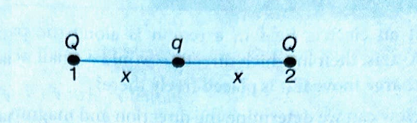

# 2. COULOMB'S LAW

**Coulomb's Law:** The force between two point charges is directly proportional to the product of two charges and inversely proportional to the square of the distance between them.

[Image of Coulomb's Law diagram showing two charges and the force vector]

If two point charges $q_1$ and $q_2$ are separated by a distance $r$ in medium, the magnitude of the force between them is given by:

$
F \propto q_1 q_2 \newline
$
$
F \propto \frac{1}{r^2} \newline
$
$
F=\frac{k\left|q_1 q_2\right|}{\varepsilon_r r^2} \newline
$
$
F=\frac{1}{4 \pi \varepsilon_0 \varepsilon_r} \frac{\left|q_1 q_2\right|}{r^2} \newline
$

Where $\varepsilon_0$ is called the permittivity of free space.
$
\varepsilon_0= 8.854 \times 10^{-12} \mathrm{C}^2 \mathrm{~N}^{-1} \mathrm{~m}^{-2} \newline
$
$
k=\frac{1}{4 \pi \varepsilon_0}=9 \times 10^9 \mathrm{Nm}^2 / \mathrm{C}^2 \newline
$

and Where $k$ is the constant of proportionality and has a value of $9 \times 10^9 \mathrm{Nm}^2 / \mathrm{C}^2$ (in vacuum).

$\varepsilon_r = \text{Dielectric constant of medium}$

(i) This force is directed along the line joining the two charges.

(ii) For like charges, it is repulsive (positive in sign); for unlike charges, it is attractive (negative in sign).

[Image of electrostatic attraction and repulsion]

(iii) Coulomb's force is analogous to the gravitational force. Both forces vary inversely as the square of the distance between two particles.

---

### Example 1

From the given set of charges, which charge(s) is/are not possible?
(a) $0.8 \times 10^{-16} \mathrm{C} \newline$
(b) $3.2 \times 10^{-20} \mathrm{C} \newline$

### Solution

(a) $0.8 \times 10^{-16} \mathrm{C}$

By $Q = ne$

$n$ must be integer, $n = 500$

$
\begin{aligned}
& 0.8 \times 10^{-16}=n\left(1.6 \times 10^{-19}\right) \\
& n=500
\end{aligned}
$

500 is an integer; so, it is possible.

(b) $3.2 \times 10^{-20} \mathrm{C}$, By $Q = ne$

$
\begin{aligned}
& 3.2 \times 10^{-20}=n\left(1.6 \times 10^{-19}\right) \newline
& \therefore n=\frac{1}{5}
\end{aligned} \newline
$

$\frac{1}{5}$ is a fraction; so, it is not possible.

---

### Example 2

There are two charges $+1 \mu \mathrm{C}$ and $+5 \mu \mathrm{C}$ separated by some distance. The ratio of the forces acting on them be.  
(1) $1: 5$
(2) $1: 1$
(3) $5: 1$
(4) $1: 25$

**Solution (2)**
Same force will act on both bodies, although their directions will be different.

---

### Example 3

According to Coulomb's law, which of the following is correct for the attraction?   
(1) $q_1 q_2<0$
(2) $q_1 q_2>0$
(3) $q_1 q_2=0$
(4) $q_1 q_2>100 \mathrm{C}$

**Solution (1)**
For attraction, one charge should be positive, and other should be negative.
So, their product of magnitude is negative.

---

### Example 4

A charge $q$ is placed at the centre of the line joining two equal charges $Q$, the system of the three charges w be in equilibrium, if $q$ is equal to  
(1) $\frac{-Q}{2}$  
(2) $\frac{-Q}{4}$  
(3) $\frac{+Q}{4}$  
(4) $\frac{+Q}{2}$  

**Solution (2)**

For equilibrium, net force on $q$, $Q$, and $Q$ should be zero.

$
\left(F_{\mathrm{C}}\right)_{\text {net}}=0 \Rightarrow \frac{k Q Q}{(2 x)^2}+\frac{k Q q}{x^2}=0 \newline
$

$
\Rightarrow \frac{Q}{4}+q=0 \Rightarrow q=\frac{-Q}{4} \newline
$

---

### Example 5

Two point charges $+3 \mu \mathrm{C}$ and $+8 \mu \mathrm{C}$ repel each other with a force of 40 N. If a charge of $-5 \mu \mathrm{C}$ is added to each of them, then force between them will become \_\_\_\_.

**Solution**
Redistribution of charges takes place.
Initially, $q_1=3 \mu \mathrm{C}$ and Charge $q_2=8 \mu \mathrm{C}$
$
40=\frac{1}{4 \pi \varepsilon_0} \cdot \frac{3 \times 8}{r^2}
$
When third charge $q_3=-5 \mu \mathrm{C}$ is added to each, then new charges on $q_1$ and $q_2$ will be
$
q_1=3-5=-2 \mu \mathrm{C} \newline
$
and
$
q_2=8-5=3 \mu \mathrm{C} \newline
$
Finally, $F=\frac{1}{4 \pi \varepsilon_0} \cdot \frac{-2 \times 3}{r^2} \newline $
So, $\frac{F}{40}=\frac{-2 \times 3}{3 \times 8} \newline $ 

$\Rightarrow F=-10 \mathrm{~N}\newline$ -ve sign indicates attraction.

---
