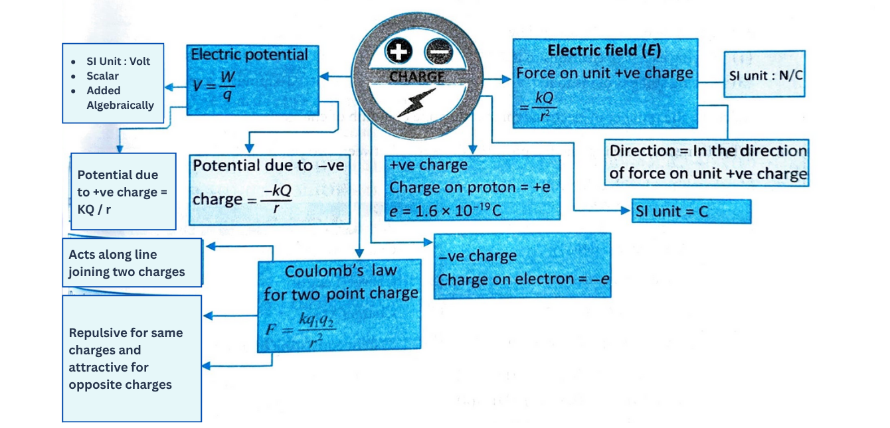

### 3. ELECTRIC FIELD

* **Electric field** due to a given charge is defined as the space around the charge in which electrostatic force of attraction or repulsion due to charge can be experienced by any other charge. If a test charge experiences no force at a point, the electric field at that point must be zero.
* **Electric field intensity** at any point is the strength of electric field at that point. It is defined as the force experienced by unit positive charge placed at that point.
* **Formula:** If $F$ is the force acting on a test charge $+q_0$ at any point, then electric field intensity at this point is given by $E=\frac{F}{q_0}$.
    

* Electric field is a vector quantity.
* **SI unit:** Since force is measured in newton (N) and charge is measured in coulomb (C), electric field intensity is measured in **newton per coulomb (N/C)**.

* Electric potential difference is a scalar quantity, and its SI unit is **volt (V)**, named after Alessandro Volta. [It represents the work done in moving a unit positive charge from one point to the other.] Thus,

    $1 \text { volt }=\frac{1 \text { joule }}{1 \text { coulomb }}$

---

### Example 6

The work done in moving a charge of 2 C across two points having a potential difference of 12 V is
(1) 42 J
(2) 24 J
(3) 12 J
(4) 20 J

**Solution (2)**
$\Delta V=\frac{W}{Q} \quad \Rightarrow \quad 12=\frac{W}{2} \quad \Rightarrow \quad W=24 \mathrm{~J}$

---

### Example 7

The potential at a point 0.1 m from an isolated point charge is +100 V. The nature of the point charge is
(1) Positive
(2) Negative
(3) Zero
(4) Either negative or zero

**Solution (1)**
Potential of positive charge is always positive.

---

### Example 8

If 50 J of work must be done to move an electric charge of 2 C from a point where potential is -10 V to another where potential is $V$ volt, then the value of $V$ is
(1) 5 V 
(2) -15 V
(3) +15 V
(4) +10 V

**Solution (3)**.  

$
W=50 \text{ J} \newline
Q=2 \mathrm{C} \newline
V_B-V_A=\frac{W}{Q} \Rightarrow V-(-10)=\frac{50}{2} \newline   
V+10=25 \quad \Rightarrow \quad V=15 \mathrm{~V} \newline 
$  

Here is that calculation converted into a single, aligned LaTeX block:

$
\begin{align*}
W &= 50 \text{ J} \\
Q &= 2 \mathrm{C} \\
V_B - V_A &= \frac{W}{Q} \Rightarrow V - (-10) = \frac{50}{2} \\
V + 10 &= 25 \quad \Rightarrow \quad V = 15 \mathrm{~V}
\end{align*}
$

### Example 9

...the same charge on each
(2) the same potential
(3) the same energy
(4) the same field on the surface

**Solution (2)**
...current flows from higher potential to lower potential.

---

**NCERT PLUS**

<h3>5.4 Electric Potential Energy</h3>

<h4>Definition and Key Concepts</h4>

<strong>Electric potential energy</strong> is the energy stored in a charged object due to its position in an electric field. It represents the <strong>work done</strong> to move a charge from a reference point (usually at infinity) to its current position within the field, against the electric forces acting on it without acceleration or without change in kinetic energy.

<h4>Formula</h4>

As work done in moving a +1 unit charge from infinity to given point in an electric field is <i>V</i>, so the

The electric potential energy (<i>U</i>) of a charge (<i>q</i>) at a point with electric potential (<i>V</i>) is given by:

<i>U = q &middot; V</i>

where <i>V</i> is the electric potential at the point where the charge is located.

<h4>Nature of Energy</h4>

<ul>
    <li>If the charge <i>q</i> is <strong>positive</strong>, the electric potential energy increases with the electric potential.</li>
    <li>If the charge <i>q</i> is <strong>negative</strong>, the electric potential energy decreases as the electric potential increases.</li>
</ul>

<h4>Example</h4>

Consider a positive charge <i>q</i> placed near another positive charge. The like charges repel each other, meaning work must be done to bring the charge <i>q</i> closer to the other charge. This work is stored as electric potential energy. If the charges are released, this stored energy can be converted into kinetic energy as the charges move apart.

<h4>Factors Affecting Electric Potential Energy</h4>

<ul>
    <li><strong>Magnitude of the Charge (<i>q</i>):</strong> The greater the charge, the more potential energy it will have.</li>
    <li><strong>Electric Potential (<i>V</i>):</strong> The potential energy depends directly on the electric potential at the location of the charge. Higher electric potential corresponds to higher potential energy for a positive charge.</li>
    <li><strong>Distance from Other Charges:</strong> In a system of charges, the electric potential energy depends on the distance between charges. For example, closer charges will have higher potential energy due to stronger interactions.</li>
</ul>

Here is the formatted text:

### 6. FLOW OF CHARGE

* **By Friction:** Two objects rubbed against each other, charge transfer takes place in which one gains electrons as the other loses electrons.
    
* **By Conduction:** Connecting one body to another body by connecting both with a conducting wire. Charge flows from higher potential to lower potential.
    
* **Charging by Induction:** Bringing a charged body near to an uncharged body which induces charge in the other.
    

---

### 6.1 Potential Difference and Flow of Charges

Consider two identical metallic spheres $P$ and $N$, carrying equal amounts of positive and negative charges, respectively. A positive charge is to be taken from point $B$ to point $A$, as shown in the figure. It is attracted by the negatively charged sphere $N$ and repelled by the positively charged sphere $P$. So, to move the charge towards point $A$, one has to apply force on it towards the left. Thus, the work done is positive. Hence, the potential difference $V_A - V_B$ is positive.

It means:
* As one moves towards $P$ (positive), the work done increases, so the **potential increases**.
* And on moving towards $N$ (negative), the **potential decreases**.
* In general, the potential of a **positively charged body** is considered **higher** than that of a negatively charged body.

What happens when a free-to-move charge is placed between the spheres?
* A free **positive charge** moves towards the lower potential (the negatively charged sphere).
* A free **negative charge** moves towards the higher potential (the positively charged sphere).

If the two charged spheres $M$ and $N$ are connected by a metal wire, **electrons** from the negatively charged sphere (at lower potential) will flow towards the positively charged sphere (at a higher potential). Eventually, the flow of electrons causes the charges on the spheres to become balanced. When that happens, the spheres no longer carry a net charge and, therefore, have equal potential. So, the flow of electrons stops.

We can thus say that a **potential difference causes charge to flow**.

