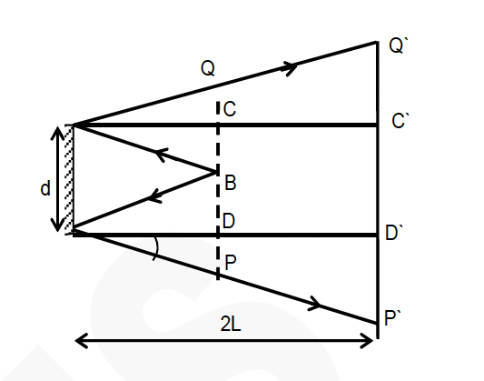
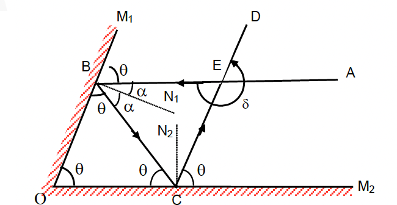
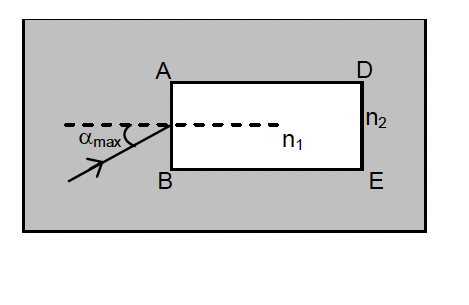
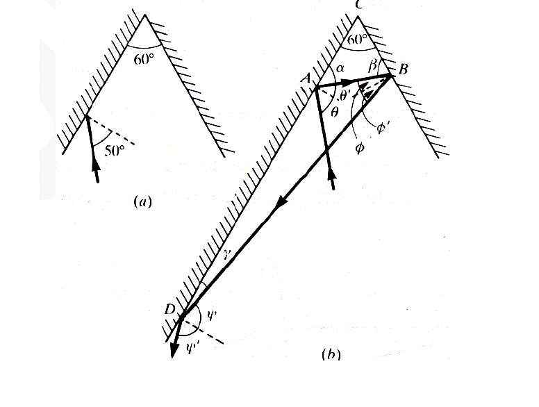
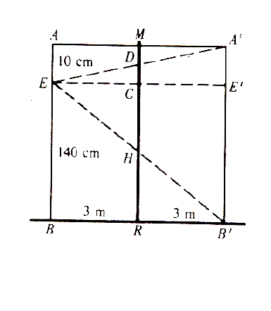

# Example Questions

### Example 22

A point source of light $B$ is placed at a distance $L$ in front of the centre of a mirror of width $d$ hung vertically on a wall. A man walks in front of the mirror along a line parallel to the mirror at a distance $2L$ from it as shown. Find the greatest distance over which he can see the image of the light source in the mirror.

[Image of ray diagram for man walking past a plane mirror]

#### Solution
The observer can see through the distance $\mathrm{P}^{\prime} \mathrm{Q}^{\prime}$, where reflected ray from B can meet the line.

From geometry $\mathrm{CD}=d=\mathrm{C}^{\prime} \mathrm{D}^{\prime}$

$
\begin{aligned}
& P^{\prime} Q^{\prime}=C^{\prime} D^{\prime}+P^{\prime} D^{\prime}+Q^{\prime} C^{\prime} \newline
& =d+2 P D+2 C Q=d+2(P D+Q C)=d+2 d=3 d
\end{aligned}
$

---

### Example 23

Two plane mirrors are inclined to each other such that a ray of light incident on the first mirror and parallel to the second is reflected from the second mirror parallel to the first mirror. Determine the angle between the two mirrors.

#### Solution

Let $\theta$ be the angle between the two mirrors $\mathrm{OM}_1$ and $\mathrm{OM}_2$. The incident ray AB is parallel to mirror $\mathrm{OM}_2$ and strikes the mirror $\mathrm{OM}_1$ at an angle of incidence equal to $\alpha$. It is reflected along BC ; the angle of reflection being $\alpha$. From figure we have

$
\angle \mathrm{M}_1 \mathrm{BA}=\angle \mathrm{OBC}=\angle \mathrm{M}_1 \mathrm{OM}_2=\theta
$

Similarly for reflection at mirror $\mathrm{OM}_2$, we have

$
\angle \mathrm{M}_2 \mathrm{CD}=\angle \mathrm{BCO}=\angle \mathrm{M}_2 \mathrm{OM}_1=\theta
$

Now in triangle $\mathrm{OBC}$, $3 \theta=180^{\circ}$,

therefore, $\theta=60^{\circ}$

---

### Example 24

Light is incident from air on oil at an angle of $30^{\circ}$. After moving through oil-1, oil-2, and glass it enters water. If the refractive index of glass and water are 1.5 and 1.3 respectively. Find the angle, which the ray makes with normal in water.

#### Solution
As we know

$
\mu \sin i=(\text{constant})
$

Here is the text formatted in Markdown.

$
\begin{aligned}
& \Rightarrow \quad \mu_{\text {air }} \sin 30^{\circ}=\mu_{\text {water }} \sin \theta_4 \newline
& \theta_4=\sin ^{-1}\left[\frac{\mu_{\mathrm{a}} \sin 30^{\circ}}{\mu_{\mathrm{w}}}\right]=\sin ^{-1}\left[\frac{1}{2.6}\right]
\end{aligned}
$

---

### Example 25

Refractive index of glass with respect to water is 1.125. If the absolute refractive index of glass is **1.5**, find the absolute refractive index of water.

#### Solution
Here the refractive index of glass with respect to water i.e. ${ }_{\mathrm{w}} \mu_{\mathrm{g}}=1.125$ and absolute refractive index of glass $\mu_{\mathrm{g}}=1.5$ We know that

$
\begin{aligned}
{ }_w \mu_g & =\frac{\mu_g}{\mu_w} \newline
\therefore \quad & { }_a \mu_w=\frac{{ }_a \mu_g}{{ }_w \mu_g}=\frac{1.5}{1.125}=1.33
\end{aligned}
$

---

### Example 26

A layer of oil 3 cm thick is floating on a layer of coloured water 5 cm thick. Refractive index of coloured water is $5/3$ and the apparent depth of the two liquids appears to be $36/7 \mathrm{~cm}$. Find the refractive index of oil.

#### Solution

$
\begin{aligned}
& \text { Apparent depth (AI) }=\frac{t_1}{\mu_1}+\frac{t_2}{\mu_2} \newline
& \therefore \quad \frac{36}{7}=\frac{5}{5 / 3}+\frac{3}{\mu_2} \newline
& \therefore \frac{3}{\mu_2}=\frac{36}{7}-3=\frac{15}{7} \newline
& \therefore \quad \mu_2=\frac{7}{5}=1.4
\end{aligned}
$

---

### Example 27

A rectangular slab ABED, of refractive index **n₁**, is immersed in water of refractive index **n₂** (**n₁** > **n₂**). A ray of light is incident at the surface AB of the slab as shown. Find the maximum value of incidence angle $\alpha_{\text{max}}$, such that the ray comes out only from the other surface ED.

#### Solution
For a maximum angle of incidence at surface AB there will be a minimum angle of incidence at the surface AD . A ray to pass through the surface DE at it should not pass beyond AD i.e. it should not refract at AD . Hence, the angle $\theta$ should be the critical angle. By Snell's Law

$
\begin{aligned}
& \mathrm{n}_1 \sin \theta=\mathrm{n}_2 \sin 90^{\mathrm{p}} \newline
& \quad \mathrm{n}_2 \sin \alpha_{\max }=\mathrm{n}_1 \sin (90-\theta)
\end{aligned}
$

$
\begin{aligned}
& \sin \alpha_{\max }=\frac{\mathrm{n}_1}{\mathrm{n}_2} \cos \theta \newline
& \alpha_{\max }=\sin ^{-1}\left[\frac{\mathrm{n}_1}{\mathrm{n}_2} \cos \sin ^{-1} \frac{\mathrm{n}_2}{\mathrm{n}_1}\right]
\end{aligned}
$

### Example 28: 

A convergent lens of 6 dioptres is combined with a diverging lens of -2 dioptres. Find the power and focal length of the combination.

#### Solution : 

Here $P_1=6$ diopters, $P_2=-2$ dioptres
Using the formula $\mathrm{P}=\mathrm{P}_1+\mathrm{P}_2=6-2=4$ dioptres

$
\mathrm{f}=\frac{1}{\mathrm{P}}=\frac{1}{4} \mathrm{~m}=25 \mathrm{~cm}
$

Equivalent focal length of two or more thin lenses in contact
If there are two lenses of focal length $f_1$ and $f_2$, the focal length $F$ of the combination is given by

$
\frac{1}{\mathrm{~F}}=\frac{1}{\mathrm{f}_1}+\frac{1}{\mathrm{f}_2}+\cdots
$

### Example 29: 

Convex lens of 10 cm focal length is combined with a concave lens of 6 cm focal length. Find the focal length of the combination.

#### Solution : 

Here $\mathrm{f}_1=10 \mathrm{~cm}, \mathrm{f}_2=-6 \mathrm{~cm}, \mathrm{~F}=$ ?

Use the formula $\frac{1}{F}=\frac{1}{f_1}+\frac{1}{f_2}=\frac{1}{10}-\frac{1}{6}=-\frac{1}{15}$

Here is the text formatted in Markdown.

### Example 36

In the figure (a) a ray of light is incident at $50^{\circ}$ on the middle of one of a pair of mirrors arranged at $60^{\circ}$ to each other.
(a) calculate the angle at which the ray is incident on the second mirror.
(b) calculate the angle at which the ray is incident on the first mirror after being reflected from the second mirror.

#### Solution

(a) Refer to Fig. (b). From the law of reflection $\theta^{\prime}=\theta=50^{\circ}$ and thus, $\alpha=90^{\circ}-\theta^{\prime}=40^{\circ}$.
Since $\alpha$, $\beta$ and $60^{\circ}$ are the interior angles of the triangle ABC , we have
$\alpha+\beta+60^{\circ}=180^{\circ}$
or $\beta=180^{\circ}-60^{\circ}-40^{\circ}=80^{\circ}$

$\beta=180^{\circ}-60^{\circ}-40^{\circ}=80^{\circ}$
and so the angle of incidence on the second mirror is $\phi=90^{\circ}-\beta=10^{\circ}$.

(b) From the law of reflection $\phi^{\prime}=\phi=10^{\circ}$. The interior angles of the triangle ABD are $90^{\circ}+\theta^{\prime}$, $\phi+\phi^{\prime}$, and $\gamma$, so $\gamma=180^{\circ}-140^{\circ}-20^{\circ}=20^{\circ}$ and the angle of incidence $\psi=90^{\circ}-\gamma=70^{\circ}$.

Here is the text formatted in Markdown.

### Example 37

A body is 1.50 m tall and can just see his image in a vertical plane mirror 3 m away. His eyes are 1.40 m from the floor level. Determine the vertical dimension and elevation of the mirror.

#### Solution

In figure, let AB represent the boy. His eyes are at E . Then $\mathrm{A}^{\prime} \mathrm{B}^{\prime}$ is the image of $A B$ in mirror MR and DH represents the shortest mirror necessary for the eye to view the image $\mathrm{A}^{\prime} \mathrm{B}^{\prime}$.

Triangles DEC and $\mathrm{DA}^{\prime} \mathrm{M}$ are congruent and so $\overline{\mathrm{CD}}=\overline{\mathrm{DM}}= 5 \mathrm{~cm}$. Triangles $\mathrm{HRB}^{\prime}$ and HCE are congruent and so $\overline{\mathrm{RH}}=\overline{\mathrm{HC}} =70 \mathrm{~cm}$. The dimension of the mirror is $\overline{\mathrm{HC}}+\overline{\mathrm{CD}}=75 \mathrm{~cm}$ and its elevation is $\overline{\mathrm{RH}}=70 \mathrm{~cm}$.

Here is the text formatted in Markdown.

### Example 38

A ray of light, traveling in a medium of refractive index $\mu$, is incident at an angle $i$ on a composite transparent plate consisting of three plates of refractive indices $\mu_1$, $\mu_2$ and $\mu_3$. The ray emerges from the composite plate into a medium of refractive index $\mu^{\prime}$ at angle $\mathbf{x}$. Show that angle $\mathbf{x}$ is independent of $\mu_1, \mu_2$ and $\mu_3$. Also show that $\mathbf{x}=\mathbf{i}$ if $\mu=\mu^{\prime}$.

#### Solution
From Snell's law we have for successive refractions (see figure)

$
\begin{aligned}
& \frac{\sin i}{\sin r_1}=\frac{\mu_1}{\mu}, \quad \frac{\sin r_1}{\sin r_2}=\frac{\mu_2}{\mu_1} \newline
& \frac{\sin r_2}{\sin r_3}=\frac{\mu_3}{\mu_2}, \quad \frac{\sin r_3}{\sin x}=\frac{\mu^{\prime}}{\mu_3}
\end{aligned}
$

multiplying these equations we get

$
\frac{\sin i}{\sin x}=\frac{\mu^{\prime}}{\mu}
$

or $\quad \sin x=\frac{\mu}{\mu^{\prime}} \sin i$

This shows that angle $x$ at which the ray leaves the composite plate depends only on the angle of incidence on the plate and the refractive indices of the media on both sides of the plate and is independent of $\mu_1, \mu_2$ and $\mu_3$. If $\mu=\mu^{\prime}$.
$\sin x=\sin i$ or $x=i$.

---

### Example 39

A cubical vessel with opaque walls, is so placed that the eye of an observer cannot see its bottom but can see the entire wall CD [see fig]. A small object is placed at $O$ at a distance $\mathbf{b}=\mathbf{10 ~cm}$ from corner $\mathbf{D}$. What minimum depth of water ($\mu = 4/3$) should be poured into the vessel which will enable the observer to see the object?

#### Solution
Let the minimum depth of water be $x$ [figure(b)]. Since the vessel is cubical ($\mathrm{AB}=\mathrm{AD}$), it is clear that angle $i=45^{\circ}$. From Snell's law, the angle of refraction is given by

$
\begin{aligned}
& \sin r=\frac{\sin i}{\mu}=\frac{\sin 45^{\circ}}{4 / 3}=0.5303 \newline
& \therefore \quad r=32.03^{\circ} \newline
& \quad \mathrm{AB}=\mathrm{AD}, \quad \therefore \quad \angle \mathrm{ADB}=45^{\circ}
\end{aligned}
$

Here is the text formatted in Markdown.

Since $\angle \mathrm{QPD}=45^{\circ}, \mathrm{PQ}(=x)=\mathrm{QD}$

Hence $\mathrm{QO}=x-b$
Now in triangle PQO

$
\begin{aligned}
& \tan r=\frac{x-b}{x} \newline
& x=\frac{b}{1-\tan r}
\end{aligned}
$

Substituting for $b$ and $r$ we get

$
\mathrm{x}=26.7 \mathrm{~cm}
$