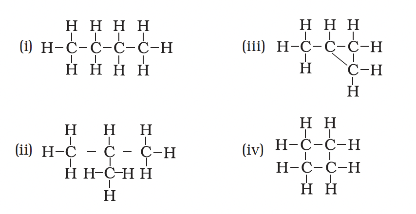
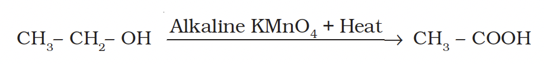
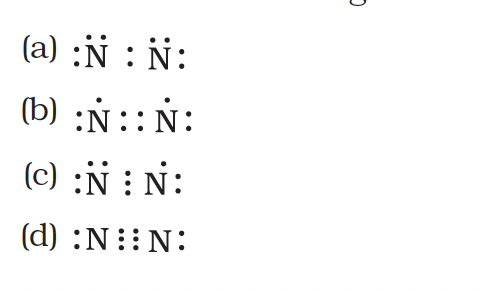
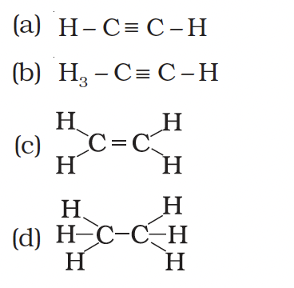
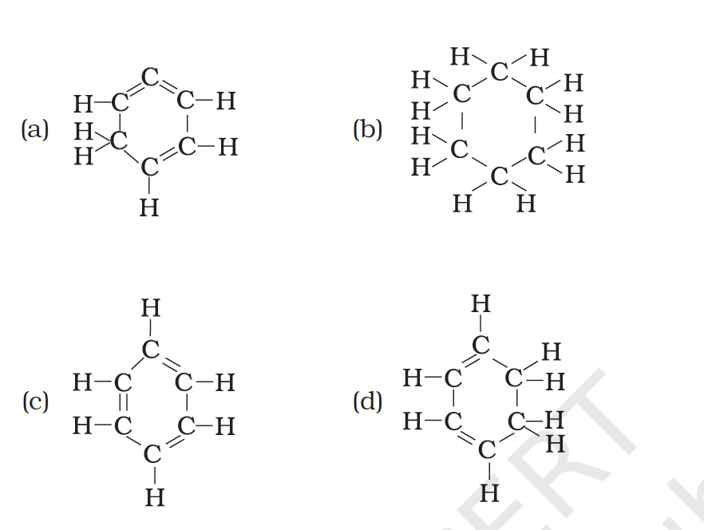
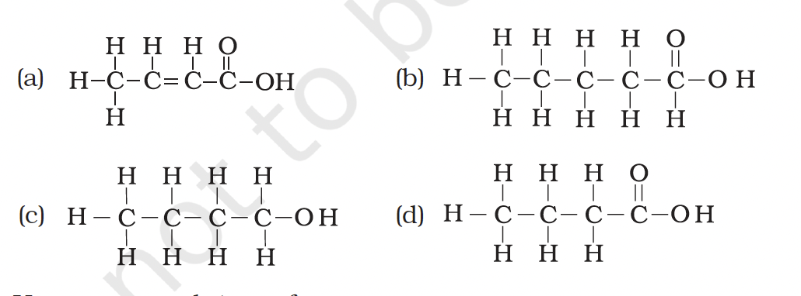
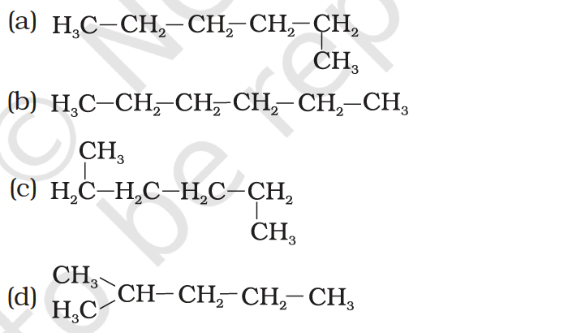
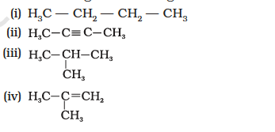

# Unit 4: Multiple Choice Questions

- [View MCQ Solutions](01-mcqs-solutions.html)
- [Back to Unit 4 Index](index.html)

<ol>
  <li>
    
Carbon exists in the atmosphere in the form of

    <ol type="a">
      <li>carbon monoxide only</li>
      <li>carbon monoxide in traces and carbon dioxide</li>
      <li>carbon dioxide only</li>
      <li>coal</li>
    </ol>
  </li>

  <li>
    
Which of the following statements are usually correct for carbon compounds? These

    <ol type="i">
      <li>are good conductors of electricity</li>
      <li>are poor conductors of electricity</li>
      <li>have strong forces of attraction between their molecules</li>
      <li>do not have strong forces of attraction between their molecules</li>
    </ol>
    <ol type="a">
      <li>(i) and (iii)</li>
      <li>(ii) and (iii)</li>
      <li>(i) and (iv)</li>
      <li>(ii) and (iv)</li>
    </ol>
  </li>

  <li>
    
A molecule of ammonia (NH3) has

    <ol type="a">
      <li>only single bonds</li>
      <li>only double bonds</li>
      <li>only triple bonds</li>
      <li>two double bonds and one single bond</li>
    </ol>
  </li>

  <li>
    
Buckminsterfullerene is an allotropic form of

    <ol type="a">
      <li>phosphorus</li>
      <li>sulphur</li>
      <li>carbon</li>
      <li>tin</li>
    </ol>
  </li>

  <li>
    
Which of the following are correct structural isomers of butane?

    

    <ol type="a">
      <li>(i) and (iii)</li>
      <li>(ii) and (iv)</li>
      <li>(i) and (ii)</li>
      <li>(iii) and (iv)</li>
    </ol>
  </li>

  <li>
    
\(\mathrm{CH}_3-\mathrm{CH}_2-\mathrm{OH} \xrightarrow{\text{Alkaline } \mathrm{KMnO}_4 + \text{Heat}} \mathrm{CH}_3-\mathrm{COOH}\)

    

    
In the above given reaction, alkaline KMnO4 acts as

    <ol type="a">
      <li>reducing agent</li>
      <li>oxidising agent</li>
      <li>catalyst</li>
      <li>dehydrating agent</li>
    </ol>
  </li>

  <li>
    
Oils on treating with hydrogen in the presence of palladium or nickel catalyst form fats. This is an example of

    <ol type="a">
      <li>Addition reaction</li>
      <li>Substitution reaction</li>
      <li>Displacement reaction</li>
      <li>Oxidation reaction</li>
    </ol>
  </li>

  <li>
    
In which of the following compounds, — OH is the functional group?

    <ol type="a">
      <li>Butanone</li>
      <li>Butanol</li>
      <li>Butanoic acid</li>
      <li>Butanal</li>
    </ol>
  </li>

  <li>
    
The soap molecule has a

    <ol type="a">
      <li>hydrophilic head and a hydrophobic tail</li>
      <li>hydrophobic head and a hydrophilic tail</li>
      <li>hydrophobic head and a hydrophobic tail</li>
      <li>hydrophilic head and a hydrophobic tail</li>
    </ol>
  </li>

  <li>
    
Which of the following is the correct representation of electron dot structure of nitrogen?

    

  </li>

  <li>
    
Structural formula of ethyne is

    

  </li>

  <li>
    
Identify the unsaturated compounds from the following

    <ol type="i">
      <li>Propane</li>
      <li>Propene</li>
      <li>Propyne</li>
      <li>Chloropropane</li>
    </ol>
    <ol type="a">
      <li>(i) and (ii)</li>
      <li>(ii) and (iv)</li>
      <li>(iii) and (iv)</li>
      <li>(ii) and (iii)</li>
    </ol>
  </li>

  <li>
    
Chlorine reacts with saturated hydrocarbons at room temperature in the

    <ol type="a">
      <li>absence of sunlight</li>
      <li>presence of sunlight</li>
      <li>presence of water</li>
      <li>presence of hydrochloric acid</li>
    </ol>
  </li>

  <li>
    
In the soap micelles

    <ol type="a">
      <li>the ionic end of soap is on the surface of the cluster while the carbon chain is in the interior of the cluster.</li>
      <li>ionic end of soap is in the interior of the cluster and the carbon chain is out of the cluster.</li>
      <li>both ionic end and carbon chain are in the interior of the cluster</li>
      <li>both ionic end and carbon chain are on the exterior of the cluster</li>
    </ol>
  </li>

  <li>
    
Pentane has the molecular formula C5 H12. It has

    <ol type="a">
      <li>5 covalent bonds</li>
      <li>12 covalent bonds</li>
      <li>16 covalent bonds</li>
      <li>17 covalent bonds</li>
    </ol>
  </li>

  <li>
    
Structural formula of benzene is

    

  </li>

  <li>
    
Ethanol reacts with sodium and forms two products. These are

    <ol type="a">
      <li>sodium ethanoate and hydrogen</li>
      <li>sodium ethanoate and oxygen</li>
      <li>sodium ethoxide and hydrogen</li>
      <li>sodium ethoxide and oxygen</li>
    </ol>
  </li>

  <li>
    
The correct structural formula of butanoic acid is

    

  </li>

  <li>
    
Vinegar is a solution of

    <ol type="a">
      <li>50% – 60% acetic acid in alcohol</li>
      <li>5% – 8% acetic acid in alcohol</li>
      <li>5% – 8% acetic acid in water</li>
      <li>50% – 60% acetic acid in water</li>
    </ol>
  </li>

  <li>
    
Mineral acids are stronger acids than carboxylic acids because

    <ol type="i">
      <li>mineral acids are completely ionised</li>
      <li>carboxylic acids are completely ionised</li>
      <li>mineral acids are partially ionised</li>
      <li>carboxylic acids are partially ionised</li>
    </ol>
    <ol type="a">
      <li>(i) and (iv)</li>
      <li>(ii) and (iii)</li>
      <li>(i) and (ii)</li>
      <li>(iii) and (iv)</li>
    </ol>
  </li>

  <li>
    
Carbon forms four covalent bonds by sharing its four valence electrons with four univalent atoms, e.g. hydrogen. After the formation of four bonds, carbon attains the electronic configuration of

    <ol type="a">
      <li>helium</li>
      <li>neon</li>
      <li>argon</li>
      <li>krypton</li>
    </ol>
  </li>

  <li>
    
The correct electron dot structure of a water molecule is

    <ol type="a">
      <li>\(\mathrm{H} \ddot{\mathrm{O}} \cdot \mathrm{H}\)</li>
      <li>\(\mathrm{H}: \mathrm{O} \cdot \mathrm{H}\)</li>
      <li>\(\mathrm{H}: \ddot{\mathrm{O}}: \mathrm{H}\)</li>
      <li>\(\mathrm{H}: \mathrm{O}: \mathrm{H}\)</li>
    </ol>
  </li>

  <li>
    
Which of the following is not a straight chain hydrocarbon?

    

  </li>

  <li>
    
Which among the following are unsaturated hydrocarbons?

    
(i) H3C — CH2 — CH2 — CH3

    

    <ol type="a">
      <li>(i) and (iii)</li>
      <li>(ii) and (iii)</li>
      <li>(ii) and (iv)</li>
      <li>(iii) and (iv)</li>
    </ol>
  </li>

  <li>
    
Which of the following does not belong to the same homologous series?

    <ol type="a">
      <li>\(\mathrm{CH}_4\)</li>
      <li>\(\mathrm{C}_2\mathrm{H}_6\)</li>
      <li>\(\mathrm{C}_3\mathrm{H}_8\)</li>
      <li>\(\mathrm{C}_4\mathrm{H}_8\)</li>
    </ol>
  </li>

  <li>
    
The name of the compound \(\mathrm{CH}_3\mathrm{—CH}_2\mathrm{—CHO}\) is

    <ol type="a">
      <li>Propanal</li>
      <li>Propanone</li>
      <li>Ethanol</li>
      <li>Ethanal</li>
    </ol>
  </li>

  <li>
    
The heteroatoms present in CH3 — CH2 — O — CH2— CH2 Cl are

    <ol type="i">
      <li>oxygen</li>
      <li>carbon</li>
      <li>hydrogen</li>
      <li>chlorine</li>
    </ol>
    <ol type="a">
      <li>(i) and (ii)</li>
      <li>(ii) and (iii)</li>
      <li>(iii) and (iv)</li>
      <li>(i) and (iv)</li>
    </ol>
  </li>

  <li>
    
Which of the following represents saponification reaction?

    <ol type="a">
      <li>(a) $\mathrm{CH}_3 \mathrm{COONa}+\mathrm{NaOH} \xrightarrow{\mathrm{CaO}} \mathrm{CH}_4+\mathrm{Na}_2 \mathrm{CO}_3$</li>
      <li>(b) $\mathrm{CH}_3 \mathrm{COOH}+\mathrm{C}_2 \mathrm{H}_5 \mathrm{OH} \xrightarrow{\mathrm{H}_2 \mathrm{SO}_4} \mathrm{CH}_3 \mathrm{COOC}_2 \mathrm{H}_5+\mathrm{H}_2 \mathrm{O}$</li>
      <li>(c) $2 \mathrm{CH}_3 \mathrm{COOH}+2 \mathrm{Na} \rightarrow 2 \mathrm{CH}_3 \mathrm{COONa}+\mathrm{H}_2$</li>
      <li>(d) $\mathrm{CH}_3 \mathrm{COOC}_2 \mathrm{H}_5+\mathrm{NaOH} \rightarrow \mathrm{CH}_3 \mathrm{COONa}+\mathrm{C}_2 \mathrm{H}_5 \mathrm{OH}$</li>
    </ol>
  </li>

  <li>
    
The first member of alkyne homologous series is

    <ol type="a">
      <li>ethyne</li>
      <li>ethene</li>
      <li>propyne</li>
      <li>methane</li>
    </ol>
  </li>
</ol>

