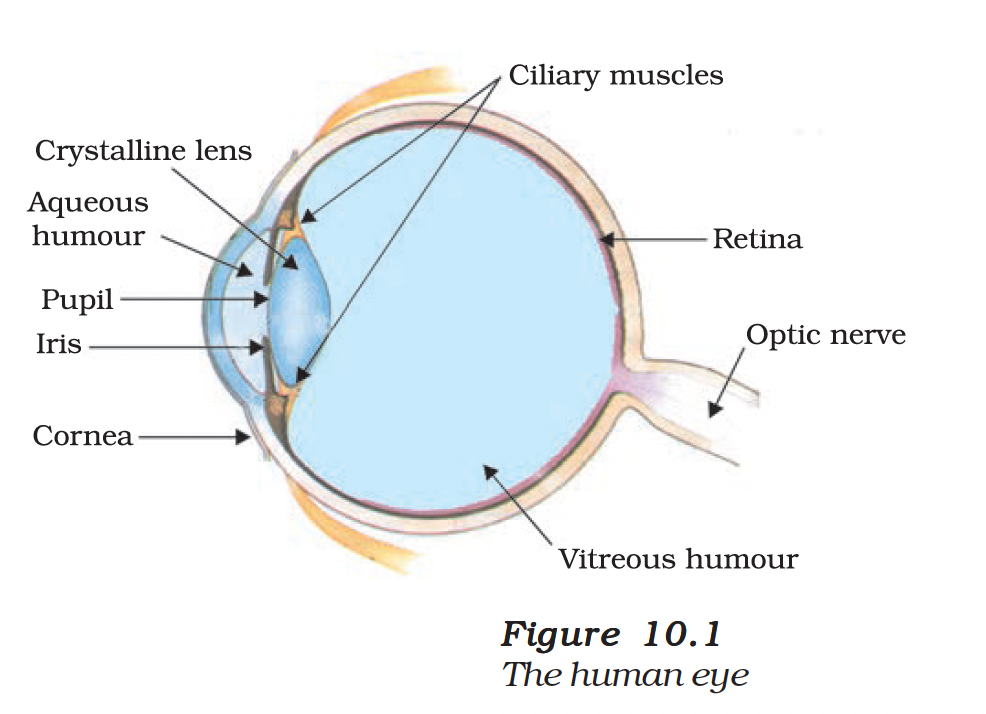

# 10.1 The Human Eye

You have studied in the previous chapter about refraction of light by lenses. You also studied the nature, position and relative size of images formed by lenses. How can these ideas help us in the study of the human eye? The human eye uses light and enables us to see objects around us. It has a lens in its structure. What is the function of the lens in a human eye? How do the lenses used in spectacles correct defects of vision? Let us consider these questions in this chapter.

We have learnt in the previous chapter about light and some of its properties. In this chapter, we shall use these ideas to study some of the optical phenomena in nature. We shall also discuss about rainbow formation, splitting of white light and blue colour of the sky.

## Structure of the Human Eye

The human eye is one of the most valuable and sensitive sense organs. It enables us to see the wonderful world and the colours around us. On closing the eyes, we can identify objects to some extent by their smell, taste, sound they make or by touch. It is, however, impossible to identify colours while closing the eyes. Thus, of all the sense organs, the human eye is the most significant one as it enables us to see the beautiful, colourful world around us.

<figure>

<figcaption><b>Figure 10.1:</b> The human eye</figcaption>
</figure>

The human eye is like a camera. Its lens system forms an image on a light-sensitive screen called the **retina**. Light enters the eye through a thin membrane called the **cornea**. It forms the transparent bulge on the front surface of the eyeball. The eyeball is approximately spherical in shape with a diameter of about 2.3 cm. Most of the refraction for the light rays entering the eye occurs at the outer surface of the cornea. The crystalline lens merely provides the finer adjustment of focal length required to focus objects at different distances on the retina.

We find a structure called **iris** behind the cornea. Iris is a dark muscular diaphragm that controls the size of the **pupil**. The pupil regulates and controls the amount of light entering the eye.

The **eye lens** forms an inverted real image of the object on the retina. The retina is a delicate membrane having enormous number of light-sensitive cells. The light-sensitive cells get activated upon illumination and generate electrical signals. These signals are sent to the brain via the **optic nerves**. The brain interprets these signals, and finally, processes the information so that we perceive objects as they are.

### Key Parts of the Human Eye

| Part | Function |
|------|----------|
| **Cornea** | Transparent membrane; most refraction occurs here |
| **Iris** | Controls the size of the pupil |
| **Pupil** | Regulates amount of light entering the eye |
| **Eye Lens** | Provides fine adjustment of focal length |
| **Retina** | Light-sensitive screen where image is formed |
| **Optic Nerve** | Transmits electrical signals to the brain |

## 10.1.1 Power of Accommodation

The eye lens is composed of a fibrous, jelly-like material. Its curvature can be modified to some extent by the **ciliary muscles**. The change in the curvature of the eye lens can thus change its focal length.

- When the muscles are **relaxed**, the lens becomes **thin**. Thus, its focal length **increases**. This enables us to see **distant objects** clearly.
- When you are looking at objects **closer** to the eye, the ciliary muscles **contract**. This **increases** the curvature of the eye lens. The eye lens then becomes **thicker**. Consequently, the focal length of the eye lens **decreases**. This enables us to see **nearby objects** clearly.

> **Definition:** The ability of the eye lens to adjust its focal length is called **accommodation**.

However, the focal length of the eye lens cannot be decreased below a certain minimum limit. Try to read a printed page by holding it very close to your eyes. You may see the image being blurred or feel strain in the eye.

### Near Point and Far Point

To see an object comfortably and distinctly, you must hold it at about **25 cm** from the eyes.

| Term | Definition | Value (Normal Eye) |
|------|------------|-------------------|
| **Near Point** (Least distance of distinct vision) | Minimum distance at which objects can be seen most distinctly without strain | About **25 cm** |
| **Far Point** | Farthest point up to which the eye can see objects clearly | **Infinity** |

> A normal eye can see objects clearly that are between **25 cm and infinity**.

### Cataract

Sometimes, the crystalline lens of people at old age becomes milky and cloudy. This condition is called **cataract**. This causes partial or complete loss of vision. It is possible to restore vision through a cataract surgery.

---

## Questions

1. What is meant by power of accommodation of the eye?
2. A person with a myopic eye cannot see objects beyond 1.2 m distinctly. What should be the type of the corrective lens used to restore proper vision?
3. What is the far point and near point of the human eye with normal vision?
4. A student has difficulty reading the blackboard while sitting in the last row. What could be the defect the child is suffering from? How can it be corrected?

---

> **Think it over**
> 
> You talk of wondrous things you see,
> You say the sun shines bright;
> I feel him warm, but how can he
> Or make it day or night?
> — C. CIBBER

---

> **Do You Know? — Eye Donation**
> 
> Our eyes can live even after our death! By donating our eyes after we die, we can light the life of a blind person. About 35 million people in the developing world are blind and most of them can be cured. About 4.5 million people with corneal blindness can be cured through corneal transplantation of donated eyes. Out of these 4.5 million, 60% are children below the age of 12.
> 
> **Important Points about Eye Donation:**
> - Eye donors can belong to any age group or sex.
> - People who use spectacles, or those operated for cataract, can still donate eyes.
> - People who are diabetic, have hypertension, asthma and those without communicable diseases can donate eyes.
> - Eyes must be removed within 4-6 hours after death.
> - Eye removal takes only 10-15 minutes and does not lead to any disfigurement.
> - Persons infected with AIDS, Hepatitis B or C, rabies, acute leukaemia, tetanus, cholera, meningitis or encephalitis cannot donate eyes.
> - **One pair of eyes gives vision to up to FOUR CORNEAL BLIND PEOPLE.**

