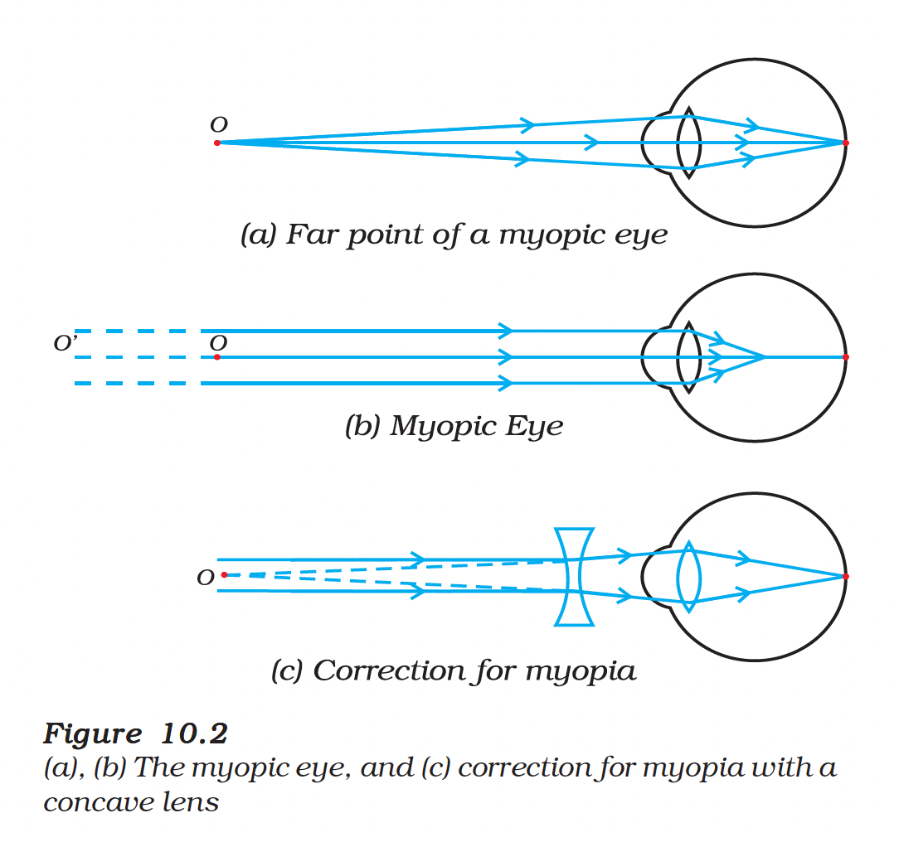
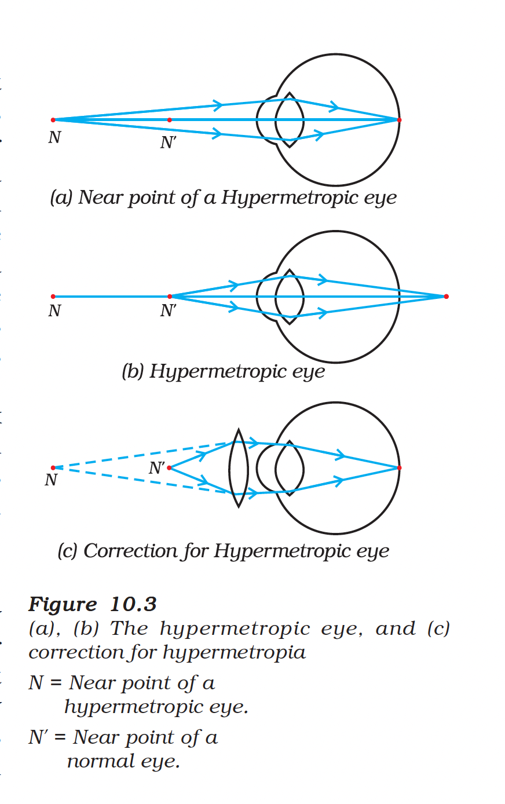

# 10.2 Defects of Vision and Their Correction

Sometimes, the eye may gradually lose its power of accommodation. In such conditions, the person cannot see the objects distinctly and comfortably. The vision becomes blurred due to the refractive defects of the eye.

There are mainly **three common refractive defects** of vision:
1. **Myopia** or near-sightedness
2. **Hypermetropia** or far-sightedness
3. **Presbyopia**

These defects can be corrected by the use of suitable spherical lenses.

---

## (a) Myopia (Near-sightedness)

Myopia is also known as **near-sightedness**. A person with myopia can see **nearby objects clearly** but **cannot see distant objects distinctly**.

### Characteristics
- The **far point** is nearer than infinity
- Such a person may see clearly only up to a distance of a few metres
- The image of a distant object is formed **in front of the retina** (not at the retina itself)

### Causes
This defect may arise due to:
1. **Excessive curvature** of the eye lens, or
2. **Elongation** of the eyeball

### Correction
This defect can be corrected by using a **concave lens** of suitable power. A concave lens of suitable power will bring the image back on to the retina and thus the defect is corrected.

<figure>

<figcaption><b>Figure 10.2:</b> (a), (b) The myopic eye, and (c) correction for myopia with a concave lens</figcaption>
</figure>

| Myopia | Details |
|--------|---------|
| **Also known as** | Near-sightedness |
| **Can see clearly** | Nearby objects |
| **Cannot see clearly** | Distant objects |
| **Image formed** | In front of retina |
| **Corrective lens** | Concave lens (negative power) |

---

## (b) Hypermetropia (Far-sightedness)

Hypermetropia is also known as **far-sightedness**. A person with hypermetropia can see **distant objects clearly** but **cannot see nearby objects distinctly**.

### Characteristics
- The **near point** is farther away from the normal near point (25 cm)
- Such a person has to keep reading material much beyond 25 cm from the eye for comfortable reading
- Light rays from a close-by object are focussed at a point **behind the retina**

### Causes
This defect arises because:
1. The **focal length** of the eye lens is **too long**, or
2. The **eyeball** has become **too small**

### Correction
This defect can be corrected by using a **convex lens** of appropriate power. Eye-glasses with converging lenses provide the additional focussing power required for forming the image on the retina.

<figure>

<figcaption><b>Figure 10.3:</b> (a), (b) The hypermetropic eye, and (c) correction for hypermetropia</figcaption>
</figure>

| Hypermetropia | Details |
|---------------|---------|
| **Also known as** | Far-sightedness |
| **Can see clearly** | Distant objects |
| **Cannot see clearly** | Nearby objects |
| **Image formed** | Behind the retina |
| **Corrective lens** | Convex lens (positive power) |

---

## (c) Presbyopia

The power of accommodation of the eye usually **decreases with ageing**. For most people, the near point gradually recedes away. They find it difficult to see nearby objects comfortably and distinctly without corrective eye-glasses. This defect is called **Presbyopia**.

### Causes
It arises due to:
1. Gradual **weakening of the ciliary muscles**
2. **Diminishing flexibility** of the eye lens

### Special Case: Both Myopia and Hypermetropia
Sometimes, a person may suffer from **both myopia and hypermetropia**. Such people often require **bi-focal lenses**.

A common type of bi-focal lenses consists of both concave and convex lenses:
- **Upper portion**: Concave lens — facilitates **distant vision**
- **Lower part**: Convex lens — facilitates **near vision**

---

## Summary Comparison

| Defect | Another Name | Clear Vision | Blurred Vision | Image Location | Corrective Lens |
|--------|--------------|--------------|----------------|----------------|-----------------|
| **Myopia** | Near-sightedness | Nearby | Distant | In front of retina | Concave |
| **Hypermetropia** | Far-sightedness | Distant | Nearby | Behind retina | Convex |
| **Presbyopia** | Age-related | — | Nearby | Beyond retina | Convex (or bi-focal) |

---

## Modern Corrections

These days, it is possible to correct the refractive defects with:
- **Contact lenses**
- **Surgical interventions** (such as LASIK)

