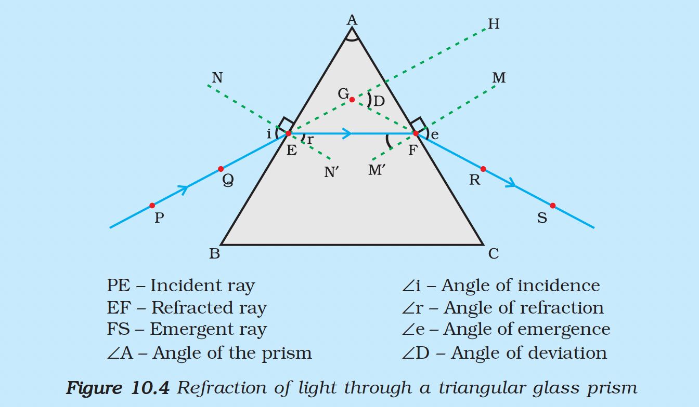

# 10.3 Refraction of Light Through a Prism

You have learnt how light gets refracted through a rectangular glass slab. For parallel refracting surfaces, as in a glass slab, the emergent ray is parallel to the incident ray. However, it is slightly displaced laterally.

How would light get refracted through a transparent prism?

## Triangular Glass Prism

Consider a **triangular glass prism**. It has:
- **Two triangular bases**
- **Three rectangular lateral surfaces**

These surfaces are inclined to each other. The angle between its two lateral faces is called the **angle of the prism**.

---

## Activity 10.1: Studying Refraction Through a Prism

**Materials needed:** Drawing board, white paper, drawing pins, glass prism, pencil, pins

**Procedure:**

1. Fix a sheet of white paper on a drawing board using drawing pins.
2. Place a glass prism on it in such a way that it rests on its triangular base. Trace the outline of the prism using a pencil.
3. Draw a straight line PE inclined to one of the refracting surfaces, say AB, of the prism.
4. Fix two pins, say at points P and Q, on the line PE.
5. Look for the images of the pins, fixed at P and Q, through the other face AC.
6. Fix two more pins, at points R and S, such that the pins at R and S and the images of the pins at P and Q lie on the same straight line.
7. Remove the pins and the glass prism.
8. The line PE meets the boundary of the prism at point E. Similarly, join and produce the points R and S. Let these lines meet the boundary of the prism at E and F, respectively. Join E and F.
9. Draw perpendiculars to the refracting surfaces AB and AC of the prism at points E and F, respectively.
10. Mark the angle of incidence ($\angle i$), the angle of refraction ($\angle r$) and the angle of emergence ($\angle e$).

---

## Understanding the Ray Diagram

<figure>

<figcaption><b>Figure 10.4:</b> Refraction of light through a triangular glass prism</figcaption>
</figure>

| Ray | Description |
|-----|-------------|
| **PE** | Incident ray |
| **EF** | Refracted ray |
| **FS** | Emergent ray |

### Observations

- At the **first surface AB**: Light ray enters from air to glass — the light ray bends **towards the normal**
- At the **second surface AC**: Light ray enters from glass to air — the light ray bends **away from the normal**

### Angle of Deviation

The peculiar shape of the prism makes the emergent ray bend at an angle to the direction of the incident ray. This angle is called the **angle of deviation** ($\angle D$).

---

## Key Concepts

| Term | Symbol | Description |
|------|--------|-------------|
| **Angle of Incidence** | $\angle i$ | Angle between incident ray and normal at first surface |
| **Angle of Refraction** | $\angle r$ | Angle between refracted ray and normal at first surface |
| **Angle of Emergence** | $\angle e$ | Angle between emergent ray and normal at second surface |
| **Angle of Deviation** | $\angle D$ | Angle between the incident ray direction and emergent ray direction |

---

## Comparison with Glass Slab

| Property | Glass Slab | Prism |
|----------|-----------|-------|
| Refracting surfaces | Parallel | Inclined |
| Emergent ray | Parallel to incident ray | At an angle to incident ray |
| Lateral displacement | Yes | Yes |
| Angle of deviation | Zero | Non-zero ($\angle D$) |

