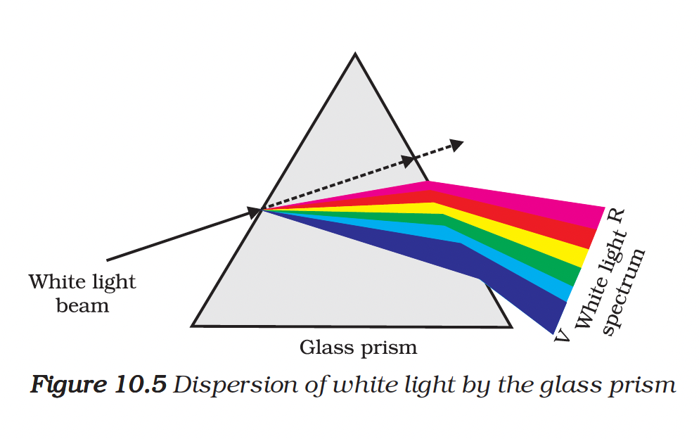
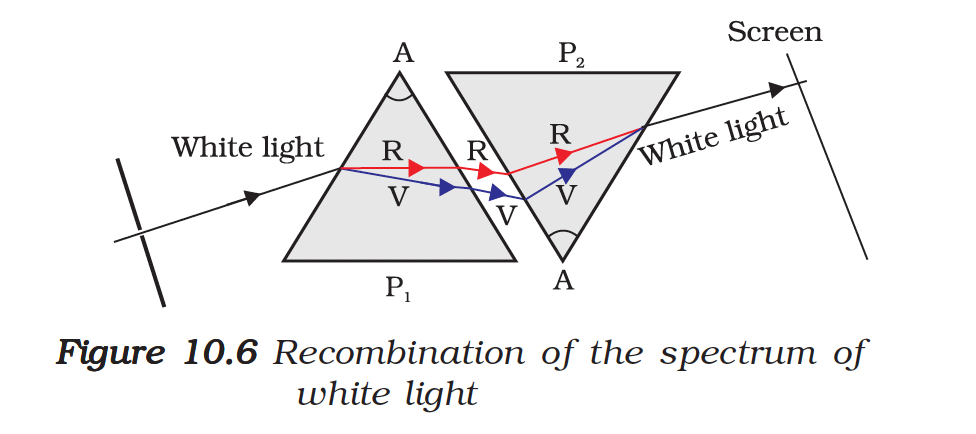
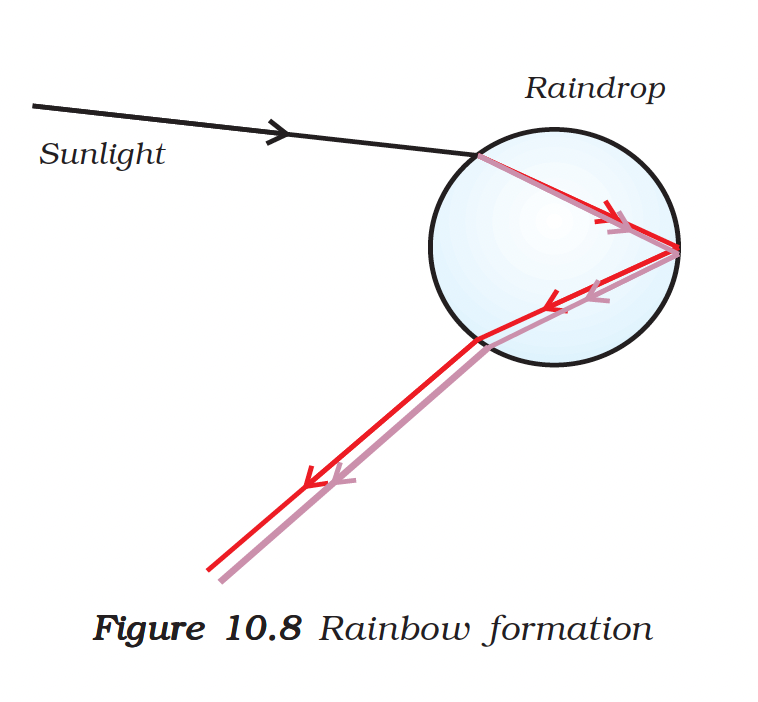

# 10.4 Dispersion of White Light by a Glass Prism

You must have seen and appreciated the spectacular colours in a rainbow. How could the white light of the Sun give us various colours of the rainbow? Before we take up this question, we shall first go back to the refraction of light through a prism.

The inclined refracting surfaces of a glass prism show an exciting phenomenon.

---

## Activity 10.2: Dispersion of White Light

**Materials needed:** Thick cardboard sheet, glass prism, screen

**Procedure:**

1. Take a thick sheet of cardboard and make a small hole or narrow slit in its middle.
2. Allow sunlight to fall on the narrow slit. This gives a narrow beam of white light.
3. Now, take a glass prism and allow the light from the slit to fall on one of its faces.
4. Turn the prism slowly until the light that comes out of it appears on a nearby screen.

**Observation:** You will find a beautiful **band of colours**!

---

## The Spectrum

The prism has split the incident white light into a band of colours.

### VIBGYOR

The various colours seen are:
- **V** — Violet
- **I** — Indigo
- **B** — Blue
- **G** — Green
- **Y** — Yellow
- **O** — Orange
- **R** — Red

> The acronym **VIBGYOR** will help you to remember the sequence of colours.

The band of the coloured components of a light beam is called its **spectrum**.

> **Definition:** The splitting of light into its component colours is called **dispersion**.

<figure>

<figcaption><b>Figure 10.5:</b> Dispersion of white light by the glass prism</figcaption>
</figure>

---

## Why Does Dispersion Occur?

Different colours of light bend through **different angles** with respect to the incident ray as they pass through a prism.

| Colour | Bending |
|--------|---------|
| **Red** | Bends the **least** |
| **Violet** | Bends the **most** |

Thus the rays of each colour emerge along different paths and become distinct. It is the band of distinct colours that we see in a spectrum.

---

## Newton's Experiment

**Isaac Newton** was the first to use a glass prism to obtain the spectrum of sunlight.

### First Experiment
He tried to split the colours of the spectrum of white light further by using another similar prism. However, he could **not get any more colours**.

### Second Experiment
He then placed a **second identical prism in an inverted position** with respect to the first prism. This allowed all the colours of the spectrum to pass through the second prism.

**Result:** He found a beam of **white light** emerging from the other side of the second prism.

> **Conclusion:** This observation gave Newton the idea that **sunlight is made up of seven colours**.

<figure>

<figcaption><b>Figure 10.6:</b> Recombination of the spectrum of white light</figcaption>
</figure>

Any light that gives a spectrum similar to that of sunlight is often referred to as **white light**.

---

## Rainbow Formation

A rainbow is a **natural spectrum** appearing in the sky after a rain shower.

### How is a Rainbow Formed?

It is caused by dispersion of sunlight by tiny **water droplets** present in the atmosphere.

| Step | Process |
|------|---------|
| 1 | Water droplets act like small prisms |
| 2 | They **refract** and **disperse** the incident sunlight |
| 3 | Then **reflect** it internally |
| 4 | Finally **refract** it again when it comes out of the raindrop |

Due to the dispersion of light and internal reflection, different colours reach the observer's eye.

<figure>

<figcaption><b>Figure 10.8:</b> Rainbow formation</figcaption>
</figure>

### Key Points about Rainbows

- A rainbow is always formed in a direction **opposite to that of the Sun**
- You can also see a rainbow on a sunny day when you look at the sky through a **waterfall** or through a **water fountain**, with the Sun behind you

---

## Summary

| Concept | Description |
|---------|-------------|
| **Dispersion** | Splitting of white light into its component colours |
| **Spectrum** | Band of coloured components of a light beam |
| **VIBGYOR** | Violet, Indigo, Blue, Green, Yellow, Orange, Red |
| **Rainbow** | Natural spectrum formed by water droplets in atmosphere |
| **Most deviated colour** | Violet |
| **Least deviated colour** | Red |

