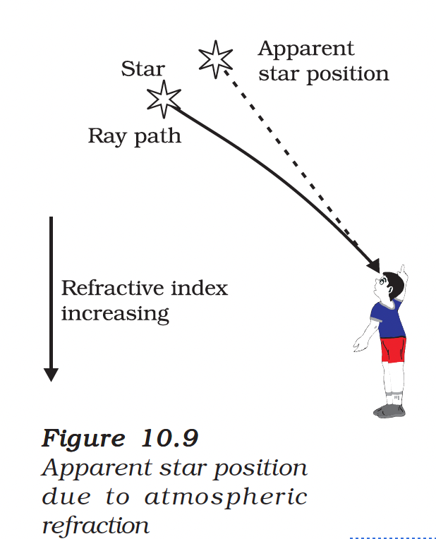
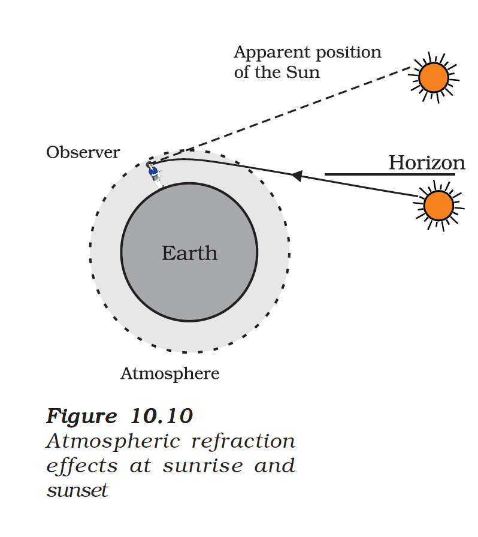

# 10.5 Atmospheric Refraction

You might have observed the apparent random wavering or flickering of objects seen through a turbulent stream of hot air rising above a fire or a radiator.

## Understanding Atmospheric Refraction

The air just above the fire becomes **hotter** than the air further up. The hotter air is **lighter (less dense)** than the cooler air above it, and has a **refractive index slightly less** than that of the cooler air.

Since the physical conditions of the refracting medium (air) are not stationary, the **apparent position of the object**, as seen through the hot air, **fluctuates**. This wavering is an effect of **atmospheric refraction** (refraction of light by the earth's atmosphere) on a small scale in our local environment.

---

## Twinkling of Stars

The twinkling of stars is a similar phenomenon on a much larger scale.

### Why Do Stars Twinkle?

The twinkling of a star is due to **atmospheric refraction of starlight**.

| Process | Description |
|---------|-------------|
| 1 | Starlight enters the earth's atmosphere |
| 2 | It undergoes **continuous refraction** before reaching the earth |
| 3 | Atmospheric refraction occurs in a medium of **gradually changing refractive index** |
| 4 | Atmosphere bends starlight **towards the normal** |
| 5 | The **apparent position** of the star is slightly different from its actual position |

### Key Points

- The star appears slightly **higher (above)** than its actual position when viewed near the horizon
- This apparent position is **not stationary** — it keeps changing slightly
- Since the physical conditions of the earth's atmosphere are not stationary, the path of light rays keeps varying
- Stars are very distant, so they approximate **point-sized sources** of light

### The Twinkling Effect

As the path of rays of light coming from the star goes on varying slightly:
- The apparent position of the star **fluctuates**
- The amount of starlight entering the eye **flickers**
- The star sometimes appears **brighter**, and at some other time, **fainter**

This is the **twinkling effect**.

<figure>

<figcaption><b>Figure 10.9:</b> Apparent star position due to atmospheric refraction</figcaption>
</figure>

---

## Why Don't Planets Twinkle?

The planets are **much closer** to the earth, and are thus seen as **extended sources**.

If we consider a planet as a collection of a large number of point-sized sources of light, the total variation in the amount of light entering our eye from all the individual point-sized sources will **average out to zero**, thereby **nullifying the twinkling effect**.

| Object | Distance | Appears As | Twinkling |
|--------|----------|-----------|-----------|
| **Stars** | Very far | Point source | Yes |
| **Planets** | Relatively close | Extended source | No |

---

## Advance Sunrise and Delayed Sunset

The Sun is visible to us about **2 minutes before** the actual sunrise, and about **2 minutes after** the actual sunset because of atmospheric refraction.

### Explanation

By **actual sunrise**, we mean the actual crossing of the horizon by the Sun.

| Event | Description |
|-------|-------------|
| **Apparent sunrise** | Sun visible **2 minutes before** actual sunrise |
| **Apparent sunset** | Sun visible **2 minutes after** actual sunset |

### Why Does This Happen?

- The atmosphere refracts sunlight towards the normal (downward)
- This makes the Sun appear **higher** than its actual position
- We can see the Sun even when it is slightly **below the horizon**

### Apparent Flattening

The **apparent flattening of the Sun's disc** at sunrise and sunset is also due to the same phenomenon of atmospheric refraction.

<figure>

<figcaption><b>Figure 10.10:</b> Atmospheric refraction effects at sunrise and sunset</figcaption>
</figure>

---

## Summary

| Phenomenon | Cause |
|------------|-------|
| Wavering of objects above fire | Atmospheric refraction due to varying density of hot air |
| Twinkling of stars | Atmospheric refraction of starlight through varying density layers |
| No twinkling of planets | Extended source — variations average out |
| Advance sunrise (2 min) | Atmospheric refraction bends light towards Earth |
| Delayed sunset (2 min) | Atmospheric refraction bends light towards Earth |
| Flattening of Sun's disc | Different amounts of refraction at different heights |

