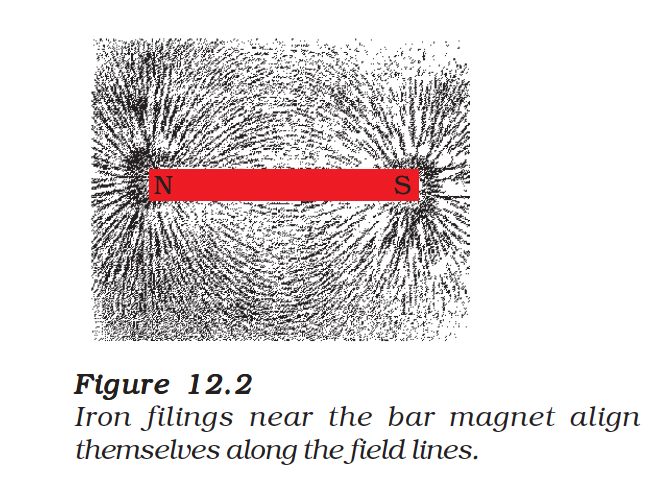
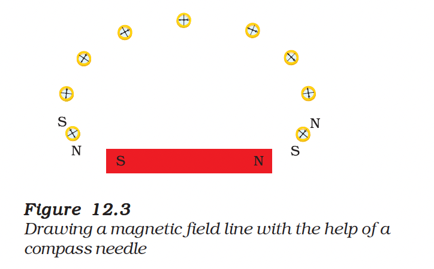
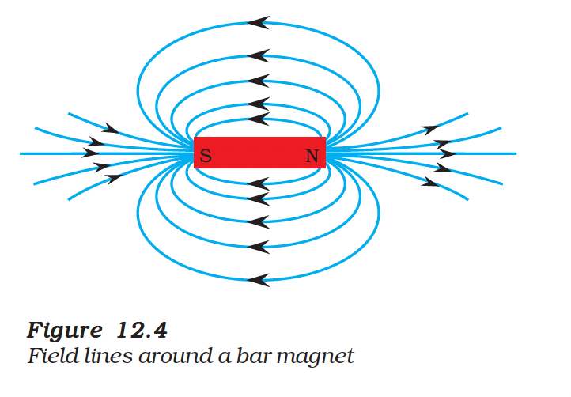

# 12.1 Magnetic Field and Field Lines

## Compass Needle

- A compass needle is essentially a small **bar magnet**.
- The end pointing towards the north is the **North pole** (north-seeking).
- The end pointing towards the south is the **South pole** (south-seeking).
- **Interaction:** Like poles repel, while unlike poles attract each other.

---

## Magnetic Field

- The region surrounding a magnet where its force can be detected is called the **magnetic field**.
- A compass needle gets deflected near a bar magnet because it experiences a force exerted by the magnet's field.

---

## Magnetic Field Lines (Activity 12.2)

- **Observation:** When iron filings are sprinkled around a bar magnet, they arrange themselves in a specific pattern.
- **Conclusion:** The filings align along **magnetic field lines**, representing the magnetic field's direction and strength.
- The magnet exerts its influence in the region surrounding it, forcing the iron filings to align.

*Figure 12.2: Iron filings pattern around a bar magnet*

---

## Drawing Magnetic Field Lines with a Compass Needle

- Mark the position of two ends of the needle.
- Now move the needle to a new position such that its south pole occupies the position previously occupied by its north pole.
- In this way, proceed step by step till you reach the south pole of the magnet as shown in Fig. 12.3.

*Figure 12.3: Drawing magnetic field lines using a compass*

- Join the points marked on the paper by a smooth curve. This curve represents a field line.
- Repeat the above procedure and draw as many lines as you can. You will get a pattern shown in Fig. 12.4.

*Figure 12.4: Complete magnetic field line pattern*

- **Observation**: The deflection increases as the needle is moved towards the poles.

---

## Properties of Magnetic Field Lines

| Property | Description |
|----------|-------------|
| **Nature** | Magnetic field has both direction and magnitude |
| **Direction (Outside)** | Field lines emerge from **North pole** and merge at **South pole** |
| **Direction (Inside)** | Field lines move from **South pole** to **North pole** |
| **Closed Curves** | Magnetic field lines are **closed curves** |
| **Strength** | Crowded lines = **stronger** field |
| **No Intersection** | No two field lines cross each other |

> **Why no intersection?** If field lines crossed, a compass needle would point in two directions at that point, which is impossible.

---

## Questions

**1. Why does a compass needle get deflected when brought near a bar magnet?**

> A compass needle is a small magnet. When brought near a bar magnet, the magnetic field of the bar magnet exerts a force on the poles of the compass needle (due to attraction/repulsion properties), causing it to deflect.

---

