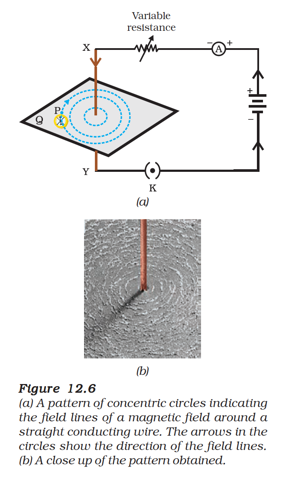

# 12.2 Magnetic Field due to a Current-Carrying Conductor

An electric current through a metallic conductor produces a magnetic field around it.

---

## 12.2.1 Magnetic Field due to a Straight Conductor

### Activity 12.4

- Take a long straight copper wire, two or three cells of 1.5 V each, and a plug key. Connect all of them in series as shown in Fig. 12.5 (a).
- Place the straight wire parallel to and over a compass needle.
- Plug the key in the circuit.

*Figure 12.5: Effect of current direction on compass needle deflection*

**Observations:**
- **Current North→South**: North pole of compass moves towards **East**
- **Current South→North**: North pole of compass moves towards **West**
- **Conclusion**: Direction of magnetic field **reverses** when current direction reverses

---

## Factors Affecting Magnetic Field Strength

| Factor | Effect on Field |
|--------|-----------------|
| **Increase Current** | Field strength **increases** (greater deflection) |
| **Increase Distance** | Field strength **decreases** (smaller deflection) |

### Field Pattern

The concentric circles representing the magnetic field around a current-carrying straight wire become larger as we move away from the wire.

*Figure 12.6: Concentric circles of magnetic field around a straight wire*

---

## 12.2.2 Right-Hand Thumb Rule

### Activity

- Connect the copper wire vertically between points X and Y in series with battery and key
- Sprinkle iron filings on the cardboard
- Close the key and gently tap the cardboard
- **Observation**: Iron filings align in **concentric circles** around the wire

### The Rule

> Imagine that you are holding a current-carrying straight conductor in your **right hand** such that the **thumb points towards the direction of current**. Then your **fingers will wrap around** the conductor in the **direction of the magnetic field lines**.

*Figure 12.7: Right-Hand Thumb Rule*

> **Note**: This rule is also called **Maxwell's corkscrew rule**. If we consider ourselves driving a corkscrew in the direction of the current, then the direction of the rotation of corkscrew is the direction of the magnetic field.

---

## Example 12.1

**Question**: A current through a horizontal power line flows in east to west direction. What is the direction of magnetic field at a point directly below it and at a point directly above it?

**Solution**:
The current is in the east-west direction. Applying the right-hand thumb rule:
- The magnetic field (at any point below or above the wire) turns **clockwise** in a plane perpendicular to the wire, when viewed from the **east end**
- **Anti-clockwise** when viewed from the **west end**

---

## Key Points

| Concept | Description |
|---------|-------------|
| Current → Magnetic Field | Electric current produces magnetic field around conductor |
| Field Pattern | Concentric circles around straight wire |
| Field Direction | Given by Right-Hand Thumb Rule |
| Field Strength | Inversely proportional to distance from wire |

---

