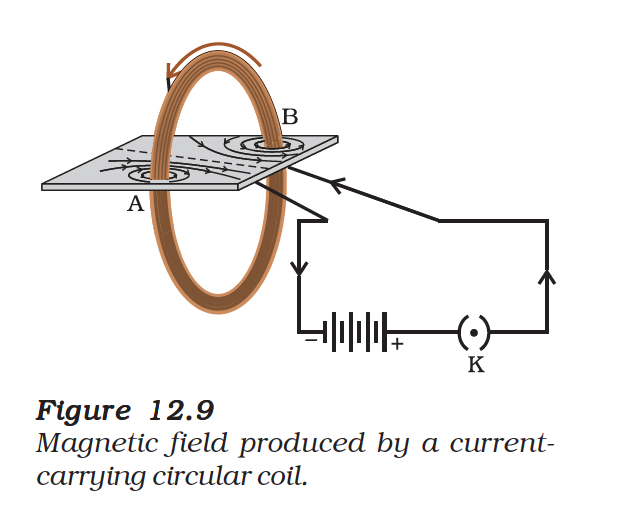
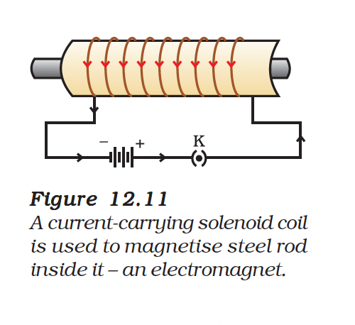

# 12.3 Magnetic Field due to a Current through a Circular Loop

When a straight wire is bent in the form of a circular loop and current is passed through it, the magnetic field pattern changes.

---

## Field Pattern around a Circular Loop

*Figure 12.8: Magnetic field lines of the field produced by a current-carrying circular loop*

### Key Observations

1. The magnetic field produced by a current-carrying wire depends **inversely on distance**
2. Concentric circles around each part of the wire become **larger** as we move away
3. At the **centre of the loop**, the arcs appear as **straight lines**
4. Every section of the wire contributes field lines in the **same direction** within the loop

---

## Multiple Turns (Coil)

*Figure 12.9: Field pattern for multiple turns*

If a circular coil has **n turns**, the magnetic field produced is **n times** as large as that produced by a single turn.

> **Reason**: The current in each circular turn has the same direction, and the field due to each turn just **adds up**.

$B_{coil} = n \times B_{single\ turn}$

*Figure 12.10: Magnetic field of a coil*

*Figure 12.11: Field lines through a coil*

---

## Solenoid

A **solenoid** is a coil of many circular turns of insulated copper wire wrapped closely in the shape of a cylinder.

### Field inside a Solenoid

| Property | Description |
|----------|-------------|
| **Field Pattern** | Uniform, parallel straight lines |
| **Field Strength** | Same at all points inside |
| **Poles** | One end acts as N-pole, other as S-pole |
| **Resembles** | Bar magnet |

---

## Questions

**1.** Consider a circular loop of wire lying in the plane of the table. Let the current pass through the loop clockwise. Apply the right-hand rule to find out the direction of the magnetic field inside and outside the loop.

**2.** The magnetic field in a given region is uniform. Draw a diagram to represent it.

**3.** Choose the correct option:
The magnetic field inside a long straight solenoid-carrying current
- (a) is zero.
- (b) decreases as we move towards its end.
- (c) increases as we move towards its end.
- **(d) is the same at all points.** ✓

---

## Summary

| Configuration | Field at Centre | Field Pattern |
|--------------|-----------------|---------------|
| Straight wire | — | Concentric circles |
| Single loop | Straight lines | Curved loops |
| Coil (n turns) | n × single turn | Stronger curved loops |
| Solenoid | Uniform | Parallel straight lines |

---

