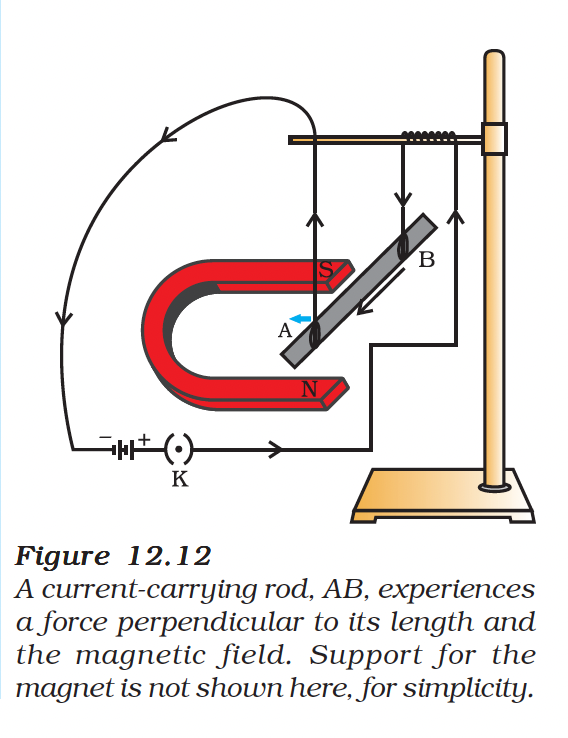
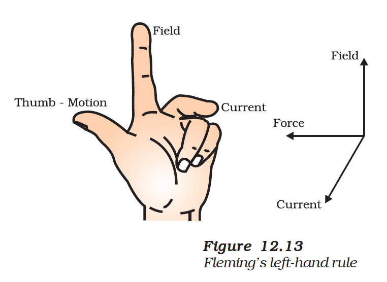

# 12.4 Force on a Current-Carrying Conductor in a Magnetic Field

An electric current flowing through a conductor produces a magnetic field. The field so produced exerts a force on a magnet placed nearby. French scientist **Andre Marie Ampere** (1775-1836) suggested that the magnet must also exert an equal and opposite force on the current-carrying conductor.

---

## Activity 12.7

*Figure 12.12: A current-carrying rod AB experiences a force perpendicular to its length and the magnetic field*

### Setup
- Take a small aluminium rod AB (about 5 cm)
- Suspend it horizontally from a stand using two connecting wires
- Place a strong horse-shoe magnet with rod between the poles
- North pole below, South pole above (field directed upwards)
- Connect rod in series with battery, key, and rheostat

### Observations

| Current Direction | Rod Displacement |
|-------------------|------------------|
| B to A | Towards **left** |
| A to B (reversed) | Towards **right** |

### Conclusions

1. A **force is exerted** on current-carrying conductor in magnetic field
2. Force direction **reverses** when current direction reverses
3. Force direction **reverses** when field direction reverses
4. Force is **maximum** when current is perpendicular to magnetic field

---

## Fleming's Left-Hand Rule

The direction of force on a current-carrying conductor in a magnetic field can be found using **Fleming's Left-Hand Rule**.

*Figure 12.13: Fleming's Left-Hand Rule*

### The Rule

> Stretch the **thumb**, **forefinger** and **middle finger** of your **left hand** such that they are **mutually perpendicular**.

| Finger | Represents |
|--------|------------|
| **Forefinger (First finger)** | Direction of **Magnetic Field (B)** |
| **Middle finger (Second finger)** | Direction of **Current (I)** |
| **Thumb** | Direction of **Force/Motion (F)** |

### Memory Aid: FBI

- **F** = Force (Thumb)
- **B** = Magnetic Field (Forefinger)
- **I** = Current (Middle finger)

---

## Applications

Devices that use current-carrying conductors and magnetic fields include:

| Device | Application |
|--------|-------------|
| **Electric Motor** | Converts electrical energy to mechanical |
| **Electric Generator** | Converts mechanical energy to electrical |
| **Loudspeakers** | Sound production |
| **Microphones** | Sound recording |
| **Measuring Instruments** | Galvanometer, ammeter |

---

## Example 12.2

**Question**: An electron enters a magnetic field at right angles to it, as shown in Fig. 12.14. The direction of force acting on the electron will be:
- (a) to the right
- (b) to the left
- (c) out of the page
- **(d) into the page** ✓

*Figure 12.14: Electron entering magnetic field*

**Solution**:
- The direction of force is perpendicular to both magnetic field and current
- Apply Fleming's left-hand rule
- **Important**: Direction of current is **opposite** to direction of electron motion
- Therefore, force is directed **into the page**

---

## Key Formulas

| Quantity | Formula |
|----------|---------|
| Force on conductor | $F = BIL$ (when B ⊥ I) |
| Force on conductor | $F = BIL \sin\theta$ (general case) |

Where:
- F = Force (N)
- B = Magnetic field strength (T)
- I = Current (A)
- L = Length of conductor (m)
- θ = Angle between B and I

---

## Summary

| Concept | Key Point |
|---------|-----------|
| Force exists | When current-carrying conductor is in magnetic field |
| Force direction | Given by Fleming's Left-Hand Rule |
| Maximum force | When current ⊥ magnetic field |
| Force factors | Depends on B, I, L, and angle |

---

