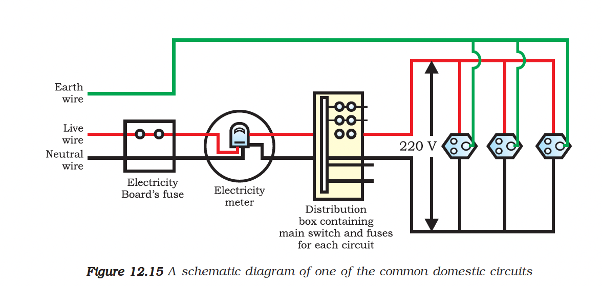

# 12.5 Domestic Electric Circuits

In our homes, we receive supply of electric power through a main supply (also called **mains**), either supported through **overhead electric poles** or by **underground cables**.

---

## Types of Wires in Domestic Circuit

| Wire | Insulation Colour | Also Called | Function |
|------|-------------------|-------------|----------|
| **Live Wire** | Red | Positive | Carries current at high potential |
| **Neutral Wire** | Black | Negative | Returns current, at zero potential |
| **Earth Wire** | Green | Ground | Safety measure for metallic appliances |

> **Potential Difference**: In our country (India), the potential difference between the live and neutral wire is **220 V**.

---

## Circuit Layout in a House

### From Mains to Home

At the **meter-board** in the house:

1. Wires pass into an **electricity meter** through a **main fuse**
2. Through the **main switch**, they are connected to the **line wires** in the house
3. These wires supply electricity to **separate circuits** within the house

### Two Separate Circuits

Often, two separate circuits are used in homes:

| Circuit Rating | Current Capacity | Used For |
|----------------|------------------|----------|
| **15 A circuit** | Higher power rating | Geysers, air coolers, etc. |
| **5 A circuit** | Lower power rating | Bulbs, fans, etc. |

---

## Earth Wire - Safety Measure

The earth wire, which has insulation of **green colour**, is usually connected to a **metal plate deep in the earth** near the house.

### Purpose

This is used as a **safety measure**, especially for those appliances that have a **metallic body**, for example:
- Electric press
- Toaster
- Table fan
- Refrigerator

### How Earth Wire Works

The **metallic body** of the appliance is connected to the earth wire, which provides a **low-resistance conducting path** for the current.

| Step | What Happens |
|------|--------------|
| 1 | Metallic body is connected to earth wire |
| 2 | Earth wire provides **low-resistance conducting path** |
| 3 | Any leakage of current to metallic body flows to earth |
| 4 | Keeps appliance potential **equal to that of the earth** |
| 5 | User **does not get a severe electric shock** |

---

## Domestic Circuit Arrangement

*Figure 12.15: Schematic diagram of a domestic electric circuit*

In each separate circuit, different appliances can be connected **across the live and neutral wires**.

### Features

- Each appliance has a **separate switch** to 'ON'/'OFF' the flow of current through it
- In order that each appliance has **equal potential difference**, they are connected **parallel to each other**

### Why Parallel Connection?

| Feature | Benefit |
|---------|---------|
| **Equal potential difference** | Each appliance gets full 220 V |
| **Independent operation** | Each has separate ON/OFF switch |
| **One failure doesn't affect others** | Other appliances continue working |

---

## Electric Fuse

Electric fuse is an **important component** of all domestic circuits.

> We have already studied the principle and working of a fuse in the previous chapter (Section 11.7).

### Function

A fuse in a circuit **prevents damage** to the appliances and the circuit due to **overloading**.

### Working Principle

The fuse prevents the electric circuit and the appliance from possible damage by **stopping the flow of unduly high electric current**.

| Process | Description |
|---------|-------------|
| **Joule Heating** | When excess current flows, heat is generated in fuse wire |
| **Melting** | The fuse wire melts due to low melting point |
| **Circuit Break** | Electric circuit is broken |
| **Protection** | Current flow stops, appliances protected |

---

## Overloading and Short Circuit

### What is Overloading?

Overloading occurs when the current in a circuit exceeds its designed capacity.

### Causes of Overloading

| Cause | Description |
|-------|-------------|
| **Short Circuit** | Live wire and neutral wire come into **direct contact** |
| **Voltage Hike** | Accidental increase in the supply voltage |
| **Too Many Appliances** | Connecting too many appliances to a **single socket** |

### Short Circuiting

This occurs when the **insulation of wires is damaged** or there is a **fault in the appliance**.

In such a situation:
- The current in the circuit **abruptly increases**
- This is called **short-circuiting**
- The fuse melts and breaks the circuit, preventing damage

---

## Summary

| Component | Colour | Function |
|-----------|--------|----------|
| **Live Wire** | Red | Carries current at high potential (220 V) |
| **Neutral Wire** | Black | Completes the circuit (0 V) |
| **Earth Wire** | Green | Safety - prevents electric shock |
| **Fuse** | — | Breaks circuit on overloading |
| **Main Switch** | — | Controls entire house supply |

### Key Points

- Domestic supply in India: **220 V AC**
- Power supplied through overhead poles or underground cables
- Two circuits: **15 A** (high power) and **5 A** (low power)
- Appliances connected in **parallel** for equal voltage
- Earth wire protects users from **electric shock**
- Fuse protects from **overloading and short circuit**
- Short circuit: live and neutral wires in **direct contact**
- Overloading also caused by **voltage hike** or **too many appliances**

---
