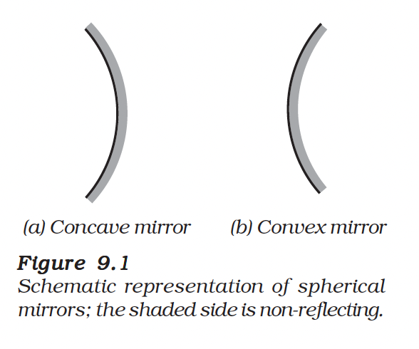
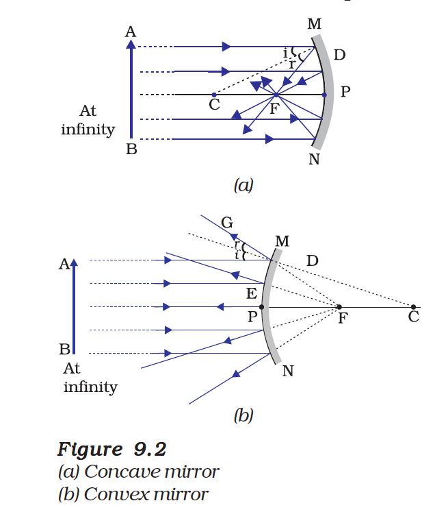

# Chapter 9: Light – Reflection and Refraction

Light is a form of energy which enables us to see objects from which it comes or from which it is reflected. In this chapter, we shall study the phenomena of reflection and refraction of light using the straight-line propagation of light.

---

# 9.1 Reflection of Light

A highly polished surface, such as a mirror, reflects most of the light falling on it. You are already familiar with the laws of reflection of light.

*Figure 9.1: Reflection of light from a plane mirror*

Let us recall these laws:

## Laws of Reflection

**(i)** The angle of incidence is equal to the angle of reflection, and

**(ii)** The incident ray, the normal to the mirror at the point of incidence and the reflected ray, all lie in the same plane.

These laws of reflection are applicable to all types of reflecting surfaces including spherical surfaces.

---

## Image Formation by Plane Mirror

*Figure 9.2: Image formation by a plane mirror*

You are also familiar with the nature of the image formed by a plane mirror. The image formed by a plane mirror is always:
- **Virtual and erect**
- The size of the image is **equal to that of the object**
- The image formed is as **far behind the mirror** as the object is in front of it
- The image is **laterally inverted**

---

## Activity 9.1: Verify Laws of Reflection

**Aim:** To verify the laws of reflection of light.

**Materials required:** Plane mirror strip, white paper, pins, pencil, protractor, scale

**Procedure:**
1. Fix a white sheet of paper on a drawing board.
2. Place a plane mirror strip vertically on the paper.
3. Draw a line along the position of the mirror (MM').
4. Draw a normal (N) perpendicular to MM'.
5. Fix two pins A and B on the incident ray.
6. View the images of pins A and B in the mirror and fix pins C and D in line with them.
7. Remove the pins and join the points to get incident and reflected rays.
8. Measure the angles of incidence and reflection.

**Observation:** The angle of incidence equals the angle of reflection (∠i = ∠r)

**Conclusion:** Laws of reflection are verified.

---

## Key Terms

| Term | Definition |
|------|------------|
| **Incident Ray** | The ray of light that falls on the reflecting surface |
| **Reflected Ray** | The ray of light that bounces back from the surface |
| **Point of Incidence** | The point where the incident ray strikes the surface |
| **Normal** | A line perpendicular to the surface at the point of incidence |
| **Angle of Incidence (∠i)** | Angle between incident ray and normal |
| **Angle of Reflection (∠r)** | Angle between reflected ray and normal |

---

## Summary

- Light travels in straight lines (rectilinear propagation)
- Reflection is the bouncing back of light from a polished surface
- Laws of Reflection: ∠i = ∠r; all rays lie in the same plane
- Plane mirror forms virtual, erect, same-sized, laterally inverted images

---
